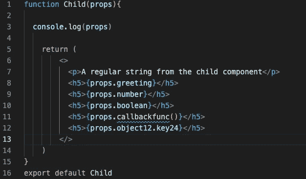

# 什么是 React 道具？

> 原文：<https://javascript.plainenglish.io/react-props-f5db047eea17?source=collection_archive---------18----------------------->

## React 道具详解。

Photo by [Lautaro Andreani](https://unsplash.com/@lautaroandreani?utm_source=medium&utm_medium=referral) on [Unsplash](https://unsplash.com?utm_source=medium&utm_medium=referral)

## 目标

[ ]什么是 React 和组件？

[ ]阐明什么是道具

[ ]讨论道具在 React 中的重要性

[ ]使用 props 在功能组件之间传递信息

[ ]正确传递不同数据类型的道具

[ ]破坏道具

为了让我们讨论 React 道具，我们应该先回顾一下 React 是什么。

# **什么是反应？**

[React 官网](https://reactjs.org/)

React 是一个用于构建 UI 的 JS 库。是*声明式*、*组件化*、*可复用*。React 允许程序员用称为“组件”的小而孤立的代码片段组成复杂的 ui。

3 pillars of React

React Components -> UX

# **什么是 React 组件？**

*   React 组件被分解成独立的 UI 块和可重用的代码。组件就像普通的 JS 函数。他们接受任意的输入，称为` ***道具*** `，并返回反应 JSX 描述应该出现在屏幕上的东西。

# **什么是道具？**

*   `props`是将数据从父组件传递到子组件的一种方式。
*   `props`代表属性。
*   `props`是键/值对对象。
*   `props`是只读的。道具不可修改。如果需要更新数据，可以使用“state”来代替。

## **为什么要用道具？**

*   我们使用 props 将数据从一个组件传递到另一个组件，这样我们就可以动态编码来实践单一责任原则。
*   干原则:不要重复自己

## **组件之间如何传递信息？我们可以将道具从父组件传递到子组件。**

首先，我个人喜欢直观地设置我的 VSC，父组件在顶部，子组件在底部，这样信息传递的方式就很清楚了。

## **如何从一个父组件正确传递不同数据类型的道具？**

Passing props from a Parent component to a Child component

我们可以将多个道具从父组件传递给子组件。当我们传递一个字符串时，我们可以使用不带花括号的引号。对于其他类型的数据，如数字、布尔、函数和对象，我们使用花括号作为值。对于传递对象，我们可以使用双花括号。

## 如何接受子功能组件上的道具

Child component: receiving props as a parameter

console.log(props)

我们接收道具作为参数。让我们登录控制台，看看我们有什么。我们在控制台中看到一个对象有五个不同的键值对。现在，在 JSX，我们可以获取每一个数据，并使用`{props.keyName}`在浏览器上显示它们，所以在这种情况下，使用`{props.greeting}`、`{props.number}`、`{props.boolean}`、`{props.callbackfunc()}`、`{props.object12.key24}`

当我们编码的时候，我们要实践干的原则，不要重复自己但是我们在上面的代码上看到多个道具。让我们解决这个问题。

# 解构用物体解构来反应道具

Destructuring Props step #1

让我们看看上面的代码。这比以前的干净多了。返回的 JSX 中没有`props.`、`props.`、`props.`、`props.`。它看起来更干净，可读性更好。

## **分配自己的变量**

析构是 JS 的一个特点。它用于从一个对象中取出数据段，然后我们可以将它们赋给新的自己的变量。这个过程不操纵原始对象，但是它通过将它们分配到自己的新变量中来制作所需对象的副本。

Destructuring Props step #2 (final stage)

当我们接受 prop 作为子功能组件的参数时，我们可以通过析构对象来进一步简化。