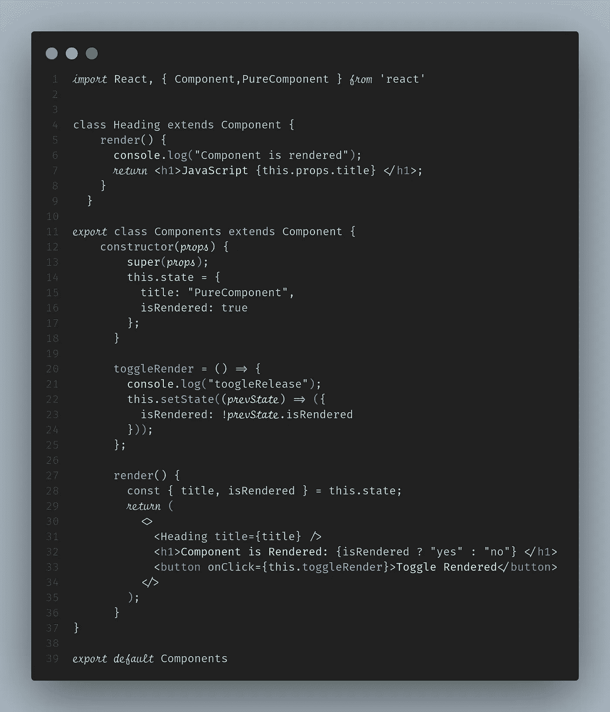
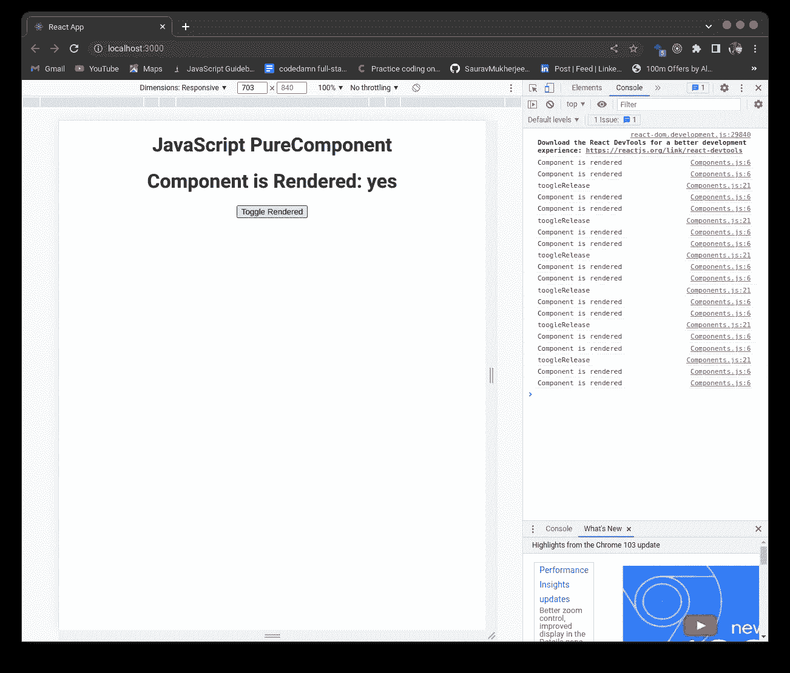
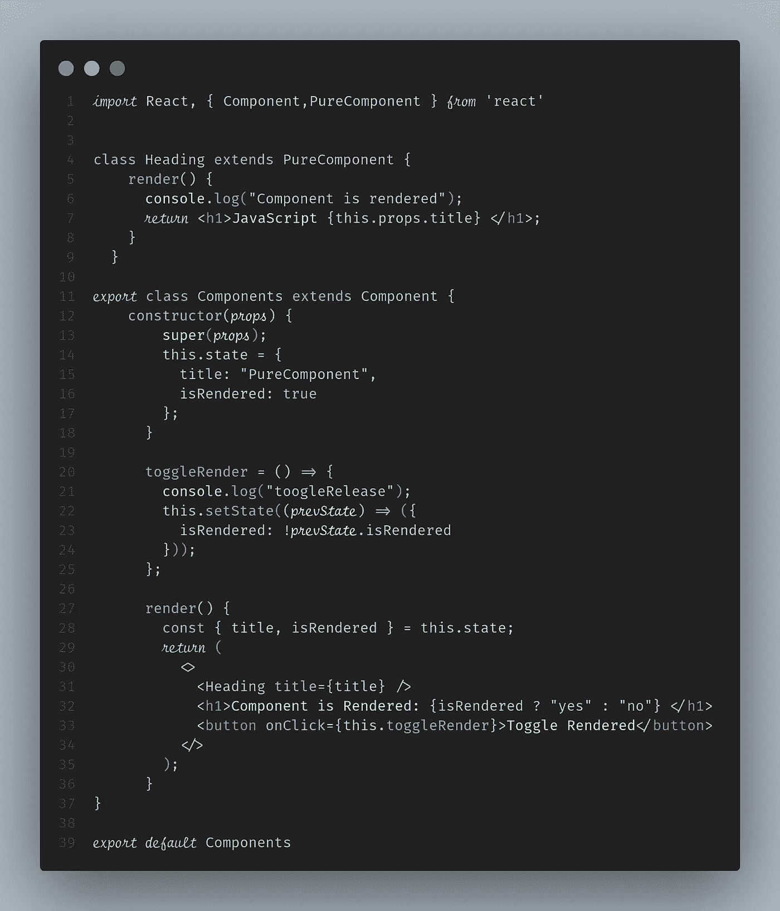
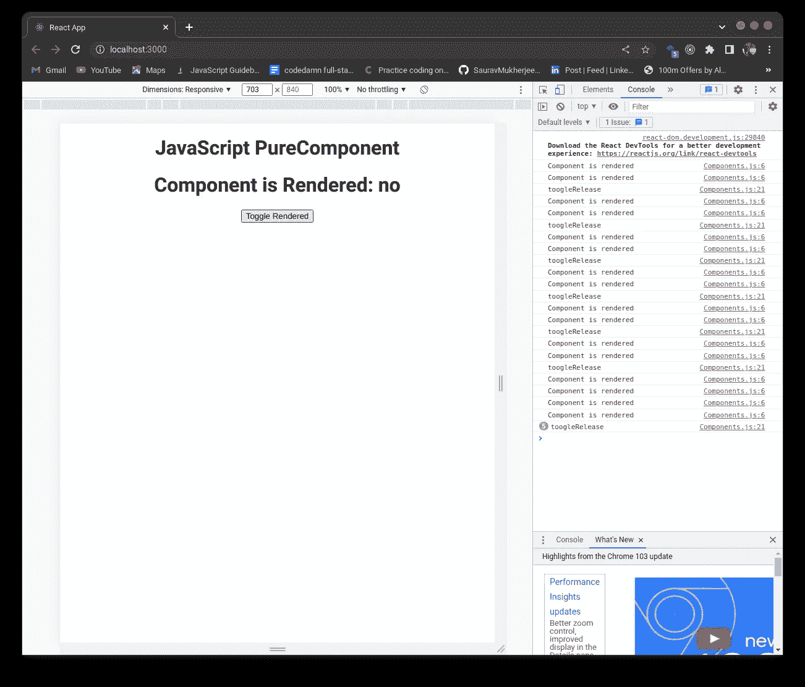
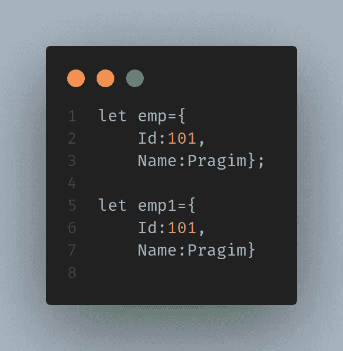
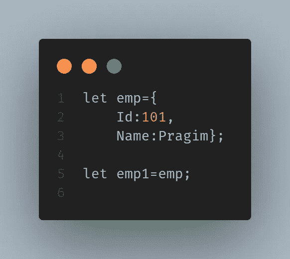

# 反应指南。纯组件

> 原文：<https://javascript.plainenglish.io/react-purecomponents-5618d35795ea?source=collection_archive---------5----------------------->

## 什么是反应。PureComponent？

Photo by [Lautaro Andreani](https://unsplash.com/@lautaroandreani?utm_source=medium&utm_medium=referral) on [Unsplash](https://unsplash.com?utm_source=medium&utm_medium=referral)

做出反应。PureComponent 和 React 差不多。组件，但它们之间的唯一区别是 React。组件没有实现 **shouldComponentUpdate()** 和 React。PureComponent 用一个**浅层道具和状态比较**来实现它。

如果一个组件使用相同的状态和属性呈现相同的输出，则该组件被认为是纯的；如果属性和状态相同，则该组件不会在每次函数调用时重新呈现。

**shouldComponentUpdate** 的用途是检查前一个的道具和状态值，是相同还是不同。如果它们相同，它不重新呈现应用程序，如果它们不同，它重新呈现应用程序。

Using Components

Components rendered on every function call

**做出反应。组件没有实现 shouldComponentUpdate()，因此它在每次调用函数时都会重新呈现。**

Using PureComponents

PureComponents Does not re-render When Props and State are same

**PureComponent 不会为每个函数调用重新渲染。它比较状态和道具的任何变化。在上面的例子中，下一个函数调用的状态和道具没有变化。因此，应用程序不会重新呈现。**

做出反应。组件在以下情况下重新呈现:

1.  在组件中调用了 setState
2.  道具值已更新
3.  调用 this.forceUpdate()

以防发生反应。PureComponent，**shouldComponentUpdate()**被调用。

这仅执行数据的浅层比较。如果数据是对象类型或复杂的数据结构，可能会导致渲染行为。

浅层比较检查相等性。当比较数字和字符串的值时，它比较这些值。

当比较对象时，它检查两个对象是否指向同一个位置。不比较对象的值。

When Comparing two Objects it ReturnsFalse

When Assigning the emp1 = emp It Returns True

因此，这可以用来提高组件的性能，并且这主要在小型项目中实现，以便更安全地使用。

*更内容于* [***普通英语***](https://plainenglish.io/) *。报名参加我们的* [***免费周报***](http://newsletter.plainenglish.io/) *。* [***推特***](https://twitter.com/inPlainEngHQ) *和*[***LinkedIn***](https://www.linkedin.com/company/inplainenglish/)*追随我们。查看我们的* [***社区不和***](https://discord.gg/GtDtUAvyhW) *并加入我们的* [***人才集体***](https://inplainenglish.pallet.com/talent/welcome) *。*