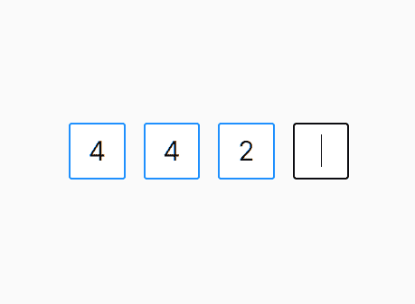

# react Refs:useRef 和 createRef 之间的区别变得简单了

> 原文：<https://javascript.plainenglish.io/react-refs-the-difference-between-useref-and-createref-made-easy-1b11a1df80b9?source=collection_archive---------4----------------------->

## 了解在 React 中创建引用的用例以及不同方法之间的差异。


Photo by [Emre Turkan](https://unsplash.com/@emreturkan?utm_source=medium&utm_medium=referral) on [Unsplash](https://unsplash.com?utm_source=medium&utm_medium=referral)

在我们看创建 ref 的不同方法之前，让我们先提醒自己 ref 实际上是什么。React 团队将其定义为:

> …一种访问在 render 方法中创建的 DOM 节点或 React 元素的方式。


嗯，这有点道理，但我们可能会打破这一点。Refs 是我们在通常的 React 流之外与 DOM 和定制组件进行交互的一种方式。

React 在我们的屏幕上呈现的是道具和状态的组合——如果它们发生变化，React 将不得不重新呈现以向我们显示新的 UI。裁判有点难以掌握，因为他们打破了这种循环；它们允许我们摆弄 DOM，而不关心道具或状态。

您可能会在文本字段等元素中看到 refs，在这些元素中，它们可以执行聚焦等操作，而无需更改属性/状态。此外，refs 是一个*可变对象，*意味着您可以访问/更改它们的值，而不会导致任何重新呈现。(想象一下使用`onFocus` useState 变量的相同焦点的有状态实现——太多不必要的工作！)

现在我们对引用有了更好的理解，让我们看看创建引用的两种方式，并看看它们的用例。

# useRef


如果你写的是基于功能组件的 React(也就是说不是基于类的)，那么这就是适合你的方法。

如果 useRef 这个名字看起来很熟悉，那是因为它是一个类似于 useState 和 useEffect 的**钩子**。因为它是一个钩子，它遵循钩子的规则，这意味着如果你还在编写基于类的 React，那么这不是你的选择，抱歉。

React 团队这样描述 useRef:

> …一个可以在其`.current`属性中保存可变值的“盒子”。

当我们定义 useRef `foo`时，我们可以用`foo.current.`访问它所附加的 DOM 节点

```
const foo = useRef(null); //Convetion is to set ref to null before                         attaching to a DOM element
```

根据引用所附加的内容，我们可以在`.current`对象上调用不同的方法——在我们的文本字段示例中，我们可以调用`foo.current.focus`。

# createRef


如果你关注 useRef，你就会知道 createRef 是为你的基于类的 React 爱好者准备的。然而，也可以在函数式 React 中使用 createRef(再次证明没有人需要仍然编写基于类的 React，hot take)。

createRef 还返回一个对象，该对象可通过 Ref 的`.current`属性访问。与 useRef 不同，createRef 是一个函数，所以它不必遵循钩子的规则。

# 所以都是回裁判…有什么区别？

useRef 和 createRef 确实非常相似。它们之间的主要区别是引用完整性。

> `useRef`在每次渲染后保持相同的值，而`createRef`则不然

如果我使用 useRef 创建一个 Ref，然后通过更新它的状态来重新呈现我的组件，我可以**保证**我的 ref 仍然具有与我的组件第一次挂载时相同的值。

如果我使用 createRef 创建一个 Ref，然后通过更新它的状态来重新呈现我的组件，我的 ref 的值将**不同。**

# 用例

## useRef

在大多数需要使用引用的情况下，您可能会想要使用它。useRef 对于存储静态的 DOM 节点/组件特别有用——例如，如果我们知道我们总是显示一个 inputfield，useRef 是访问它的好方法。这是因为无论有多少个重新呈现器，useRef 都返回相同的值。

useRef 的另一个用途是捕获组件挂载时收到的属性。考虑以下情况:

```
const propRefs = useRef(props);
console.log(propRefs) //Will be the same regardless if props change
```

这种方法利用了 useRef 返回相同值的事实。

## createRef

如果你是基于类的，那么这是你唯一的选择，但是仍然有理由在功能组件中使用 createRef。因为 createRef 将在每次渲染时重新创建，所以它非常适合处理动态 DOM 节点，在这种情况下，我们不必知道渲染了多少元素。

例如，假设您正在一个在线购物网站上输入您的 PIN 码。



Not my actual PIN (Obviously).

一个好的 UX 应该是在输入一个数字时让下一个输入自动聚焦。

可以用 useRef 来处理这个问题，但是我们需要为每个输入元件定义 4 个独立的 Ref。现在想象我们正在输入`n`号码，显然我们不能手动定义`n`裁判。这就是 createRef 有用的地方。与钩子不同，我们可以编程方式调用 createRef(在循环内部)，因为它只是一个函数。这意味着我们可以轻松地创建`n` refs 来处理`n` DOM 元素。

如果你想看看它的代码实现，我在这里找到了 Github 用户 [bytecodepandit](https://gist.github.com/bytecodepandit) 的[伟大的要旨。](https://gist.github.com/bytecodepandit/46f34a6e788bde2ba07aa9fa1375cd3a#file-singleinputboxgroup-jsx)

# 结论

在不知道需要使用哪种创建方法的情况下，Refs 就已经够混乱的了。希望这篇文章能让你对它们之间的区别和潜在的用例有一个更清晰的认识。

> 功能组件、持久值、静态 DOM 元素— **想想 useRef()**
> 
> 基于类的反应、基于当前渲染的值、动态 DOM 元素— **想想 createRef()**

*如果你喜欢这篇文章或者觉得它有用，那么欢迎关注。或者，你可以在这里的 Medium* [*上支持我*](https://jamesmbrightman.medium.com/membership) *或者给我买一杯* [*咖啡*](https://ko-fi.com/jamesbrightman) *！非常感谢所有的支持。*

*更多内容请看* [***说白了就是***](https://plainenglish.io/) *。报名参加我们的* [***免费每周简讯***](http://newsletter.plainenglish.io/) *。关注我们*[***Twitter***](https://twitter.com/inPlainEngHQ)*和*[***LinkedIn***](https://www.linkedin.com/company/inplainenglish/)*。查看我们的* [***社区不和谐***](https://discord.gg/GtDtUAvyhW) *加入我们的* [***人才集体***](https://inplainenglish.pallet.com/talent/welcome) *。*