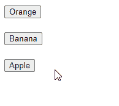

# 如何在 React 中移除元素 OnClick

> 原文：<https://javascript.plainenglish.io/react-remove-element-onclick-4714b294824a?source=collection_archive---------3----------------------->


在本文中，我们将学习如何在 React 中轻松地从 DOM onclick 中移除元素，无论它是在列表中还是独立的元素。

# 在 React 中移除独立元素 onclick

要删除独立元素 onclick:

1.  将可见性状态作为一个`Boolean`值存储在状态变量中，并使用它的值有条件地呈现元素。
2.  将事件处理程序附加到元素的`onClick`事件。
3.  在事件处理程序中，对可见性状态的值求反，以从 DOM 中移除元素。

有一个例子可以说明这一点:

```
import { useState } from 'react';export default function App() {
  const [visible, setVisible] = useState(true); const removeElement = () => {
    setVisible((prev) => !prev);
  }; return (
    <div>
      Click to remove element
      <br />
      {visible && (
        <button onClick={removeElement}>Remove</button>
      )}
    </div>
  );
}
```


我们使用`useState()`在组件中创建一个状态变量。这个钩子返回一个包含两个变量的数组，通常称为`state`和`setState`。`state`变量(`visible`)保存当前的可见性状态，`setState`函数(`setVisible`)更新它。

```
const [visible, setVisible] = useState(true);
```

我们为按钮的`onClick`事件设置了一个事件处理程序，这样当按钮被点击时，处理程序函数就会被调用。

```
<button onClick={removeElement}>Remove</button>
```

在处理函数中，我们使用可见性状态的`setState`函数来更新状态。

```
const removeElement = () => {
  setVisible((prev) => !prev);
};
```

我们没有直接传递取反后的值，而是传递一个回调函数给返回取反后的值的`setState`。这确保了我们总是获得最新的状态值。

## 小费

出于性能原因，React 批处理状态更改，因此在调用`setState`后，状态可能不会按照我们预期的顺序立即更新。这就是为什么当从先前状态的数据计算新状态时，我们总是将函数传递给`setState`。

# 从列表中移除元素 onclick

要从列表 onclick 中删除元素:

1.  将事件处理程序附加到表示列表的数组中每个元素的`onClick`事件。
2.  在特定元素的事件处理程序中，调用数组上的`filter()`方法，为数组中除了要移除的元素之外的每个元素指定一个条件`true`。
3.  使用`setState`用`filter()`返回的结果更新状态数组。

例如:

```
import { useState } from 'react';export default function App() {
  const [fruits, setFruits] = useState([
    'Orange',
    'Banana',
    'Apple',
  ]); const removeElement = (index) => {
    const newFruits = fruits.filter((_, i) => i !== index);
    setFruits(newFruits);
  }; return (
    <div>
      {fruits.map((fruit, index) => (
        <div key={index}>
          <button
            onClick={() => removeElement(index)}
          >
            {fruit}
          </button>
          <br />
          <br />
        </div>
      ))}
    </div>
  );
}
```



使用`map()`方法，我们为数组中的每个元素呈现一个按钮。对于每个按钮，我们都附加了一个事件处理程序，它将调用`removeElement()`方法，将按钮所代表的元素的索引作为参数传递。

```
{fruits.map((fruit, index) => (
  <div key={index}>
    <button
      onClick={() => removeElement(index)}
    >
      {fruit}
    </button>
    <br />
    <br />
  </div>
))}
```

`removeElement()`通过从 [filter()](https://developer.mozilla.org/en-US/docs/Web/JavaScript/Reference/Global_Objects/Array/filter) 回调中返回一个条件来删除一个元素，该条件仅适用于数组中没有将`index`传递给`removeIndex()`的元素。这样做会将带有那个`index`的元素从数组中排除，所以当数组状态被更新时，代表该元素的按钮不再被呈现。

```
const fruits = ['Orange', 'Banana', 'Apple'];const newFruits = fruits.filter((_, index) => index !== 1);console.log(newFruits); // [ 'Orange', 'Apple' ]
```

## 注意:不要在 React 中直接修改状态

试图通过使用像`splice()`这样的函数修改元素来从数组中删除它是行不通的:

```
const removeElement = (index) => {
  // ⚠️ Mutating the array like this will not update the view
  fruits.splice(index, 1);
};
```

状态在 React 中是不可变的，所以我们不能通过改变它来更新数组。必须用从`filter()`返回的新数组替换它，以便视图更新。

# 单击从列表中删除对象元素

我们也可以使用这种方法从 list onclick 中删除由对象表示的元素。

```
import { useState } from 'react';export default function App() {
  const [fruits, setFruits] = useState([
    { id: 1, name: 'Orange' },
    { id: 2, name: 'Banana' },
    { id: 3, name: 'Apple' },
  ]); const removeElement = (id) => {
    const newFruits = fruits.filter(
      (fruit) => fruit.id !== id
    );
    setFruits(newFruits);
  }; return (
    <div>
      {fruits.map((fruit) => (
        <div key={fruit.id}>
          <button onClick={() => removeElement(fruit.id)}>
            {fruit.name}
          </button>
          <br />
          <br />
        </div>
      ))}
    </div>
  );
}
```

这次我们不是按索引过滤，而是按`id`属性过滤，从数组中删除一个项目，并从 DOM 的列表中删除元素。

```
const fruits = [
  { id: 1, name: 'Orange' },
  { id: 2, name: 'Banana' },
  { id: 3, name: 'Apple' },
];const newFruits = fruits.filter((fruit) => fruit.id !== 2);console.log(newFruits);
// [ { id: 1, name: 'Orange' }, { id: 3, name: 'Apple' } ]
```

*最初发表于*[*codingbeautydev.com*](https://cbdev.link/922aee)

# JavaScript 做的每一件疯狂的事情

一本关于 JavaScript 微妙的警告和鲜为人知的部分的迷人指南。


[报名](https://cbdev.link/d3c4eb)立即免费领取一份。