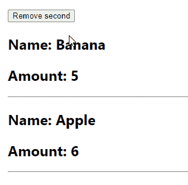

# 如何在 React 中从状态数组中移除项目

> 原文：<https://javascript.plainenglish.io/react-remove-item-from-state-array-4e966bbeef4e?source=collection_archive---------8----------------------->

## 了解如何在 React 中轻松地从状态数组中移除项目。


在本文中，我们将学习如何在 React 中轻松地从状态数组中移除一个项目。

# 数组 filter()方法

要从 React 中的状态数组中删除一个项目，请在数组上调用 [filter()](https://developer.mozilla.org/en-US/docs/Web/JavaScript/Reference/Global_Objects/Array/filter) 方法，指定一个测试，数组中除了要删除的项目之外的每个项目都将通过该测试，然后用`setState`用`filter()`的结果更新状态。

```
import { useState } from 'react';export default function App() {
  const initialState = [
    { id: 1, name: 'Banana', amount: 5 },
    { id: 2, name: 'Apple', amount: 6 },
  ]; const removeSecond = () => {
    setFruits((current) =>
      current.filter((fruit) => fruit.id !== 2)
    );
  }; const [fruits, setFruits] = useState(initialState); return (
    <div style={{ margin: '16px' }}>
      <button onClick={removeSecond}>Remove second</button>
      {fruits.map((fruit) => (
        <div key={fruit.id}>
          <h2>Name: {fruit.name}</h2>
          <h2>Amount: {fruit.amount}</h2>
          <hr />
        </div>
      ))}
    </div>
  );
}
```



我们通过从`filter()`回调中返回一个条件来移除带有`id`T3 的水果对象，该条件仅针对数组中不具有 2 的`id`的项目。这样做将从`filter()`返回的数组中排除目标项。

```
const initialState = [
  { id: 1, name: 'Banana', amount: 5 },
  { id: 2, name: 'Apple', amount: 6 },
];const secondRemoved = initialState.filter((fruit) => fruit.id !== 2);// [ { id: 1, name: 'Banana', amount: 5 } ]
console.log(secondRemoved);
```

由于这里的`App`是一个功能组件，我们使用`useState()` React 钩子来创建初始状态数组。第一个值`useState()`返回让我们访问状态数据。第二个值是用于更新状态的函数(统称为`setState`)。我们将一个函数传递给`setState`(这里命名为`setFruits`)以确保我们获得当前/最新的状态。

```
const removeSecond = () => {
  // "current" contains the latest state array
  setFruits((current) =>
    current.filter((fruit) => fruit.id !== 2)
  );
};
```

**提示**:当从当前状态数据计算出新状态时，总是传递一个函数给`setState`。

# 不要在 React 中直接修改状态

请注意，试图通过使用类似`splice()`的函数直接修改来从数组中删除项目是行不通的:

```
const removeSecond = () => {
  // Find the index of the object to be removed
  const secondIndex = fruits.findIndex((fruit) => fruit.id === 2); // Mutating the array like this will not update the view
  fruits.splice(secondIndex, 1);
};
```

状态在 React 中是不可变的，所以我们不能通过改变它来更新数组。必须用从`filter()`返回的新数组替换它，以便视图更新。

# 基于多个条件从状态数组中移除项目

如果需要根据多个条件从状态数组中删除一个项目，可以使用[逻辑 AND ( & & )](https://developer.mozilla.org/en-US/docs/Web/JavaScript/Reference/Operators/Logical_AND) 或[逻辑 OR ( & & )](https://developer.mozilla.org/en-US/docs/Web/JavaScript/Reference/Operators/Logical_OR) 运算符。

## 使用逻辑 OR (||)运算符

下面是一个使用逻辑 OR ( `||`)操作符从状态数组中删除一个项目的例子。

```
const initialState = [
  { id: 1, name: 'Banana', amount: 5 },
  { id: 2, name: 'Apple', amount: 6 },
  { id: 3, name: 'Orange', amount: 10 },
  { id: 4, name: 'Watermelon', amount: 1 },
];const [fruits, setFruits] = useState(initialState);const remove = () => {
  setFruits((current) =>
    current.filter(
      (fruit) =>
        fruit.name === 'Orange' || fruit.name === 'Apple'
    )
  );
};
```

如果操作数中至少有一个的计算结果为`true`，那么将一组操作数与`||`运算符组合将产生`true` **。通过将该操作符与`filter()`方法一起使用，我们返回一个新数组，该数组只包含`name`等于`'Orange'`或`'Apple'`的水果对象。**

## 使用逻辑 AND (&&)运算符

下面是一个使用逻辑 AND ( `&&`)运算符从状态数组中删除项目的示例:

```
const initialState = [
  { id: 1, name: 'Banana', amount: 5 },
  { id: 2, name: 'Apple', amount: 6 },
  { id: 3, name: 'Orange', amount: 10 },
  { id: 4, name: 'Watermelon', amount: 1 },
];const [fruits, setFruits] = useState(initialState);const remove = () => {
  setFruits((current) =>
    current.filter(
      (fruit) => fruit.id !== 2 && fruit.id !== 4
    )
  );
};
```

只有当所有的操作数都是`true`时，用`&&`运算符组合操作数才会产生`true` **。**

通过将`filter()`方法与`&&`操作符相结合，我们能够指定一个复合布尔表达式来删除带有`2`和`4`的`id`的水果对象。

## 用德摩根定律简化复合布尔表达式

我们可以使用[德摩根定律](https://en.wikipedia.org/wiki/De_Morgan%27s_laws)之一将前面例子中的 AND 条件转换为 OR 条件，并减少求反的次数。

```
const remove = () => {
  setFruits((current) =>
    current.filter(
      (fruit) => !(fruit.id === 2 || fruit.id === 4)
    )
  );
};
```

这种转换可以使表达式更容易阅读和理解。

*最初发表于:*[*codingbeautydev.com*](https://cbdev.link/5455d1)

# JavaScript 做的每一件疯狂的事情

一本关于 JavaScript 微妙的警告和鲜为人知的部分的迷人指南。


[**报名**](https://cbdev.link/d3c4eb) 立即免费领取一份。