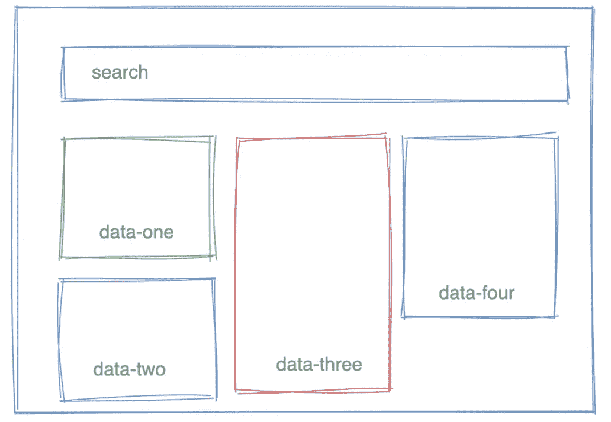
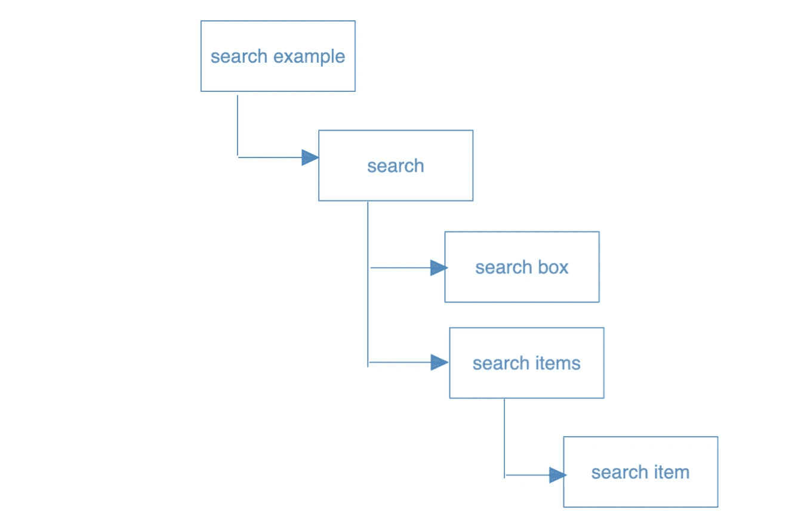
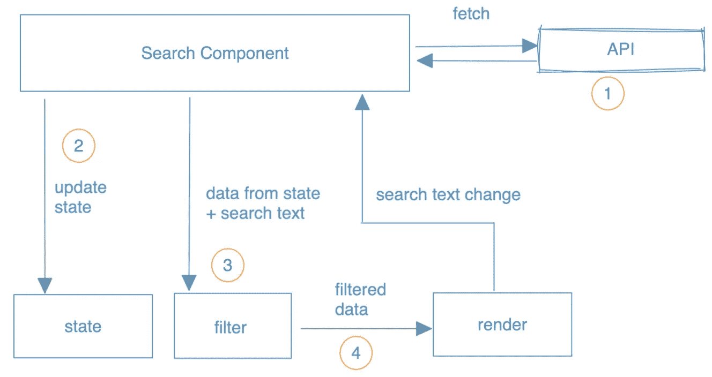

# React:搜索组件设计

> 原文：<https://javascript.plainenglish.io/react-search-component-design-6b0e618dbf5f?source=collection_archive---------7----------------------->

## 如何设计一个允许用户搜索内容的 React 组件(在我们的例子中:meme)。

fig(1) search design

## 介绍

在这篇博客中，我们将重点设计一个 React 组件，它将允许用户搜索迷因。这包括从一个 API 获取数据，在一个砖石布局中呈现给用户，然后根据用户搜索过滤获取的数据。稍后，我们可以添加逻辑来与其他人共享搜索结果。

该方法分为 UI 设计、组件图、代码细节和功能增强。

注意:为了保持我们对核心业务逻辑的关注，我没有包括道具设计、js doc、国际化、可访问性等。

# 功能要求

*   用户应该能够看到所有可用的迷因。
*   用户应该能够通过标题搜索迷因。
*   用户应该能够搜索包含感兴趣的文本的模因。
*   用户应该能够在更新/编辑搜索文本时看到搜索结果的变化。
*   (额外)用户应该能够在搜索时锁定/解除锁定感兴趣的迷因。

# 构件图

在这一节中，我们将着重于构建组件的层次结构，以理解任务委托和它们之间的数据通信。

fig(2) component diagram

# 代码设计

## 搜索组件:

我们将构建一个搜索组件，为我们完成大部分繁重的工作。因此迷因可以通过外部 API 获得，一旦 DOM 被挂载，我们将利用 *useEffect* 钩子进行异步 API 调用。

> 学习要点💡:对外部 API 调用使用 useEffect，应用数组过滤方法。

fig(3) search component workflow

我们将从用户搜索的文本/字符串中过滤提取的数据，然后更新呈现函数，而不是直接从状态更新呈现函数。当用户从搜索的文本/字符串中删除/移除字符或子字符串时，这允许我们保留*的原始状态*。

## 搜索项目组件:

SearchItem 组件的重点是渲染一个迷因。对过滤后的数据调用 SearchItem 仍然是搜索组件的职责。通过这样做，获取的数据经过状态更新、过滤逻辑，然后到视觉变化(即，搜索项目)。

很好，我们的搜索示例很好，除了我们不能与搜索查询共享 URL。如果没有这个功能，用户将不得不重新输入搜索文本来查找结果。

## 改进的搜索组件:

在本节中，我们将增强搜索组件以利用 useSearchParams 钩子，但是首先，我们需要用 BrowserRouter 包装我们的主要组件(即 SearchExample)并定义一些路由。关于使用 react-router-dom 的更多细节，请参考 react-router [文档](https://reactrouter.com/docs/en/v6/hooks/use-search-params)。

> 学习要点💡:利用 react-router-dom，使用 SearchParam 钩子用查询字符串更新浏览器 URL。

我们开始定义一个路由(搜索组件将在根目录加载)，然后我们将 useSearchParams 挂钩添加到我们的搜索组件，以便我们用用户键入的搜索文本/字符串更新 URL。

> 请查看 [codesandbox](https://codesandbox.io/s/search-example-mh426q) 获取完整代码

## 搜索演示:

 [## React 应用

### 搜索使用功能组件、挂钩和反应路由器构建的示例应用程序

mh426q.csb.app](https://mh426q.csb.app/) 

> **奖励**:增加了允许用户在搜索时锁定/选择感兴趣的项目/迷因的功能。即，单击将固定项目，双击将取消固定选定的项目/meme。

## 具有更多改进的搜索组件:

在本节的这一部分，我们将增强我们的代码，以便用户能够在搜索时通过单击和双击项目来锁定/取消锁定。这使得用户在搜索时不会丢失他们感兴趣的项目。大部分逻辑驻留在搜索组件中，在搜索项组件和 CSS 中有少量更新。

> 💡:利用点击事件，合并两个数组，传递回调函数

和 searchItem 组件:

> 请查看 [codesandbox](https://codesandbox.io/s/search-example-with-item-select-vif9hh) 获取完整代码

## 高级搜索演示:

 [## 搜索示例应用程序

### 改进的搜索示例，具有允许用户在搜索时锁定/取消锁定项目的功能

vif9hh.csb.app](https://vif9hh.csb.app/) 

现在，我们的应用程序已经完成了我们在设计阶段开始时决定的大部分功能，但我们可以继续添加新的增强功能，如无限滚动、加载占位符等。但我会让你自己去发挥。

## 我之前的三篇博客:

1. [React | Node:为什么要关心依赖关系？](https://citta-lab.medium.com/react-node-why-should-we-care-about-dependencies-a8d3e904689b)

2. [DIY:如何修理你的 HVAC 区域风门](https://medium.com/@mahesh2684/diy-how-to-fix-your-hvac-zone-damper-4a7a5b21d3be)

3.[React 应用中使用 react-intl 的国际化](https://medium.com/javascript-in-plain-english/internationalization-in-react-apps-using-react-intl-1d72a6f14053)

*更多内容请看*[***plain English . io***](https://plainenglish.io/)*。报名参加我们的* [***免费周报***](http://newsletter.plainenglish.io/) *。关注我们关于*[***Twitter***](https://twitter.com/inPlainEngHQ)*和*[***LinkedIn***](https://www.linkedin.com/company/inplainenglish/)*。查看我们的* [***社区不和谐***](https://discord.gg/GtDtUAvyhW) *加入我们的* [***人才集体***](https://inplainenglish.pallet.com/talent/welcome) *。*