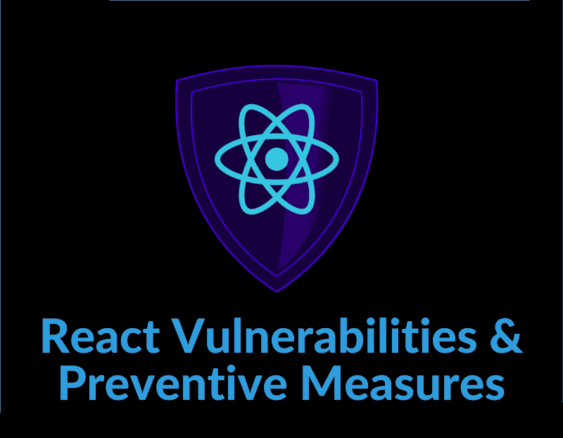
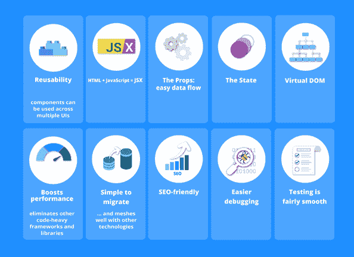
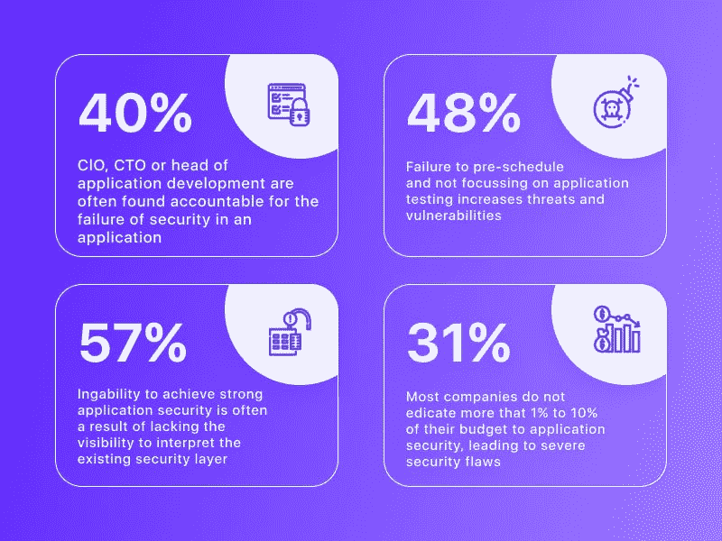
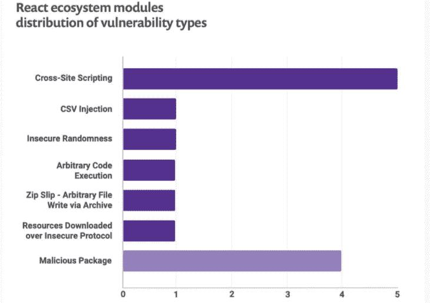

# 应对安全漏洞:如何保护您的应用程序并修复它们

> 原文：<https://javascript.plainenglish.io/react-security-vulnerabilities-how-to-protect-your-app-and-fix-them-8e96da639104?source=collection_archive---------4----------------------->

Image Source: Login Radius

React 已经成为最流行的 JavaScript (JS)框架，不难看出其中的原因。它被像脸书、网飞、Airbnb、优步和更多的顶级公司使用！

*   10，499，785 个直播网站正在使用 React。
*   *用 182.4k GitHub stars&37.2k GitHub forks 反应。*

如果您是 React 新手，或者正在考虑在您的下一个项目中使用它，那么您一定不能忽视一些重要的安全漏洞。

React 漏洞为开发人员提供了如何预防和修复这些漏洞的具体建议，因此您可以避免未来的问题，并使您的应用程序更加安全。

如果您正在使用 React，了解这些漏洞以及如何保护您的应用程序免受它们的攻击是非常重要的。在本文中，我们将解释 React 安全漏洞是什么，并向您展示如何修复它们。

# 为什么选择 React？

Image Source: Medium

**什么是安全漏洞？**

在计算机安全中，漏洞是可以被威胁者利用的弱点。漏洞通常被记录为软件中的错误，使得攻击者能够对您的网站或应用程序进行更改。

这些更改通常是恶意的，但有时也可能是有益的，例如暴露安全性、设计或其他方面的错误。了解漏洞如何影响您的站点是保护站点免受外部威胁的重要一步。

一般来说，网站存在两类漏洞:客户端和服务器端漏洞。安全漏洞通常由白帽黑客发现，并报告给受影响的公司，以便他们可以修复。

在 web 应用程序的环境中，安全漏洞可能允许攻击者窃取用户数据、向应用程序中注入恶意代码或控制用户的帐户。

而且，为了解决 React 漏洞，你可以**雇佣 React 开发者**。这不仅有助于你解决问题，也有助于你的应用程序没有错误。

# 一些常见的 React 漏洞及其解决方案

在运行或构建 React 应用程序时，有几个常见的安全问题需要注意:

Image Source: Simform

跨站点脚本(XSS)

当攻击者将代码注入您的网站时，这被称为跨站脚本(XSS)。恶意代码可以改变页面上的元素，窃取 cookies，甚至删除数据。

自动安全扫描器也更难检测到这类问题。这使得 XSS 成为构建 React 应用时最危险的威胁之一。

防止 XSS 漏洞的一种方法是通过严格的转义。这应该小心使用，因为浏览器应该已经自动转义 HTML 内容。如果使用不当，它还会降低性能，这可能会破坏您使用 React 本机移动应用程序的体验。

# 注入攻击

当攻击者将恶意代码注入到应用程序中时，就会发生注入攻击。黑客通过网站、社交媒体平台等注入他们的恶意代码。

众所周知，注入攻击允许黑客通过网页进行访问，从而控制数据库。访问数据库使黑客能够控制信用卡信息和许多应用程序的其他敏感数据。

建议您始终将数据脱机存储在安全的服务器或数据库中，尤其是当数据包含用户的敏感信息(如密码或信用卡号)时。

为了防止任何不必要的安全漏洞的发生，使用专用服务器来存储您的数据将是理想的。

# CSRF 袭击

跨站点请求伪造(CSRF)是一种攻击，它迫使登录用户的浏览器在他们不知情的情况下发送伪造的 HTTP 请求，以便执行恶意操作。

CSRF 攻击专门针对状态改变请求(POST、PUT 或 DELETE ),因为这些请求被认为比“get”请求更敏感。

攻击者通过使用从社交工程(如发布关于小猫的消息)到可以自动触发攻击的恶意软件的任何东西来引诱另一个网站上的受害者。当然，攻击者根本不在您的网络上，也有许多其他方法可以访问您用户的 cookies。

通过限制易受 CSRF 攻击的请求数量，您可以保护自己免受网站上恶意链接的攻击。这方面的关键设计原则是使用 GET 而不是 PUT 或 POST 等其他类型，因为这些类型会在被浏览器访问时转换数据，这使它们成为更危险的伪造方法。

# 恶意文件上传

攻击者可以很容易地将恶意代码上传到您的服务器。通过发送包含图像字段的表单提交，他们可以让您在服务器上执行恶意代码。

通过确保所有上传都经过验证，很容易避免这种情况。如果你正在使用类似亚马逊 S3 的东西，该服务可以通过向他们的 AWS IAM 控制台添加一个简单的检查来帮助你防止恶意文件上传(见下文)。

或者，如果您托管自己的服务器，可以查看 Nodejs-Security-Shield 之类的模块，它允许您做类似的事情。

# 授权和认证不足

授权指的是谁可以访问特定的数据，而身份验证决定了那个人是否是他们所说的那个人。当没有对应用程序使用的所有方法执行授权检查时，会出现一个常见的漏洞。

例如，用户可能需要在查看其个人帐户详细信息之前登录，而不是在查看客户订单之前。在这些情况下，黑客可以通过简单地将访问令牌传递给另一个用户(例如，一个客户)来利用这些特权方法(例如，获取您的所有客户的列表)。

为了缓解 react 应用程序中的这些漏洞，请使用 JWT 或 JSON Web 令牌进行授权。

# 分布式拒绝服务(DDoS)

这是一种非常常见的攻击，利用僵尸网络(数百或数千台被入侵的计算机)向您的服务器发送大量流量。目标是造成过多的额外负载，导致你的应用或网站瘫痪。

作为最直接的攻击之一，你会希望确保你的应用程序能够处理大量的突发请求，以防止它被关闭。

防御 DDoS 攻击的一个好方法是通过服务器级的请求节流——跟踪在任何给定时间有多少并发请求，检查它们是否有效，如果无效就限制它们。这对于像 Cloudflare 这样的服务来说尤其有效，cloud flare 在默认情况下提供了额外的安全层。

# XML 外部实体攻击(XXE)

当 web 应用程序处理 XML 数据时，攻击者有可能通过耗尽系统资源或消耗内存来导致 DoS。该攻击可以使用来自服务器外部的恶意定制的 XML 内容来执行。

为了防止 XXE 攻击，需要在 XML 解析器库中使用禁用外部实体(libxml2)。简单地从一个库或解析器换到另一个库或解析器并不能保护你免受 XXE 攻击；如果发布了任何补丁，您还需要升级 libxml2 和 libexpat 本身。

这可以通过在您支持的每个平台上使用 npm 更新或 yarn 更新来更新您的应用程序来实现。

# 开发基于 React 的应用程序时要忽略的其他安全漏洞

除了我们在这里讨论的 React 漏洞之外，在构建 React 应用程序时，还需要注意其他几个安全漏洞:

# 服务器端渲染

因为服务器端渲染不需要将整个 React 应用加载到浏览器中，所以它比客户端渲染更安全。

但是，您必须记住，您的 React 代码在服务器上仍然容易受到攻击，因此确保您遵循了安全方面的最佳实践。

例如，避免在服务器上使用动态生成的数据(如用户配置文件)，因为它不能被浏览器验证。相反，将所有动态数据保存在数据库中。

此外，在运行任何敏感操作(如创建帐户或更新配置文件数据)之前，请确保用户已登录—如果您的服务器允许匿名请求，则有人可能会在没有向其帐户授予任何适当权限的情况下执行这些操作。

# 危险的 URI 计划

使用链接导航的默认行为基于 URI 模式，这是您的浏览器知道如何从一个页面转到另一个页面的方式。

你可以使用 javascript:来代替普通的 URL，但是这将你的应用程序暴露给 XSS(跨站点脚本)攻击，因为这允许用户使用他们自己的数据在你的浏览器中执行脚本和代码。

例如，如果你有一封电子邮件输入，他们可以运行 javascript:alert('XSS 攻击！');它会弹出一个警告框，提示 XSS 攻击。

显然，您不希望这种情况发生，所以要始终防止危险的方案，如 javascript:，VBScript:，等等。，当允许用户通过链接导航时。

# " DangerouslySetInnerHTML "

因为一个小小的错误，攻击者可以将一个完全无害的标题标签变成一段恶意代码。这个例子只是 React 的 DOM 中发现的众多缺陷之一。(由于 React 如此受欢迎，可能会有更多人被发现。)

幸运的是，避免这样的安全漏洞并不难；ReactJS 开发人员可以采取简单的措施，在攻击发生之前保护应用程序免受攻击。

例如，在将输入数据发送给 JavaScript 函数或将其与 HTML 元素绑定之前，应该始终对其进行净化。如果您需要以纯文本而不是 HTML 标签的形式访问内容，那么您应该使用第三方工具来为您显式地处理转义。

需要注意的是，这些只是一般的提示；取决于您的应用程序如何使用 React 组件，还有其他潜在的问题，所以不要做假设！

# 结论

正如我们所见，React 已经成为最流行的前端框架和库之一。由于其知名度不断上升，它也正在成为恶意演员的目标。

您需要了解 React 应用程序中的一些常见漏洞，并采取建议的步骤来降低这些风险。

此外，您还应该意识到其他安全漏洞，这些漏洞可能不是特定要应对的，但仍然会影响其应用程序。因此，你可以遵循最佳实践并保护你的应用程序，但为此，[**雇佣 React 开发人员**](https://www.valuecoders.com/hire-developers/hire-reactjs-developers) 在最好的 [**React 开发公司**](https://www.valuecoders.com/blog/top-and-best-companies/top-5-reactjs-development-companies-to-build-robust-web-apps/) **。如果你感兴趣，请在下面给我们留言。**

*更多内容请看*[***plain English . io***](https://plainenglish.io/)*。报名参加我们的* [***免费周报***](http://newsletter.plainenglish.io/) *。关注我们关于*[***Twitter***](https://twitter.com/inPlainEngHQ)*和*[***LinkedIn***](https://www.linkedin.com/company/inplainenglish/)*。加入我们的* [***社区不和谐***](https://discord.gg/GtDtUAvyhW) *。*