# 在 AWS 云中使用基于路径的路由反应 SPA

> 原文：<https://javascript.plainenglish.io/react-spa-with-path-based-routing-in-aws-cloud-2e5b0e4739b6?source=collection_archive---------6----------------------->

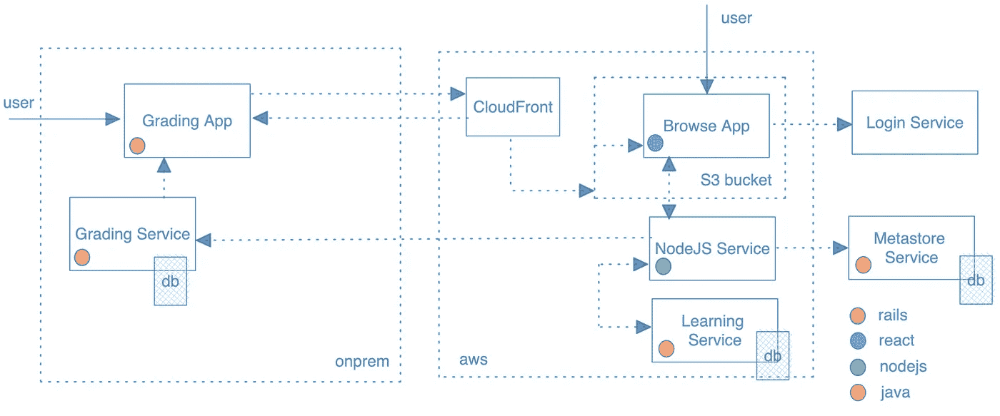

fig(1): architecture diagram

## I ntro

作为一个组织，我们正在 Node.js 中编写新的应用程序和/或服务，Go，React，并在 AWS 云中部署它们。这意味着不再需要向遗留代码库添加代码，也不再需要为更新的开发/增强进行内部部署。因此，微服务和微前端的想法为我们提供了一种制定迁移计划和开发新的客户增强请求的方法。我们基于路径的路由探索就是这样开始的。

在这篇博文中，我将概述我们的架构，并分享一些挑战和我一路走来的收获。

## 动机

经过仔细的客户请求筛选，我们决定构建一个独立的应用程序，允许用户浏览和搜索我们所有应用程序的内容。新的应用程序应该尊重现有的用户权限，应该允许用户在遗留应用程序之间导航，并且应该避免任何功能对等和延迟。

## 功能要求

*   用户应该能够访问旧应用程序的新应用程序。
*   在新的应用程序中应该尊重用户的特权。
*   用户应该无缝地浏览/搜索新应用程序中的任何数据

## 非功能需求

*   新的应用程序应该使用新的技术堆栈来构建
*   新的应用程序应该部署在 AWS 云中
*   潜伏

## 设计 Node.js 服务

可以把它想象成一个中间人，来促进我们的新 SPA、用于用户认证的登录服务、用于授权和内容的分级服务以及用于更多内容细节的元存储服务之间的通信。

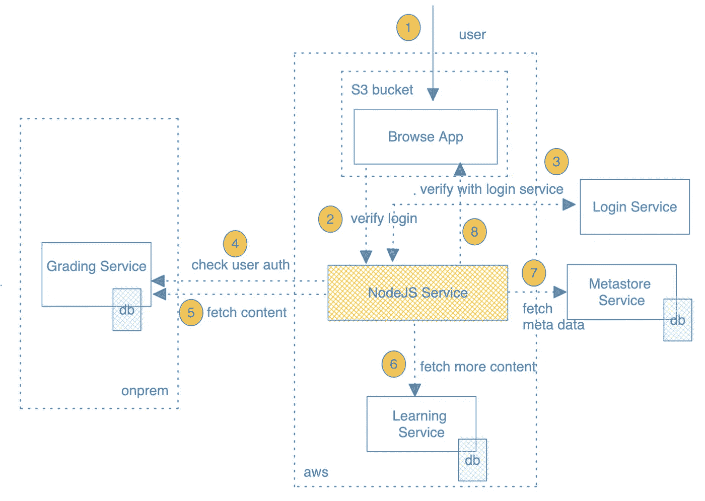

fig(2): microservice communication flow

## 设计基于路径的路由

在本节中，我们将建立平地机应用程序与浏览应用程序之间的通信。然后，我们将研究如何在 AWS 云中实现这一点。我们的一些主要需求是提供应用程序之间的无缝转换，避免任何差异，并为未来的用例建立一个基本的微前端。

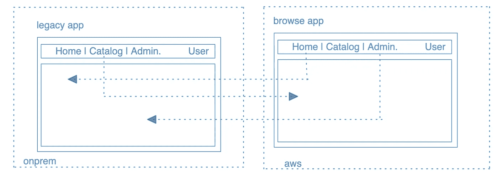

fig(3): communication between old and new app

正如我们所看到的，如果用户单击我们的遗留应用程序中的 catalog 选项卡，那么我们只会将用户重定向到 AWS 上托管的新应用程序。为了避免任何差异，我们为新的 spa 借用了相同的设计、布局和导航条。

## **设计决策一:域名**

我们的传统平地机应用程序有一个类似于 https://grader.com[的名字，并在本地托管。因此，我们不能在 AWS 云中选择相同的域名，但是，我们希望选择一个与现有域名相同的名称，并反映下一代的变化。因此，我们得到了一个类似于 https://product-name-grader.com 的域名。](https://grader.com)

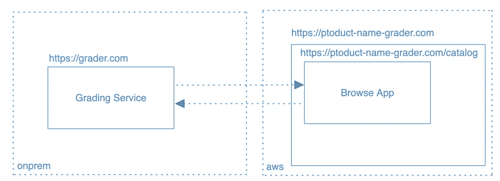

fig(4): domain names between apps

## **设计决策二:应用名称**

我们希望使用这个新域名来托管许多 spa，因此我们的新应用程序将在“/catalogs”下提供服务。将来，我们希望在“/licensing”下添加 licensing SPA，在“/coursework”下添加 course work SPA 等。

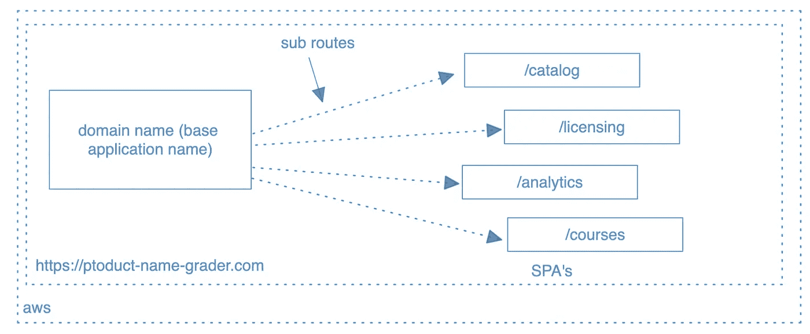

fig(5): new app domain name and possible spa’s

## **设计决策三:创建 React 应用构建**

我们的 SPA 是使用 [CRA](https://create-react-app.dev/) 脚手架构建的，如果您运行“npm run build ”,它会以一种结构良好的方式生成一个包含 javascript 块、资产等的构建文件夹，所有这些都是从构建文件夹根目录下的“index.html”文件中引用的。

> **注意**:为了减少讨论中的噪音，我减少了 CRA 构建过程中的文件。

“index.html”将在应用程序初始化时加载。暂时保留这个想法，因为它在配置我们的 CloudFront 和 s3 bucket 时起着至关重要的作用。

## **设计决策四:部署**

**第一部分(概述):**

下面的架构概述显示了我们的代码部署到 S3 桶所需的所有组件。我们公司的构建过程与 maven 紧密相关，但是在您的案例中可能不需要。简而言之，maven 插件帮助我们进行代码健全，并构建构建文件，然后由 TeamCity 作业将该文件复制到 S3 桶中。

> **注意**:可以跳过 maven，使用 npm 来构建文件。然后手动将构建文件复制到没有 TeamCity 的 S3 存储桶中。

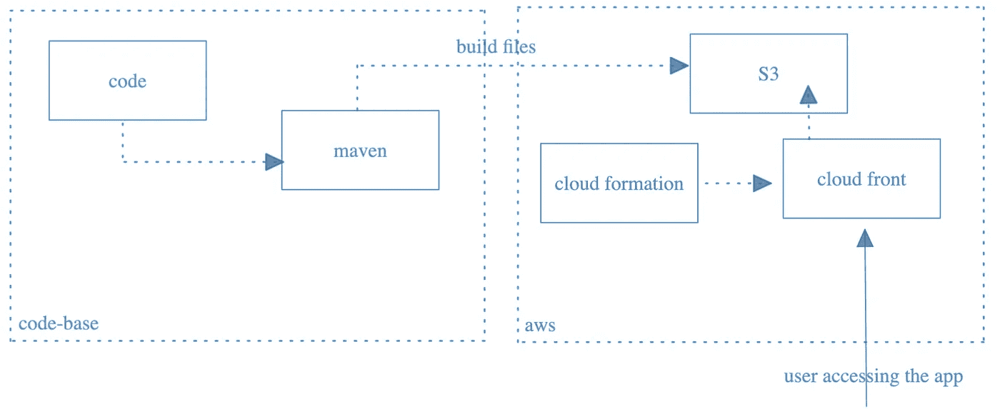

fig(5): AWS CloudFront and S3 deployment

我们的 S3 位于云锋之后，云锋充当面向前方(用户)的入口点。对 CloudFront 的任何更新，如版本变化等。将使用云形成来完成。

用户可以通过从传统评分应用程序导航和/或直接访问 SPA 来访问 SPA。所有的 SPA 请求都将由 CloudFront 处理，然后从 S3 桶中加载适当的文件(毕竟 S3 就像一个文件夹)。

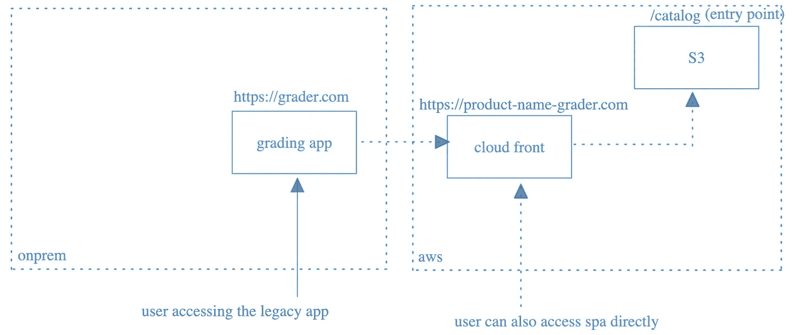

fig(6): AWS CloudFront and S3

如果你回头看一下**第三部分:创建 React 应用构建**，我们的构建文件夹有一个 index.html 文件，每当用户访问[https://product-name-grader.com](https://product-name-grader.com)(即与访问[https://product-name-grader.com/index.html](https://product-name-grader.com/index.html)相同)时，该文件就会被 CloudFront 加载。但是，我们希望我们的 URL 路径能够反映预期的 SPA，即目录。

我们*重命名*这个‘index . html’文件来编目(没有。html)所以它将作为一个对象被加载，加载 SPA 的 URL 将是[https://product-name-grader.com/catalog](https://product-name-grader.com/catalog)

> **注意**:如果你尝试给目录添加一个. html 扩展名，那么每当用户试图访问 https://product-name-grader.com/catalog.html 的时候，它就会把 catalog.html 文件下载到你的机器上，因为它只不过是一个存储在桶/文件夹中的文件。

**第二部分(构建和后期构建):**

通过添加构建后脚本，我们可以在“npm 运行构建”步骤中重命名和/或移动文件。请在此阅读更多关于此[的内容。下面是我们需要在 package.json 中进行的更改，然后在项目根目录中添加一个后期构建脚本。](https://docs.npmjs.com/cli/v8/using-npm/scripts)

> **学习技巧**:我们将了解 npm 项目中构建后脚本的好处。

到此结束时，我们将有一个更新的构建文件夹，其中 index.html 被重命名为 catalog.html，然后一个新的子文件夹目录将托管构建的静态内容。下面是后期生成过程文件/文件夹的概述。

下面是带有构建后更改的[提交](https://github.com/citta-lab/medium/tree/475cc9bcd43d0811dca03f762e66099b54c4d67b/catalog)。

**第三部分(成功抵达 S3):**

正如我在前面几节中提到的，我们有一个 maven 进程来运行构建脚本，并将其压缩到主页名称下(在 package.json 中提到)和 pom 版本下。然后，team city 作业会将构建文件夹结构复制到 artifactory (JFrog ),下一个 team city 作业会从 artifactory 获取最新的构建，并将其放在 S3 存储桶名称下(即 catalogs-name-us-east-1 ),并将 catalog.html 文件重命名为 catalog(使其成为对象而不是 HTML 页面)。

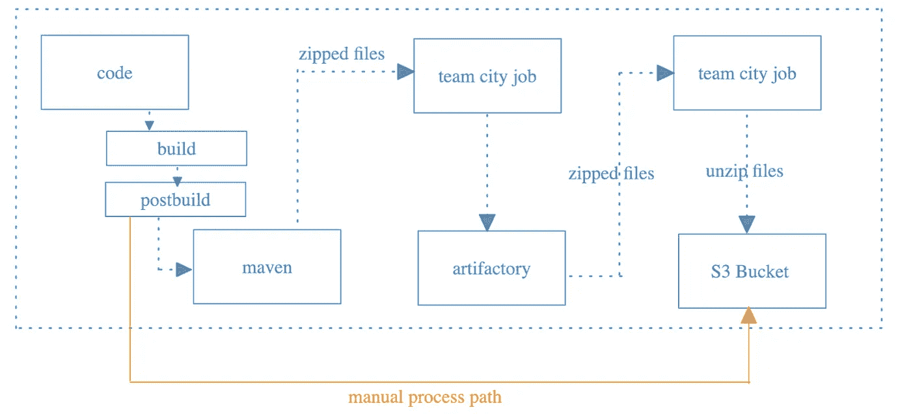

fig(7): code to S3

**重要提示:**但是，您可以跳过所有这些自动化过程，手动构建代码，然后将内容复制到 S3 存储桶。

> **手动更新(亚马逊 S3):**
> 【选择】catalogs.html>动作>重命名对象>目录>保存更改。
> 【选择】catalogs.html>动作>编辑元数据>值【text/html】>保存修改。

下面是亚马逊 S3 控制台，以及我们完成上述过程(自动或手动)后文件应该是什么样子。

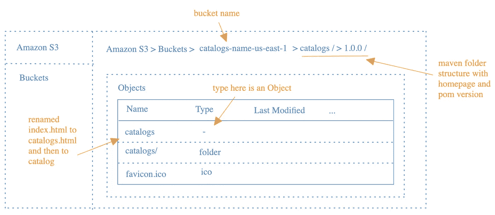

fig(8): AWS S3 console with our build code

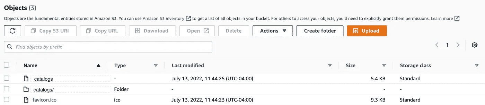

**第四部分(云锋):**

在这一节中，我们将关注用户请求如何从 CloudFront 到达 S3 桶，以及实现这一点所需的 CloudFront 配置。

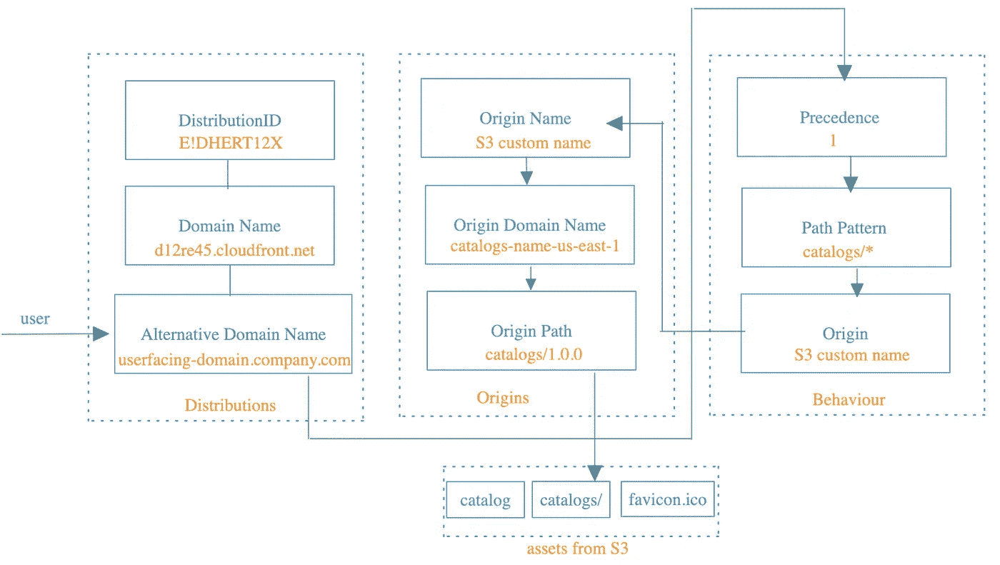

fig(9): CloudFront to S3 bucket

**发行起点:**

下面我们有两个原点名称，一个用于我们的节点服务，一个用于我们的 S3 存储桶。有了节点服务并定义了行为，我们就可以将流量从我们的 SPA 路由到我们的节点服务，而无需定义完整的 API URL。

**示例:**通常，当我们在 SPA 中提取 API 调用时，我们会提到一个 API 的完整 URL，类似于[https://service-name . company . com/catalogs/v1/admin/healthcheck](https://service-name.company.com/catalogs/v1/admin/healthcheck)，但是通过结合路径模式、优先级和源域，我们可以简单地在定义的路径上调用 fetch 方法，如“catalogs/v1/admin/health check”。

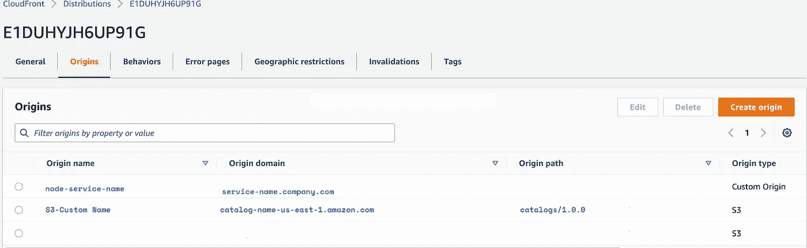

fig(10): Origins details in CloudFront

**分布行为:**

基于优先级匹配路径模式，然后将各个请求定向到它们各自的起点。在我们的例子中，首先匹配节点服务路径(优先级 0，1)，然后我们匹配 S3 桶。如果这些路径模式中的任何一个不匹配，默认情况下路由到 S3(因此默认设置为*)。

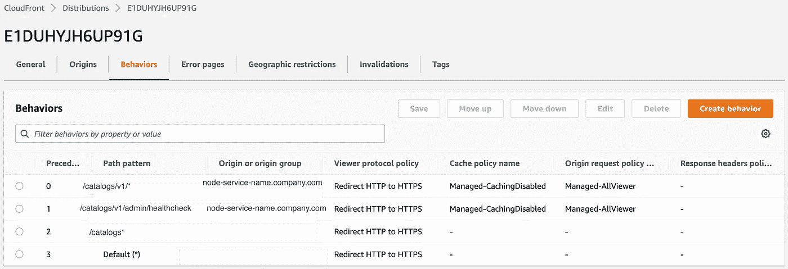

fig(11): Behaviour to route the requests

**分配错误页面:**

在本节中，如果由于某种原因我们无法进行路径模式匹配，我们将把请求恢复到我们的 S3 存储桶。

**示例:**当我们用自定义路径(如 catalogs/1234)更新 URL 时，这特别有用，但是我们的 S3 桶没有名为 catalogs/1234 的对象，所以它会出错(如 403)。因此，我们将请求路由回 catalogs 对象(从 catalogs.html 重命名为 catalog 对象),这将触发 react-router 逻辑来查找适当的页面。

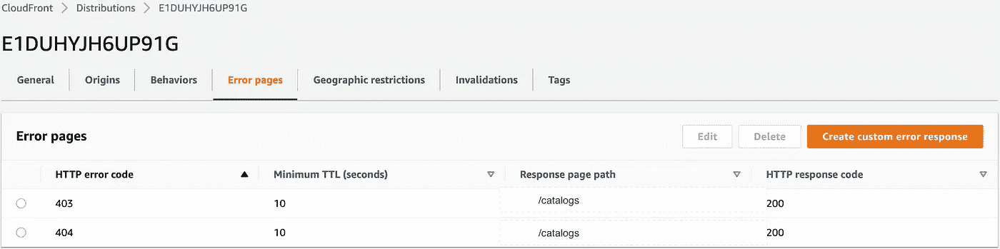

fig(13): fallback to S3 root directory (i.e catalogs)

到目前为止，我们应该已经构建好了我们的 SPA 并部署到 AWS 云。

**我之前的三篇博客:**
1。 [React:搜索组件设计](/react-search-component-design-6b0e618dbf5f)
2。 [React | Node:为什么要关心依赖关系？](https://citta-lab.medium.com/react-node-why-should-we-care-about-dependencies-a8d3e904689b)
3。 [DIY:如何修理你的 HVAC 区域风门](https://citta-lab.medium.com/diy-how-to-fix-your-hvac-zone-damper-4a7a5b21d3be)

*更多内容请看*[***plain English . io***](https://plainenglish.io/)*。报名参加我们的* [***免费周报***](http://newsletter.plainenglish.io/) *。关注我们关于* [***推特***](https://twitter.com/inPlainEngHQ)[***领英***](https://www.linkedin.com/company/inplainenglish/)**和* [***不和***](https://discord.gg/GtDtUAvyhW) ***。****