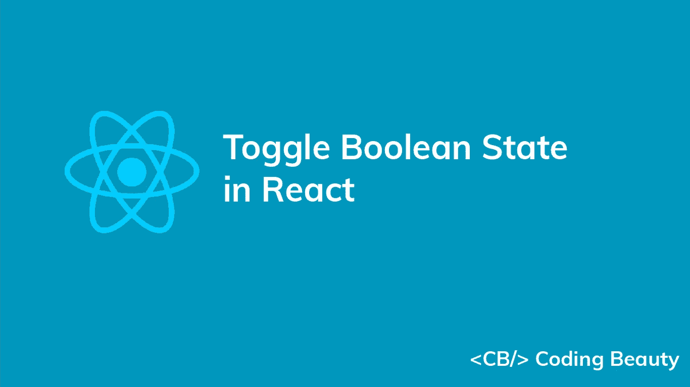
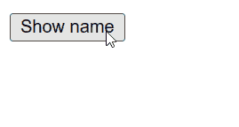

# 如何在 React 中切换布尔状态

> 原文：<https://javascript.plainenglish.io/react-toggle-boolean-state-639f488403f5?source=collection_archive---------19----------------------->



要在 React 中切换布尔状态:

1.  使用`useState`钩子创建布尔状态(如果你还没有创建)。
2.  将回调传递给状态更新函数(`setState`)。
3.  从回调中返回布尔变量的反值。

例如:

`JavaScript`

```
import { useState } from 'react';

export default function App() {
  const [visible, setVisible] = useState(false);

  const handleToggle = () => {
    setVisible((current) => !current);
  };

  return (
    <div>
      <button onClick={handleToggle}>Show name</button>
      {visible && <p>Coding Beauty</p>}
    </div>
  );
}
```



The text’s visibility is toggled on button click.

我们用`useState`钩子创建布尔状态。`[useState](https://reactjs.org/docs/hooks-state.html)`返回一个由两个值组成的数组，第一个是状态值，第二个是被调用时更新状态的函数。

我们将回调函数传递给`setVisible`，因为回调总是传递最新的`visible`状态。

**提示:**当从当前状态数据计算出新的状态时，总是传递一个函数给`setState`。

在我们的例子中，回调简单地否定布尔值，并返回否定状态的结果。

[逻辑不](https://developer.mozilla.org/en-US/docs/Web/JavaScript/Reference/Operators/Logical_NOT)(！)运算符将真值转换为`false`，将假值转换为`true`。

`JavaScript`

```
console.log(!true); // false

console.log(!false); // true

console.log(!5); // false

console.log(!undefined); // true
```

**注意**:JavaScript 中只有 6 个 falsy 值:`undefined`、`null`、`''`(空字符串)、`NaN`、`0`、`false`。所有其他值都是真的，并且当被求反时将产生`false`。

# 对布尔状态切换执行操作

当组件中的布尔状态发生变化时，有时您希望执行重新渲染之外的操作，例如网络请求。要执行这样的操作，将代码放在`[useEffect](https://reactjs.org/docs/hooks-effect.html)`钩子中，并将布尔状态变量包含在`useEffect`的 dependencies 数组中。

`JavaScript`

```
import { useEffect, useState } from 'react';
import axios from 'axios';

export default function App() {
  const [visible, setVisible] = useState(false);

  const handleToggle = () => {
    setVisible((current) => !current);
  };

  useEffect(() => {
    if (visible) {
      axios.post('https://example.com/stats/name/views').then(() => {
        console.log('Updated stats successfully.')
      });
    }
  }, [visible]);

  return (
    <div>
      <button onClick={handleToggle}>Show name</button>
      {visible && <p style={{ color: 'blue' }}>Coding Beauty</p>}
    </div>
  );
}
```

`[useEffect](https://reactjs.org/docs/hooks-effect.html)`钩子中的代码在组件挂载或从`visible`状态的变化中更新后运行。这里，状态控制元素的可见性，所以在钩子中，我们检查元素是否可见，如果可见，我们向服务器发出网络请求，更新与元素相关的视图统计信息。

# 对布尔状态更改执行操作，但跳过第一次渲染

根据您的情况，您可能希望该操作在组件从状态更改更新时运行，而不是在组件首次挂载时运行。

我们可以通过在第一次渲染中创建一个初始值为`false`的 ref 标志变量，并在所有后续渲染中将其值更改为`true`来实现这一点。

`JavaScript`

```
import { useEffect, useRef, useState } from 'react';
import axios from 'axios';

export default function App() {
  const afterFirstRender = useRef(false);
  const [visible, setVisible] = useState(false);

  const handleToggle = () => {
    setVisible((current) => !current);
  };

  useEffect(() => {
    if (!afterFirstRender.current) {
      afterFirstRender.current = true;
      return;
    }

    if (visible) {
      axios.post('https://example.com/stats/name/show').then(() => {
        console.log('Stats updated successfully')
      });
    }
  }, [visible]);

  return (
    <div>
      <button onClick={handleToggle}>Show name</button>
      {visible && <p style={{ color: 'blue' }}>Coding Beauty</p>}
    </div>
  );
}
```

`useRef`返回一个可变的 ref 对象，当组件更新时，该对象的值不变。此外，修改该对象的`current`属性值不会导致重新渲染。这与从`useState`返回的`setState`更新功能相反。

如果 ref 的值是`false`，我们防止动作在`[useEffect](https://reactjs.org/docs/hooks-effect.html)`中发生，并将值更改为`true`用于后续渲染。否则，我们执行动作。

*最初发表于*[*codingbeautydev.com*](https://cbdev.link/e32fa9)

# JavaScript 做的每一件疯狂的事情

一本关于 JavaScript 微妙的警告和鲜为人知的部分的迷人指南。


[**报名**](https://cbdev.link/d3c4eb) 立即免费领取一份。

## 更多内容请访问 [PlainEnglish.io](https://plainenglish.io/) 。

*报名参加我们的* [***免费周报***](http://newsletter.plainenglish.io/) *。关注我们上* [***推特***](https://twitter.com/inPlainEngHQ) ， [***领英***](https://www.linkedin.com/company/inplainenglish/) ***，***[***YouTube***](https://www.youtube.com/channel/UCtipWUghju290NWcn8jhyAw)***，以及****[***不和***](https://discord.gg/GtDtUAvyhW) *

## *希望扩大你的科技创业公司的知名度和采用率吗？检查[电路](https://circuit.ooo/?utm=publication-post-cta)。*