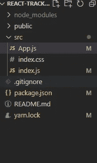
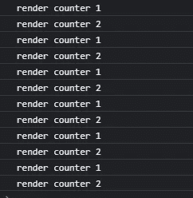
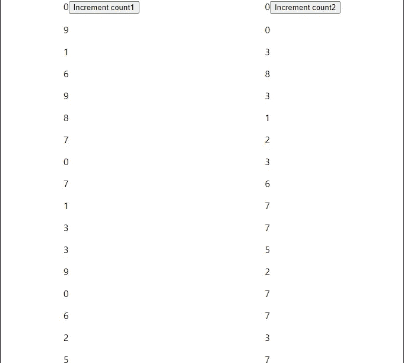
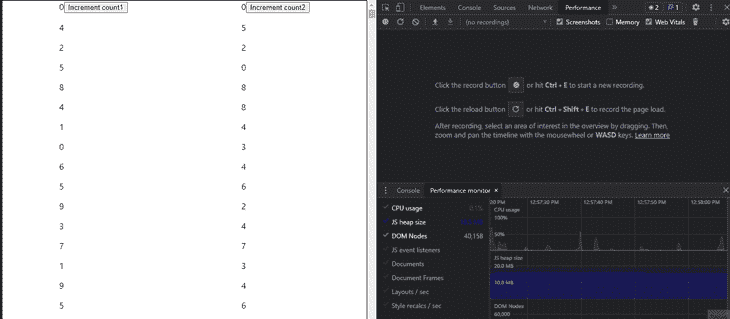
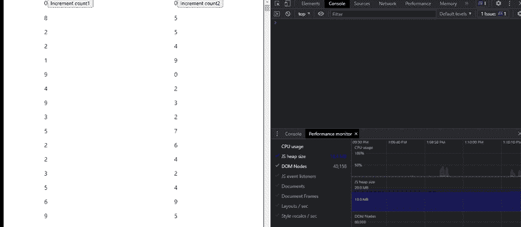

# 跟踪反应:管理状态并防止过度重新渲染

> 原文：<https://javascript.plainenglish.io/react-tracked-manage-state-and-prevent-excessive-re-rendering-d41d20f3335c?source=collection_archive---------1----------------------->


Source: [https://github.com/dai-shi/react-tracked](https://github.com/dai-shi/react-tracked)

在过去的几年中，React 中的状态管理经历了重大的演变。有了像内置 React Context API 和 React Redux 这样的解决方案，保持全局状态和跟踪变化变得前所未有的简单。然而，在实现这些工具时，一个持续的挑战是优化性能和防止组件不必要的重新呈现。

而在较小的应用程序中，过多的重新渲染可能不会引起注意或者没有负面影响，随着应用程序的增长，每次重新渲染都可能导致 UI 延迟或滞后。在本教程中，我们将使用 [React Tracked](https://github.com/dai-shi/react-tracked) ，一个用于状态使用跟踪的库，通过防止不必要的重新渲染来优化我们的应用程序的性能。

# 安装 React Tracked

首先，在您的机器上建立一个新的 React 项目。在终端中打开项目，并添加以下命令来安装 React 跟踪库:

```
yarn add react-tracked scheduler
```

现在，让我们通过给它以下结构来清理我们的项目:



# 设置我们的应用程序

让我们比较一下 React Tracked 和共享状态的普通 React 实现。我们将创建一个简单的全局上下文，它有两个计数器组件，每个组件使用一个值。

在`App.js`中添加以下代码:

```
import Counter1 from "./Counter1";
import Counter2 from "./Counter2";import { SharedStateProvider } from "./store";function App() {
  return (
    <>
      <SharedStateProvider>
        <div
          style={{
            display: "flex",
            flexDirection: "row",
            border: "1px solid black",
            justifyContent: "space-around",
          }}
        >
          <Counter1 />
          <Counter2 />
        </div>
      </SharedStateProvider>
    </>
  );
}export default App;
```

要创建计数器组件，请在每个文件中添加以下代码:

# `Counter1`

```
import React from "react";
import { useSharedState } from "./store";export default function Counter1() {
  const [state, setState] = useSharedState(); const increment = () => {
    setState((prev) => ({ ...prev, count1: prev.count1 + 1 }));
  }; return (
    <div>
      {state.count1}
      {console.log("render counter 1")} <button onClick={increment}>Increment count1</button> </div>
  );
}
```

# `Counter2`

```
import React from "react";
import { useSharedState } from "./store";export default function Counter2() {
  const [state, setState] = useSharedState(); const increment = () => {
    setState((prev) => ({ ...prev, count2: prev.count2 + 1 }));
  }; return (
    <div>
      {state.count1}
      {console.log("render counter 2")} <button onClick={increment}>Increment count2</button> </div>
  );
}
```

# `store.js`

最后，让我们创建我们的`store.js`文件，它使用全局计数器上下文和计数器组件中状态的`useSharedState()`钩子:

```
import React, { createContext, useState, useContext } from "react";const initialState = {
  count1: 0,
  count2: 0,
};const useValue = () => useState(initialState);const MyContext = createContext(null);export const useSharedState = () => {
  const value = useContext(MyContext);
  return value;
};export const SharedStateProvider = ({ children }) => (
  <MyContext.Provider value={useValue()}>{children}</MyContext.Provider>
);
```

要运行该项目，请添加以下命令:

```
yarn start
```

现在，我们将在浏览器屏幕上看到以下输出:


打开浏览器控制台，按下每个**增量**按钮三次。我们将收到以下输出:



无论状态是否更新，每个组件都会重新呈现。理想情况下，组件应该只在状态改变时才重新呈现。

在我们的示例中，总共应该有六次重新渲染，两个组件都有三次，但是，我们得到了 12 次，这表明两个组件在每次单击时都重新渲染了。

# 呈现一个大列表

现在，让我们尝试呈现一个大的元素列表。将下面的代码添加到`Counter1`和`Counter2`中，在每个组件中生成一个 10，000 个随机数的列表:

```
import React, { useEffect, useState } from "react";
import { useSharedState } from "./store";export default function Counter1() {
  const [state, setState] = useSharedState(); const [randomNumbers, setRandomNumbers] = useState([]);
  const increment = () => {
    setState((prev) => ({ ...prev, count1: prev.count1 + 1 }));
  };
  const generateHugeList = () => {
    let list = [];
    for (let i = 0; i < 10000; i++) {
      list.push(Math.floor(Math.random() * 10));
    }
    setRandomNumbers(list);
  };
  useEffect(() => {
   generateHugeList();
  }, []);
  return (
    <div>
      {state.count1}
      {console.log("render counter 1")} <button onClick={increment}>Increment count1</button>
      {randomNumbers.map((number) => {
        return <p>{number}</p>;
      })}
    </div>
  );
}
```

计数器组件在浏览器上呈现列表，产生类似如下的输出:



随着这些新元素的引入，我们的应用程序需要更多的时间来加载:


第一次加载时，CPU 使用率跃升至 100 %:


React 将在第一次渲染时将所有元素绘制到浏览器 DOM 中，因此 100%的 CPU 使用率是典型的。但是，在单击每个计数器组件上的**增量**按钮后，CPU 使用率保持在 100 %,这表明两个计数器都在不断重新呈现:



# 防止重新渲染的选项

防止重新渲染的一个流行方法是[在 React Redux](https://blog.logrocket.com/getting-started-react-redux-firebase/) 中使用选择器，这是订阅 Redux 存储并在调度动作时运行的函数。选择器使用`===`作为严格的质量检查，每当数据改变时重新呈现组件。虽然这个过程对变量很有效，但每次数据改变时返回新引用的函数会不断地重新呈现。

另一方面，React Tracked 包装上下文对象，并通过使用 JavaScript 代理来跟踪状态的单个属性的变化，从而返回自己的提供者。

代理包装单个对象，截取或改变其基本操作。React Tracked 实现了检查组件内部状态的代理，只有当信息改变时才重新呈现它。要查看代理的运行情况，让我们在应用程序中实现 React Tracked。

# 呈现跟踪了反应的列表

首先，我们需要通过添加以下代码来修改我们之前创建的`store.js`文件:

```
import { useState } from "react";
import { createContainer } from "react-tracked";const initialState = {
  count1: 0,
  count2: 0,
};const useMyState = () => useState(initialState);export const { Provider: SharedStateProvider, useTracked: useSharedState } =
  createContainer(useMyState);
```

在上面的代码中，我们导入了`createContainer()`，它返回一个 React 跟踪的提供者。`useTracked`钩子为我们的状态创建了一个代理。

现在，让我们重新构建项目，并将之前的输出与 React Tracked 的输出进行比较:



例如，当我们选择**增量计数 1** 按钮时，在第一次渲染时，`Counter1`和`Counter2`都会被渲染。然而，在随后的点击中，只有`Counter1`被重新渲染，减少了 CPU 的整体使用，提高了我们应用的性能。

# 结论

在本教程中，我们探讨了由不必要的重新渲染导致的不必要的性能缺陷。虽然像 React Redux 和 React Context API 这样的工具可以很容易地跟踪应用程序状态的变化，但它们并没有提供一个简单的解决方案来最小化重新呈现。

使用 React Tracked 库，我们构建了一个应用程序，并最大限度地减少了重新呈现计数器组件的次数，从而减少了 CPU 的使用并提高了整体性能。我希望你喜欢这个教程！

原帖通过 [LogRocket](https://blog.logrocket.com/react-tracked-manage-state-prevent-excessive-re-rendering) 发布。

*更多内容看* [***说白了。报名参加我们的***](http://plainenglish.io/) **[***免费周报***](http://newsletter.plainenglish.io/) *。在我们的* [***社区获得独家访问写作机会和建议***](https://discord.gg/GtDtUAvyhW) *。***