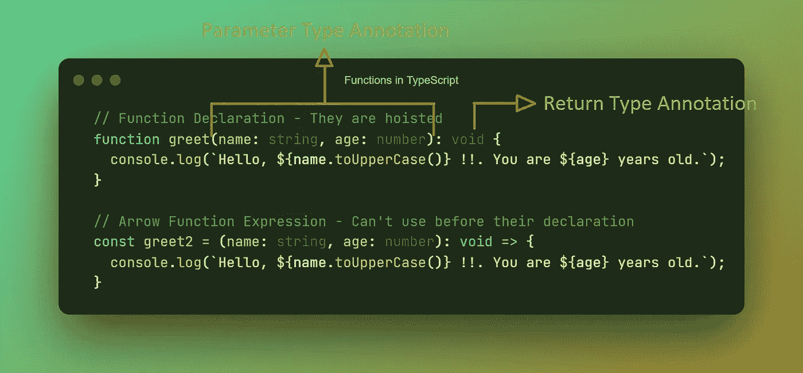
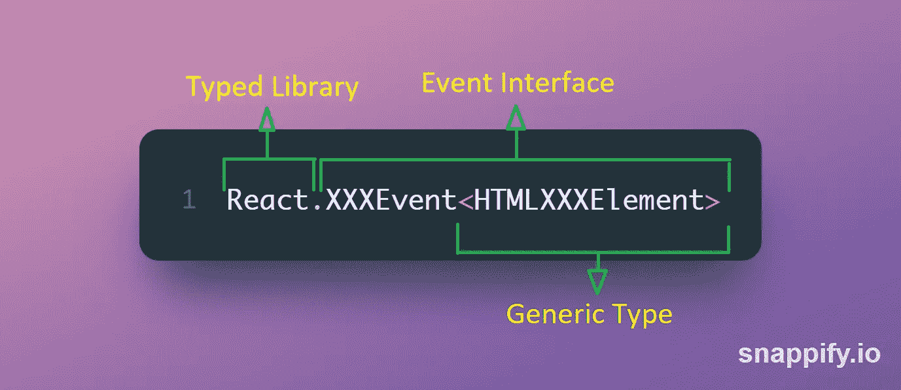

# React & TypeScript:处理事件

> 原文：<https://javascript.plainenglish.io/react-typescript-handling-events-ab13d9778411?source=collection_archive---------5----------------------->

## 如何在 React & TypeScript 中处理事件

👋嘿大家好！

事件处理是 React 中的常规活动。当你在 React 应用程序中过渡到使用 TypeScript 时，事件处理会给你一点困难，迫使你使用`any` type 来让你的生活继续。所以，让我们来看看如何让你的生活变得轻松一点。

Regularly used JavaScript Events in React

> **作为一种类型化语言，TypeScript 可以在构建时捕捉错误和 bug，远在你的应用上线之前。**

为了支持您使用 TypeScript 的信念，让我们来看看 TypeScript 的一些明显的额外好处。TypeScript 使代码易于阅读和维护。而 vs 代码和其他编辑器中的**智能感知支持**让开发者的日子轻松多了。使用 typescript 增加了对代码的信心。随着大多数库中对 typescript 支持的快速增长，将 typescript 与 react 一起使用变得更加有利。😃

在本文中，我将分享我们如何在 React ❤️TypeScript 婚姻中处理 JavaScript 事件。我正在添加一些可以帮助你的片段，尤其是如果你是 React 应用程序中的 TypeScript 新手的话。这些是我在 React 中经常处理的事件处理程序。我还补充了我对这些事件的观察。

在继续之前，让我们看看函数是如何类型化的。

Functions in typescript

**通常不需要返回类型注释**，因为 TypeScript 会根据函数的`return`语句推断出函数的返回类型。

**事件类型的典型语法:**

Event Type representation

# **1。点击事件:🖱️**

click 事件在 React 中被大量使用，所以你必须一直处理 Click 事件。

*触发器:* **点击 HTML 元素时**

*类型:*

这里有一个例子:

# **2。更改事件:📝**

change 事件通常用于更新组件的输入状态。它在表单组件**中用于更新输入状态**，验证输入，并在用户输入时立即提供反馈。这种即时反馈有助于改善用户体验。

*Trigger:* React 合成变化事件的行为与 JavaScript 变化事件略有不同，因为 React 比较 DOM 和虚拟 DOM，并在输入发生变化时调度变化事件**，而 JavaScript 变化事件仅在元素失去焦点后触发。**

> ****change 事件是为** `**<input>**` **、** `**<textarea>**` **、** `**<select>**` **元素触发的。****

***类型:***

**这里有一个例子:**

# **3.模糊事件:👋**

**当焦点离开一个元素时，模糊事件被用来做一些事情。该事件通常**用于验证“所需”条件**，并且可以向用户提供关于该条件的即时反馈。该事件**也可用于其他验证**，在这种情况下，只有在用户完成整个输入后才需要为用户输入提供反馈，这与变更事件的情况不同。**

***触发:*当焦点离开一个元素时**

***类型:* `React.FocusEvent<HTMLxxxElement>`**

**这里有一个例子:**

# **4.提交事件:📄**

**提交事件用于**处理表单**的提交。该事件仅针对 form 元素触发。表单元素的默认行为是使用 GET/POST `method`重定向到`action`属性中提供的 URL。为了防止这种默认行为并控制表单提交，使用了`Event`接口的`preventDefault`方法。**

***触发:*提交`<form>`时。**

***类型:***

**这里有一个例子:**

# **5.按键事件:⌨️**

**Keydown 事件用于处理按键时触发的事件。这个事件很方便，因为许多用户喜欢使用键盘，使用这个事件可以提高可访问性。keypress 事件已被否决，结束了这两个事件之间的混淆。当出于某种原因，`<form>`元素没有被用来注册用户输入时，这个事件就派上了用场。**

***触发:*按下一个键时**

***类型:***

**这里有一个例子:**

***🎉有趣的事实:如果您在* `*<form>*` *元素中使用* `*<input type="submit />*` *或* `*<button type="submit" >Submit</button>*` *，您不需要添加一个 KeyDown 处理程序来在按下“Enter”键时提交表单，该特性默认添加到您的* `*<form>*` *组件中。***

**我希望，这能让你的生活轻松一点。我有一些反应项目，可能会进一步帮助你。这是我的 Github。深入研究一下，并随意使用代码。我在下面添加了一些我认为有用的参考资料。**

# **🎁奖金:**

**如果使用内联事件处理程序，则不需要为事件添加类型，因为在这种情况下，TypeScript 足以推断事件类型。**

**保重，试着花些时间在你的爱好上！**

# **参考资料:**

1.  **[React 中 TypeSctipt 的官方文档](https://www.typescriptlang.org/docs/handbook/react.html)**
2.  **[反应事件类型备忘单](https://github.com/piotrwitek/react-redux-typescript-guide/blob/master/README_SOURCE.md#reactxxxeventhtmlxxxelement)**
3.  **[反应中变化和输入事件的区别](https://stackoverflow.com/questions/38256332/in-react-whats-the-difference-between-onchange-and-oninput)**
4.  **[输入时提交表单](https://stackoverflow.com/a/33212911/7233936)**

***更多内容请看*[***plain English . io***](https://plainenglish.io/)*。报名参加我们的* [***免费周报***](http://newsletter.plainenglish.io/) *。关注我们关于*[***Twitter***](https://twitter.com/inPlainEngHQ)*和*[***LinkedIn***](https://www.linkedin.com/company/inplainenglish/)*。查看我们的* [***社区不和谐***](https://discord.gg/GtDtUAvyhW) *加入我们的* [***人才集体***](https://inplainenglish.pallet.com/talent/welcome) *。***