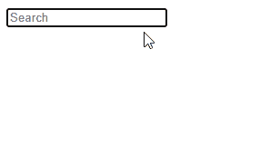

# useDeferredValue 挂钩在 React 中是如何工作的？

> 原文：<https://javascript.plainenglish.io/react-usedeferredvalue-b510b375bb1d?source=collection_archive---------9----------------------->

## 使用“useDeferredValue”挂钩，通过推迟耗时的更新以允许关键更新快速发生来提高性能。


React now 在版本 18 中提供了并发支持。现在有许多功能可以帮助更好地利用系统资源和提升应用程序性能。一个这样的特性是`useDefferedValue`钩子，在本文中我们将学习`useDeferredValue`并理解我们可以使用它的场景。

# 我们为什么需要`useDefferedValue`？

在我们看到这个钩子的运行之前，我们需要了解 React 如何管理状态和更新 DOM。

假设我们有以下代码:

`App.js`

```
export default function App() {
  const [name, setName] = useState(''); const computedValue = useMemo(() => {
    return getComputedValue(name);
  }, [name]); const handleChange = (event) => {
    setName(event.target.value);
  }; return (
    <input
      type="text"
      placeholder="Username"
      value={name}
      onChange={handleChange}
    />
  );
}
```

这里我们用`[useState](https://reactjs.org/docs/hooks-reference.html#usestate)`钩子创建了一个状态变量，并从状态中导出了一个计算值(`computedValue`)。只有当状态改变时，我们才使用`[useMemo](https://reactjs.org/docs/hooks-reference.html#usememo)`钩子来重新计算计算值。

因此，当输入字段的值改变时，`name`状态变量被更新，并且在 DOM 被更新之前重新计算计算出的值。

这通常不是问题，但有时这种重新计算过程涉及大量计算，需要很长时间才能完成。这可能会降低性能和用户体验。

例如，我们可以开发一个功能，让用户在一个巨大的列表中搜索一个项目:

`App.js`

```
function App() {
  const [query, setQuery] = useState(''); const list = useMemo(() => {
    // 👇 Filtering through large list impacts performance
    return largeList.filter((item) => item.name.includes(query));
  }, [query]); const handleChange = (event) => {
    setQuery(event.target.value);
  }; return (
    <>
      <input type="text" value={query} onChange={handleChange} placeholder="Search"/>
      {list.map((item) => (
        <SearchResultItem key={item.id} item={item} />
      ))}
    </>
  );
}
```

在这个例子中，我们有一个查询状态变量用于过滤一个巨大的条目列表。列表越长，完成过滤和更新`list`变量以完成 DOM 更新所需的时间就越长。

因此，当用户在输入字段中键入内容时，过滤将导致 DOM 更新延迟，输入中的文本需要一段时间才能立即反映用户键入的内容。这种缓慢的反馈会对你的应用对用户的反应产生负面影响。

我在下面的演示中模拟了缓慢，这样你可以更好地理解这个问题。只有几个搜索结果供您正确地可视化，它们都是输入到输入字段中的内容的大写字母。

在这个演示中，我尽可能快地一个接一个地输入每个字符，但是由于人为的缓慢，我的击键需要大约一秒钟来改变输入的文本。


# `useDeferredValue`在行动

在这种情况下，`useDeferredValue`挂钩非常方便。`useDeferredValue()`接受一个状态值作为参数，并返回该值的副本，该副本将被延迟，即，当状态值被更新时，该副本不会相应地更新，直到 DOM 被更新以反映状态变化。这确保了紧急更新的发生，而不会被不太关键、耗时的更新所延迟。

```
function App() {
  const [query, setQuery] = useState(''); // 👇 useDefferedValue
  const deferredQuery = useDefferedValue(query); const list = useMemo(() => {
    return largeList.filter((item) => item.name.includes(query));
  }, [deferredQuery]); const handleChange = (event) => {
    setQuery(event.target.value);
  }; return (
    <>
      <input type="text" value={query} onChange={handleChange} placeholder="Search" />
      {list.map((item) => (
        <SearchResultItem key={item.id} item={item} />
      ))}
    </>
  );
}
```

在上面的例子中，我们之前的代码被修改成使用`useDeferredValue`钩子。和以前一样，当用户键入时，`query`状态变量将被更新，但是这一次，`useMemo`不会被立即调用来过滤大列表，因为现在`deferredQuery`是依赖关系`useMemo`正在监视变化，并且`useDeferredValue`确保在`query`被更新并且组件被重新呈现之前`deferredQuery`不会被更新。

由于`useMemo`不会被调用，并且不会因为`query`状态的改变而阻止 DOM 更新，所以 UI 会及时更新，并且一旦用户输入，输入文本也会改变。这解决了响应问题。

在`query`状态更新后，*然后* `deferredQuery`将被更新，导致`useMemo`过滤大列表并重新计算`list`变量的值，更新显示在输入字段下方的项目列表。



正如你在演示中看到的，当我输入时，文本会立即改变，但是列表会滞后，过一段时间会更新。

如果我们在短时间内不断改变输入字段的文本(例如，通过快速输入)，那么`deferredQuery`状态将保持不变，列表也不会更新。这是因为在`useDeferredValue`能够被更新之前`query`状态将保持变化，所以`useDeferredValue`将继续延迟更新，直到它有时间将`deferredQuery`设置为`query`的最新值并更新列表。

我的意思是:


这非常类似于去抖动，因为列表直到输入停止一段时间后才更新。

## 小费

有时在我们的应用程序中，当事件发生时，我们会想要执行一个昂贵的动作。如果此事件在短时间内发生多次，该操作将重复多次，从而降低性能。为了解决这个问题，我们可以设置一个要求，即从事件最近一次发生起，动作只执行“X”次。这叫做**去抖**。

例如，在注册表单中，我们可以让请求在用户最后一次在用户名输入字段中键入用户名后 500 毫秒才被发送，而不是在用户输入时发送请求来检查数据库中的重复用户名(当然，我们可以在用户提交表单后执行重复检查，而不是近乎实时地执行)。

由于`useDeferredValue`钩子会延迟更新并导致额外的重新渲染，所以不要过度使用它是很重要的，因为这实际上会导致我们试图避免的性能问题，因为它会迫使 React 在你的应用中进行额外的重新渲染。只有当您有重要更新时才使用它，这些更新应该尽快进行，而不会被较低优先级的更新拖慢。

# 结论

`useDeferred`值接受一个状态变量并返回它的一个副本，该副本直到组件从原始状态的更新中重新呈现后才会被更新。这提高了应用程序的性能和响应能力，因为耗时的更新被推迟到以后进行，以便为那些应该在 DOM 中毫不延迟地显示给用户的关键更新让路。

【codingbeautydev.com】原载于[](https://cbdev.link/96f1b6)

# *JavaScript 做的每一件疯狂的事情*

*一本关于 JavaScript 微妙的警告和鲜为人知的部分的迷人指南。*

**

*[**报名**](https://cbdev.link/d3c4eb) 立即免费领取一份。*