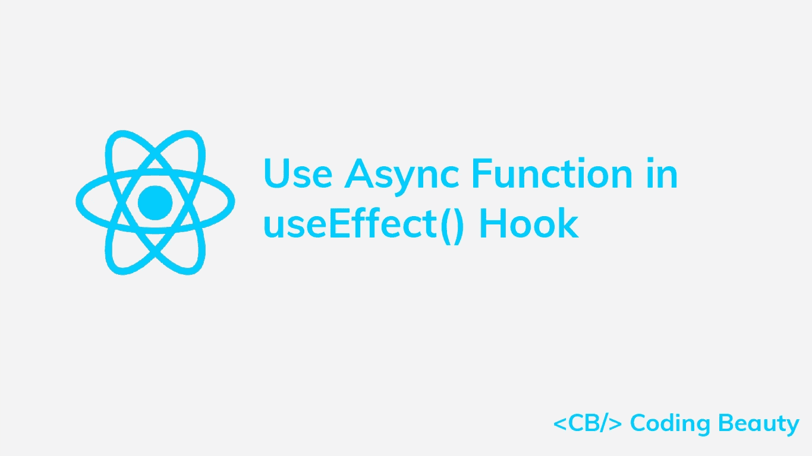

# 如何在 React useEffect()挂钩中使用异步函数

> 原文：<https://javascript.plainenglish.io/react-useeffect-async-bbae21889cc0?source=collection_archive---------11----------------------->

## 了解在 React useEffect()钩子中轻松调用异步函数的多种方法。



在本文中，我们将看看在 React `useEffect()`钩子中轻松调用`async`函数的不同方法，以及在使用`async` / `await`时要避免的陷阱。

# 使用 useEffect()中的 then/catch 调用异步函数

`async`函数在 JavaScript 中执行异步操作。为了在 React useEffect()钩子中等待`Promise``async`函数返回被解决(完成或拒绝),我们可以使用它的`then()`和`catch()`方法:

在下面的例子中，我们调用`fetchBooks()`异步方法来获取和显示样本阅读应用程序中存储的书籍:

```
export default function App() {
  const [books, setBooks] = useState([]); useEffect(() => {
    // await async "fetchBooks()" function
    fetchBooks()
      .then((books) => {
        setBooks(books);
      })
      .catch(() => {
        console.log('Error occured when fetching books');
      });
  }, []); return (
    <div>
      {books.map((book) => (
        <div>
          <h2>{book.title}</h2>
        </div>
      ))}
    </div>
  );
}
```

# 异步/等待问题:异步回调无法传递给 useEffect()

也许您更喜欢使用`async/await`语法来代替`then/catch`。您可以通过将回调传递给`useEffect()` `async`来尝试这样做。

这不是一个好主意，如果你使用的是棉绒，它会马上通知你。

```
// ❌ Your linter: don't do this!
useEffect(async () => {
  try {
    const books = await fetchBooks();
    setBooks(books);
  } catch {
    console.log('Error occured when fetching books');
  }
}, []);
```

你的 linter 抱怨是因为`useEffect()`的第一个参数应该是一个函数，要么不返回任何东西，要么返回一个函数来清除副作用。但是`async`函数总是返回一个`Promise`(隐式或显式)，并且`Promise`对象不能作为函数调用。这可能会导致 React 应用程序出现真正的问题，比如内存泄漏。

```
useEffect(async () => {
  const observer = () => {
    // do stuff
  }; await fetchData(); observable.subscribe(observer); // Memory leak!
  return () => {
    observable.unsubscribe(observer);
  };
}, []);
```

在这个例子中，因为回调函数是`async`，它实际上并不返回定义的清理函数，而是返回一个用清理函数解析的`Promise`对象。因此，这个清除函数永远不会被调用，观察者永远不会从可观察对象中退订，从而导致内存泄漏。

那么我们该如何解决这个问题呢？我们如何在`useEffect()`钩子中使用带有`async`功能的`await`操作符？

# async/await 解决方案 1:在 IIFE 中调用异步函数

解决这个问题的一个简单方法是将[中的`async`函数`await`立即调用函数表达式](https://developer.mozilla.org/en-US/docs/Glossary/IIFE)(life):

```
const [books, setBooks] = useState([]);useEffect(() => {
  (async () => {
    try {
      const books = await fetchBooks();
      setBooks(books);
    } catch (err) {
      console.log('Error occured when fetching books');
    }
  })();
}, []);
```

顾名思义，生命是一个一旦被定义就运行的函数。它们用于避免污染全局命名空间，以及在尝试一个`await`调用可能导致包含生命的作用域出现问题的场景中(例如在`useEffect()`钩子中)。

# 异步/等待解决方案 2:在命名函数中调用异步函数

或者，您可以在一个命名函数中`await`这个`async`函数:

```
useEffect(() => { // Named function "getBooks"
  async function getBooks() {
    try {
      const books = await fetchBooks();
      setBooks(books);
    } catch (err) {
      console.log('Error occured when fetching books');
    }
  } // Call named function
  getBooks();
}, []);
```

还记得使用可观察模式的例子吗？下面是我们如何使用一个命名的`async`函数来防止发生的内存泄漏:

```
// ✅ Callback is not async
useEffect(() => {
  const observer = () => {
    // do stuff
  }; // Named function "fetchDataAndSubscribe"
  async function fetchDataAndSubscribe() {
    await fetchData();
    observable.subscribe(observer);
  } fetchDataAndSubscribe(); // ✅ No memory leak
  return () => {
    observable.unsubscribe(observer);
  };
}, []);
```

# 异步/等待解决方案 3:创建自定义挂钩

我们还可以创建一个自定义钩子，它的行为类似于`useEffect()`，并且可以接受`async`回调而不会导致任何问题。

自定义挂钩可以这样定义:

```
export function useEffectAsync(effect, inputs) {
  useEffect(() => {
    return effect();
  }, inputs);
}
```

我们可以从代码中的多个地方调用它，就像这样:

```
const [books, setBooks] = useState([]);useEffectAsync(async () => {
  try {
    const books = await fetchBooks();
    setBooks(books);
  } catch (err) {
    console.log('Error occured when fetching books');
  }
});
```

有了这三种方法，我们现在可以很容易地在`useEffect()`钩子中使用带有`async`函数的`await`操作符。

# 在 useEffect()外部定义异步函数

要在`useEffect()`钩子之外定义一个命名的`async`函数，可以用 [useCallback()](https://reactjs.org/docs/hooks-reference.html#usecallback) 钩子包装这个函数:

```
const getBooks = useCallback(async () => {
  try {
    const books = await fetchBooks();
    setBooks(books);
  } catch (err) {
    console.log('Error occured when fetching books');
  }
}, []);useEffect(() => {
  getBooks();
}, [getBooks]);
```

如果没有`useCallback()`，每次重新渲染时都会重新创建`getBooks()`函数，不必要地触发`useEffect()`并导致性能问题。

【codingbeautydev.com】原载于[](https://cbdev.link/52f554)

# *JavaScript 做的每一件疯狂的事情*

*一本关于 JavaScript 微妙的警告和鲜为人知的部分的迷人指南。*

**

*[报名](https://cbdev.link/d3c4eb)立即免费领取一份。*