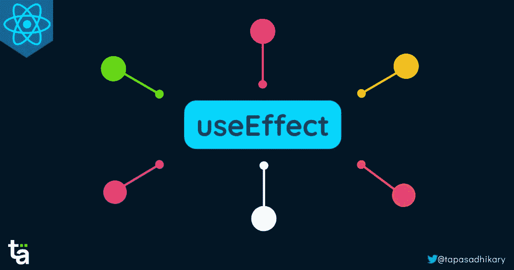

# 你必须知道的钩子用法

> 原文：<https://javascript.plainenglish.io/react-useeffect-hook-usages-you-must-know-45157805fb98?source=collection_archive---------5----------------------->

## 学习 React 中 useEffect 钩子的实际用法，以及如何通过各种用例管理组件的副作用。



React 是一个基于 JavaScript 的用户界面库。React 组件是独立的可重用代码逻辑片段，具有自己的 UI。多个组件一起创建一个有意义的工作 React 应用程序。

我们可以用两种方式创建组件，使用类或函数。随着 JavaScript 开发人员对函数的了解越来越多，我们看到许多 React 开发人员适应基于函数的组件，而不是基于类的组件。

从 React 16.8 版本开始，React 得到了一个令人兴奋的新特性，叫做[钩子](https://www.youtube.com/watch?v=CvNvRaS3u60)。React 提供了许多标准的内置钩子来管理状态、隔离副作用、创建引用、提高性能等。我们还可以创建[自定义钩子](https://www.youtube.com/watch?v=nt-TB3f5kp4)，这只是访问许多 React 特性的 JavaScript 函数。

在本文中，我们将讨论一个最常用的内置 React 挂钩`useEffect`。我们将通过实际的使用案例来学习它的用法。

# useEffect 挂钩

组件的结果是用呈现逻辑(用 JSX 写的)在用户界面上呈现“某些东西”。许多因素驱动渲染逻辑，

*   状态值在组件内部定义和更新。
*   props 值被传递给组件。
*   副作用。

现在，有哪些`side effects`？如果你以前在编程的环境中没有听说过，那也没关系。这里就让我们来破一破，了解一下。

*   副作用可以是负责改变组件状态的任何效果(编程逻辑)。如果状态改变，组件会重新呈现。例如，一个典型的副作用是进行 API 调用并更改组件的本地状态来存储 API 响应数据。
*   此外，可能会有副作用，可能不会更新状态值，也不会影响渲染逻辑。例如，您在浏览器控制台上记录一个文本，或者在浏览器的本地存储中存储一些内容。请注意，其中一些我们可以使用`useRef`钩子来完成，我们将在以后的文章中学习。

所以，副作用是我们应该从渲染中分离出来的。`useEffect`钩子通过将它从渲染逻辑中分离出来来帮助执行副作用。

```
useEffect(callback, [dependencies]);
```

useEffect 挂钩有两个参数，

*   定义和清除副作用的回调函数。
*   一个可选的依赖数组，确保何时运行回调函数中定义的副作用。

# useEffect 挂钩的用法

我们传递给`useEffect`钩子的回调函数运行副作用。默认情况下，React 会在组件的每次渲染时运行它。但是，在每个渲染上运行副作用可能会非常昂贵，而且会影响性能。我们可以使用传递给 useEffect 钩子的依赖数组参数来控制它。

在这一节中，我们将学习 useEffect 钩子的六种用法来运行和清理副作用。

# 1.副作用运行`After Every`渲染

第一种是默认情况。如果不将依赖数组传递给 useEffect 钩子，回调函数将在每次渲染时执行。因此`React`会在每次渲染后运行它定义的副作用。

这不是一个经常使用的用例场景。我们可能总是想控制副作用的发生。

```
useEffect(() => {
  // Side Effect
});
```

# 2.初始渲染后副作用运行`Only Once`

您可能希望在初始渲染后只运行一次副作用。典型的情况是获取数据，进行 API 调用，并在初始呈现后将响应存储在状态变量中。您不想再次进行此 API 调用。

您可以将一个空数组作为第二个参数传递给 useEffect 钩子来处理这个用例。

在这种情况下，副作用仅在组件的初始渲染后运行一次。

```
useEffect(() => {
  // Side Effect
}, []);
```

# 3.`State Value`变化后的副作用

您可能需要根据状态值运行副作用。例如，您可能会有一个副作用，即根据口语(英语、西班牙语、印地语、泰米尔语等)准备一条问候消息。).这里，口语值存储在一个状态变量中。

每当我们选择一种口语，状态就会更新。随着状态值的更新，您希望重新创建问候消息。为了解决这个用例，您必须将状态变量作为依赖数组的一部分传递给 useEffect 钩子。

```
useEffect(() => {
  // Side Effect
}, [state]);
```

在这种情况下，副作用将在每次状态变量的值改变时运行。如果多个状态变量影响副作用，可以在依赖数组中以逗号分隔的形式传递它们。

```
useEffect(() => {
  // Side Effect
}, [state1, state2, state3]);
```

# 4.`Props Value`改变后副作用运行

就像状态一样，我们也可以把道具作为依赖来运行副作用。在这种情况下，每当作为依赖项传递的道具发生变化时，副作用就会运行。

您可以像前面的例子一样，以逗号分隔的依赖关系来传递多个属性。

```
useEffect(() => {
  // Side Effect
}, [props]);
```

# 5.`Props and State Value`改变后副作用运行

如果您需要在每次状态和道具组合发生变化时运行副作用，该怎么办？当副作用取决于状态和道具值时，可能会出现这种用例。在这种情况下，您需要将 state 和 props 变量作为依赖项传递。

```
useEffect(() => {
  // Side Effect
}, [props, state]);
```

# 6.副作用`Cleanup`

到目前为止，我们已经看到了如何以及何时运行副作用。同样重要的是，我们要清理掉影响应用程序性能的副作用。每个副作用都不一样。因此，副作用的清除策略会有所不同。

例如，如果使用`setTimeout`函数运行定时器有副作用，就需要通过调用`clearTimeout`函数来清除它。但是我们怎么做呢？

为了清理副作用，您需要从我们传递给 useEffect 钩子的回调函数中返回一个函数。您必须将副作用清除逻辑放在返回的函数中。

```
useEffect(() => {
  // Side Effectreturn () => {
    // Side Effect Cleanup
  }
}[props, state]);
```

有几点需要注意，

*   每次初始渲染后都会调用清理功能来清理之前的副作用，然后运行后续的副作用。
*   当组件卸载时，cleanup 函数被调用。

# 结论

以上就是关于`useEffect`钩子的用法。我希望这篇文章对你有所帮助。

但是等等，还没完，真的！如果你想通过动手项目继续了解它，我会把这个 YouTube 视频教程留给你。我希望你也喜欢它。

*请* [*订阅*](https://www.youtube.com/tapasadhikary?sub_confirmation=1) *未来内容*🔥🔥🔥

# 在我们结束之前…

我分享我的知识，

*   🌐Web 开发(JavaScript、ReactJS、Next.js、Node.js 等等……)
*   🛡️网络安全公司
*   💼职业发展
*   🌱开源
*   ✍️内容创作

让我们连接起来，

*   [在 Twitter 上关注](https://twitter.com/tapasadhikary)
*   [订阅我的 YouTube 频道](https://www.youtube.com/tapasadhikary?sub_confirmation=1)
*   [GitHub 上的侧项目](https://github.com/atapas)
*   [Showwcase React 社区](https://www.showwcase.com/community/react.js)

*原载于*[*https://blog . greenroots . info*](https://blog.greenroots.info/react-useeffect-hook-usages-you-must-know)*。*

*更多内容请看*[***plain English . io***](https://plainenglish.io/)*。报名参加我们的* [***免费周报***](http://newsletter.plainenglish.io/) *。关注我们关于*[***Twitter***](https://twitter.com/inPlainEngHQ)*和**[***LinkedIn***](https://www.linkedin.com/company/inplainenglish/)*。加入我们的* [***社区***](https://discord.gg/GtDtUAvyhW) *。**