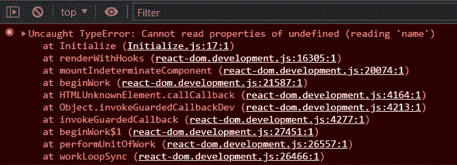
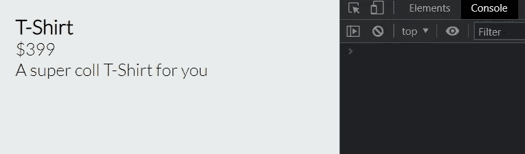
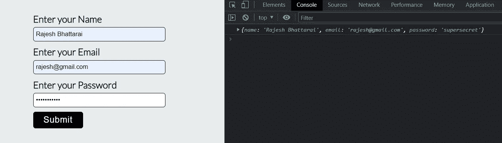
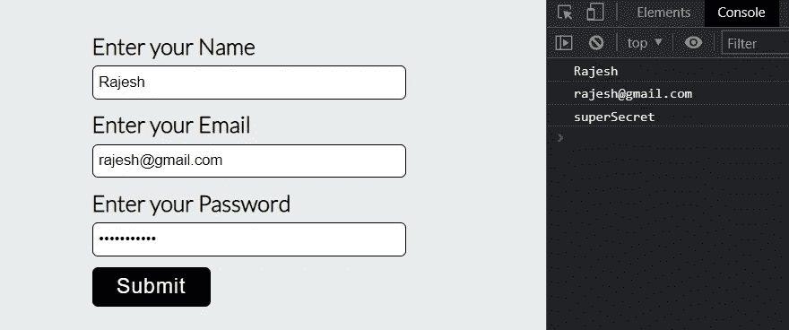
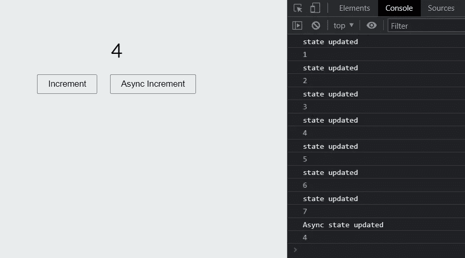
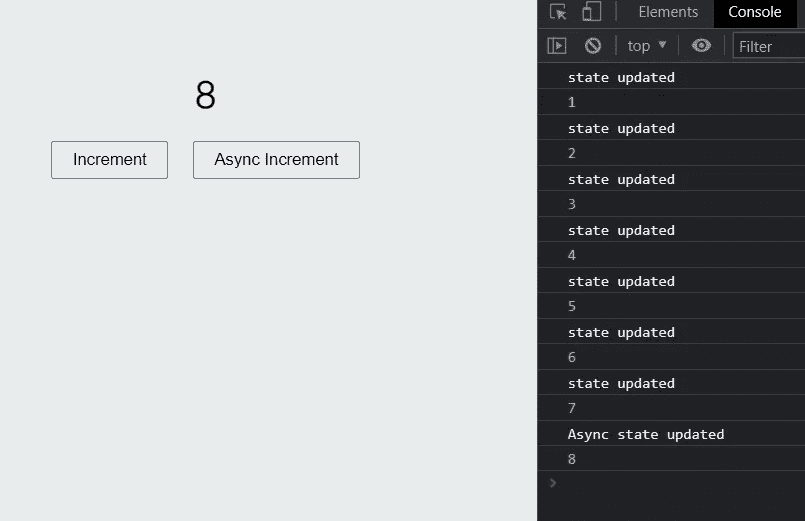
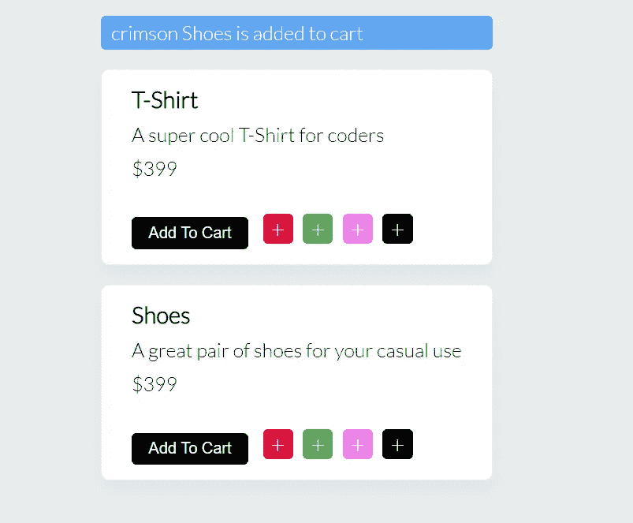
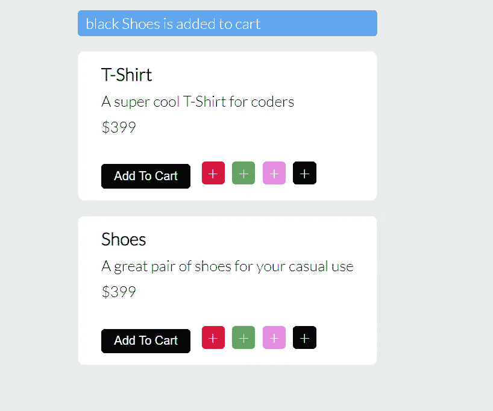

# 你必须避免的错误！

> 原文：<https://javascript.plainenglish.io/react-usestate-hook-mistakes-you-must-avoid-fde757ca52f5?source=collection_archive---------3----------------------->


在这篇博客中，我们将讨论 React developer 常犯的 5 个最常见的 useState 挂钩错误。我们将一步一步地看到所有常见的错误，并通过示例学习如何修复它们。

# 1.依赖于 API 响应来填充状态

我见过许多 React 开发人员在没有正确初始化的情况下定义了 useState 钩子，然后用 API 响应添加数据。当您试图在组件呈现之前访问状态数据时，这会给您一个错误，因为获取 API 响应需要一些时间。

> 让我们看看下面的例子

**初始化组件**

```
import React, { useEffect, useState } from 'react';

const Initialize = () => {
    const [product, setProduct] = useState();

    useEffect(() => {
        // Consider this as an API response
        const apiResponse = {
            name: "T-Shirt",
            price: "$399",
            description: "A super coll T-Shirt for you"
        }
        setProduct(apiResponse);
    }, [])
    return (
        <div>
            <h3>{product.name}</h3>
            <p>{product.price}</p>
            <p>{product.description}</p>
        </div>
    );
};

export default Initialize;
```

**输出**



useState hook gives cannot read properties of undefined error

我们正在从产品状态中访问 name 属性，而该属性在状态中并不存在。一旦 API 调用成功，就会添加它。因此，在组件呈现期间，产品状态是未定义的。修复这个错误的一个好方法是初始化状态。

**初始化组件**中的初始化状态

```
import React, { useEffect, useState } from 'react';

const Initialize = () => {
    const [product, setProduct] = useState({
        name: "",
        price: "",
        description: ""
    });

    useEffect(() => {
        // Consider this as an API response
        const apiResponse = {
            name: "T-Shirt",
            price: "$399",
            description: "A super coll T-Shirt for you"
        }
        setProduct(apiResponse);
    }, [])
    return (
        <div>
            <h3>{product.name}</h3>
            <p>{product.price}</p>
            <p>{product.description}</p>
        </div>
    );
};

export default Initialize;
```

**输出**



No Error in the console

初始化状态后，错误从控制台消失，我们可以清楚地看到网页上的数据。

# 2.为每个输入元素创建状态更改方法

假设您有一个表单组件，其中有多个输入元素。现在，您需要从这些输入元素中获取值，并更新组件状态。在这种情况下，一些初级开发人员为每个 input 元素创建一个独特的 handle change 函数，这不是处理表单数据的好方法。

> 让我们看看下面的例子

**更新状态组件**

```
import { useState } from "react";

function UpdateState() {
  const [formData, setFormData] = useState({name: '', email: '', password: ''});

  const handleName = event => {
    setFormData({...formData, name: event.target.value})
  }

  const handleEmail = event => {
    setFormData({...formData, email: event.target.value})
  }

  const handlePassword = event => {
    setFormData({...formData, password: event.target.value})
  }

  const handleSubmit = () => {
    console.log(formData);
  }

  return (
    <div>
      <div className="input-control">
        <label htmlFor="name">Enter your Name</label>
        <input 
         type="text" 
         className="input-field" 
         placeholder="Enter your name" 
         id="name" 
         onChange={handleName}
        />
      </div>
      <div className="input-control">
        <label htmlFor="email">Enter your Email</label>
        <input 
         type="email" 
         className="input-field" 
         placeholder="Enter your email" 
         id="email" 
         onChange={handleEmail}
        />
      </div>
      <div className="input-control">
        <label htmlFor="password">Enter your Password</label>
        <input 
         type="password" 
         className="input-field" 
         placeholder="Enter your password" 
         id="password" 
         onChange={handlePassword}
        />
      </div>

      <div>
        <button onClick={handleSubmit} className="submit">Submit</button>
      </div>

    </div>
  );
}

export default UpdateState;
```

正如我所说的，这不是处理表单数据的好方法。我们只需要一个函数来接收所有输入字段的数据并更新状态。让我们看看下面的代码，看看我们如何做到这一点。

**更新状态组件**

```
import { useState } from "react";

function UpdateState() {
  const [formData, setFormData] = useState({name: '', email: '', password: ''});

  const handleChange = name => event => {
    setFormData({...formData, [name]: event.target.value})
  }

  const handleSubmit = () => {
    console.log(formData);
  }

  return (
    <div>
      <div className="input-control">
        <label htmlFor="name">Enter your Name</label>
        <input 
         type="text" 
         className="input-field" 
         placeholder="Enter your name" 
         id="name" 
         onChange={handleChange("name")}
        />
      </div>
      <div className="input-control">
        <label htmlFor="email">Enter your Email</label>
        <input 
         type="email" 
         className="input-field" 
         placeholder="Enter your email" 
         id="email" 
         onChange={handleChange("email")}
        />
      </div>
      <div className="input-control">
        <label htmlFor="password">Enter your Password</label>
        <input 
         type="password" 
         className="input-field" 
         placeholder="Enter your password" 
         id="password" 
         onChange={handleChange("password")}
        />
      </div>

      <div>
        <button onClick={handleSubmit} className="submit">Submit</button>
      </div>

    </div>
  );
}

export default UpdateState;
```

**输出**



logging out the form data after clicking submit button

# 3.在更新输入数据的同时呈现组件

你可以在上面的例子中看到，我在每个将要更新状态的输入元素中使用了 onChange 方法。我们知道一旦状态被更新，组件会重新呈现以反映新的变化。这样做的问题是，每次我们在输入框中输入一个字符，我们的组件都会重新呈现。使用 [**useRef**](/what-is-useref-hook-forwardref-in-react-a-complete-explanation-8f55496875ca) 钩子可以避免组件不必要的重新渲染。如果你想要一个关于 useRef 钩子和 forwardRef 的详细解释，那么 [**点击这里**](/what-is-useref-hook-forwardref-in-react-a-complete-explanation-8f55496875ca) 。

> 让我们看看下面的例子

**用户执行组件**

```
import React, { useRef } from 'react';

const UseRefImplement = () => {
    const formField = useRef(null);

    const handleSubmit = () => {
        console.log(formField.current['name'].value);
        console.log(formField.current['email'].value);
        console.log(formField.current['password'].value);
    }
    return (
    <div>
      <form ref={formField}>
      <div className="input-control">
        <label htmlFor="name">Enter your Name</label>
        <input 
         type="text" 
         className="input-field" 
         placeholder="Enter your name" 
         id="name" 
         name="name"
        />
      </div>
      <div className="input-control">
        <label htmlFor="email">Enter your Email</label>
        <input 
         type="email" 
         className="input-field" 
         placeholder="Enter your email" 
         id="email" 
         name="email"
        />
      </div>
      <div className="input-control">
        <label htmlFor="password">Enter your Password</label>
        <input 
         type="password" 
         className="input-field" 
         placeholder="Enter your password" 
         id="password" 
         name="password"
        />
      </div>
      </form>

      <div>
        <button onClick={handleSubmit} className="submit">Submit</button>
      </div>

    </div>
  );
};

export default UseRefImplement;
```

**输出**



logging out the form data after clicking submit button

# 4.使用异步方法更新状态

在这种情况下，让我们先直接看例子。

**异步方法组件**

```
import React, { useEffect, useState } from 'react';

const AsyncMethod = () => {
    const [count, setCount] = useState(0);

    const increment = () => {
        console.log("state updated");
        setCount(count+1);
    }

    const asyncIncrement = () => {
        setTimeout(() => {
            setCount(count+1)
            console.log("Async state updated");
        }, 3000);
    }

    useEffect(() => {
        console.log(count);
    }, [count]);

    return (
        <div className="async">
            <h2>{count}</h2>    
            <div className="button-group">
                <button onClick={increment}>Increment</button>
                <button onClick={asyncIncrement}>Async Increment</button>
            </div>   
        </div>
    );
};

export default AsyncMethod;
```

**输出**



state update and async state update

仔细看控制台。我通过更新状态将数量增加到了 7，现在不知从哪里，您看到了异步状态更新的 4。

## 异步状态更新有什么问题？

实际上，我通过单击 Increment 按钮将计数增加到 3，然后单击 Async Increment 按钮。但是你知道异步函数中有 setTimeout 来模拟异步更新。现在与此同时，我通过点击增量按钮将计数增加到 7。此时，异步状态更新被触发，现在根据异步方法，当前状态计数为 3，因为这是我单击异步增量时的计数。因此它将计数更新为 4 而不是 8。

如果异步状态更新方法跟踪当前状态，这个问题就可以解决。我们可以通过将回调函数传递给设置状态方法来做到这一点

**异步方法组件**

```
import React, { useEffect, useState } from 'react';

const AsyncMethod = () => {
    const [count, setCount] = useState(0);

    const increment = () => {
        console.log("state updated");
        setCount(count+1);
    }

    const asyncIncrement = () => {
        setTimeout(() => {
            setCount(prevCount => prevCount + 1)
            console.log("Async state updated");
        }, 3000);
    }

    useEffect(() => {
        console.log(count);
    }, [count]);

    return (
        <div className="async">
            <h2>{count}</h2>    
            <div className="button-group">
                <button onClick={increment}>Increment</button>
                <button onClick={asyncIncrement}>Async Increment</button>
            </div>   
        </div>
    );
};

export default AsyncMethod;
```

**输出**



state update and async state update

现在您可以看到，通过将回调函数传递给 set state 方法，该方法跟踪最新的状态数据，问题就解决了。

# 更新派生状态

初级 React 开发人员最常犯的一个错误是，当组件中有两个状态，而第二个状态是从第一个状态派生出来的，那么在更新状态时，他们会不知不觉地创建一个 bug。

> 让我们看看下面的例子

**衍生组件**

```
import React, { useState } from 'react';

const DeriveState = () => {
    const [products, setProducts] = useState([
        {
            name: "T-Shirt",
            price: "$399",
            description: "A super cool T-Shirt for coders",
            selectedColor: "crimson",
            id: 146
        },
        {
            name: "Shoes",
            price: "$399",
            description: "A great pair of shoes for your casual use",
            selectedColor: "crimson",
            id: 790
        }
    ])

    const [cartProduct, setCartProduct] = useState();  

    const addToCart = (productId) => {
        const product = products.find(product => product.id === productId);
        setCartProduct(product);
    }

    const handleColor = (color, productId) => {
        setProducts(currentProducts => currentProducts.map(product => {
            if (product.id === productId) {
                return {...product, selectedColor: color}
            }
            return product
        }));
    }

    return (
        <div className="cards">
            {
                cartProduct ?
                <div className="card-added">
                {cartProduct.selectedColor} {cartProduct.name} is added to cart
                </div> : null
            }
            {
                products.map(product => (
                    <div key={product.id} className="card">
                      <h3>{product.name}</h3>
                      <p>{product.description}</p>
                      <p>{product.price}</p>
                      <p className="quantity">
                      <button onClick={() => addToCart(product.id)} className="cart-btn">
                      Add To Cart
                      </button>                   
                      <span 
                        onClick={() => handleColor("crimson", product.id)} 
                        className="select-color crimson">+</span>
                      <span 
                        onClick={() => handleColor("green", product.id)} 
                        className="select-color green">+</span>
                      <span 
                        onClick={() => handleColor("violet", product.id)} 
                        className="select-color violet">+</span>
                      <span 
                        onClick={() => handleColor("black", product.id)} 
                        className="select-color black">+</span>
                      </p>
                    </div>
                ))
            }
        </div>
    );
};

export default DeriveState;
```

**输出**



The UI of Derive state component

你可能会想，嘿，太棒了，所有的功能都工作正常，上面的代码有什么问题吗？好吧，让我告诉你有一个错误。如果您单击颜色按钮并尝试更新颜色，那么新选择的颜色不会得到反映，因为这里我们有两种不同的状态，我们正在更新唯一的原始状态。不更新派生状态。

为了修复这个 bug，我们基本上不是在派生状态下存储所选产品的副本。我们将存储所选产品的 id。看看下面的代码。

**衍生组件**

```
import React, { useState } from 'react';

const DeriveState = () => {
    const [products, setProducts] = useState([
        {
            name: "T-Shirt",
            price: "$399",
            description: "A super cool T-Shirt for coders",
            selectedColor: "crimson",
            id: 146
        },
        {
            name: "Shoes",
            price: "$399",
            description: "A great pair of shoes for your casual use",
            selectedColor: "crimson",
            id: 790
        }
    ])

    const [cartProduct, setCartProduct] = useState();
    const [cartProductId, setCartProductId] = useState();
    const addedProductToCart = products.find(product => product.id === cartProductId);

    const addToCart = (productId) => {
        setCartProductId(productId);
    }

    const handleColor = (color, productId) => {
        setProducts(currentProducts => currentProducts.map(product => {
            if (product.id === productId) {
                return {...product, selectedColor: color}
            }
            return product
        }));
    }

    return (
        <div className="cards">
            {
                addedProductToCart ?
                <div className="card-added">
                {addedProductToCart.selectedColor} {addedProductToCart.name} is added to cart
                </div> : null
            }
            {
                products.map(product => (
                    <div key={product.id} className="card">
                      <h3>{product.name}</h3>
                      <p>{product.description}</p>
                      <p>{product.price}</p>
                      <p className="quantity">
                      <button onClick={() => addToCart(product.id)} className="cart-btn">
                      Add To Cart
                      </button>                   
                      <span 
                        onClick={() => handleColor("crimson", product.id)} 
                        className="select-color crimson">+</span>
                      <span 
                        onClick={() => handleColor("green", product.id)} 
                        className="select-color green">+</span>
                      <span 
                        onClick={() => handleColor("violet", product.id)} 
                        className="select-color violet">+</span>
                      <span 
                        onClick={() => handleColor("black", product.id)} 
                        className="select-color black">+</span>
                      </p>
                    </div>
                ))
            }
        </div>
    );
};

export default DeriveState;
```

**输出**



The UI of Derive state component

现在我们可以在页面上看到所选的颜色。我们还删除了所选产品的副本，只存储了它的 id。

感谢您读到这里。我希望现在你已经理解了 React developer 在使用 useState 钩子时经常犯的错误。并且你已经准备好在你的下一个项目中避免这些错误。

## 如果你想要更多这样的内容，请在[媒体](https://rajeshi.medium.com)上关注我，并订阅我的 [YouTube 频道](https://www.youtube.com/channel/UCgfW-cxlW7NlpbOscKJYkfA)

有疑问吗？通过[推特](https://twitter.com/izrajesh)联系我

## 更多内容请访问 [PlainEnglish.io](https://plainenglish.io/) 。

报名参加我们的 [**免费每周简讯**](http://newsletter.plainenglish.io/) 。关注我们 [**推特**](https://twitter.com/inPlainEngHQ) ，[**LinkedIn**](https://www.linkedin.com/company/inplainenglish/)**，**[**YouTube**](https://www.youtube.com/channel/UCtipWUghju290NWcn8jhyAw)**，以及** [**不和谐**](https://discord.gg/GtDtUAvyhW) **。**

## 对扩展您的软件启动感兴趣吗？检查[电路](https://circuit.ooo/?utm=publication-post-cta)。

我们提供免费的专家建议和定制解决方案，帮助您建立对您的技术产品或服务的认知和采用。