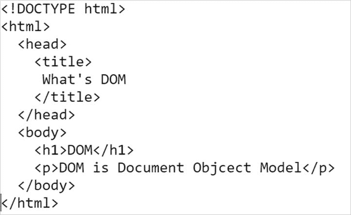
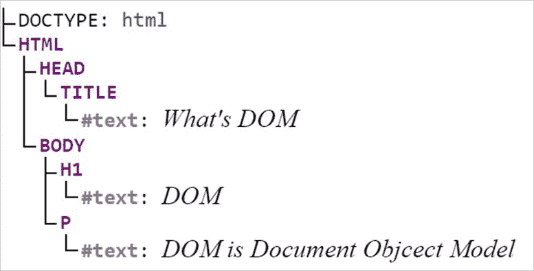
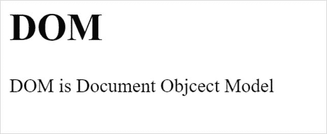
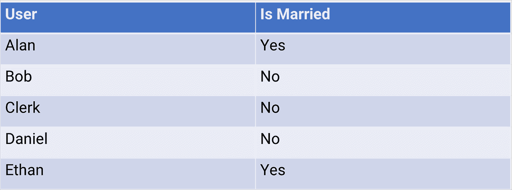
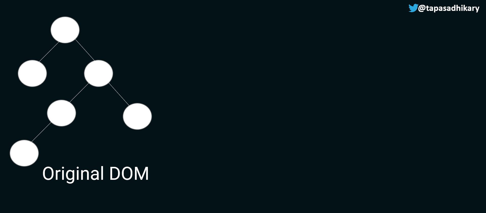

# 反应虚拟 DOM 和和解——像我五岁时那样解释

> 原文：<https://javascript.plainenglish.io/react-virtual-dom-and-reconciliation-explained-like-im-five-6e4670ffc847?source=collection_archive---------7----------------------->

## 理解 React 的虚拟 DOM 和协调概念。

# 什么是 DOM？

DOM 代表文档对象模型。`HTML`是网页的语言。它为 web 页面结构提供了许多专门的标签，包括将多个页面链接在一起的方式。网页的结构表现为树形结构`document object`。JavaScript 编程语言可以改变这个文档对象的结构，为网页带来动态行为。

`DOM`(文档对象模型)是树形结构网页文档的编程接口。文档树被称为`DOM Tree`。

我们用一个简单的例子来理解一下。下面是一个 HTML 代码片段，目的是显示网页的标题和网页正文中的一些信息。



如果我们将上面的代码片段表示为一个文档树，它将看起来像这样。每个 HTML 元素代表树中的一个`node`。



当它呈现在网页上时，我们可以看到这样的信息，



现在，如果我们必须改变段落的文本(`<p>`标签)，我们将需要能够从文档树中找到`<p>`标签，然后为它设置一个新的文本值。我们必须使用 JavaScript DOM APIs 来完成所有这些工作。

```
const paragraph = document.querySelector("p"); paragraph.innerText = 'Some other text!';
```

在文档树中寻找特定节点的机制称为`Querying the DOM`。在文档树中添加新节点、删除节点或更新节点称为`DOM Manipulation`。DOM 操作的结果反映在 web 用户界面上。这个过程叫做`rendering`。

# DOM 操作代价很高

频繁更新`DOM`成本高昂。这可能会降低网页的性能，使其变慢。因为 DOM 是用树结构表示的，所以查询和更新通常比渲染要快。然而，如果我们不得不遍历 DOM 树的很大一部分来找到要更新的节点，这也可能是很昂贵的。

让我们看看下面的雇员表，该表显示了雇员的姓名以及该雇员是否已婚。



如果我们每次都必须遍历这个表的文档树表示来进行更新，那么 DOM 操作的成本会很高。

# React 中的虚拟 DOM 和协调

反应过来是`declarative`。这意味着 React 从开发人员那里抽象出许多底层操作，比如 DOM 操作。因此，React 还确保额外注意解决由于频繁的 DOM 操作和呈现而可能出现的性能问题。

React 从不直接更新`original DOM`(除非开发人员用例需要)。在 React 中，对于每个 DOM 对象，都会创建一个相应的内存副本。这个副本被称为`Virtual DOM` (VDOM)。

在`Virtual DOM`树中，每个元素由一个节点表示。每当元素的状态改变时，都会创建一个新的虚拟 DOM 树。React 的 diffing 算法会将当前的虚拟 DOM 树与其以前的版本进行比较。最后，虚拟 DOM 使用该算法用 diff 更新实际 DOM。

下面的动画图像解释了虚拟 DOM 是如何作为原始 DOM 的副本创建的，以及差异和更新是如何发生的。



How Virtual DOM works — Learn visually

*请* [*点击此链接*](https://res.cloudinary.com/atapas/image/upload/v1649655587/demos/vdom_idrwtz.gif) *如果您没有看到上面的动画图像*

*   首先，React 创建原始 DOM 的副本，称之为虚拟 DOM。虚拟 DOM 的每个节点代表一个元素。
*   接下来，如果有一个元素的状态更新，就会创建一个新的虚拟 DOM。
*   差分算法识别变化中的差异。在这种情况下，来自已更改节点的子树被标识为 diff。
*   最后，React 运行批处理更新，用这些更改更新原始 DOM，以保持同步。

通过区分不同的树来确定哪些部分需要更改，然后用它来更新原始 DOM 的机制被称为`Reconciliation`。你可以在这里了解[和解。React 使用了一个名为【16.0 版本的新协调引擎。你可以点击](https://reactjs.org/docs/reconciliation.html)了解更多关于 [React 光纤架构的信息。](https://github.com/acdlite/react-fiber-architecture)

就是这样。我希望虚拟 DOM 和调和的初学者友好解释对你有所帮助。

# 结论

作为`React`的初学者，你不需要知道虚拟 DOM 是如何工作的，差异是如何发生的，什么是批量更新等等。但是如果你有兴趣知道 React 如何处理应用程序性能和其他概念，如记忆，你必须花一些时间理解虚拟 DOM 和渲染的概念。

此外，不管你喜不喜欢，虚拟 DOM 和渲染对你的面试官来说可能是一个令人兴奋的话题😉！所以，最好意识到这一点。

如果您有兴趣从视频教程中进一步了解虚拟 DOM、协调、区分和批量更新，请查看以下内容:

# 在我们结束之前…

我分享我的知识，

*   🌐Web 开发(JavaScript、React、Next.js、Node.js 等等……)
*   🛡️网络安全公司
*   💼职业发展
*   🌱开源
*   ✍️内容创作

让我们连接起来，

*   [在 Twitter 上关注](https://twitter.com/tapasadhikary)
*   [订阅我的 YouTube 频道](https://www.youtube.com/tapasadhikary?sub_confirmation=1)
*   [GitHub 上的附带项目](https://github.com/atapas)
*   [展示 React 社区](https://www.showwcase.com/community/react.js)

*最初发布于*[*https://blog . greenroots . info*](https://blog.greenroots.info/reactjs-virtual-dom-and-reconciliation-explain-like-im-five)*。*

*更多内容请看* [***说白了就是***](https://plainenglish.io/) *。报名参加我们的* [***免费每周简讯***](http://newsletter.plainenglish.io/) *。关注我们*[***Twitter***](https://twitter.com/inPlainEngHQ)*和*[***LinkedIn***](https://www.linkedin.com/company/inplainenglish/)*。加入我们的* [***社区不和谐***](https://discord.gg/GtDtUAvyhW) *。*