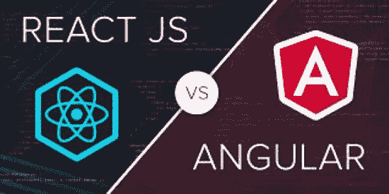
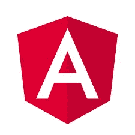

# 反应 VS 角度:前端巨人的冲突

> 原文：<https://javascript.plainenglish.io/react-vs-angular-clash-of-the-frontend-giants-89289038e5e2?source=collection_archive---------3----------------------->

## 发现关于这两个 JavaScript 前端巨头的最重要的事实。

如今，几乎一半基于 JavaScript 的前端项目都是使用这两个巨大且公认的框架编写的。web 开发的世界强烈依赖于这种技术，如果你没有听说过这种技术，你就不能认为自己是真正的开发人员。因此，在这篇文章中，我们将发现关于这两个技术世界中不可思议的艺术品的最重要的事实。我们开始吧

React VS Angular

# 故事

## **反应**

Meta and React

React 是一个 JavaScript 开源前端库，由 Meta(创建时是脸书公司)在 2013 年开发，由它的创建者维护，但也有热情的开发人员和开源爱好者。React 是最受欢迎的 GitHub 库之一，当然也是 JavaScript 库中最著名的。

最初，脸书使用 C++来开发和扩展他们的前端应用程序，速度很快，但为了测试代码库中的每个小变化，工程师们需要编译代码，这需要花费大量的时间，所以这是一个糟糕的解决方案。

因此，他们决定使用 JavaScript 作为一种解释语言来完成这项工作，并建立一套强大的指令集来使所有的过程更加敏捷和愉快。他们做到了。他们创建了 React，一个可能会成为最著名的图书馆。

脸书没有给出这个名字的官方动机，但是一些人认为这是对当时唯一强大的前端框架 Angular 的一种反应。

## **棱角分明**

Google and Angular

Angular 也是一个拥有 MIT 许可的开源前端开发框架。第一个版本名为 AngularJs，于 2010 年发布，主要由谷歌开发。经过几年的经验和发展，以及像 React 这样的竞争对手的增长，谷歌发布了第二个版本，名为 Angular2。

所以，如果你决定学 Angular，一定要小心学 Angular2，离开 AngularJS。仔细检查文档、StackOverflow 问题和 YouTube 视频的版本，因为这两个版本不兼容，而且，如果你用 AngularJs 编写代码，你必须从头开始更新它，这在时间和费用方面都不是一件好事。

AngularJS 是用 JavaScript 编写的，而 Angular2 是用 TypeScript 编写的。这大概就是 Angular 这么好的支持 TypeScript 的原因。它也是对 Bootstrap 支持最好的框架，因此您可以使您的页面响应更快。

# **来自社区的数字**

根据 stackeoverflow.com 2021 年开发者调查，这两种技术非常受欢迎，开发者适应性很强。超过 40%参与调查的开发人员表示他们使用 React，而几乎 23%的人表示使用 Angular。这意味着 React 比 Angular 拥有更多的人使用他们的技术。

这是一个优点，也是一个缺点。它是一个优点，因为它意味着 React 有一个更大更强的社区，可以帮助新开发人员更快地学习和找到更好的资源。不利的一面是，由于市场饱和，React 开发人员可能缺乏工作场所。棱角分明的所以，有一个较弱但虽然很大的社区，但也缺乏就业机会较低。

在 Angular one 中，另一个证明他的用户对 React 的喜爱的数字是 GitHub 库中的 starts。Meta technology 有 118k 颗星，而 Google one“只有”79k 颗星。

# 重要区别:库与框架

这两种技术的主要区别之一是 React 是一个库，而 Angular 是一个框架。这是什么意思？本质上，当你使用一个库时，你负责整个应用的流程，而一个框架可以为你处理。在库中，你可以随时调用元素，有了框架，你会受到更多的限制，但也更安全。

# 简而言之，它是如何工作的

## **反应**

React 使用一个单独的页面，您可以在其中放置、添加和删除不同的部分，称为组件。在 React 理念中，这个组件必须是可重用的和轻量级的。这种模式使得页面结构更容易处理和修改，也提高了整个项目的性能。React 不会在每次发生事情时重新呈现整个页面。为了解决这个问题，他使用了虚拟 DOM，它允许站点只重新加载需要的组件或站点的块。它还允许服务器端渲染(SSR)扩展客户端的性能。

## **棱角分明**

首先，Angular 看起来更加复杂和令人难以招架，但它是一个令人惊奇的框架。它提供了简单的双向数据绑定、MVC 模型、路由包和依赖注入。这些都是很棒的特性，对于没有太多经验的新手来说，听起来可能有些吓人。这些概念是 Angular 如何工作的核心。

双向数据绑定只是一种让组件共享数据并确认某些事件的机制。MVC 模型是组件被组织和放置在页面上的方式，你可以简化像对象和它们的行为一样的思考。路由包是一组指令，让页面在路由器内部创建一些路由，因此当请求进来时，可以识别和生成不同的页面。那么，最终，依赖注入是一种机制，一个对象在其中接收它所依赖的其他对象。这最后一个听起来仍然很棘手。但是，这总体上是有棱角的:一个巨大的框架，有很多很棒的特性，有些还非常先进。

# **表演**

这两种技术的性能很容易比较。它们都是用 JavaScript 编写的，所以我们不需要做奇怪的基准测试或非常复杂的算法来决定哪种性能更好。我们只需要对它们的规格进行一些简单的理论观察。更准确地说，正如你所猜测的，性能最好的应该是更轻的，占用空间更少的那种。这是真的。

那么，哪一个更轻呢？这是反应，用他的 43kb 的空间，对抗 143kb 的角。但是，为什么这个差别这么大呢？React 是一个库，而 Angular 是一个框架，所以他也有自己的语言来呈现页面，而 React 使用 JSX。此外，Angular 有许多额外的功能，这使得所有的包更大，并降低性能。这就是 React 性能更好的原因。此外，React 缺少的特性可以从可通过 npm 安装的不同库中获得。

# 骗局

## **反应过来**

React 不像 Angular 那样实现 MVC，所以他需要导入其他库来使用它，这不是最佳选择。一个奇怪的骗局是这样一个事实:反应速度太快，演变得也很快。在某些情况下，这是一个巨大的优势，但它缺乏文档，而且它迫使开发人员随时更新发生的任何事情，因为它可能是伟大的事情。

## **棱角分明**

如前所述，由于大量的依赖性，Angular 往往非常慢，这使得它很难扩展。此外，如此众多的特性使得学习曲线变得更加陡峭。

# 哪个更好？

显然，在技术领域的几乎每一场辩论中，没有绝对的赢家，但有些情况下，采用一种技术比采用另一种技术更好。所以，有时候建议有棱角，其他时候反应更好。

但是，这些情况是什么呢？如果您想使用较少的外部依赖，角度是选择。如果你想要一个更健壮的框架，Angular 100%。如果你想要快速充电的东西，再来一次。另一方面，如果你想要更多的性能，并使你的应用程序更具可扩展性，React 是更好的选择。如果你不需要大量的特性，而只需要几个必要的部分来实现中小型项目，React 看起来会好得多。此外，如果您需要在开发阶段更快更灵活，建议使用 React。如果对你来说社区方面很重要，一定要做出反应。

如果你是初学者，这两条路都很好走，但是我建议你学习 React。注意:在正确学习 JavaScript 之前，不要学习它们。否则，一切都会变得难以置信的艰难，你会因为基础的缺乏而放弃，而这一点都不值得。

## **官方网站**

我把官方网站留在这里，所以你可以去阅读官方文档，自己了解更多。

**反应过来:**

 [## react——用于构建用户界面的 JavaScript 库

### React 使得创建交互式 ui 变得不那么痛苦。为应用程序中的每个状态设计简单的视图，并反应…

reactjs.org](https://reactjs.org/) 

**棱角分明:**

 [## 有角的

### Angular 是一个构建移动和桌面 web 应用程序的平台。加入数百万开发者的社区…

angular.io](https://angular.io/) 

# 结论

总之，我们必须认识到 React 和 Angular 都是伟大的技术，Meta 和 Google 在这方面做得很好。很明显，在未来我们将继续看到这两个巨大的生态系统继续成长和进化。也许吧，谁知道呢。必须指出的是，还有很多其他有价值的技术，如 VueJs，Svelte，甚至是有很多追随者的不同概念，但现在没有什么与 React 和 Angular 几乎相似。因此，他们是未来职业道路和工作的安全选择。

所以，这是反应与角度:前端的冲突。希望你喜欢。如果你有，请考虑订阅。如果你对 JavaScript 和类似的东西感兴趣，这里还有一些文章

**Javascript 全栈:**

 [## JavaScript 足以让自己成为全栈开发者吗？

### 了解 JavaScript 基础知识及其主要框架会让你成为全栈开发人员吗？你应该投资时间在…

javascript.plainenglish.io](/is-javascript-enough-to-make-yourself-a-fullstack-developer-c2ba0f1e8f07) 

**顶级 JavaScript 框架:**

 [## 2022 年最著名的 JavaScript 库和框架

### JavaScript 库和框架及其多种用例。

javascript.plainenglish.io](/javascript-most-famous-libraries-and-framework-in-2022-90c6560f5ca4) 

**Python VS JavaScript:**

 [## Python 与 JavaScript:两种最流行的编程语言的比较

### 两种最重要的编程语言的历史和特点

javascript.plainenglish.io](/python-vs-javascript-e8590d346c3b) 

*更多内容请看*[***plain English . io***](http://plainenglish.io/)*。报名参加我们的* [***免费周报***](http://newsletter.plainenglish.io/) *。在我们的* [***社区***](https://discord.gg/GtDtUAvyhW) *获得独家获得写作机会和建议。*