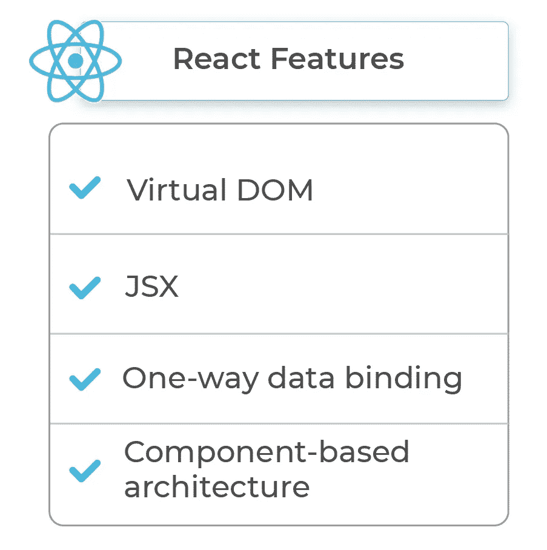
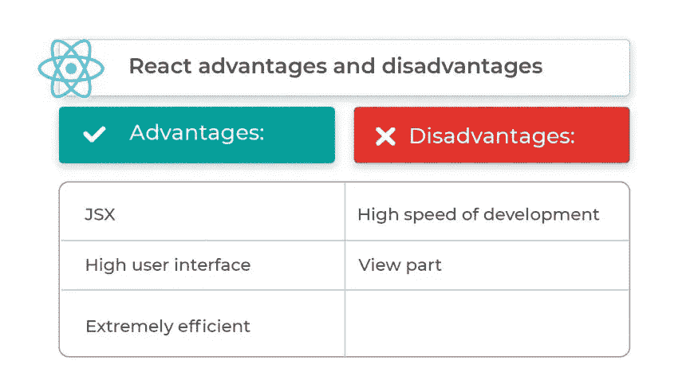
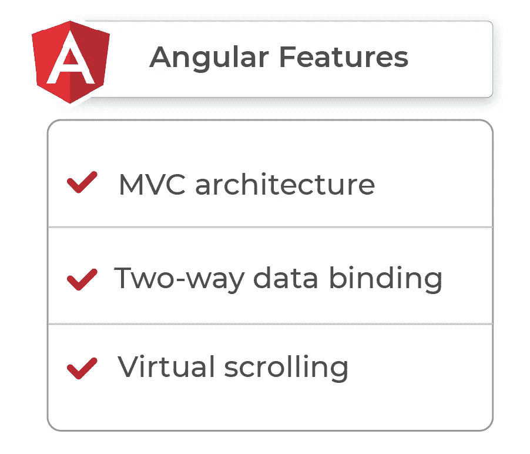
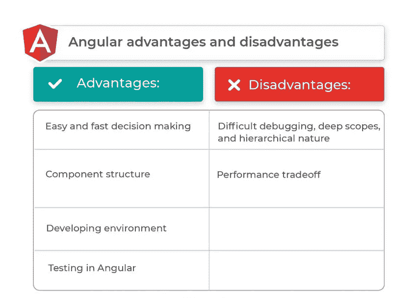
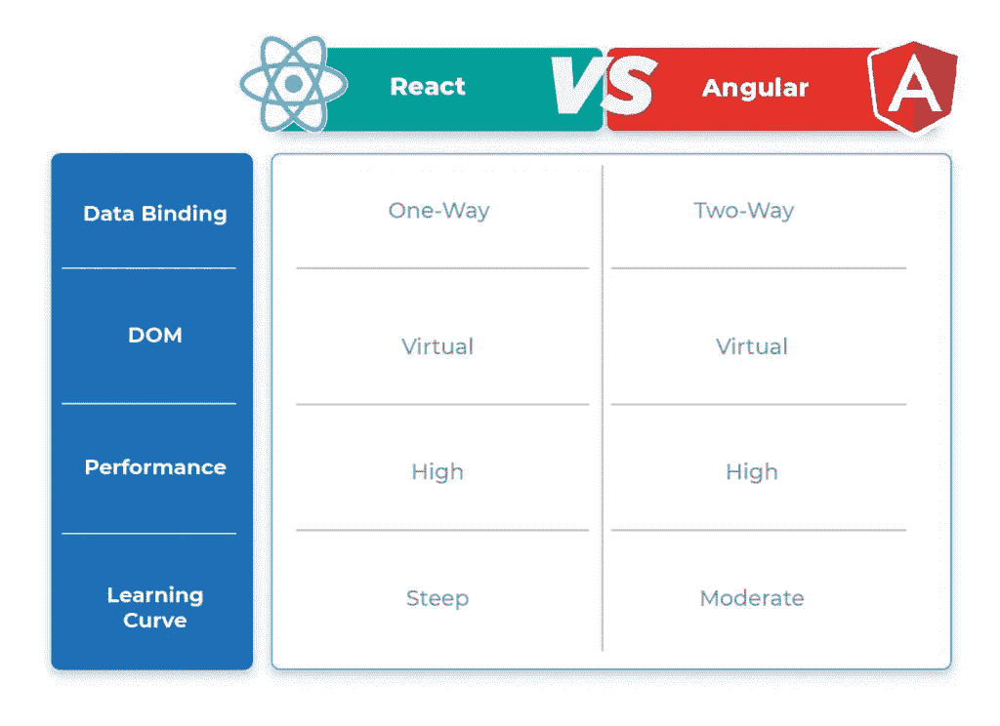

# React vs Angular:项目的最佳框架(2022 版)

> 原文：<https://javascript.plainenglish.io/react-vs-angular-the-best-framework-for-your-project-2022-edition-5f6e2221170?source=collection_archive---------9----------------------->

## 比较 React 和 Angular，它们的特性和用例，帮助您为您的项目选择理想的 JavaScript 框架。

Photo by [Maxwell Nelson](https://unsplash.com/@maxcodes?utm_source=unsplash&utm_medium=referral&utm_content=creditCopyText) on [Unsplash](https://unsplash.com/s/photos/angular?utm_source=unsplash&utm_medium=referral&utm_content=creditCopyText)

尽管有各种各样的框架，React vs Angular 似乎是一场漫长的辩论，但两者都比竞争对手更突出，出现得更快。怎么会？

2020 年的[栈溢出调查，在 React 以 35.9%的得票率坐上第二把交椅的时候证明了它们的受欢迎程度，Angular 以 25.1%成为第三个被开发者广泛使用的框架。](https://insights.stackoverflow.com/survey/2020#development-environments-and-tools)

但是是什么让 Angular vs 的反应各不相同呢？哪种框架最适合您的项目？让我们深入研究 React 和 Angular 的比较，它们的特性，以及回答这些问题的用例。

# 什么是反应？

React，或 React.js，是一个基于 JavaScript 的前端库，帮助创建用户界面(UI)。它用声明式编程风格描绘 UI 状态。

通过 React，程序员可以掌握应用程序一旦开发出来，将如何呈现给用户，以及他们将如何与用户交互。

虽然 React 以开发 web 应用程序而闻名，但它也有助于构建移动应用程序和原生渲染应用程序。

像*脸书、Instagram、网飞、*和*纽约时报*这样的全球性公司在他们的项目中使用 React。

# 反应与角度:反应特征

开发人员喜欢用 [React](https://www.clickittech.com/developer/hire-react-developer/) 工作，因为它有很强的特性。那么，是哪些特性让 React 脱颖而出呢？以下是几个基本的:

# 虚拟 DOM

DOM 是一个虚拟对象模型，它以层次结构表示网页。虚拟 DOM (VDOM)是指 DOM 的副本，它带有一个内存协调算法，允许 React 将任何网页克隆到它的虚拟内存中。这两个版本由 ReactDOM 库同步。

VDOM 特性的好处之一是它允许快速应用程序开发。

例如，每次程序有改动或修改时，DOM 就开始重新呈现用户界面。相反，VDOM 不改变所有的组件，只改变更新的组件。

# JSX

JSX 是一个帮助将 HTML 标签转换成 React 组件的特性。换句话说，它使得直接在 JavaScript 代码中插入和组合 HTML 与定制标签成为可能，这可能相当方便。

JSX 描述和描绘应用程序的用户界面外观。此外，相同的语法有助于快速、轻松地对构建块做出反应。

# 单向数据绑定

React 的好处之一是单向数据绑定特性。这意味着数据流是单向的，允许开发者对移动和网络应用有更多的控制。

该特性限制开发人员在不使用回调函数的情况下编辑任何组件。除了增强控制之外，单向数据绑定使应用程序变得灵活和有竞争力。

# 基于组件的体系结构

基于组件的架构侧重于将设计分解成逻辑组件或单个功能，以确保界面清晰，包括事件、属性和方法。

由于 React 有类似的架构，它的 web 和移动应用程序的用户界面被分成几个组件。

每个组件都有自己的逻辑，用完整的 JavaScript 编写，而不是使用模板。它允许开发人员在不影响 DOM 的情况下传输数据。

# 反应与角度:何时选择反应

我们已经了解了一些项目特性，这些特性应该会给你一个提示，React 是最好的选择。

# 数据可视化工具或仪表板

如果您的项目需要数据可视化工具或仪表板，那么 React 是您理想的平台。这些 React 用例帮助最终用户以逻辑格式分析和理解数据的全部本质。

# 社交网络

如果你计划创建社交网络应用，那么 React 是最合适的选择。它不仅使应用程序对最终用户更具动态性和响应性，还增强了客户端到服务器的性能。

例如，如果用户点击了一个 like 按钮，整个网站将被刷新和重新加载，这非常耗时。但是 React 只刷新发生活动的特定区域，而不是刷新整个页面。因此，用 React 构建的社交媒体网络速度很快。

# 零售或电子商务

如果您正在开发基于电子商务或零售的应用程序，React 也可以帮助您。怎么会？React 清楚地指出了何时用特定的规则构建任何可重用的组件，例如原子设计。使用 React 创建零售店或电子商务平台还可以保持应用程序的所有其他功能处于活动状态，以防单个功能崩溃或被窃听。

# 跨平台移动应用

使用 React Native，您可以使用相同的架构来构建不同的 web 和移动应用程序。例如，假设您从事笔记本电脑业务，几个月前，您要求开发人员制作您商店的网站。现在，您也想拥有一个移动应用程序。因此，React 将帮助开发人员使用类似的方法来创建您商店的移动应用程序。

# 发挥优势

为了对 React 与 Angular 的争论有一个总体的了解，我们必须考虑 React 提供的好处。

*   **JSX。**大多数编辑器没有显示完整的代码补全支持。这对开发人员来说真的很累，因为他们没有得到组件变量和函数的完整引用。但是有了 JSX，React 变得更简单、更快速、更优雅。另外，React 没有运行时故障、无色编码和受限的代码完成支持。
*   **高质量的用户界面。**与其他框架不同，React 更侧重于 UI。它通过设备和程序之间的 JavaScript 交互为用户提供了一个极具反应性的界面。这增加了你的应用程序的总加载时间，并运行它没有分心。
*   **极有效率。** React 有自己的虚拟 DOM 来保存组件。由于 React 自动分析虚拟 DOM 中所需的更改，开发人员能够以高灵活性和健壮的性能工作。这样，它还可以根据新的变化更新 DOM 树。而且 React 不需要昂贵的 DOM 操作，所有的更新都是系统化执行的。

# 应对不利因素

*   **变化率高。React 的主要缺点之一是开发人员必须重新学习新技术来定期做类似的事情。这个因素让他们感到不舒服，因为他们必须不时地适应和更新他们的技能。**
*   **查看零件。** React 只覆盖应用的 UI 层。这意味着您仍然需要依靠其他技术来获得一套工具来推进您的项目。否则，仅仅依靠 React 是无法完成任务的。

毫无疑问，了解 React 的好处和使用案例会让你更容易做出为你的项目选择正确道路的决定。让我们继续回顾 Angular 及其特性，以便能够做出最终选择。

看一看这个幻灯片[来了解 React 开发人员所需的技能。](https://www.clickittech.com/resource/slides/software-development/React-developer-skills.pdf)

# 什么是有角？

Angular 是谷歌在 2016 年推出的一个框架。它最适合使用 TypeScript 和 HTML 创建单页应用程序。它被广泛用于开发动态 web 应用程序。

因此，在 React 和 Angular 之间的争论中，如果你想构建一些沉重的应用程序，那么 Angular 可能是你的最佳选择。它更像是一个完整的工具包，拥有开发人员喜欢的一切。所以难怪它会在一些领先的组织中迅速流行起来，比如宝马、Xbox、福布斯等等。

使用 Angular 构建的一些最著名的项目包括*微软 Office Home* 、*三星 Forward* 和*宝马车道价格计算器*。

# 反应与角度:角度特征

如果框架没有潜力，你就不能构建智能 web 应用，但是 Angular 似乎赢得了这场竞赛，因为它在大多数全球企业中都存在。和其他平台一样，Angular 也有很多有价值的特性。其中一些是:

# MVC 架构

模型-视图-控制器(MVC)是一种架构模式，它将一个应用程序分成三个逻辑组件——模型、视图和控制器。每个组件在应用程序中都有不同的用途。MVC 是开发可扩展和可伸缩项目最常用的架构。

所有应用程序数据都通过*模型*组件来管理，而*视图*组件则监控和管理您的数据显示。相反，*控制器*组件作为模型层和视图层之间的桥梁。

# 双向数据绑定

这意味着数据共享发生在特定的组件类和模板之间。因此，如果一方发生了数据更改，另一方将自动受到影响。

例如，更改输入框的值也会更新或更改组件类中存在的链接特性的值。

双向数据绑定最大限度地减少了开发时间，因为*视图*层描绘了*模型*层，没有任何改变，以确保平滑同步。

# 虚拟滚动

呈现大量元素非常耗时，甚至会降低 DOM 的性能。因此，虚拟滚动允许通过为可用于呈现的容器元素和总元素创建相似的高度来模拟所有呈现的项目的有效方式。

虚拟滚动允许代码执行大量滚动事件，并增强 DOM 元素的加载和卸载。

# 反应与角度:何时选择角度

该项目需要勾选某些复选框，以表明 Angular 是最佳选择。我们去看看。

# 视频流应用

如果你还记得 YouTube 的 PlayStation 3 版本，那么你确实见过 Angular。在 Angular 的帮助下，谷歌用虚拟按键取代了所有的鼠标移动，让游戏玩家可以流畅地操作 YouTube。

因此，如果你计划开发一个在不同平台上具有流畅功能的视频流应用程序，你应该选择 Angular 而不是任何其他框架。

# 电子商务应用

Angular 有助于减少电子商务应用程序的等待时间。例如，T-Mobile 发现它的客户过去常常要等几秒甚至几分钟才能看到内容。因此，该公司利用 Angular 通过实现服务器端渲染来缩短等待时间。

Angular 还帮助他们自主更新网站，甚至在不停止操作的情况下执行动态页面。因此，T-Mobile 的电子商务应用获得了更多的有机流量，因为该框架帮助他们改造了整个应用，并使其对最终用户更加流畅。

# 实时数据应用

如果你愿意开发一个获取实时数据的定制应用，你可以依赖 Angular。领先的天气网站[*【weather.com】*](http://weather.com/)使用 Angular 实时收录天气更新，该项目获得了成功。

# 用户生成的内容门户

如果你计划开发一个用户生成内容的网站或应用程序，那么 Angular 再次成为首选。像 Upwork 和纽约时报这样的平台是两个使用 Angular 来管理沉重页面的流行名字。

# 角度优势

*   **简单快速的决策。** Angular 是一个 MVC 框架，提供优秀的观点和解决方案。新的和有经验的开发人员都可以使用 Angular 做出正确和及时的决策。
*   **构件结构。**你可以将所有的角度组件与各种其他框架一起使用。这意味着，即使你正在使用一些其他技术来构建一个应用程序，你也可以包括 Angular 来确保项目运行没有技术问题。
*   **开发环境。**如果您使用 Angular，请随意选择任何工作环境。虽然大多数开发人员更喜欢 TypeScript，但是您可以自由地应用 Dart 和 JavaScript。对于模板，你可以使用 Jade 或者核心 HTML。
*   **测试角度。** Angular 旨在简化应用程序开发。因此，您可以为不同种类的应用程序编写测试，而不会遇到任何困难。

# 角度缺点

*   **调试困难，范围深，层次性强。** Angular 有分层架构，这也是为什么调试困难的原因，尤其是对于不了解 n 层架构的开发者。同样，在繁重的应用程序中调试作用域也是一项艰巨的工作。此外，所有角度注射器都在一个层次结构中，导致深度嵌套。
*   **性能权衡。**基于 Angular 的应用不支持旧设备，因为浏览器仍然忙于控制 DOM 元素，并且需要许多外部资源来完成这项工作。然而，性能权衡因素在现代计算机、移动电话和其他设备中并不存在。因此，只要最终用户拥有最新的设备，就不会有问题。

因此，尽管 Angular 有一些缺点，但它适合各种项目，是当今许多开发人员的首选。

# 反作用力与角度—对照表

# 从有角到有反应

从 Angular 到 React，成千上万的公司正在从一个图书馆转移到另一个图书馆，纽约 martech 机构 BrandVerge 就是这样的例子。

做出从 [AngularJS 切换到 ReactJS](https://www.clickittech.com/reactjs-development-services/) 的决定可能很容易，但实现肯定需要改变思维方式，因为两个框架在前端开发方面采取了不同的方法。

# 反作用力与角度的结论

React 和 Angular 是两个重要的框架，对于不同类型的项目有很多好处。然而，决定是选择 React 还是 Angular 取决于您的项目需求。所以，如果你还在试图解决反应与角度的难题，你可以随时寻求专业人士的指导。

原始帖子发布于:

 [## 反应与角度:为你的特定项目选择哪一个。2022 版

### 尽管有各种各样的框架，React vs Angular 看起来像是一场漫长的辩论，但两者都更加突出和…

www.clickittech.com](https://www.clickittech.com/developer/react-vs-angular/?utm_source=react+vs+angular&utm_id=Blogs+medium) 

*更多内容看* [***说白了。报名参加我们的***](https://plainenglish.io/) **[***免费周报***](http://newsletter.plainenglish.io/) *。关注我们关于* [***推特***](https://twitter.com/inPlainEngHQ)[***LinkedIn***](https://www.linkedin.com/company/inplainenglish/)*[***YouTube***](https://www.youtube.com/channel/UCtipWUghju290NWcn8jhyAw)*[***不和***](https://discord.gg/GtDtUAvyhW) *。*****