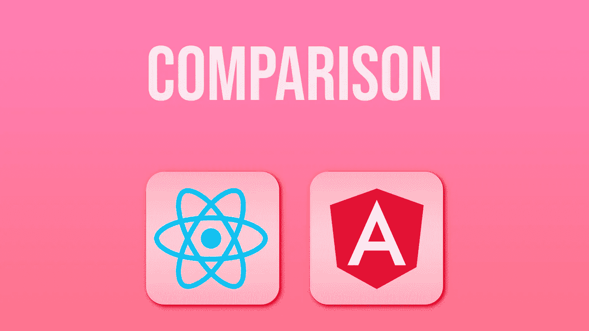

# 反应与角度:决定性的比较

> 原文：<https://javascript.plainenglish.io/react-vs-angular-the-definitive-comparison-fc3989100c8b?source=collection_archive---------11----------------------->

## 和我一起探索这两种框架的特性、差异、优缺点

Source: Me :)

你认为你知道角 vs 反应？再想想！R **eact 和 Angular 是各自领域内最好的框架**，但是你应该选择哪一个呢？让我们来探讨一下每种方法的优缺点，这样您就可以确保为您的项目选择正确的方法，无论是基于前端还是后端开发。

# 什么是反应？

React 的整体性能非常好，尤其是与其他 JavaScript 框架相比。React 的入门也非常容易——只需一次导入和几行代码就可以在屏幕上获得一些交互式内容。

这使得 React 对于那些寻求简单而非复杂的东西的人来说更容易理解。在这种意义上，值得指出的是，与它的许多竞争对手不同，如 Angular 和 Backbone，React 中没有使用定制的编程语言或组件；你需要的一切都可以在 **NPM** 上找到！更好的是，它是开源的，任何人都可以免费使用。

React 适合你吗？: **React 并不适合每一个开发项目**，但它擅长创建专注于以清晰易读的格式显示数据的页面。它也非常适合开发具有复杂 ui 的应用程序，尤其是那些需要优先考虑性能的应用程序。

这使得 React 成为复杂仪表板和企业软件开发的理想选择。许多知名网站和应用程序都在使用 React，包括 PayPal、网飞、IMDB、Trello、等等。

# 为什么使用 React？

React 是一个用于构建复杂 ui 的 JavaScript 库。由于其灵活性和速度，该框架已被证明在开发人员中相当受欢迎。如果你正在寻找一个拥有高性能的替代品，React 相对于 AngularJS 的最大优势之一就是它的**声明式渲染**。简而言之，在 React 中，你不必像在其他框架如 **AngularJS** 或 **Backbone** 中那样写那么多代码。

声明性呈现需要更少的样板代码，因为它涉及编写更少的命令性 **DOM 操作代码** ( *处理事件和更新内容的 JavaScript 类型*)。相反，当您的视图模型发生变化时，一切都会发生。

React 的另一个令人喜欢的地方是它的 JSX 模板。这种类型的模板允许您使用 **XML** 语法来声明用户界面，如果您来自 **PHP** 背景或任何其他服务器端编程语言，这将非常方便。

你用 JavaScript 编写你的模板，它们可以包含 HTML 标签，甚至嵌入表达式，看起来就像直接来自 PHP(不幸的是，在 **JSX** 中没有一个简单的方法来转义标签，所以当嵌入不安全的内容时，你需要使用字符串函数)。呈现为虚拟 DOM 节点的模板很容易与真实的 DOM 节点进行比较。 **React 然后计算每当检测到视图模型中的变化时需要重新渲染多少 DOM**。

# React 和 Angular 的主要区别

众所周知，R **eact 和 Angular 是 web 开发中最受欢迎的两种选择。随着时间的推移，他们之间有很多比较。特别是 React 社区，他们一直对使用 React 的选择直言不讳。但是仍然有许多问题没有得到解答:**为什么在 Angular over React 刚发布的时候，那么多人选择了它？****

这些框架之间有哪些区别？他们真的有那么大的不同吗？为了回答这些问题，**理解这些框架如何工作**以及它们在应用程序结构中扮演什么角色是至关重要的。

React 的另一个优点是它高度模块化。从第一天起，它就采用基于组件的方法进行设计。这意味着您可以使用它的基本构建块来创建新的组件，并定制现有的组件以满足您的需求，这使您可以轻松地构建功能强大的应用程序。

一旦你掌握了 React 的基本思想，你就可以**轻松地将它**集成到你当前的项目中，甚至学习**如何创建你自己的复杂网络应用。它的简单性使它成为初学者的理想选择，但是有经验的用户也可以在它的文档和在线社区中找到他们需要的东西，比如 *Stack Overflow* ，在那里开发者可以分享如何处理特定问题的技巧和最佳实践。**

# 什么时候用什么

一般来说，R **eact 和 Angular 用在类似的上下文中。两者都最适合需要在网站或应用程序上快速迭代的大型项目。也就是说，在很多情况下，一个人可能比另一个人更适合。例如，React 基于组件的架构意味着它通常更适合较小的项目，因为它更容易重用代码和单独更新页面。**

同时，如果你需要一个不经常改变的用户界面，比如文档网站或只有一个视图的应用程序，Angular 可能是一个更好的选择，因为每个页面都可以独立更新，不会影响你网站上的其他页面。

比较 React 和 Angular 这样的框架可能会很棘手，因为它们本质上解决的是类似的问题——*让开发用户界面变得更容易*。它们的主要区别在于它们如何在浏览器的内存中存储信息，这对每个框架的易学性有很大影响。例如，React 将每个组件存储为一个 JavaScript 对象，该对象包含自己的**模板**、**样式表**和**事件处理程序。**

这意味着开发人员需要了解 Javascript 和 React 特定的编程概念(如 **JSX** )，以便有效地使用 React。相比之下，Angular 允许开发人员在 JavaScript 代码中使用 HTML 标签，而无需学习新的约定或语言。这可能会让那些对编码了解不多但仍想轻松访问其特性的开发人员更容易理解。

现在你知道了。感谢您的阅读。

*更多内容请看* [***说白了就是***](http://plainenglish.io/) *。报名参加我们的**[***免费每周简讯***](http://newsletter.plainenglish.io/) *。在我们的* [***社区***](https://discord.gg/GtDtUAvyhW) *获得独家获得写作机会和建议。**