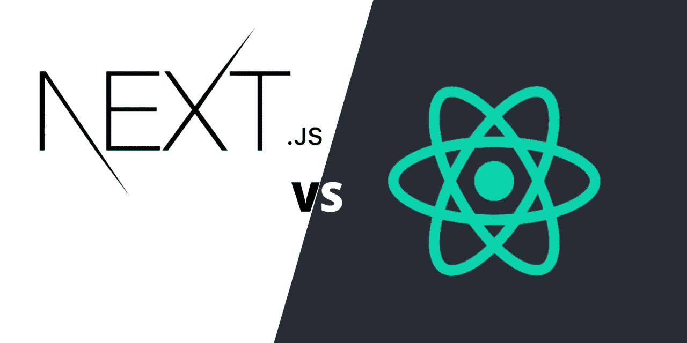
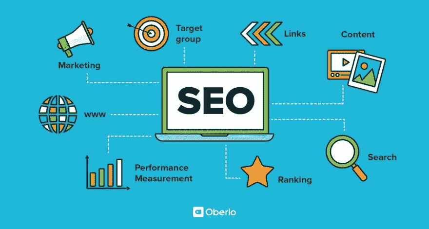
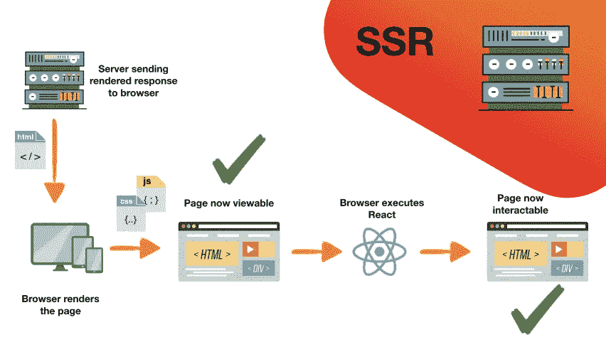
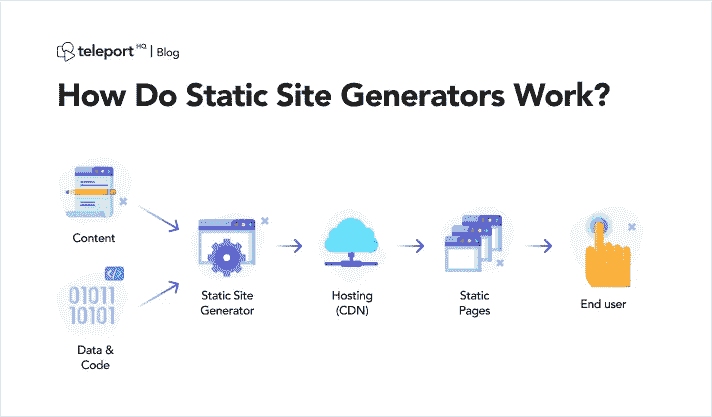
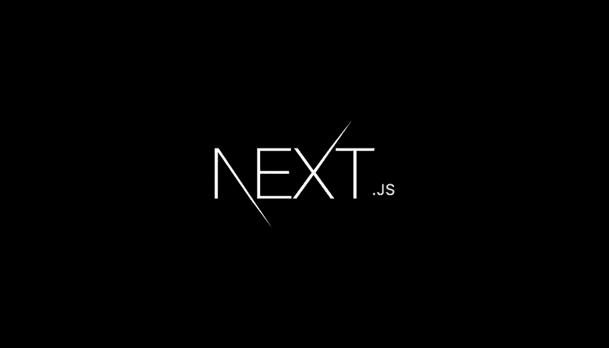

# 反应与下一个 js。您应该使用哪一个？

> 原文：<https://javascript.plainenglish.io/react-vs-next-js-which-one-should-you-use-4ca83d907d59?source=collection_archive---------6----------------------->

随着前端网络开发的最新趋势，我们已经看到了很多 JavaScript 框架的增加，每一个都有其独特的方式，也有其优点和缺点。

因此，我只想看看事物的反应方面，看看反应生态系统中的两个主要竞争者，这些是“普通的”反应和 [Next.js](https://nextjs.org) ，然后看看为什么有人会选择其中一个来对抗另一个，以及每个人在前端应用程序开发方面带来的好处。

如果您还不熟悉 Next.js，有一篇有用的文章您可以在这里查看[。](https://upmostly.com/nextjs/what-is-nextjs)

# 相关概念

首先，我们必须熟悉三个关键概念:

*   **SEO** (搜索引擎优化)
*   **SSR** (服务器端渲染)
*   **SSG** (静态励磁发电机)

之后，我们将能够继续进行比较，并分析每种方法在选择前端技术(在我们的案例中是框架/库)方面的优缺点:

# 1.搜索引擎优化

你可能已经熟悉这个概念了，因为它现在到处都是。尽管如此，如果你没有，搜索引擎优化指的是**以谷歌搜索引擎排名更高的网站的过程/优化**为目标。

就搜索引擎优化而言，一个优化良好的网站很可能会出现在谷歌的前几页。

# 2.SSR(服务器端渲染)

**SSR 指应用程序能够在服务器(后端)上呈现内容，并返回呈现的整个页面，而不是在浏览器中呈现页面**。

这类似于 PHP、Ruby、Java 和其他服务器语言/框架从一开始就为内容提供服务。

所有的数据都将在后端进行处理，处理完毕后，内容将被发送回客户端。

# 3.SSG(静态现场发电机/发电)

**SSG 是一个工具，允许基于预定义的模板和原始数据生成完整的 HTML 页面，这些模板和原始数据准备好提前渲染**。与传统的数据库驱动的内容管理系统不同，**固态硬盘不需要数据库，而是从静态的降价文件/GraphQL** 中生成内容。

现在我们已经对这些概念比较熟悉了，让我们来看看每一种技术相对于其他技术的优点/缺点。

# 利弊

# 反应

**赞成**:

*   支持创建 SPAs(单页应用程序)
*   更快的开发时间
*   更高的可定制性
*   不固执己见
*   伟大的全才
*   一个庞大的开发者市场

**缺点**:

*   它需要更多的努力来提高搜索引擎优化
*   通常较慢的应用程序
*   大的第一内容画图，这可能在第一次打开应用程序时的长加载过程中被证明

# Next.js

**优点**:

*   开箱即可支持 SSR 和 SSG
*   伟大的搜索引擎优化由于 SSR 和 SSG 的能力
*   良好的性能
*   轻量级选手
*   简单的设置过程
*   易于配置

**缺点**:

*   固执己见的
*   与 React 的 CRA 相比，学习曲线更陡
*   在开发过程的后期，更有可能变得高度复杂

# 你应该用哪一个？

在经历了每一个的优缺点之后，很自然的会检查每个框架/库的一些用例。因此，您将能够更好地了解哪种技术更适合您的业务需求。

# 反应

作为利弊的结果，React 的 CRA 最适合 SEO 不重要或者开发时间必须很短的场景。

使用案例:

*   大多数情况下，只有登录后一切才可用
*   **管理平台**
*   **客户关系管理系统**
*   **仪表盘**

# Next.js

每当我们谈论好的 SEO 和应用程序内容的频繁变化时，Next.js 将是主要的竞争者。

然而，随着 SSG 的加入，额外的用例将使静态页面不会经常改变其内容，并且需要高性能和良好的 SEO。

此类用例包括:

*   **社交媒体平台**
*   **电子商务应用**
*   **SaaS**
*   **博客**
*   **个人页面**
*   **主页**
*   **文档**

# 结论

说到这里，我希望您现在对为您的项目选择合适的前端技术有了更好的想法。

如果你对我在这篇文章中提到的任何事情有建议、批评或反馈，请在下面留下你的评论。谢谢！

下次见！干杯！

*更多内容请看*[***plain English . io***](https://plainenglish.io/)*。报名参加我们的* [***免费周报***](http://newsletter.plainenglish.io/) *。关注我们关于*[***Twitter***](https://twitter.com/inPlainEngHQ)[***LinkedIn***](https://www.linkedin.com/company/inplainenglish/)*[***YouTube***](https://www.youtube.com/channel/UCtipWUghju290NWcn8jhyAw)*[***不和***](https://discord.gg/GtDtUAvyhW) *。对增长黑客感兴趣？检查* [***电路***](https://circuit.ooo/) *。***