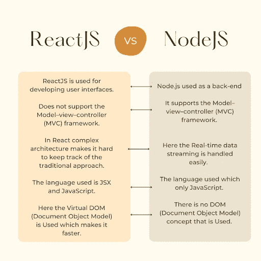

# React vs. Node.js:两个最佳 JavaScript 技术堆栈的比较(2022)

> 原文：<https://javascript.plainenglish.io/react-vs-node-js-a-comparison-of-the-two-best-javascript-tech-stacks-2022-c6e9cdfaff9e?source=collection_archive---------0----------------------->

## 学习**reaction 的基础知识，Node.js 和**在人气、学习曲线、社区支持等方面进行比较。

React 和 Node.js 是两种流行的 JavaScript 技术堆栈，用于构建快速、动态和数据密集型 web 应用程序。但我们不能说两者的工作方式是一样的。

是的，你没听错。它们不是相互竞争，而是相互补充。

Node.js 是一个平台，而 React 是一个 JavaScript 库。这意味着，如果您正在用 Node.js 构建一个应用程序，那么在应用程序中也有可能使用 React，反之亦然。

那么，如何比较它们呢？

别担心！本文将帮助您了解这些(**reactor 和 Node.js** )技术的基本信息。我们还将比较 React 与 Node.js 与诸如受欢迎程度、学习曲线、社区支持等标准。此外，我们还将查看对比表。

让我们开始吧。

# 反应-理解基础知识

React 是一个由脸书构建的 JavaScript 库，用于使用组件创建用户界面。组件是可重用的，有助于有效地组织代码。React 使用虚拟 DOM 来跟踪对组件所做的更改。它只更新虚拟 DOM，这减少了对某些数据更改进行重新渲染的开销。

# 反应是如何产生的？

当脸书新闻提要团队面临维护和管理 DOM 更新的问题时，反应就产生了。DOM 很慢，使得用户界面很难使用。

为了解决这个问题，脸书开发了自己的图书馆“反应”。它速度快，提供了构建用户界面的灵活性，并克服了 DOM 更新所面临的困难。

# 何时&谁创造了反应？

React 于 2013 年 5 月 29 日首次发布。这个项目是由在脸书工作的乔丹·沃克创建的。他想出了这个主意，并找到了克服 DOM 更新性能问题的方法。在解决了这个问题后，脸书决定开放源代码并将其转化为一个社区项目。

# 什么是反应核心特征？

**其核心特征是:**

1.  **虚拟 DOM —** React 构建在虚拟 DOM 之上，通过使用真实 DOM 的轻量级表示，减少了昂贵的重新渲染。当组件中发生任何数据更改时，React 只更新真实 DOM 中的必要字段。这样，它可以节省时间，并尽可能多地重用现有的 HTML 元素。

[Image Source](https://levelup.gitconnected.com/what-is-the-use-of-the-virtual-dom-in-react-62a2ad61bb88)

**2 .组件-** 组件是可重用的模块化代码，使得编写和维护大型应用程序变得容易。这些组件可以进一步分为更小的组件，称为子组件。

**3。JSX -** 它是一个 JavaScript 语法扩展，看起来类似于 HTML。它允许你用 JS 而不是模板或 web 视图来编写你的标记。因此，它使跟踪页面上的内容变得更容易，因为所有内容都在一个地方。

**4。单向数据绑定-** 数据单向流动。用户界面会随着状态的变化而自动更新。使用简单的函数，您可以在应用程序状态改变时触发 UI 更新。

# React 用在哪里？谁是它的用户？

React 可用于各种 web 应用程序，包括新项目、现有项目和移动应用程序。它非常适合任何需要动态更新的 UI。

目前使用 React 的公司有雅虎、Instagram、网飞、Airbnb、Imgur、Dropbox 和索尼。

[Image Source](https://www.goodcore.co.uk/blog/wp-content/uploads/2020/01/Angular-vs-React-List-of-Companies-Using-ReactJS.png)

# **Node.js-了解基础知识**

Node.js 是一个开源的跨平台 JavaScript 运行时环境，用于在浏览器之外执行 JavaScript 代码。它是轻量级的、高效的，非常适合跨分布式设备的数据密集型实时应用。

# Node.js 是怎么产生的？

当 Joyent 的团队面临在服务器端使用 JavaScript 的问题时，Node.js 应运而生。他们发现将 JavaScript 与 C++集成并在分布式设备上使用很有挑战性。

然后，开发他们产品的开发人员 Ryan Dahl 创建了 Node.js，并使用谷歌的 V8 JavaScript 引擎(与 Chrome 浏览器使用的 JavaScript 引擎相同)来构建它。

他利用非阻塞 I/O 有效地处理并发连接。然后 Joyent 在 2009 年开源了它；许多公司使用 Node.js 来构建他们的 web 服务。

# Node.js 的核心特性是什么？

**一些核心特性是:**

**1。Events -** Node.js 运行在基于“流程”模块的事件驱动架构上，轻量高效。这种事件驱动的架构有助于 Node.js 创建快速 web 服务器。

**2。单线程-** Node.js 是单线程的，意味着 Node.js 只能处理一个进程。如果有多个并发请求，它们将排队等待处理(除非有大量 CPU 核心)。

**3。异步-** 它遵循非阻塞异步输入/输出，以高效和有效地处理并发连接。作为一个例子，考虑一个在线购物门户。如果 Node.js 不支持异步调用，那么添加产品的请求将被阻塞，直到产品被添加到购物车并且用户结帐。

**4。非阻塞 I/O -** 虽然非阻塞输入/输出是 Node.js 高效的原因之一，但它还有另一个优势。通过将并发请求委托给 JavaScript 函数，它允许开发人员更容易地处理并发请求。因此，它会产生更干净的代码。

# Node.js 用在哪里？谁是它的用户？

你可以[雇佣 Node.js 开发者](https://www.pixelcrayons.com/hire-node-Js-developers) 来构建 web 服务器、聊天和协作工具等实时网站，以及为移动应用提供动力的 API(应用编程接口)。

目前使用 Node.js 的公司有 PayPal、优步、沃尔玛等等。

[Image Source](https://www.cronj.com/blog/node-js-development-lead-to-enterprise-application-development/)

现在，让我们来分析一下这两种方法有何不同，以及它们如何结合使用:

React 和 Node.js 是两种不同的技术，有不同的特性。

# React 与 Node.js:比较

## 1.方法:你努力实现的目标是什么？

React 是一个 JavaScript 库，用于构建应用程序的用户界面。它使用 JSX，看起来类似于 HTML，但仍然是有效的 JavaScript 代码。因此，开发人员可以更容易、更顺利地编写带有许多 UI 组件的大型应用程序。React 可以与其他框架一起使用，但它本身已经获得了广泛的流行。

另一方面，Node.js 是一个 JavaScript 运行时环境，可以在各种设备上运行。它允许开发人员编写高性能的应用程序，而不必直接处理 I/O 操作。Node.js 使用事件驱动的非阻塞架构，通过事件排队使并发请求成为可能。

此外，这两种技术可以一起用于构建高性能的动态 web 应用程序。

**用例:**

假设您正在构建一个在线电子商务门户。虽然 Node.js 可以用来构建 web 服务器，但 React 最适合前端，用户可以在前端与应用程序进行交互。结合起来，它们使开发人员能够更容易高效地处理请求。

## 2.受欢迎程度:哪些技术是最常用的？

了解受欢迎程度的一个很好的方法是看 GitHub 明星。2022 年，reactjs.org 获得了超过 6.8k 颗恒星，而 Node.js 获得了 85k 颗恒星。

## 3.学习曲线:哪种技术更容易学？

在不同的平台上有大量的 JavaScript 课程，比如 YouTube 和 Udemy 的 React 和 Node.js。因此，如果你想学习其中任何一种，它们都很容易掌握。

而且，既然是很不一样的技术，分开学会更容易。对于 React，建议您具备 HTML、CSS 和 JavaScript 的基础知识。

但是对于 Node.js，您需要了解非阻塞 I/O、异步请求等。

## 4.社区支持:找到了解技术的开发人员有多容易？

每天都有大量的社区支持这些技术。你可以在脸书和推特上找到活跃的社区，以及两者的本地聚会。

## 5.开发者成本:雇佣开发者需要多少成本？

如果你正在寻找具有这些技能的开发人员，费用将取决于你的位置和需求。但是两者都有很高的需求量，这使得它们成为了一个便利的选择。

租用远程节点的过程。js developer 每年会花费你 12，000 到 150，000 美元。鉴于，[雇佣 React.js 开发者](https://www.pixelcrayons.com/hire-react-developers) 的费用如下:

# 总结一下！

到目前为止，很明显 React 和 Node.js 是两个非常不同的技术栈。Node.js 是一个 JavaScript 运行时环境，它使开发人员能够用 JavaScript 编写高性能、事件驱动的应用程序。

相比之下，React 是一个帮助构建用户界面的前端 JavaScript 库。此外，它还可以与 AngularJS 等其他框架一起用于构建大型 web 应用程序。

因此，Node.js 非常适合后端开发，而 React 最适合前端开发。此外，你可以[雇佣了解两种技术的全栈开发者](https://www.pixelcrayons.com/hire-dedicated-full-stack-developers) 。

干杯！

*更多内容看* [***说白了。报名参加我们的***](http://plainenglish.io/) **[***免费周报***](http://newsletter.plainenglish.io/) *。在我们的* [***社区不和谐***](https://discord.gg/GtDtUAvyhW) *获得独家获取写作机会和建议。***