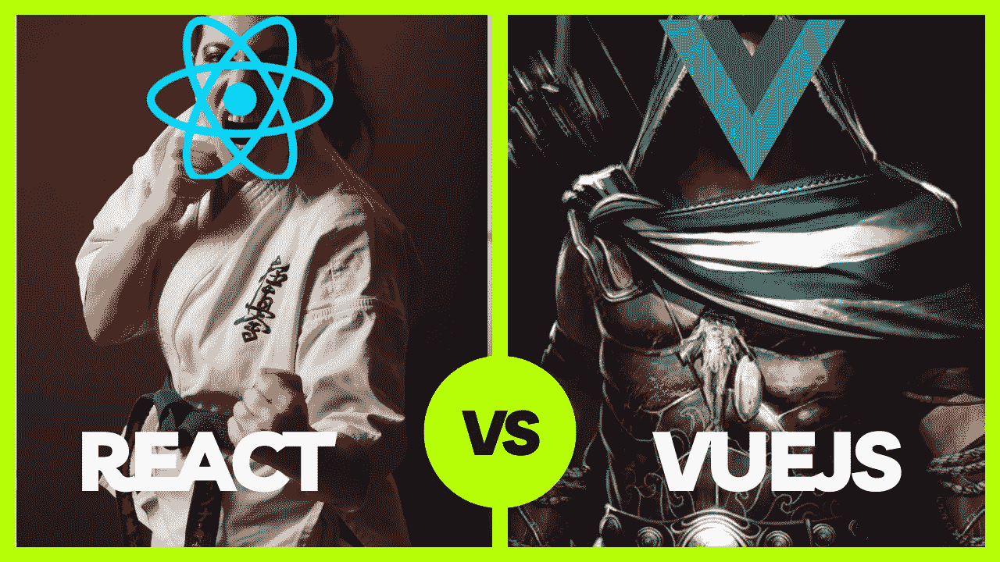

# React vs Vue.js:移动和 Web App 开发哪个最好？

> 原文：<https://javascript.plainenglish.io/react-vs-vue-js-which-is-the-best-for-mobile-and-web-app-development-f5187477ae23?source=collection_archive---------4----------------------->

Vuejs 还是 Reactjs？当谈到构建 web 或移动应用程序时，JavaScript 是任何 web 开发项目的基本技术，但是哪种技术最适合您的项目呢？

决定使用什么框架来构建用户界面(ui)可能是一件很麻烦的事情，有许多基于 JavaScript 的框架。但是最受欢迎的是 Vuejs 和 Reactjs。我将概述导致这些结论的重要因素，包括:

1.  采用
2.  学习曲线
3.  表演
4.  工具作业
5.  招聘开发人员
6.  社区

# 采用

大公司已经使用了 React 和 Vue.js。考虑使用脸书、Instagram 和纽约时报等知名品牌。相比之下，Behance，任天堂，甚至 NASA 的很大一部分前端工作都是由 Vue.js 提供动力的。

顶级软件公司同时使用 React 和 Vue.js，但是目前 React 比 Vue.js 更广泛。

# 学习曲线

React 包含了一些使使用框架更简单的特性。将 React 和 JSX 结合起来的一个好处是模板引擎更容易掌握，因为它类似于标准的 HTML。

单向数据绑定是该框架的另一个特性，它让程序员能够更好地控制自己的代码，并最大限度地减少错误。另一方面，Vue.js 是为了简洁易用而创建的。您的代码、样式表和模板组件都可以写在同一个文件中。

开发人员通常认为 Vue.js 更容易使用,因为这是一种自然的方法，通过分离 HTML、CSS 和 JavaScript 来分离职责。

# 表演

React 和 Vue.js 的速度都是公认的。此外，即使 React 是第一个使用虚拟 DOM 的，Vue.js 也从这个想法中受益。

这些框架还支持服务器端呈现和树抖动，这可以找到并删除不活动的(死的)代码。这导致了更快的加载时间。

然而，React 的设计并不是轻量级的，与 Vue.js 的近 21 千字节相比，React 只有约 30 千字节， **React 在速度上略逊于 Vue.js。**

# 工具作业

react 的第三方命令行界面(CLI)工具 Create-react-app 将为 SPA 构建您的开发环境，并引导您从开发进入生产。

对于大多数集成开发环境(ide)和代码编辑器，React 提供了出色的支持。React 还包括奇妙的调试工具，比如 React 开发者工具。

Vue.js 的官方 CLI 工具称为 Vue CLI，它与 create-react-app 非常相似，但可扩展性稍强。与 React 类似，Vue.js 为大多数 ide 提供了出色的支持。然而，与 React 不同的是，Vue.js 包含了官方的 web 开发工具。

关于这些框架的生态系统，Vue.js 是一个独立的框架，而 React 则更加分散。

# 社区

与 Vue.js 相比，React 具有更广泛的社区集成，因为它是由脸书开发和维护的。这个社区为开发人员提供了大量有用的第三方库，因此他们可以专注于编写代码，而不是从头开始创建这些库。

像 Stack Overflow 这样的网站被社区用来提问和提供帮助。YouTube 或 Udemy 等网站上有大量的商业和免费内容，教初学者如何使用 React。

虽然 Vue.js 是由一个类似的专门创建优秀第三方工具的社区维护的，但该框架并不像 React 那样知名，这就形成了一个恶性循环。

# 招聘开发人员

React 比 Vue.js 应用更广泛，因此有更多熟练的开发人员和就业机会。

然而，这并不是对 Vue.js 对你的公司有多大用处的判断。但是就受欢迎程度而言，你的公司如何处理项目开发确实很重要。

# 结论

React 和 Vue.js 彼此非常相似。这些相似之处有助于确定最终选择哪个框架。

*更多内容请看*[***plain English . io***](https://plainenglish.io/)*。报名参加我们的* [***免费周报***](http://newsletter.plainenglish.io/) *。关注我们关于*[***Twitter***](https://twitter.com/inPlainEngHQ)[***LinkedIn***](https://www.linkedin.com/company/inplainenglish/)*[***YouTube***](https://www.youtube.com/channel/UCtipWUghju290NWcn8jhyAw)*[***不和***](https://discord.gg/GtDtUAvyhW) *。对增长黑客感兴趣？检查* [***电路***](https://circuit.ooo/) *。***