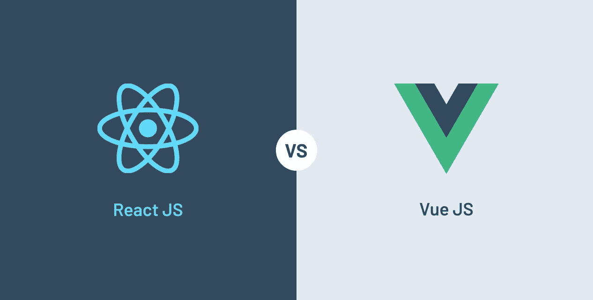

# React vs. Vue.js:学习 Web 开发哪个好？

> 原文：<https://javascript.plainenglish.io/react-vs-vue-js-which-one-is-better-for-learning-web-development-4e28fc502e44?source=collection_archive---------13----------------------->

**那么 React vs. Vue，哪个更好？**等等……先不要回答这个问题。

不要误解我的意思，这两个框架都很棒，而且它们完成了工作。但这不是我想要解决的困境。

更好的问题是:**教一个完全的 web 开发新手哪个好？**

> ⚠️ ***注*** :请注意，我们并不是在试图回答这个问题:“在学习反应后学习 Vue *或在*学习 Vue 后学习反应*有多容易/难”。*

Photo by [Lautaro Andreani](https://unsplash.com/@lautaroandreani?utm_source=medium&utm_medium=referral) on [Unsplash](https://unsplash.com?utm_source=medium&utm_medium=referral)

## 纯 JavaScript

事实上，React 要求更少的结构，更接近于编写纯 JavaScript，这意味着您必须自己实现一些模式，并且有更多的犯错空间，但是犯这些错误可能对学习过程有益。这个想法是，犯错误对于精炼一个概念的理解和使理解变得稳健是至关重要的。

Photo by [Myriam Zilles](https://unsplash.com/@myriamzilles?utm_source=medium&utm_medium=referral) on [Unsplash](https://unsplash.com?utm_source=medium&utm_medium=referral)

## 更少的句法糖

Vue 中的[语法糖](https://en.wikipedia.org/wiki/Syntactic_sugar) &所需模式/结构确实使做某些事情稍微容易一些(即，`v-for`指令代替了自己循环数组，或者`v-modal`指令代替了实现自己与监听器和 Redux store setters 的双向绑定)，同时它们也使理解底层发生的事情对初学者来说更具挑战性，因为它是隐藏的，看起来像魔术一样。

Photo by [Joshua Earle](https://unsplash.com/@joshuaearle?utm_source=medium&utm_medium=referral) on [Unsplash](https://unsplash.com?utm_source=medium&utm_medium=referral)

## 代码自由

Vue 迫使您构建项目和组件的方式会很有帮助。不过，如果你只是尝试学习一些东西或者设计一个新项目的原型，这也可能是一个不必要的额外认知负担。您并不真正知道什么是最好的结构，所以早期关注它可能是一种浪费，并且还可能增加开始关注功能本身的感觉努力。

## 结论

总之，我们认为开始学习 React 而不是 Vue 对于初级开发人员和在这个领域开始职业生涯的人来说是一个更好的选择，尽管“*感觉复杂*”。

以前，我们写了为什么我们选择 React & TypeScript，我们试图打破初学者和 TypeScript 新手对这些伟大技术的复杂性的认识。看看下面这个故事:

 [## 我们选择 React & TypeScript 不是因为它们简单，而是因为它们很难。

### 打破 React + TypeScript“感知”的复杂性对于那些对使用这些伟大技术持怀疑或犹豫态度的 Web 开发人员来说…

medium.com](https://medium.com/next-generation-web/we-choose-react-typescript-not-because-theyre-easy-but-because-they-re-hard-d198a04b2bc6)  [## 软件工程师如何被炒，快。

### 我作为一名自由职业者为一家公司工作，我们必须通过雇佣新的软件工程师来扩大我们的团队。但是他们都被解雇了…

medium.com](/how-to-get-fired-as-a-software-engineer-fast-e99e6fe0d908)  [## 风格指南、设计系统和组件库—解释

### 你可能会认为“风格指南”、“设计系统”和“组件库”都是同一个意思。在这个…

medium.com](https://medium.com/next-generation-web/style-guides-design-systems-component-libraries-explained-118e79476305) 

*更多内容请看*[***plain English . io***](https://plainenglish.io/)*。报名参加我们的* [***免费周报***](http://newsletter.plainenglish.io/) *。关注我们关于*[***Twitter***](https://twitter.com/inPlainEngHQ)*和*[***LinkedIn***](https://www.linkedin.com/company/inplainenglish/)*。查看我们的* [***社区不和谐***](https://discord.gg/GtDtUAvyhW) *加入我们的* [***人才集体***](https://inplainenglish.pallet.com/talent/welcome) *。*