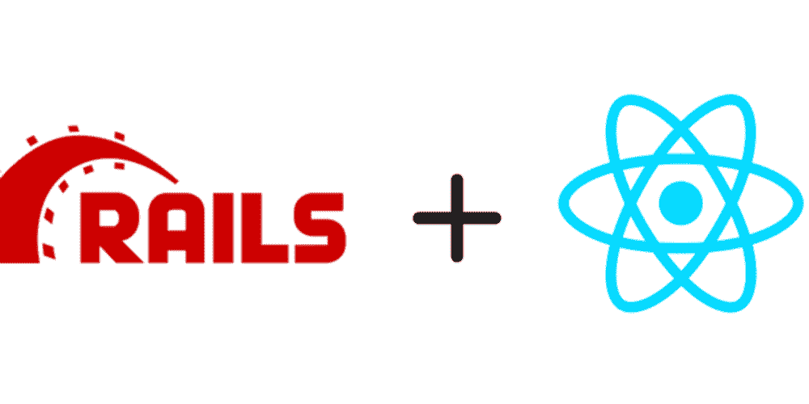
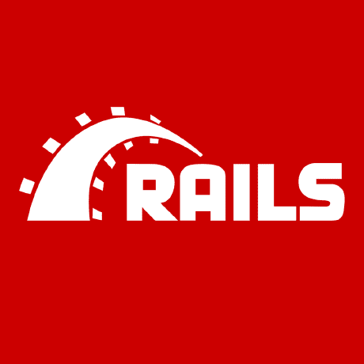
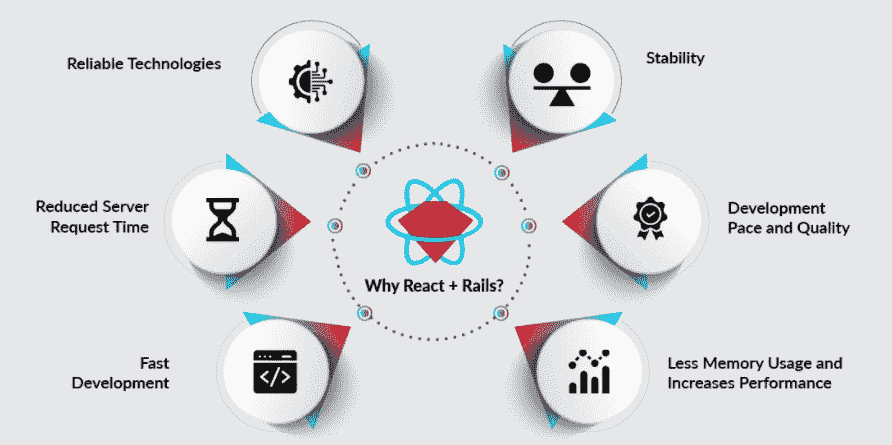

# 与 Rails 互动:形成现代 Web 应用程序的绝佳组合

> 原文：<https://javascript.plainenglish.io/react-with-rails-an-excellent-combination-to-form-modern-web-applications-113c0aee8d19?source=collection_archive---------5----------------------->

Image Source: Dev Community

React with Rails 是构成现代 web 应用程序的绝佳组合。React 是一个用于创建用户界面的 JavaScript (JS)库，而 Rails 是一个 web 开发框架，为您每天使用的许多网站和应用程序提供支持。

当 React 与 Rails 一起使用时，它们为在 web 上创建令人惊叹的东西提供了一个强大的平台。

在这篇博客中，我们将探索在 Rails 中使用 React 的一些好处，以及许多与之相关的重要事情！

# 什么是反应？

Image Source: Facebook

React 是由脸书创建的用于形成用户界面的 JavaScript 库。它强调声明性、可重用性和可堆肥性。

React 通常与 Redux 结合使用，Redux 是 JavaScript 应用程序的可预测状态容器。React 帮助开发人员构建大型应用程序，这些应用程序可以从组织的一端到另一端进行增量更新。

尽管 React 主要用于单页面 web 应用程序(SPAs ),但它也可以适用于其他类型的应用程序，例如使用像 Electron 这样的框架构建的本地移动应用程序或桌面应用程序。

一些使用 React 的热门网站包括网飞、Instagram、脸书、Airbnb 和微软 Office 365 应用开发平台团队。

*   ***10549****[*据报道，企业在其科技栈中使用****React***](https://stackshare.io/react)*。**
*   **React 工具有****183.1k****GitHub 群星&****37.4k****GitHub 分叉。(堆栈共享)**

*React 是开发 web 应用程序的最佳技术之一。*

# *什么是 Ruby on Rails？*

**

*Image Source: Ruby on Rails Guides*

*Ruby on Rails，也称为 RoR，是一个 web 应用程序框架，随着时间的推移变得非常流行。*

*ROR 最初是由 David Heinemeier Hansson 在 2004 年发布的，后来成为了一个开源框架，用于创建用 Ruby 编写的服务器端 web 应用程序。*

*Ruby 是一种面向对象的编程语言，它运行在开源上，使得它很容易安装在各种平台上。Ruby 对程序员生产率和性能的关注使得它非常适合作为创建 web 应用程序的语言。*

*一些流行的网站，GitHub，Basecamp，Airbnb 等等都是基于 Ruby On Rails 框架的。这种受欢迎程度使得 RoR 成为对交通流量要求高或要求低停机时间和快速装载时间的公司的最佳选择。*

*Slack 等初创公司的日益成功可以归功于他们对 RoR 的使用，这让企业家们有充分的理由考虑将 RoR 用于他们的下一个大创意。*

*   ****3354*** *军团* [*据说在他们的科技栈中使用了****Rails***](https://stackshare.io/rails)**。***
*   ***Rails 带****50.2k****GitHub 星&****20.2k****GitHub 叉(StackShare)***

**为了在 web 应用开发中充分利用 Ruby on Rails，你可以**雇佣 Ruby on Rails 开发者印度**。**

# **在选择 React with Rails 之前要忽略什么？**

**在选择 React with Rails 之前，您应该考虑几个因素:**

1.  **项目的规模:如果你正在构建一个小项目，那么 React with Rails 将是一个不错的选择。但是，如果您正在构建一个大型项目，您可能需要考虑使用不同的框架。**
2.  ****项目的复杂程度:**对于简单的项目，React with Rails 是个不错的选择。但是，如果您的项目很复杂，您可能希望使用不同的框架。**
3.  ****项目的时间表:**如果项目是时间敏感的，那么用 Rails 反应可能不是最好的选择。**
4.  **项目预算:对于预算有限的项目来说，React with Rails 是一个不错的选择。**
5.  ****产品安全性和可伸缩性:**对于需要安全性和可伸缩性的产品，React with Rails 可能不是最佳选择。**
6.  ****项目的语言需求:**如果你的项目需要特定的语言，那么 React with Rails 可能不是最好的选择。**

# **选择 React with Rails 的 7 个理由**

**在构建下一个项目时，选择 React with Rails 的原因有很多。这里有七个！**

****

**Image Source: Bacancy Technology**

# **快速发展**

**Ruby on Rails 和 React 的结合可以提高前端性能和整体站点加载时间，从而降低跳出率。管理变更也更容易，因为您需要的一切都在一个地方。**

**当需要添加新功能时，如搜索功能或电子商务商店，您可以通过添加新的 API 端点或在您的服务器上运行的脚本来快速轻松地完成。**

**每一项更改都可以在后端和前端完美地同步，而无需您付出额外的努力。总而言之，在你的开发过程中，更少的摩擦意味着更高的速度和生产力。**

# **缩短服务器请求时间**

**使用 React 的 RoR 将减少服务器请求时间，因为 javascript 将在浏览器上运行，因此服务器需要的渲染更少。这意味着客户机和服务器之间的请求时间减少了，服务器上的负载也减少了。**

**这为您的应用提供了更好的用户体验，而不会影响应用速度性能。应用程序加载时间的减少导致电子商务网站的转换率增加，这使其更吸引用户，从而增加收入。**

# **表演**

**当涉及到你的网站的用户体验时，性能是最重要的。虽然许多开发人员将性能作为他们的首要任务之一，但是您需要一个框架来轻松地让您的最终用户满意。**

**这就是为什么像 React 这样的 JavaScript 框架和 Ruby on Rails web 应用服务器是完美的补充。**

**尽管 React 可以单独使用，但它的模块化允许它与其他框架和平台协调工作，同时也让站点的每个组件完全控制它们如何通信——所有这些都不会影响页面的任何其他部分。**

**这种效率意味着用户更快乐，这最终会让你比那些无法像你一样优化网站的竞争对手更有优势。**

# **缩短服务器请求时间**

**这里真正的关键是将客户端代码与服务器端代码分开。使用传统的 MVC 框架，您将运行在两个不同设备(服务器和客户端)上的不同类型的代码(例如，Ruby 和 JavaScript)混合在一起。**

**这意味着，当有人更改了一个文件而不记得编辑另一个文件时，更多的东西更有可能被破坏。一个额外的好处是，如果东西坏了，你可以只在一边修理，而不是两边；你将能够确切地知道问题发生在哪里。**

**正确设置 Rails 的资产管道后，浏览器对 JS/CSS 文件的请求应该被最小化，从而进一步加快页面加载速度，减少服务器负载，以获得更好的可伸缩性。**

# **模块性**

**你喜欢 Ruby on Rails，对吧？它最大的天赐之物之一是它的模块化。作为初学者，这可能会令人沮丧——您希望使用一个框架来构建整个项目。**

**这不需要如此！事实上，使用多个框架(比如 React 和 Rails)可以帮助您的应用程序更加灵活。因为它们是独立的框架，不一定有关于它们如何一起工作的规则，所以您可以以不同的方式使用它们。**

**例如，在你的网站上添加新页面时，你可能会对某些页面使用单页应用程序，而对另一些页面使用传统页面。**

# **可维护性**

**与其他 JavaScript 框架相比，React with Ruby on Rails 更简单，并且提供了更多的可维护性。换句话说，它为开发人员节省了时间，因为需要编写的代码更少，这意味着编写不需要的组件所浪费的时间更少，应用程序中出现的错误也更少。**

**此外，React with Ruby on Rails 通过提供使构建 web 应用程序更快更容易的预制组件简化了工作。**

**表单字段、日历视图、模态等预建元素有助于消除大量编码工作，因此您可以直接做您最擅长的事情——设计吸引用户的漂亮界面，同时增加收入。**

# **发展速度和质量**

**选择像 Ruby on Rails 这样的框架意味着你可以快速启动并运行你的产品——但这对于一个初创公司来说未必是最重要的。**

**开发速度不如开发质量重要。刚刚起步的公司应该在他们早期的软件产品中更加关注稳定性和可维护性。**

**使用 React，开发可以进行得更快，因为它使用可重用的组件而不是模板(Ruby on Rails 应用程序的典型方法)。**

**此外，如果应用程序的一部分不需要另一部分的功能，就没有必要通过引入额外的库来复制代码，而这在经典的 MVC 框架中是会发生的。**

# **在现代 Web 应用程序开发中使用 React with Rails 的好处**

**Rails 和 React 都是可以让你快速构建 web 应用的工具。然而，您可能想知道 Rails 和 React 如何一起创建现代 web 应用程序。如果是这样，你来对地方了！**

# **易于维护**

**有了 React 和 Rails 的协同工作，在更新后端 API 时，很容易保持前端代码的最新。数据更新会立即推送到您的视图中，因此不再需要重新绘制或手动计算。**

**这节省了维护时间。您还可以查看特定的组件，无论它们是表单还是内容片段，这允许您单独更新这些片段，而无需重新构建整个站点。**

# **水疗面临着越来越激烈的竞争**

**React with Rails 提供了一个定义良好的结构，这可能看起来没什么大不了的，但有助于保持事情井井有条和清晰分离。随着时间的推移，良好的结构也更容易维护和更新。**

**如果您现在正在构建一个 web 应用程序，那么如果没有 SPA(单页应用程序)的这两种技术中的一种，就不要考虑开发它。例如，jQuery 能做的和 Angular 能做的有很大区别。**

**它们都服务于自己的目的，并根据您的需求做出明智的选择。尽管很难掌握，前端框架允许我们建立令人惊讶的动态体验。**

**好的前端框架是由理解开发人员思维方式的团队从头开始精心设计的。**

# **出色的用户体验**

**通过 React 和 Ruby on Rails 的结合，我们得到了一个不仅快速而且易于使用的界面。新功能可以轻松快速地集成，因为两者都有大量现成的功能。**

**两者无缝协作，创建了一个性能前所未有的后端，同时减少了停机时间。由于速度快，它们可以在所有平台上运行(桌面、移动、平板)。**

**它们非常适合创建无论在什么平台上运行都能快速运行的应用程序。通过结合这两个框架，您可以更好地控制应用程序的性能和外观。**

**反应式编程被像脸书、沃尔玛、雅虎这样的大公司所使用。。**

# **速度和性能**

**React 与 Rails 不兼容是一个神话；这取决于您想要什么类型的集成。**

**如果您不需要从您的服务器修改任何前端代码(例如，如果您只是想使用您现有的 API 和呈现框架)，那么通过将 React 组件集成到您的视图中，有可能获得非常快速和无缝的结果。**

**这对于日历或其他依赖于时间的数据等应用程序尤其有效，这些应用程序可以利用现有的 JavaScript 库，如 MomentJS 和 jQuery。**

# **更少的代码，更少的错误**

**有了 React 和 Ruby on Rails，许多前端开发模式都内置于这两个框架中。因此，您可以为类似或更好的功能编写更少的代码。**

**这意味着更少的 bug——和更快乐的开发者。当然，像任何技术一样，在一起实现它们时，总有可能会出错；但这不会是因为你缺少一个框架或库。**

**你只需要做你的功课，以确保他们一起玩得很好。**

# **顶级公司将 Ruby on Rails 与 React 一起使用**

**一些将 Ruby on Rails 与 React 结合使用的顶级公司包括:**

# **爱好**

**Gusto 是一家基于云的薪资和人力资源公司。他们使用 React with Rails 为客户创建一个用户友好的界面。**

# **开门**

**当他们创建 OpenDoor 时，开发团队使用 ROR 和 Angular。然而，随着时间的推移，在性能或用户体验方面有了更好的结果。**

**后来，人们发现 React 更合适，因为它的采用率每年都在快速增长，同时在开发单页面应用程序(spa)时也更安全。**

# **爱彼迎（美国短租平台）**

**这是一个很好的 React Rails 例子。Airbnb 使用 Ruby 作为主要编程语言，Rails 用于 SSR 配置，ReactJS 用于流畅的用户界面。**

# **包扎**

**如您所见，React with Rails 是创建现代 web 应用程序的绝佳组合。它们都是经过充分测试的可靠框架，已经被业界一些最大的公司所使用。**

**结合使用时，它们可以为您的客户提供快速、高效且用户友好的体验。因此，如果你想创建一个顶级的 web 应用程序，你绝对应该考虑使用 React with Rails。**

**而且，你可以 [**雇佣 React**](https://www.valuecoders.com/hire-developers/hire-reactjs-developers?utm_source=hire_reactJS&utm_medium=guest_blog&utm_campaign=Medium&utm_id=NKY) 和 [**Ruby 开发者**](https://www.valuecoders.com/hire-developers/hire-ror-developers?utm_source=hire_ruby&utm_medium=guest_blog&utm_campaign=Medium&utm_id=NKY) 在 web app 开发中高效利用这两种技术。**

***更多内容看* [***说白了。报名参加我们的***](https://plainenglish.io/) **[***免费周报***](http://newsletter.plainenglish.io/) *。关注我们关于*[***Twitter***](https://twitter.com/inPlainEngHQ)*和*[***LinkedIn***](https://www.linkedin.com/company/inplainenglish/)*。加入我们的* [***社区不和谐***](https://discord.gg/GtDtUAvyhW) *。*****