# 用 TypeScript 或 JavaScript 做出反应——你站在哪一边？🤔

> 原文：<https://javascript.plainenglish.io/react-with-typescript-or-javascript-which-side-are-you-on-4c700c6068e4?source=collection_archive---------0----------------------->

## JavaScript 是前端开发的宠儿，但 TypeScript 是这个宠儿的父亲。学会拥抱它，在 2022 年出人头地。🚀

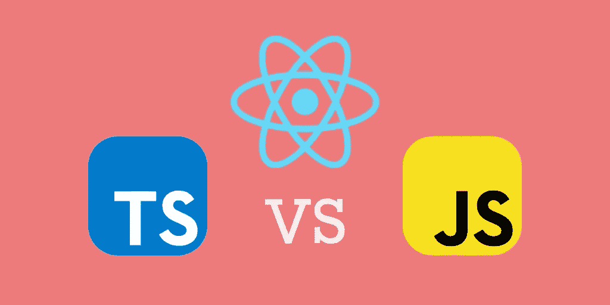

从 2021 年栈溢出开发者调查可以看出，TypeScript 仍然是最受欢迎的语言之一。在 2021 年最受欢迎语言的前三名，这绝对是值得探索的事情。


在本文中，我们将探讨 TypeScript 是什么，以及在 React 中使用 TypeScript 与使用 JavaScript 有什么区别。

# 在 TypeScript 和 JavaScript 中反应代码和文件类型

乍一看，来自典型 React 类型脚本和 JavaScript 的代码似乎没有任何区别。

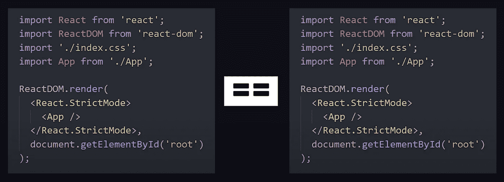

这一点也不奇怪，因为 TypeScript 是 JavaScript 之父——它是 JavaScript 的超集。这意味着，在 JavaScript 上运行的任何代码也能够运行 TypeScript 文件。

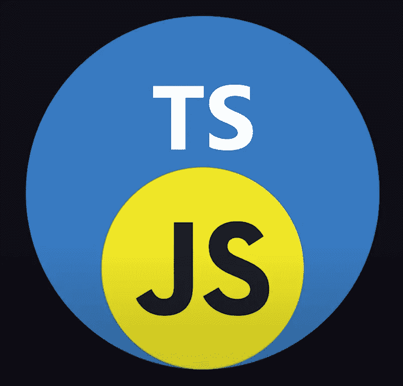

上图显示的是所有的 JavaScript 都是有效的类型脚本代码，但并不是所有的类型脚本都是有效的 JavaScript 代码。这个概念类似于所有的 CSS 在 SASS 代码上都是有效的，但是并不是所有的 SASS 代码都是有效的 CSS 代码。

然而，浏览器不知道如何运行 TypeScript 代码，这就是为什么您会在所有 TypeScript 项目中看到`tsconfig.json`。这个配置文件将定制 TypeScript 编译器的行为，并将 TypeScript 代码编译成 JavaScript，以便浏览器能够理解和执行代码。

说到底，TypeScript 和 JavaScript React project 唯一的区别就是它的文件扩展名以`.tsx`结尾，另一个以`.js`结尾。

# 如何在 Typescript 中创建 React 项目

您可以在您的环境中使用`create-react-app`库创建一个新的 TypeScript React 项目，并使用以下命令:

```
npx create-react-app my-app --template typescript
```

或者，

```
yarn create react-app my-app --template typescript
```

如果您有一个现有的 JavaScript React 项目，并希望将其转换为 TypeScript，那么可以运行这个命令。

```
npm install — save typescript @types/node @types/react @types/react-dom @types/jest
```

或者，

```
yarn add typescript @types/node @types/react @types/react-dom @types/jest
```

运行该命令后，您可以将所有的`.js`文件重命名为`.tsx`，并重启服务器。

# 捕虫器

当您将`strict: true`放到`tsconfig.json`文件中时，TypeScript 的威力就显现出来了。它会自动强类型化你所有的变量，道具等等。假设您有一个带有姓名和电子邮件地址的用户对象。

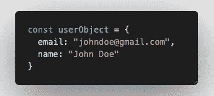

并且将这些信息传递给子组件来呈现这些信息。

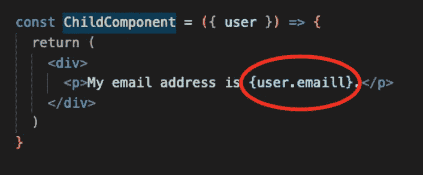

Missing type check, missed out typo on JavaScript

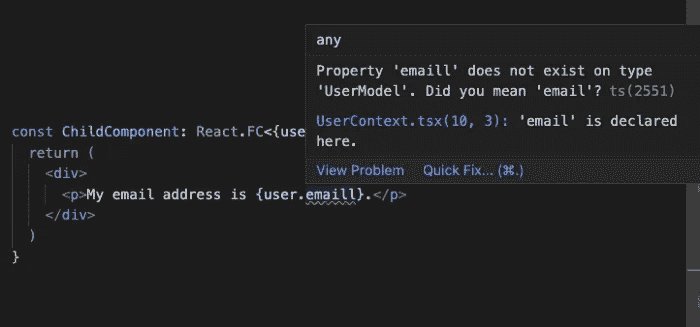

Strict type check on Typescript

# IDE 中的智能感知助手

当您将用户对象从父组件传递到子组件时，情况与上面的示例相同。

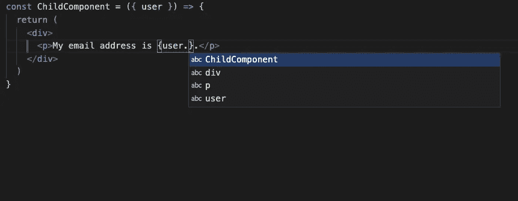

Missing IntelliSense on JavaScript

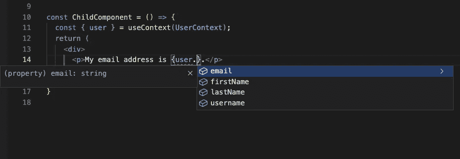

IntelliSense on Typescript

# 类型系统

所以我想你可能会问，如何对对象或变量进行严格类型化，以便代码可以激活 React TypeScript 项目中的 Bug Catcher 和 IntelliSense。让 TypeScript 类型系统在 React TypeScript 项目中为您工作需要注意的 3 件事情。

*1。声明基本类型变量的类型，并声明对象/数组的接口。*

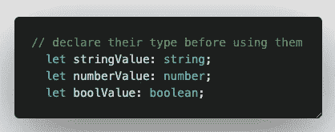

Type declaration for primitive types


Define interface for object to strict type the data

如果你想在对象中有一个可选的字段，你可以设置`?`使这个字段成为可选的，这样当你检查你的代码时，TypeScript 就不会打扰你。

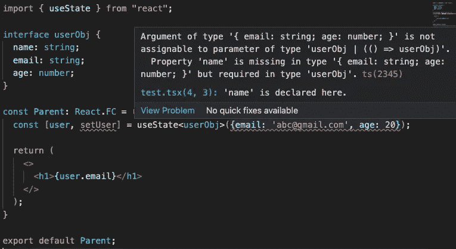

TypeScript showing error for missing required field as declared in your interface

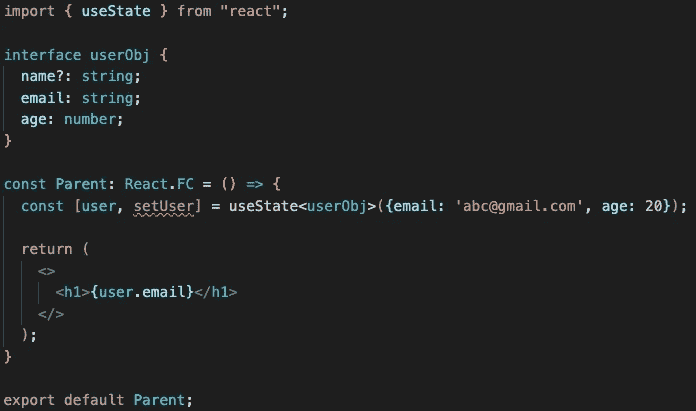

Change name field to optional, no more complaint from TypeScript

*2。必要时声明功能组件类型*


Child component unable to identify user being passed down from parent

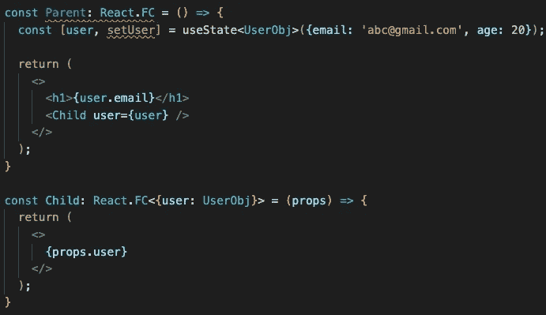

Add type declaration in your React.FC to let your component know what to expect

*3。这对你是免费的。如果你用一个值初始化一个变量，TypeScript 会自动为你推断类型。*

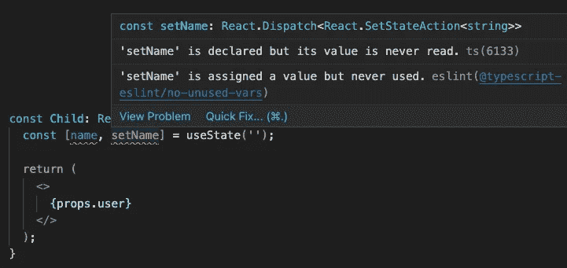

Initialise your variable and TypeScript will strict type it for you for free

# 摘要

希望这篇文章打动了您的心，让您看到在 React 项目中使用 TypeScript 的好处。这是一种短期痛苦，长期收获的关系。最初，当您第一次启动 TypeScript 项目时，您会发现设置所有样板文件非常困难和麻烦，但是在您的应用程序变得更大之后，您会发现这些样板文件非常有帮助，并且使开发速度更快，更不容易出错。不要相信我的话。试试吧，在下面的评论中让我知道你属于哪个阵营(TypeScript 或 JavaScript)以及你为什么选择它，我很乐意听到你的意见。干杯。

[](https://medium.com/@devjo/membership) [## 用我的推荐链接- DevJo 加入媒体

### 作为一个媒体会员，你的会员费的一部分会给你阅读的作家，你可以完全接触到每一个故事…

medium.com](https://medium.com/@devjo/membership) 

*更多内容看* [***说白了。报名参加我们的***](http://plainenglish.io/) **[***免费周报***](http://newsletter.plainenglish.io/) *。在我们的* [***社区不和谐***](https://discord.gg/GtDtUAvyhW) *获得独家获取写作机会和建议。***