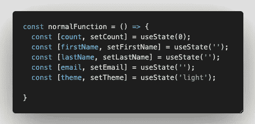

# 做出反应，不要让元开发者失望

> 原文：<https://javascript.plainenglish.io/reactjs-dont-let-meta-developers-down-99f8d24b497?source=collection_archive---------3----------------------->

## 2022 年你应该知道的 React 编码模式。你不会想错过它们的。

React 仍然是最受欢迎的前端库，用于构建令人惊叹的用户界面和用户体验。从[npmtrends.com](https://www.npmtrends.com/@angular/core-vs-react-vs-vue)你可以很容易地看到，React 的下载量是 Angular 和 Vue.js 等其他流行前端框架/库下载量的 3 倍以上

Chart data comparing Angular/Vue/React from npmtrends.com

即使这种惊人的趋势正在上升，我们作为 React 开发人员，也需要意识到 React 的常见陷阱，并不惜一切代价避免它。让我们开始吧！🏊🏼‍♂️🏊🏼‍♀️

# 1.避免过度优化✅

不要通过将每一个`div`重构到它自己的 JS 文件中来开始构建你的应用程序。由于多层嵌套，过度优化 React 组件会导致许多渲染问题。相反，应该基于小节构建应用程序框架。例如，`header`、`body`和`footer`就是一个很好的起点。并且在每一节检测重复的组件，比如`button`或者`input`或者`form field`，然后重构为可复用的组件，避免重复代码。为了更容易地将重复的代码重构为可重用的组件，我建议使用 **VS 代码**中的`glean`扩展来加快您的重构过程。

glean extension from vs code

一旦你下载了扩展，你可以突出显示文件中重复的代码块，然后点击显示的灯泡，就会有额外的重构助手可供你选择。

# 2.避免过度使用用户的浏览器内存🏃🏼‍♂️🏃🏼‍♀️

如果你在你的组件中操作多个`useState`钩子，并且你在那个组件中运行昂贵的计算。请注意，即使昂贵的计算方法仅依赖于一个特定的`useState`钩子，昂贵的计算方法也将在该组件的任何状态改变时运行。

为了防止组件出现潜在的性能瓶颈，可以使用`useMemo`钩子将昂贵的计算方法放在回调函数中，并显式声明该方法所依赖的变量状态。以这种方式，`useMemo`钩子将记忆计算的值，并在其它非从属状态改变时返回先前计算的值，并且仅在从属状态改变时重新运行昂贵的计算。

apply useMemo hook to prevent function

# 3.避免声明不必要的 div

你在你的 IDE 中遇到过这个错误吗？它指出在你的 JSX 返回方法中不能有多个兄弟组件，并且你只能有一个根元素。

解决这个问题的一个快速或糟糕的方法是将这些兄弟元素用一个`div`包围起来。然而，拥有太多不必要的`div(s)`会导致 DOM 结构和 CSS 样式的问题。

Quick or bad fix 💩

相反，尝试使用由 **React** 实现的方法来正确解决这个问题。您可以尝试使用`<React.Fragment>`或空的`<>`元素标签来解决这个问题。

Cleaner and better way 👍

# 4.没有文件夹管理，避免混乱的文件结构

避免在一个文件中包含多个导出功能。相反，每个文件一个导出函数将是一个更好的实践。

Bad practice to export multiple components in 1 file

Better practice to export 1 component 1 file

但是，您也可能会面临一些问题，比如在一个目录中有太多的小组件文件。

Messy file management

我建议更进一步，将每个组件放入它的目录中，你可以创建它自己的 CSS 模块或另一个专门针对该组件的测试文件，并通过创建一个`index.tsx`文件正常导出它们，以便无缝地从其他组件导入它们。

Shift Navbar into its directory

Export Navbar normally as you would

Declare export default from index.tsx

Seamlessly import Navbar as usual in other component

# 5.使用多个使用状态时混乱的状态管理

React 开发人员遇到的一个常见问题是在一个组件文件中处理多个`useState`钩子。当将不同的状态解耦到不同的`useState`钩子时，单一责任原则(SRP)的想法很棒，但是当你有太多的`useState`钩子逻辑要在一个文件中处理时，噩梦就来了。

Multiple useStates declared in 1 component file

要解决这个问题，您可以将一些`useState`挂钩组合成一个自定义挂钩，并在自定义挂钩中执行其自定义逻辑，以避免单一组件文件过度拥挤。

Refactor and group relevant useState hooks into a custom hook

# 摘要

希望这篇文章已经教会了你一些有用的东西，并且增加了你对 React 开发的一些常见陷阱的认识。React 是一个非常灵活的库，我们有权在 React 中使用自己的最佳实践。我希望这些技巧能够让整个 React 社区受益，从而开发出更好、更高性能的 React 应用程序。请在下面的评论中让我知道 React 中是否有其他要避免的陷阱，这样我们就可以通过采用正确的实践让元开发者和开源社区感到自豪。干杯。

 [## 用我的推荐链接- DevJo 加入媒体

### 作为一个媒体会员，你的会员费的一部分会给你阅读的作家，你可以完全接触到每一个故事…

medium.com](https://medium.com/@devjo/membership) 

*更多内容请看*[***plain English . io***](https://plainenglish.io/)*。报名参加我们的* [***免费周报***](http://newsletter.plainenglish.io/) *。关注我们关于*[***Twitter***](https://twitter.com/inPlainEngHQ)*和*[***LinkedIn***](https://www.linkedin.com/company/inplainenglish/)*。加入我们的* [***社区不和谐***](https://discord.gg/GtDtUAvyhW) *。*