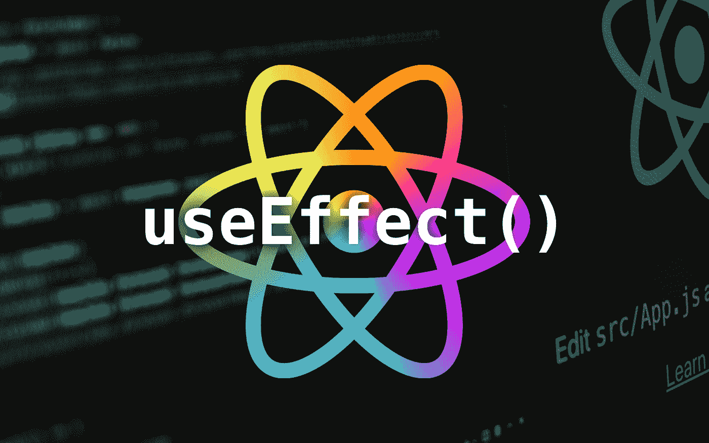
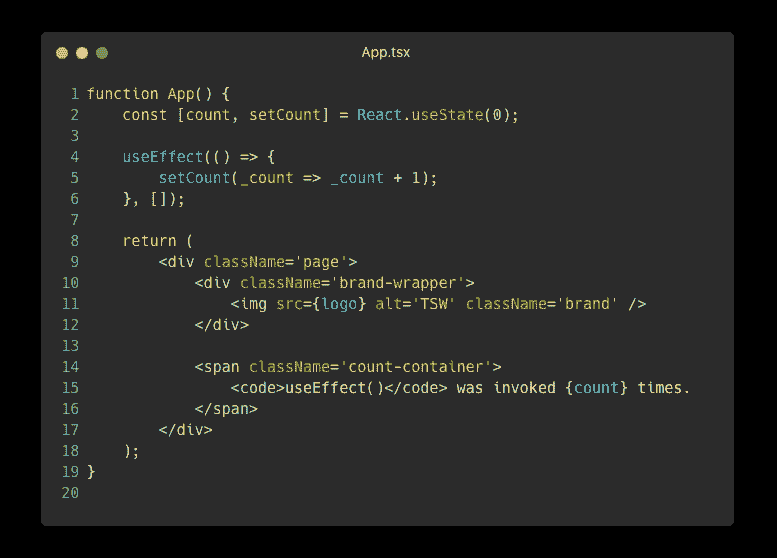
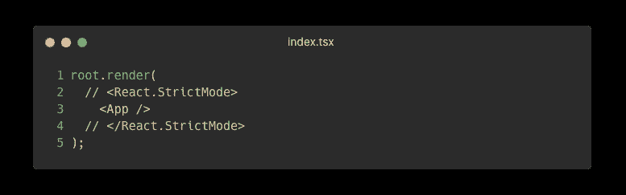
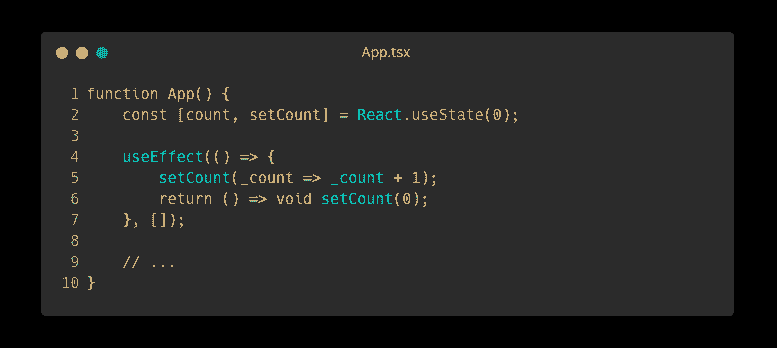
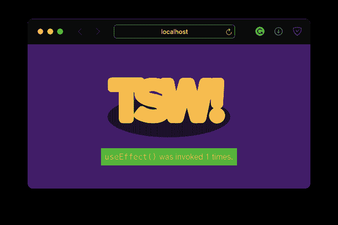
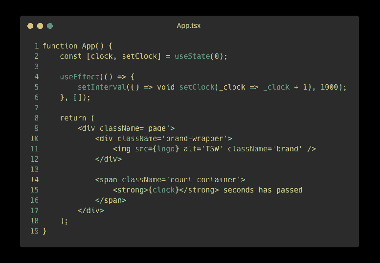
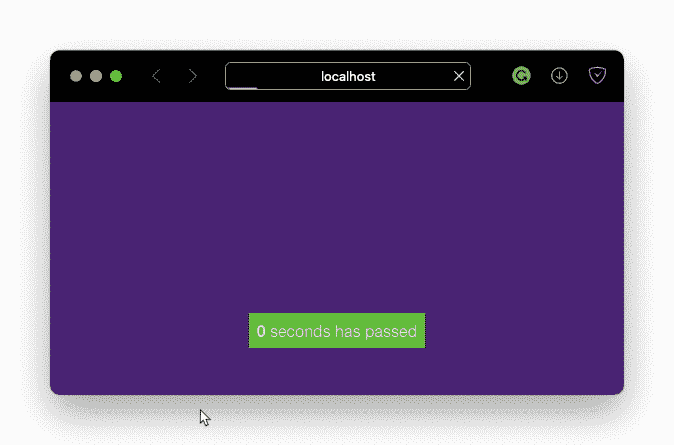

# React useEffect 挂钩未断开；你的代码是

> 原文：<https://javascript.plainenglish.io/reactjs-useeffect-is-not-broken-your-code-is-5d0a80b24b53?source=collection_archive---------0----------------------->

## useEffect 钩子在严格模式下有一个“double-call”bug，但不是 bug；这是一个特点。

您正在使用 React 18，并且已经转移到功能组件。然后，您意识到没有办法控制组件的生命周期。不能在函数中覆盖函数！

你去谷歌找到了`**useEffect**`钩子，并意识到当你使用一个空的依赖数组时，`useEffect`钩子的行为就像是`**componentDidMount**`方法。但是只有一个问题:`useEffect`调用你的函数两次！

# 那么问题出在哪里？

Simple counter for the number of times useEffect is called

上面的 TSX 代码创建了一个名为`count`的状态变量，并且只有在组件挂载后才会生效。效果将`count`增加`1`。当我们呈现该组件时，您会看到以下页面:

`useEffect`被调用两次。一个简单但糟糕的解决方案是删除严格模式:

Strict mode is commented out

禁用严格模式是一个糟糕的解决方案，因为它帮助您调试组件的生命周期。对你有什么帮助？继续读。

# 清理您的组件

`useEffect`钩子被调用两次，因为 React 挂载、卸载、然后重新挂载组件，以捕捉组件生命周期中的常见错误。

你的问题的根源是你没有清理你的组件！当 React 组件重新挂载时，应该有效地重置它:应该清除所有间隔，应该删除事件侦听器，应该重置状态变量。

你传递给`useEffect`的函数应该`return`清理函数:

Notice the **return** in the callback to useEffect

现在，当您运行上面的代码时，我们看到`count`只增加一次:

Use effect is only invoked 1 time

# 但是我不想清理我的组件！

你应该这么做。让我们看看一些更有问题的代码。你有一个每秒钟递增一次的计时器。为此，您可以使用`setInterval`:

如果您的组件重新安装，您会注意到时钟将以两倍的速度递增时间:

Notice how the timer skips every other number

这样做的另一个副作用是，如果你卸载组件，隐藏它，或者使用`react-router`导航离开页面，你的计时器将仍然运行。如你所知，浏览器中的 JavaScript 是单线程的。因此，这个计时器将占用宝贵的计算和浏览器资源。你的页面会变慢，用户体验会变差，Safari 会给出这个警告:

这同样适用于事件侦听器。事件侦听器有自己的线程来侦听事件。但是如果你有一个事件监听器，回调在主 JavaScript 线程中运行，再次占用宝贵的资源。这会影响站点的响应能力，并可能为更重要的事件造成瓶颈。

不要忘记在使用完组件后清理它们，祝编码愉快！👍

 [## 停止使用 For 循环，改用迭代器

### For 循环不再是 JavaScript 中迭代数组的最佳方式。相反，使用数组迭代器函数。这里…

javascript.plainenglish.io](/stop-using-for-loops-use-iterators-instead-javascript-62682c74427d)  [## 请停止编写 Sh*t JavaScript

### 你做错了什么，以及如何弥补。

medium.com](https://medium.com/@thesoggywaffle/please-stop-writing-sh-t-javascript-ba8fd4e1cd9e)  [## 在 React 项目中使用 Ionicons 的正确方法

### HTML 中的 IonIcons 很容易，但在 React 中却很难。尽管缺少文档，我还是弄明白了！

javascript.plainenglish.io](/the-correct-way-to-use-ionicons-in-your-reactjs-project-3b65c97d5b1) 

*更多内容看*[**o**](https://plainenglish.io/)**。报名参加我们的* [***免费周报***](http://newsletter.plainenglish.io/) *。关注我们关于*[***Twitter***](https://twitter.com/inPlainEngHQ)*和*[***LinkedIn***](https://www.linkedin.com/company/inplainenglish/)*。查看我们的* [***社区不和谐***](https://discord.gg/GtDtUAvyhW) *，加入我们的* [***人才集体***](https://inplainenglish.pallet.com/talent/welcome) *。**