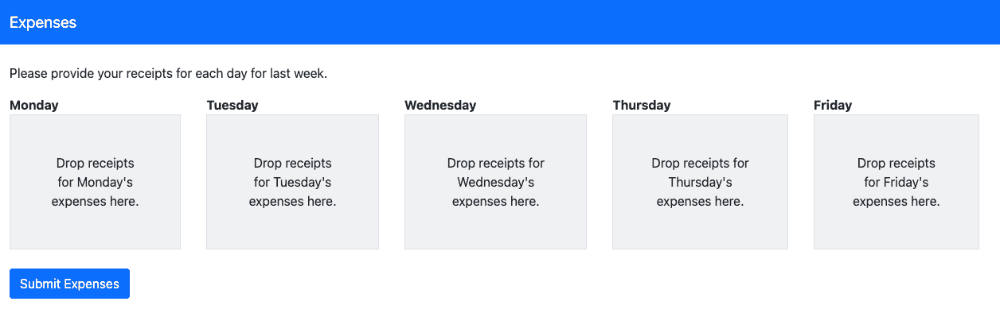

# 如何在浏览器中通过 JavaScript 读取文件—简介

> 原文：<https://javascript.plainenglish.io/reading-files-via-javascript-in-the-browser-introduction-ad40af01a1dd?source=collection_archive---------15----------------------->

Photo by [Mr Cup / Fabien Barral](https://unsplash.com/@iammrcup?utm_source=medium&utm_medium=referral) on [Unsplash](https://unsplash.com?utm_source=medium&utm_medium=referral)

我一直在做一个项目，需要我创建一个自定义的文件选择器控件。这个控件要求我通过 JavaScript 加载一个图像。在这个过程中，我不得不钻研可用的文件管理 API。按照我打算创造更多内容的[方式之一](https://medium.com/@chad.campbell/five-ways-i-intend-to-create-more-content-in-2022-69a0efd02cc4)，我决定将我所学到的东西分享到这个由三部分组成的系列中。我相信初学者和专业人士会看到如何:

*   [第 1 部分—选择要阅读的文件](https://medium.com/@chad.campbell/reading-files-via-javascript-in-the-browser-part-1-choosing-files-to-read-af34a6daa63f)
*   [第 2 部分—用客户端 JavaScript 读取文件](https://medium.com/@chad.campbell/reading-files-via-javascript-in-the-browser-part-2-reading-files-with-client-side-javascript-98a359392e8e)
*   [第 3 部分——用 JavaScript 响应文件阅读器错误和进度更新](https://medium.com/@chad.campbell/reading-files-via-javascript-in-the-browser-part-3-responding-to-filereader-errors-and-progress-458fce0a9f17)

我的*目标*是在接下来的每一周发布一篇本系列的文章。出于这个原因，我鼓励你现在就[跟随我](https://medium.com/@chad.campbell)。只需点击我个人资料下方漂亮的“关注”按钮。这将有助于您了解本系列的新文章何时发布。我相信这个系列值得您花时间的原因有几个。

首先，文件管理往往发生在幕后。无论您使用的是普通的 JavaScript，还是 Angular、Vue、Svelte 之类的前端框架，或者当今流行的任何框架，本系列中分享的概念都是有用的。第二，当我创建我的文件选择器控件时，我觉得这些概念分散在不同的地方。我这个系列的目标是将它们结合在一起。虽然我们的目标是将这些概念整合到一个地方，但是这个系列还会有进一步发展的空间。

本系列将关注浏览器中文件管理的客户端。本系列将*而不是*涵盖向 API 或其他服务器端环境发送文件信息。如果你对此感兴趣，我希望你能在评论中发表你想看的环境。但是我不能保证我能够解决这个问题。我能说的是，本系列中还有其他一些内容，我相信对您会有所帮助。

为了将这些概念联系在一起，将参考一个简单的、虚构的应用程序。如果这个假装的应用程序是真实的，它会让用户报告与工作相关的费用以获得报销。在这个系列中，我将这个虚构的应用程序称为“*费用*”。下图显示了这个应用程序*可能*会是什么样子。

expenses imaginary app

记住上面的形象将有助于你巩固本系列分享的概念。当这个应用被引用时，我将使用斜体作为友好的提醒。除了引用“*费用*”，我还想强调一下可用的源代码库。

本系列中使用的源代码库可以在[这里](https://github.com/ecofic/article-reading-files-via-javascript)找到。这个库中的代码旨在*支持*这个文章系列。因此，它包含一个目录，其中包含指向重点示例的链接。每个示例都对应于本系列文章中的内容。此存储库中没有名为“*费用*”的全功能费用报告应用程序。存储库是为了强化本系列文章中的概念。这不是关于创建一个“*费用*”应用程序。尽管如此，我相信这个系列值得你花时间。

本系列文章假设您熟悉 CSS、HTML 和 JavaScript。这个系列不会教你如何编程。本系列将着重于在浏览器中通过 JavaScript 读取文件。如果你对这些感兴趣，我鼓励你现在就跟我来，看看接下来的三周会有什么出现。

*更多内容看* [***说白了。报名参加我们的***](http://plainenglish.io/) **[***免费每周简讯***](http://newsletter.plainenglish.io/) *。在我们的* [***社区不和谐***](https://discord.gg/GtDtUAvyhW) *获得独家获得写作机会和建议。***