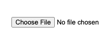
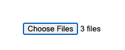
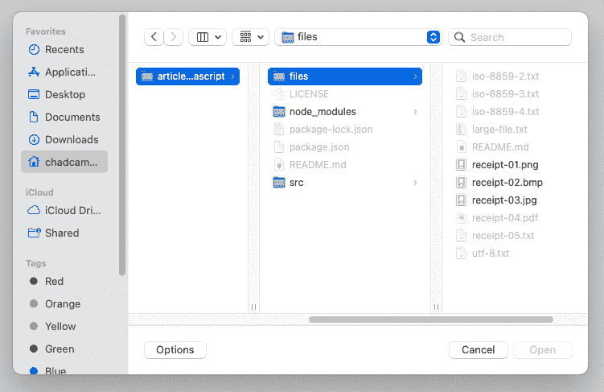
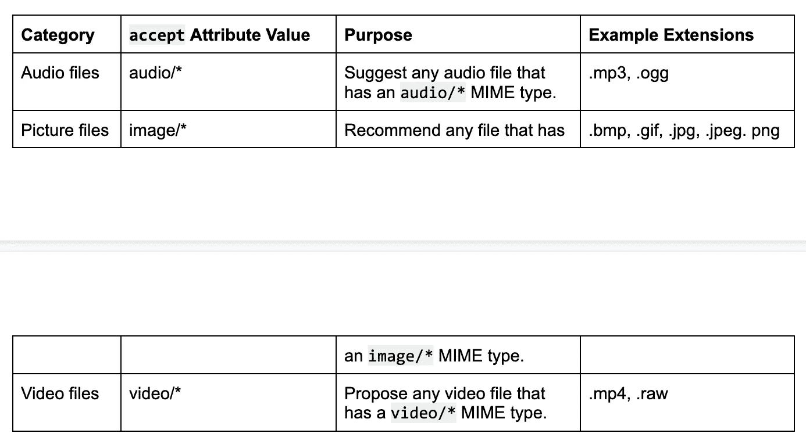
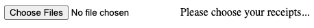
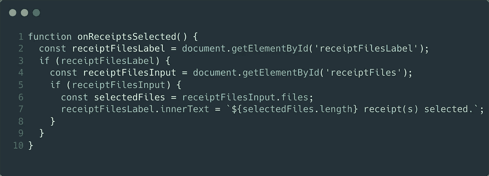
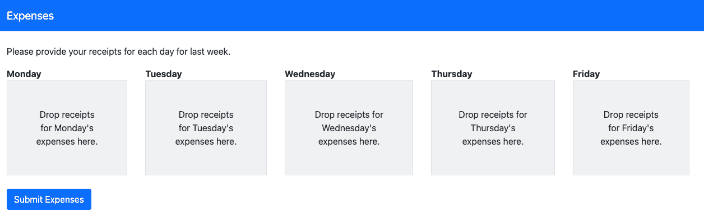
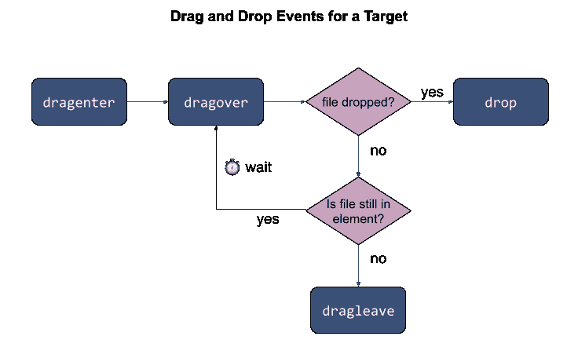
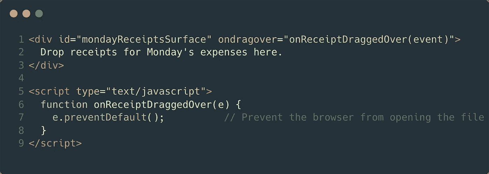
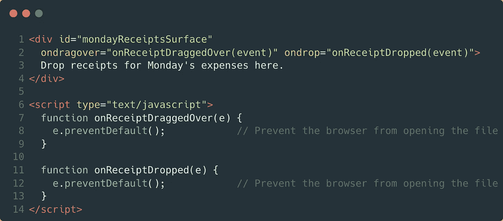

# 在浏览器中通过 JavaScript 读取文件:选择要读取的文件

> 原文：<https://javascript.plainenglish.io/reading-files-via-javascript-in-the-browser-part-1-choosing-files-to-read-af34a6daa63f?source=collection_archive---------12----------------------->

## 第 1 部分:选择要读取的文件

本文是关于在浏览器中通过 JavaScript 读取文件的系列文章的第一部分。这个系列必须从某个地方开始。最好的起点是展示如何让*选择*一个要读取的文件。你可以想象像“*Expenses”*这样的应用程序会从让用户选择一张或多张收据中受益。另外，JavaScript 的文件管理 API 需要用户发起的事件来读取文件。

出于隐私和安全原因，JavaScript 依赖用户发起的事件来获取文件。如果你退一步想想，这很有意义。你会希望一个网站在你访问它的时候抓取你电脑上的文件吗？当然不是！这将是对隐私的大规模侵犯，也是对安全的侵犯。令人欣慰的是，浏览器提供了护栏，让用户坐在驾驶座上。同时，应用程序和服务通常需要用户提供文件。从工程的角度来看，我们如何在需要的时候从用户的电脑中获取文件？

从用户处获取文件有两种方式:

1.  通过具有文件类型的输入元素
2.  通过拖放

这两种用户发起的方法将在本文中讨论。第一部分将讨论如何通过输入元素选择文件。接下来的部分将介绍拖放文件。我们开始吧。

# 通过输入控件选择文件

获取文件最简单的方法是添加一个 HTML 输入元素。默认情况下，输入标签具有文本类型。这种类型允许输入标记接受单行字符。可以将 type 属性更改为 file，以便将 input 元素转换为文件选择器。一旦完成，一个“浏览”按钮将被添加。这将看起来像这样:

image 1.1

图 1.1 显示了文件输入元素在编写时的默认外观。实际的默认外观因浏览器而异。如果你使用的是 CSS 框架，它看起来也会有所不同。尽管如此，这个图像是使用与本系列文章相关的[源存储库](https://github.com/ecofic/article-reading-files-via-javascript)中的第一个样本呈现的。该示例包含如下所示的代码:

sample 1.1

这个输入元素将让用户选择*一个*文件。文件输入元素还支持以下功能:

*   选择多个文件
*   推荐一种特定的文件
*   设置占位符

这些能力可以增强像" *Expenses* "这样的应用或者你的应用。本节的以下部分涵盖了这些能力。

# 通过文件输入元素选择多个文件

假设你正在处理*费用*。如果您添加了一个基本的文件输入元素，用户*可以*一次添加一个收据。您可以更进一步，让用户同时选择多个收据👍。通过让用户一次选择多个收据，你可以改善应用程序的体验。使用“multiple”属性可以做到这一点。

“多个”属性允许用户从一个打开的对话框中同时选择几个文件。此布尔属性可应用于输入元素，如下所示:

sample 1.2

具有“多重”属性的输入元素最初将呈现为与没有“多重”属性的的*相同。‘multiple’属性只是改变了用户如何与打开的对话框交互。用户将能够选择几个文件，而不是限制用户选择单个文件。如果选择了多个文件，所选文件的数量将替换输入元素的标签。下图显示了选择三个文件后的文件输入元素。*

image 1.2

这就是“多重”属性的全部内容。如果您希望允许用户一次选择多个文件，请添加“multiple”属性。如果您想推荐一种特定的文件，请查看 accept 属性。

# 推荐特定种类的文件

“接受”属性让你*推荐*用户可以在打开的对话框中选择的文件类型。应用时，*与*不匹配该属性值的文件将被禁用或隐藏。例如，“*费用*”应用将受益于建议*图像*作为潜在收据。macOS 上的一个建议图像的示例打开对话框如下所示:

image 1.3

该对话框区分与 accept 属性值匹配的文件和不匹配的文件。在这一点上，您可能想知道我用来建议图像的接受值。在这个特定的示例中，文件输入元素如下所示:

sample 1.3

此代码片段使用“accept”属性来建议图像。这是一个*类别*的文件。“接受”属性还允许您推荐带有特定扩展名的文件。这两个选项都包含在以下部分中。

# 建议文件类别

“accept”属性识别三类文件。下表显示了这些类别是音频、图片和视频文件。

这三个选项是“accept”最常用的值。如果你的场景不符合上面列出的任何一个类别，我会推荐你访问 [IANA 媒体类型列表](https://www.iana.org/assignments/media-types/media-types.xhtml)。这个注册表相当长。但是，如果您需要推荐带有特定扩展名的文件，它会很有用。

# 推荐带有特定扩展名的文件

“接受”属性允许您推荐具有特定扩展名的文件。可以为“accept”属性分配文件扩展名。文件扩展名不区分大小写。但是，如下例所示，提前期是*要求的*。

sample 1.4

此示例将呈现一个文件输入，建议用户在打开对话框中选择 PDF 文件。然而，建议同时使用*多种*文件是很有用的。幸运的是,“accept”属性通过提供一个逗号分隔的列表让您做到这一点，如下所示:

sample 1.5

当打开对话框显示时，这个文件输入元素将建议 PDF 和 TXT 文件。我相信你可以想象，推荐带有特定扩展名或适合某个类别的文件会有多大帮助。然而，重要的是要认识到这些只是建议。“接受”属性将*而不是*阻止用户选择带有其他扩展名的文件。因此，您应该*而不是*依赖 accept 属性来执行任何类型的验证。相反，您应该在服务器端验证该文件。虽然这超出了本系列的范围，但我想将焦点转移回输入元素本身，并讨论设置默认文本。

# 设置文件输入元素的占位符

默认情况下，文件输入元素将显示一个带有“未选择文件”字样的占位符。虽然这个短语是准确的，但它相当模糊。更详细的短语将改善应用程序的体验。例如，如果这个占位符说“请选择您的收据……”，那么“*费用*”将会受益。乍一看，您可能会想到尝试以下内容:

sample 1.6

这个样本可能看起来是正确的。毕竟，占位符*是*输入元素的有效属性。然而，您可能会惊讶地发现，占位符属性对文件输入没有任何作用。至少，在撰写本文时，这种说法是真实的。不过先别着急！您可以解决这种行为以达到您的目标。仔细想想，实际上有两种场景需要考虑:1)在没有选择文件时标记输入元素，2)在选择了一个或多个文件时标记输入元素。

# 未选择文件时标记

HTML 文件输入元素没有一个好的方法来描述*本身*。但是，HTML 输入元素通常与另一个名为 label 的元素成对出现。该元素是将描述链接到输入元素的一种方式。例如，可以通过添加标签来描述“ *Expenses* ”中的输入元素，如下所示:

sample 1.7

此示例通过以下方式关联描述:a)向 input 元素添加 id，b)通过 label 元素的 for 属性将 id 用作引用。如果你运行这个，你会看到这样的东西:

image 1.4

哎呀！这看起来不太好，也不符合我们的目标。和我呆在一起，因为它将变得有趣。首先，我们要像这样隐藏文件输入元素:

sample 1.8

现在，它看起来像我们想要的。但是，有人*会如何选择*他们的收据呢？好吧，事实是:标签元素将像按钮一样工作！没错。即使文件输入元素被*隐藏*，标签元素也会像按钮一样工作。只要 for 属性与文件输入元素的 id 相关联，该按钮就会启动打开对话框。然后，用户可以选择他们的文件。不过，这只能让我们实现目标的一半。如果您在[源代码库](https://github.com/ecofic/article-reading-files-via-javascript)中运行 sample 1.8，您会注意到另一个问题:当选择一个文件时，标签不会改变。与输入元素相关联的标签不会自我更新。

# 选择一个或多个文件时标记

要在选择一个或多个文件后正确应用标签，需要一些 JavaScript。您可以通过侦听 change 事件对用户选择文件做出反应。您可以向文件输入元素添加一个事件处理程序，如下所示:

sample 1.9

下一步是定义 onReceiptsSelected 函数。该函数在以下示例中定义:

sample 1.10

这个功能就是“神奇”发生的地方。第 2 行获取描述已经选择了多少文件的 label 元素。第 4 行检索用户一直与之交互的文件输入元素。这个元素很重要，因为如第 6 行所示，这是我们获取用户选择的文件的方式。这些文件可以通过方便命名的 files 属性获得。第 7 行使用 JavaScript 的字符串插值用友好的描述更新标签的文本。😅

恭喜你！现在，您知道了如何为文件输入元素设置占位符。在本节中，您还了解了如何推荐特定类型的文件。您还看到了如何允许用户同时选择几个文件。所有这些都是在文件输入元素的上下文中完成的。然而，这只是让用户选择阅读文件的一种方式。您也可以通过拖放从用户那里获取文件。

# 通过拖放获取文件

从用户处获取文件的另一种方法是实现拖放支持。这种方法比文件输入元素方法更灵活、更具交互性。实现起来也更复杂。为了演示，假设您想让某人将收据拖放到“*费用*”中。当收据被丢弃时，您将阅读该收据(即文件)。本系列的下一篇文章将向您展示如何*阅读*像收据这样的文件。因此，我鼓励你[现在就跟我来](https://docs.google.com/document/d/1WoqliHHFM7Z22FZtotLn3E1FBZszwKXLd0MF7dUSH5g/edit#)，这样你就知道那篇文章什么时候发表了。不过现在，让我们讨论通过拖放获取文件。

接受文件的拖放过程有两个步骤:

1.  定义拖放表面
2.  对拖放事件做出反应

这两个步骤都将在本节中详细介绍。我们走吧！

# 定义拖放表面

拖放表面表示可以放置文件的目标区域。为了演示，让我们想象"*费用*"如下所示:

image 1.5

此图中重要的细节是有五个*下降表面:每个工作日一个。虽然拖放支持可以添加到任何 HTML 元素中，但是在上面的场景中，div 可能是一个合适的选择。出于这个原因，也为了便于讨论，我将使用以下内容:*

sample 1.11

就是这样。你可能认为我忘记了一些事情。然而，我没有。正如我在这个[系列的介绍](https://medium.com/@chad.campbell/reading-files-via-javascript-in-the-browser-introduction-ad40af01a1dd)中提到的，文件管理主要发生在幕后。对于实现拖放来说也是如此。在拖放环境中，我们的主要职责是对拖放事件做出反应。

# 对拖放事件做出反应

HTML 元素有七个*拖放事件可用。对于拖放表面，只有四个事件是相关的。这四个事件是:拖动输入、拖动结束、拖动离开和放下。出于讨论目的，我想介绍这四个事件:*

*   dragenter:当用户将文件拖动到目标图面的边界时，将触发该事件。
*   dragover:当文件在目标表面的边界内拖动时，该事件将重复触发。此事件在浏览器确定的时间间隔内触发。
*   dragleave:如果用户在输入文件后将文件拖出目标表面的边界，将触发该事件。
*   drop:如果用户在目标图面的边界内释放文件，将触发此事件。

我发现将这四个事件相互联系起来很有帮助。为此，我想到了下面的流程图:

flowchart 1.1

我相信这个流程图有助于理解拖放表面(即目标)上的事件流。像其他 HTML DOM 事件一样，您没有*来对它们中的任何一个做出反应。事实上，对于拖放场景，您可能只在高级样式需要时才使用 dragenter 和 dragleave 事件。例如，如果您想在有人拖动文件时更改 div 的边框外观。要实现拖放支持，您只需要两个事件:dragover 和 drop。*

# 对 dragover 事件的反应

dragover 事件为您提供了一种观察文件在拖放表面被拖动的方式。我们在本文中讨论的“*费用*”场景不需要这种能力。然而，dragover 事件仍然必须解决。原因是因为下降事件本身是不够的。

如果您首先实现 drop 事件，您将体验到一些有趣的事情。浏览器将尝试在新标签中打开该文件。如果这是你想要的，太好了！您可以跳过这一部分。然而，我想不出有哪一次这是我想要的行为。要覆盖此行为，您需要包括 dragover 事件，如下所示:

sample 1.12

此示例的第一行连接到 dragover 事件处理程序。该事件在第 6–8 行中定义。“神奇”发生在第 7 行。这一行使用 preventDefault 方法来停止标准行为。如果您从[源代码库](https://github.com/ecofic/article-reading-files-via-javascript)运行这个示例，您会注意到浏览器仍然会尝试在新的标签页中打开文件。原因是因为您仍然需要对 drop 事件做出反应。

# 对放下事件作出反应

drop 事件使您能够响应用户将文件放到表面上。以下示例基于示例 1.12 中的代码，并添加了 drop 事件处理程序。

sample 1.13

第 2 行引用了 drop 事件处理程序。这个事件处理程序在第 11–13 行定义，反映了 dragover 事件处理程序。就像 dragover 事件处理程序一样，这个事件处理程序也使用 preventDefault 方法来阻止浏览器试图在新选项卡中打开文件。如果您运行这个示例，您将亲自看到这种体验。您可能会惊讶地发现，该文件实际上什么也没有发生。那是因为要靠*你*去得到。

dataTransfer 属性公开一个名为 files 的属性。该属性是一个文件列表，它提供两个信息:1)拖放操作中文件的数量；2)拖放操作中文件的元数据。读取文件时会使用元数据。这是本系列下一篇文章的主题。

在本文中，您了解了如何从用户那里读取文件。如果这篇文章是有帮助的，请鼓掌👏，或者拍手，在下面。这会让我知道你觉得它很有用。由于这是通过 JavaScript 阅读文件系列的第一篇文章，我鼓励你现在就[关注我](https://docs.google.com/document/d/1WoqliHHFM7Z22FZtotLn3E1FBZszwKXLd0MF7dUSH5g/edit#)。这样，当下一篇文章可用时，您就会知道了。感谢您的阅读。

*更多内容看* [***说白了。报名参加我们的***](http://plainenglish.io/) **[***免费周报***](http://newsletter.plainenglish.io/) *。在我们的* [***社区获得独家访问写作机会和建议***](https://discord.gg/GtDtUAvyhW) *。***