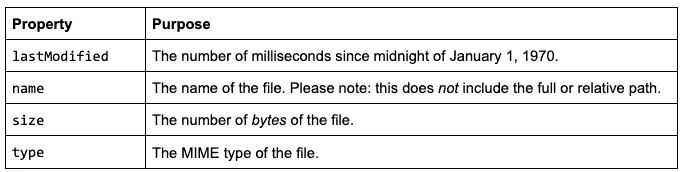
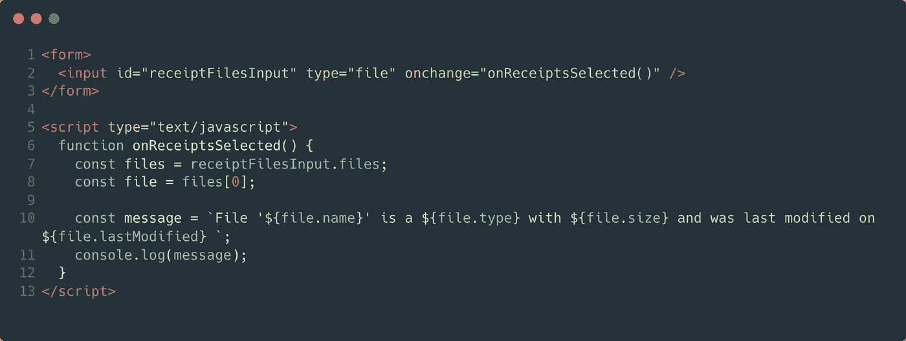
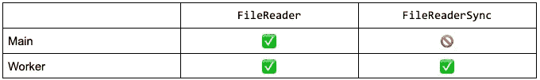
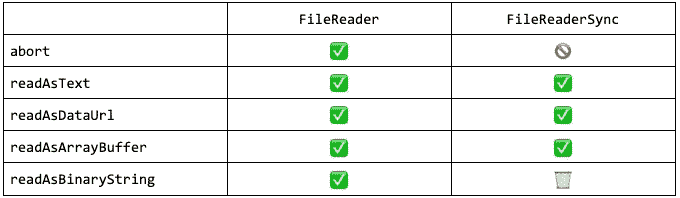
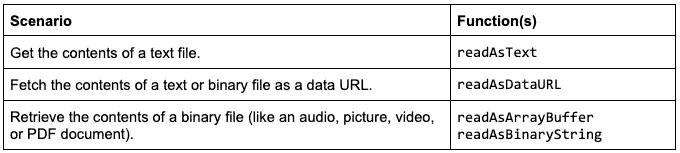
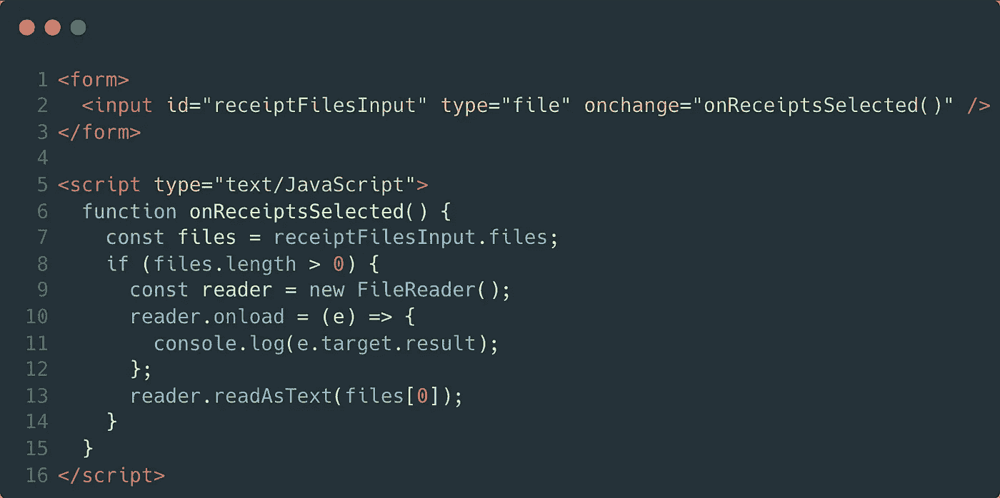
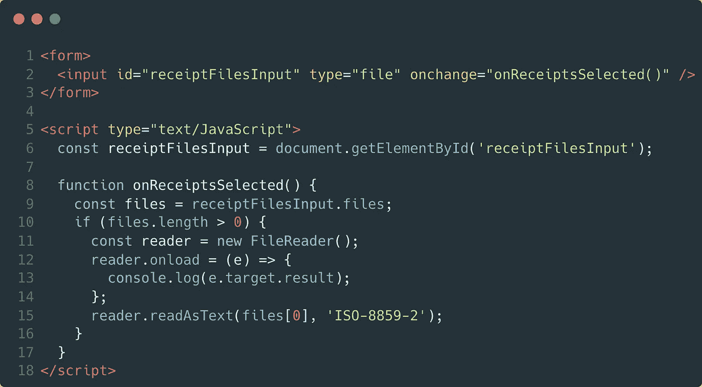
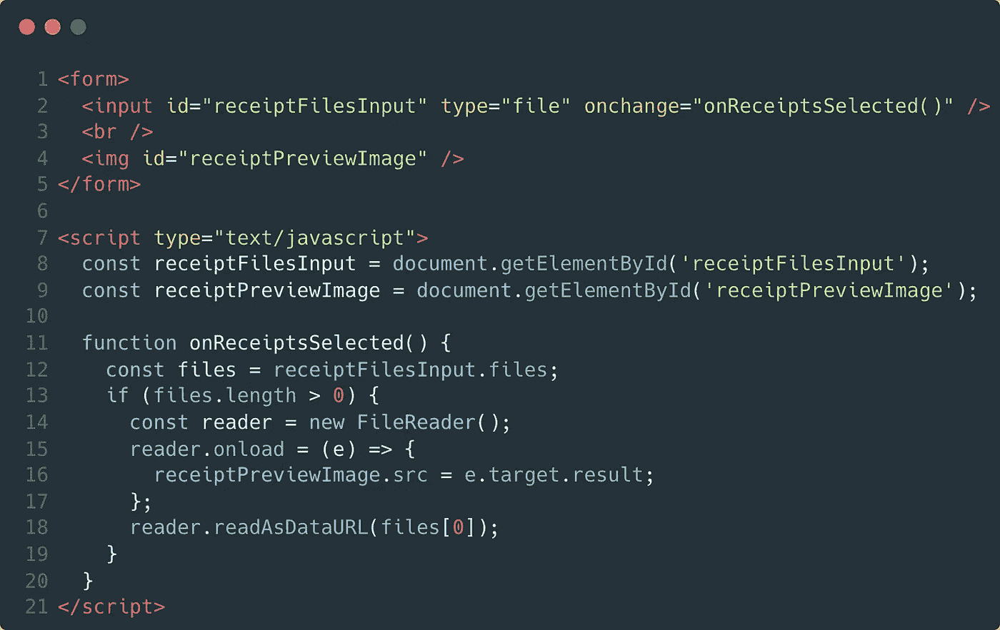
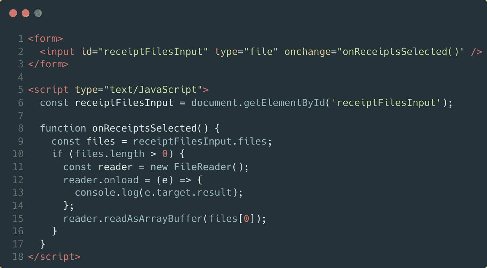
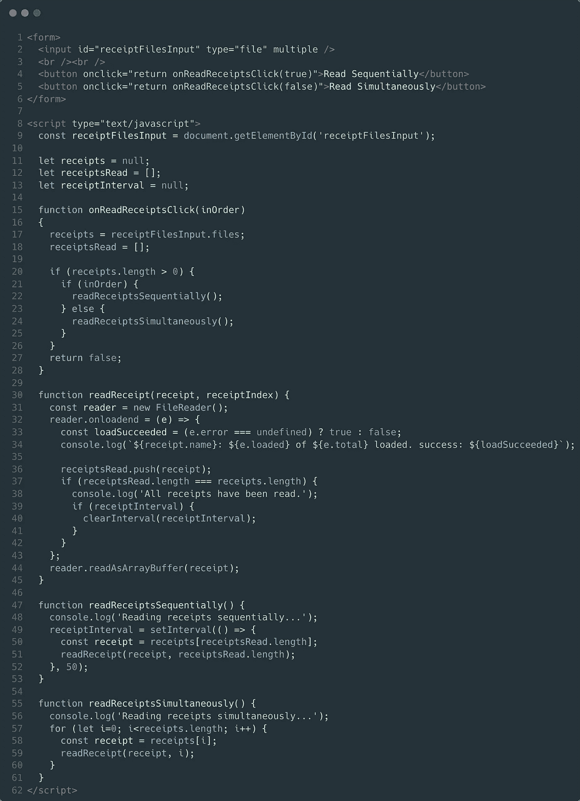

# 如何在浏览器中通过 JavaScript 读取文件—使用客户端 JavaScript 读取文件

> 原文：<https://javascript.plainenglish.io/reading-files-via-javascript-in-the-browser-part-2-reading-files-with-client-side-javascript-98a359392e8e?source=collection_archive---------7----------------------->

## 第 2 部分:如何通过客户端 JavaScript 让*读取*文件。


Photo by [Markus Spiske](https://unsplash.com/@markusspiske?utm_source=medium&utm_medium=referral) on [Unsplash](https://unsplash.com?utm_source=medium&utm_medium=referral)

[](https://medium.com/@chad.campbell/reading-files-via-javascript-in-the-browser-part-1-choosing-files-to-read-af34a6daa63f)[通过 JavaScript 读取文件系列](https://medium.com/@chad.campbell/reading-files-via-javascript-in-the-browser-introduction-ad40af01a1dd)的第 1 部分向您展示了如何从用户那里获取文件进行读取。本文将继续这个系列，并向您展示如何通过客户端 JavaScript 读取文件。本文将首先向您展示如何通过文件类型获取关于文件的信息。从那里，焦点将转移到读取文件的内容。首先要决定使用两个接口中的哪一个来读取文件:FileReader 或 FileReaderSync。最后，本文将基于这一决定，向您展示如何读取文件的内容。我们开始吧。

# 获取文件类型的文件详细信息

[第 1 部分](https://medium.com/@chad.campbell/reading-files-via-javascript-in-the-browser-part-1-choosing-files-to-read-af34a6daa63f)介绍了 files 属性，但当时没有解释。您可能已经猜到这个属性代表用户选择的文件。这些文件以文件对象列表的形式出现。每个对象包括两种信息:1)关于文件的元数据和 2)文件内容的句柄。本文稍后将向您展示如何使用该句柄。目前，下表显示了文件类型中可用的元数据。



table 2.1

表 2.1 显示了文件对象的表面属性。这张表可供参考。不过，查看这些属性的另一个有用的方法是通过代码。使用这些属性的代码示例如下所示:



sample 2.1

示例 2.1 重新混合了第 1 部分中的代码，并展示了如何使用 File 对象的属性。第 10 行使用文件的元数据创建了一条消息。该消息打印到控制台的第 11 行。如果您要从包含的[源代码库](https://github.com/ecofic/article-reading-files-via-javascript)中选择 receipt-01.png，您会看到类似下面的内容:

```
File 'receipt-01.png' is a image/png with 4024 bytes and was last modified on 1637857591663
```

上面的结果显示了正在使用的文件对象的属性。它能完成任务。然而，它不是很漂亮。您可能会想到，通过以下方式可以改善结果:

*   格式化文件的大小。特定于文化的格式会很好。使用 4 KB 这样的上下文格式会更好。
*   将最后修改的值格式化为本地化的日期/时间。

这些增强超出了本文的范围。然而，本节确实向您展示了可以从文件中获得的元数据。也许更有价值的是文件本身的内容。这个对话从 FileReader 和 FileReaderSync 接口开始。

# 比较 FileReader 和 FileReaderSync

JavaScript 有两个读取文件的接口:FileReader 和 FileReaderSync。FileReader 接口允许您异步读取文件*。而 FileReaderSync 接口让你同步读取文件*。本文将使用 FileReader 接口。做出这一决定的两个原因是基于 a)读取文件的位置和 b)可用的 API。**

## **标识文件的读取位置**

**[本系列的第 1 部分](https://medium.com/@chad.campbell/reading-files-via-javascript-in-the-browser-part-1-choosing-files-to-read-af34a6daa63f)展示了如何通过 a)输入元素和 b)拖放来选择文件。值得注意的是，这两个场景发生在*主*线程上。**

**JavaScript 有两种核心类型的线程:*主*和*工作线程*。默认情况下，主线程是运行所有 JavaScript 的单个线程。这意味着长时间运行的同步代码会阻塞 UI。长时间运行的进程可以通过在工作线程上执行代码来确保 UI 的响应性。线程的细节超出了本文的范围。但是对于本文，理解文件可以从*或者*线程中读取是很重要的。下表显示了每个线程可用的接口。**

****

**table 2.2**

**表 2.2 显示了可以用来根据正在使用的线程读取文件的接口。FileReader 接口可以用在任一类型的线程中。但是，FileReaderSync 接口只能在工作线程中使用。这是本文将使用 FileReader 接口的一个原因。另一个原因来自可用的 API。**

## **识别可用的 API**

**FileReader 和 FileReaderSync 接口提供了类似的方法。大多数方法都在这两个接口中实现。下表显示了每个接口实现的和可用的方法。**

****

**table 2.3**

**从表 2.3 可以看出两个重要的细节。首先，readAsBinaryString 方法已经被 FileReaderSync 接口的*弃用*。第二，中止方法是 FileReaderSync 接口上可用的*而不是*。基于这个表中的细节，FileReader 接口给了我们更多的灵活性。表 2.2 中的信息强化了这一观点。这就是为什么在本文中使用 FileReader 接口来读取文件。**

# **使用 FileReader API 读取文件**

**FileReader 接口允许您读取针对三种特定场景的文件。这些场景和相应的功能如下表所示。**

****

**table 2.4**

**表 2.4 显示了可以通过 FileReader API 解决的三种情况。本节将涵盖这些情况。然而，在我们开始之前，我需要在这一部分之前提出两个警告。**

**首先，在获取二进制文件的内容时，有两个选项:readAsArrayBuffer 和 readAsBinaryString。如表 2.3 所示，readAsBinaryString 已被弃用。尽可能编写健壮的、可重用的代码是最佳实践。因此，readAsBinaryString 将在本节中*而不是*讨论。**

**其次，将显示一个名为“onload”的事件。这个事件将在本系列的*下一篇*文章中详细讨论。出于这个原因，我推荐[关注我](https://medium.com/@chad.campbell)，以便知道那篇文章何时发表。现在，在该事件中将使用名为“e”的参数从嵌套的 target.result 属性中获取文件的内容。在这一点上，这听起来可能令人困惑。不过，我相信当你看到以下场景中的示例时，会更清楚。**

## **获取文本文件内容**

**readAsText 函数允许你以文本形式读取文件的内容。您可以像这样简单地读取文件的内容:**

****

**sample 2.2**

**示例 2.2 中的第 12 行显示了正在使用的 readAsText 函数。您可以使用本文的[源代码库](https://github.com/ecofic/article-reading-files-via-javascript)来试验 readAsText 函数的行为。我建议从 files 目录中选择 utf-8.txt 文件。如果你选择一个二进制文件，比如图片或视频，你会看到它的二进制内容，这不是很有帮助。如果你选择一个文本文件，比如 utf-8.txt，你将*可能*看到打印到控制台窗口的文件内容。我说可能是因为这取决于文件内容的编码方式。**

**默认情况下，readAsText 函数使用 UTF-8 编码来读取文件的内容。但是，该函数允许您将编码作为第二个参数传递。该值不区分大小写，指定读取文件内容时使用的编码。为了进行演示，以下示例使用 ISO-8859–2 编码读取一个文件。**

****

**sample 2.3**

**样本 2.3 中的第 12 行看起来与样本 2.2 几乎相同。不同之处在于添加了第二个参数。现在，如果您打开 utf-8.txt 文件，您会在控制台窗口中看到一些奇怪的东西。这是因为“ISO-8859–2”编码是在 readAsText 函数中指定的。当使用“ISO-8859–2”时，在这里找到的任何键[都是候选键。您需要验证您选择的编码，因为列表是*而不是*保证的。尽管如此，如果您使用无法识别的编码，您不会导致错误。相反，readAsText 函数将退回到使用 UTF-8。](https://github.com/whatwg/encoding/blob/main/indexes.json)**

**您可能想知道是否有办法检测使用了什么编码。不幸的是，没有。十有八九，UTF 8 号会成功。这是网络上最常用的编码。事实上，截至 2021 年，近 98%的网站使用 UTF-8 字符编码。因此，读取不同编码的文件有点不常见。读取文件以在 URL 中使用，这是一个更常见的场景。**

## **获取数据 URL 的文件内容**

**readAsDataURL 函数允许您读取 base64 编码字符串形式的文件内容。如果您需要立即在网页中显示媒体，这很有用。例如，您可能希望在用户选择图片或视频后显示它。readAsDataURL 将为您提供一个可用于 img 或 source 元素的 src 属性的结果。以下示例显示了设置 img src 的 readAsDataURL。**

****

**sample 2.4**

**示例 2.4 显示了使用中的 readAsDataURL。值得注意的是，第 16 行将请求的结果设置为 img 元素的 src 属性。这个结果将是代表文件内容的 Base64 编码字符串。就是这样。关于 readAsDataURL 函数，没有其他需要了解的特殊细节。它只是直接解决了 readAsText 和 readAsArrayBuffer 函数不能解决的问题。readAsArrayBuffer 函数解决了另一种情况。**

## **正在检索二进制文件内容**

**readAsArrayBuffer 函数允许您将文件内容读入 ArrayBuffer。ArrayBuffer 将原始文件二进制数据存储在固定长度的数组中。这对于处理像 PDF 文档这样的二进制文件很有用。事实上，下面的示例假设您将从本文源代码库中的 files 目录中选择 receipt-04.pdf。**

****

**sample 2.5**

**示例 2.5 将文件的内容作为 ArrayBuffer 打印到控制台窗口。这个 ArrayBuffer 让你控制文件的数据。做这样的事情已经超出了本文或系列文章的范围。尽管如此，我还是想让您知道 readAsArrayBuffer 函数就像 readAsDataURL 和 readAsText 函数一样存在。我还希望您知道在读取多个文件时如何使用 FileReader。**

# **读取多个文件**

**第 1 部分展示了如何选择多个文件。在*这篇*文章中，代码样本总是使用第一个文件。然而，有理由认为有人可能想在费用应用程序中一次选择多张收据。一旦被选中，这些收据需要被阅读。您可能想知道如何读取多个文件。在这一节中，我将向您展示如何顺序(即按顺序)或同时读取文件。下面的代码示例显示了这两种方法。**

****

**sample 2.6**

**示例 2.6 向您展示了如何顺序和同时读取文件。如果您熟悉 JavaScript，这里唯一的“新”部分是 loadend 事件的使用。该事件将在本系列的下一部分中讨论。不过现在，我想指出的是，无论是顺序读取文件还是同时读取文件，都会为每个文件创建一个唯一的 FileReader。这很重要，因为如果你试图用同一个 FileReader 读取两个文件，你*可能会*看到以下错误之一:**

***未捕获的 DOMException:无法对“FileReader”执行“readAsText”:该对象已忙于读取 Blobs。***

***未捕获的 DOMException:无法对“FileReader”执行“readAsDataURL”:该对象已忙于读取 Blobs。***

***未捕获的 DOMException:无法对“FileReader”执行“readAsArrayBuffer”:该对象已忙于读取 Blobs。***

**如果文件读取器正在主动读取一个文件，并且在文件读取器完成读取初始文件之前就开始了对文件的读取操作，则可能会发生上述错误之一。基本上，如果一个竞争条件发生。从技术上讲，你可以用一个共享的文件阅读器读取多个文件。如果减少内存占用是至关重要的，这可能是有用的。如果你感兴趣，我在这里创建了一个样本[。然而，对于大多数场景，建议为每个文件对象创建一个 FileReader。建议这样做，因为您的代码更容易维护。](https://github.com/ecofic/article-reading-files-via-javascript/blob/live/src/part-02/shared-file-reader.html)**

**在本文中，您看到了如何使用客户端 JavaScript 读取文件。如果这篇文章有帮助，请鼓掌(👏，)下面。这将让我和其他人知道，你发现它值得你的时间。这是系列文章的第二篇。因此，现在请[跟随我](https://docs.google.com/document/d/1rpmLhxuLTdjIu1Vwzgop24GEvBm0Qkg9043cWGQdGwU/edit#)以便您知道下一篇文章何时发表。下一篇文章将向您展示如何处理较大文件的进度更新和读取错误。感谢您的阅读。**

***更多内容请看* [***说白了就是***](http://plainenglish.io/) *。报名参加我们的* [***免费每周简讯***](http://newsletter.plainenglish.io/) *。在我们的* [***社区不和谐***](https://discord.gg/GtDtUAvyhW) *获得独家获取写作机会和建议。***