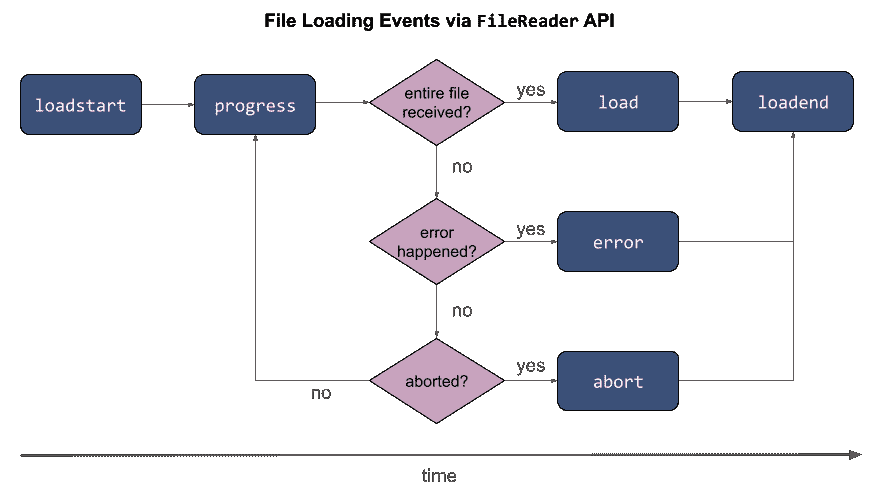
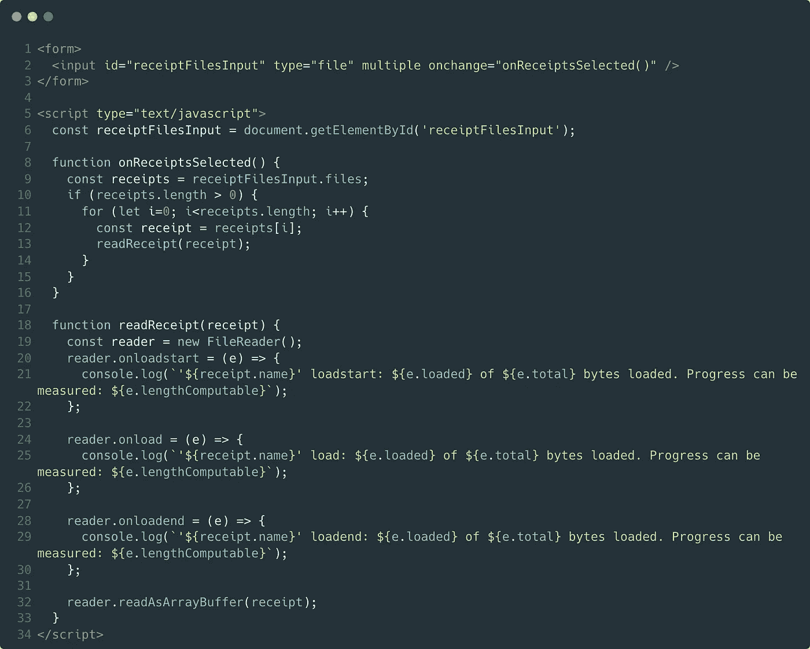
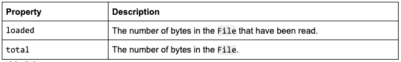
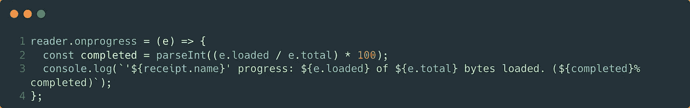
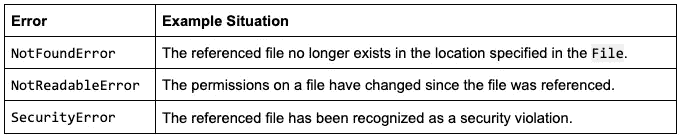
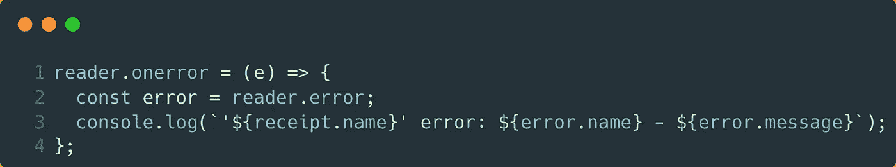
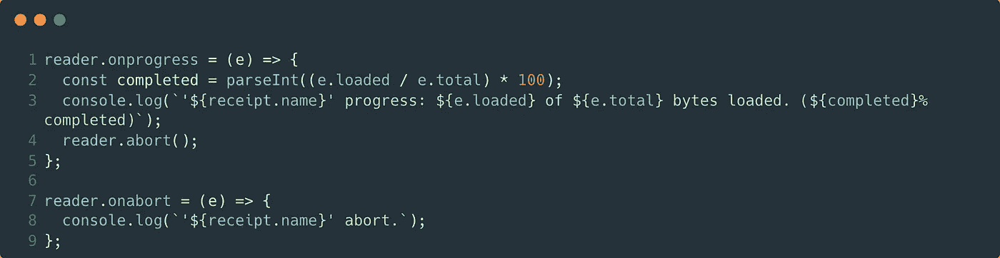

# 在浏览器中通过 JavaScript 读取文件

> 原文：<https://javascript.plainenglish.io/reading-files-via-javascript-in-the-browser-part-3-responding-to-filereader-errors-and-progress-458fce0a9f17?source=collection_archive---------15----------------------->

## 第 3 部分:用 JavaScript 响应 FileReader 错误和进度更新。

关于通过 JavaScript 读取文件的[的本系列的第 2 部分](https://medium.com/@chad.campbell/reading-files-via-javascript-in-the-browser-introduction-ad40af01a1dd)向您展示了如何使用客户端 JavaScript 读取文件。本文将接过接力棒，向您展示如何响应读取文件时发生的事件。为了介绍这些事件，我想向大家展示一个流程图。

flowchart 3.1

流程图 3.1 显示了读取文件时触发的事件。这些事件在 JavaScript 的标准 FileReader 对象上可用。这个过程从触发 loadstart 事件开始，到触发 loadend 事件结束。在此过程中还会发生其他一些事件。通过对这些事件做出反应，您可以创建一个更丰富、更健壮的应用程序。本文将讨论:

*   对文件加载事件做出反应
*   管理进度更新
*   应对错误
*   捕捉取消

为了强调本文的主题，我想提醒你三件事:1。本系列使用一个名为“Expenses”的虚拟费用报告应用程序来强化这些想法。2.本文中展示的示例可以在[源代码库](https://github.com/ecofic/article-reading-files-via-javascript)中找到。3.如果在这篇文章中的任何时候你感到困惑，我会鼓励你回顾流程图 3.1。它可以帮助你重新集中注意力。有了这三个提醒，我们可以继续讨论本文中涉及的六个事件。前三个事件直接处理文件的加载。

# 对文件加载事件做出反应

FileReader 对象提供了三个与加载文件直接相关的事件。这三个事件是 loadstart、load 和 loadend 事件。这三个事件显示在上面流程图 3.1 的顶行。下面的代码示例展示了使用中的所有这三个事件。

sample 3.1

示例 3.1 显示了 FileReader 的 loadstart、load 和 loadend 事件。当 FileReader 开始读取文件时，将触发 loadstart 事件。如果文件被成功读取，加载事件将被触发。然后，一旦 FileReader 完成获取 File 对象的数据，loadend 事件将被触发。需要认识的重要事实是，只有当文件被成功读取时，加载事件才会被触发。即使文件*未*成功读取，loadend 也会触发。值得注意的是，所有的 FileReader 事件都共享相同类型的细节。

每个 FileReader 事件接收一个 ProgressEvent。这个参数就是示例 3.1 中打印到控制台的详细信息的来源。下表描述了与在浏览器中读取文件相关的属性:

table 3.1

表 3.1 显示了属于传递给 loadstart、load 和 loadend 事件的 ProgressEvent 参数的属性。该参数也被传递给其他 FileReader 事件，包括 progress 事件。

# 管理进度更新

FileReader 的 progress 事件让您发现一个文件已经被读取了多少。此事件将在 loadstart 事件之后开始激发。它至少会触发一次，即使文件的大小为零字节(是的，我测试过)。如果文件足够大，进度事件*可能会*触发多次。我之所以说“may”是因为 progress 事件会定期触发。

大约每隔 50 毫秒触发一次进度事件([源](https://w3c.github.io/FileAPI/#dfn-filereader))，直到文件被读取。在每次更新过程中，可以计算出文件被读取的数量。以下示例显示了该计算:

sample 3.2

示例 3.2 建立在示例 3.1 的基础上，以响应进度事件。为了测试这个示例，使用了源存储库中的 [large-file.txt](https://github.com/ecofic/article-reading-files-via-javascript/blob/live/files/large-file.txt) 。在测试期间，我的机器上的进度事件被触发了两次。在每一次迭代中，下载的字节百分比都是按照第 2 行所示进行计算的。该信息然后被打印到控制台，如第 3 行所示。在现实世界中，您可能希望使用 progress 事件来更新 UI 中的进度条。虽然这是增强体验的一种方式，但另一种方式是优雅地应对错误。

# 应对错误

FileReader 的错误事件允许您对意外发生的情况做出响应。例如，一个文件在被选中和被读取之间可能会被移动。虽然这种情况似乎很少发生，但这种情况以及其他意想不到的情况确实会发生。事实上，[文件 API 规范](https://w3c.github.io/FileAPI/#ErrorAndException)会调用以下错误:

table 3.2

表 3.2 显示了可能触发文件读取器错误的情况。下面的示例建立在示例 3.1 的基础上，包括一个错误处理程序。

sample 3.3

示例 3.3 在文件读取器读取文件时发生错误的情况下创建一个处理程序。这个处理程序的第 2 行使用了 FileReader 对象的 error *属性*。为了确认并消除任何混淆，FileReader 有一个事件和一个名为 error 的属性🤷‍♂️.错误*属性*是一个共享问题原因细节的 DOMException。这些细节用于第 3 行。

示例 3.3 的第 3 行创建了描述错误的注释，并将其打印到控制台。此注释依靠错误的 name 属性来识别问题。该名称将是此处列出的[名称之一。该值由 message 属性补充，它提供了问题的简要描述。这一行还包括导致错误的文件的名称。](https://developer.mozilla.org/en-US/docs/Web/API/DOMException#error_names)

导致错误的文件名是*，而不是在错误事件处理程序中直接可用的*。传递给事件处理程序的 ProgressEvent 参数不包含文件名。FileReader 对象也不包含文件名。这意味着您需要跟踪自己正在读取的文件的名称。样本 3.3 依赖于样本 3.1 中定义的收据。关于错误事件，我还想分享另外一个细节。

如果在*其他* FileReader 事件之一中发生错误，将*而不是*调用错误事件。例如，假设从 progress 事件调用一个名为 calculateCompleted 的未定义方法。虽然这会引发 ReferenceError，但不会触发 Error 事件。因此，您需要适当地处理其他 FileReader 事件中的异常。你可能也想考虑处理取消。

# 捕捉取消

FileReader 允许取消正在进行的读取操作。如果通过 abort 方法取消读取操作，将会触发相应的 abort 事件。重申一下，FileReader 有一个中止*事件*和一个中止*方法*。您可以将它们一起使用，如下面的代码示例所示。

sample 3.4

样本 3.4 修改了样本 3.2，并使用 [large-file.txt](https://github.com/ecofic/article-reading-files-via-javascript/blob/live/files/large-file.txt) 进行了测试。此示例的第 4 行在第一次进度更新后中止了文件的读取。这将触发第 7–9 行定义的中止事件处理程序。中止事件不做任何特殊的事情，也不提供任何独特的信息。相反，我想包括这一部分只是为了确保你知道它的存在。

本文向您展示了如何响应读取文件时发生的 FileReader 事件。如果这篇文章有帮助，请鼓掌(👏，)现在。这让我和其他人知道你觉得它很有价值。这是阅读文件系列的第三篇文章。因此，现在请[跟随我](https://medium.com/@chad.campbell)以便您知道本系列的最后一篇文章何时发表。下一篇文章将向您展示如何从 FileReader 中检索文件内容。

*更多内容请看*[***plain English . io***](http://plainenglish.io/)*。报名参加我们的* [***免费周报***](http://newsletter.plainenglish.io/) *。在我们的* [***社区***](https://discord.gg/GtDtUAvyhW) *获得独家获得写作机会和建议。*