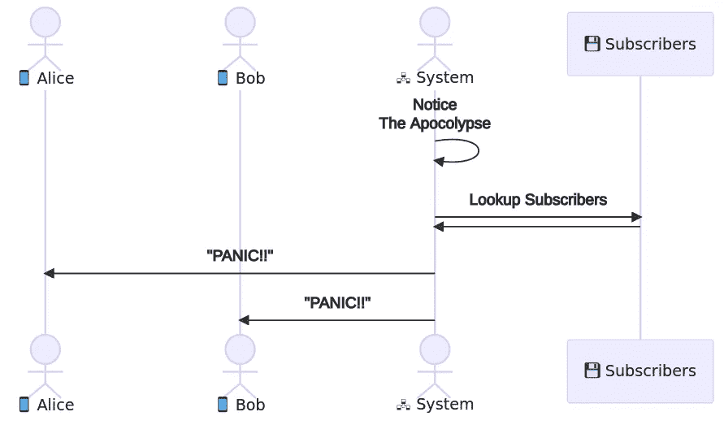
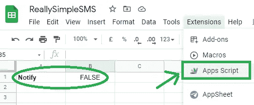
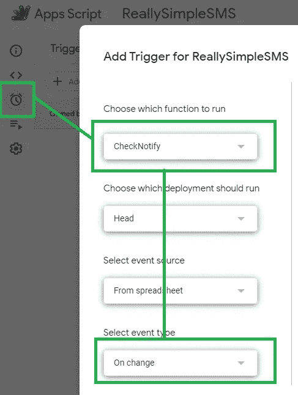
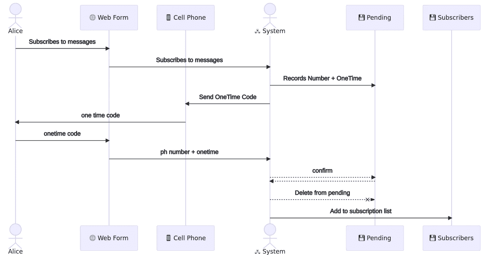
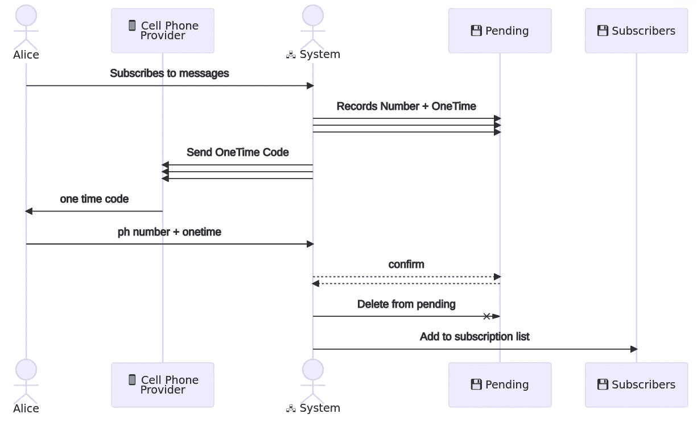

# 非常简单的短信通知(JavaScript 和 Google Sheets)

> 原文：<https://javascript.plainenglish.io/really-simple-sms-notifications-ddd9b781e953?source=collection_archive---------1----------------------->

## 为虚拟程序员发送警报


Photo by [Nubelson Fernandes](https://unsplash.com/@nublson?utm_source=medium&utm_medium=referral) on [Unsplash](https://unsplash.com?utm_source=medium&utm_medium=referral)

在之前的一篇文章中，我提到我已经实现了从电子表格发送短信通知。想知道怎么做吗？

在我开始软件领域的旅程之前，我开始了护理生涯。

在医院工作时，我花了很多天把病房的传呼机粘在腰带上。这个传呼机的目的是，如果有紧急情况，所有的工作人员都可以被召回到他们的病房协助处理紧急情况。尽管大多数人都有手机，但寻呼机是一种完全被动的无线电设备，因此携带在敏感设备周围是安全的。

几年后，我的第一份工作是软件开发。就职于一家小咨询公司，没多久就被压进了“随叫随到”的轮岗，被递上了随叫随到的手机。关键是当不好的事情发生时，客户代表会打电话给你来解决客户遇到的问题。通常，远程登录会重启崩溃的服务。

我(有点明显)想到，我们可以自动化系统检查，就像我在医院经历的那样，向寻呼机发出通知，甚至在客户注意到问题之前就可能解决问题。(我知道，“革命思维”)。

有两种观点反对这一观点:

1.  我们不会发现所有的问题
2.  真的很贵。

对于第一点，我竭尽全力保持冷静，但我认为我的目光有效地传达了我的观点。

第二点非常有道理。

没有 WiFi 路由器、能够接收电子邮件的手机还很遥远(或者过于昂贵)。寻呼机已经够便宜了，但是通过 API 实现自动寻呼机服务却非常昂贵。我不记得确切的费用，但我记得我看着金额，将其与我的工资支票进行比较，并决定我宁愿自己和我的同事得到报酬。

这是一个经常让我烦恼的问题，我想过这个问题，但不足以让我去追寻它。

大约 10 年后，我与一所主要大学签约，在他们的交流平台上工作。我们对网站的紧急横幅进行了一些测试，我开玩笑说我们应该为学生提供短信服务。

首席开发人员眼睛一亮，说他们已经有了，并告诉了我这个行业最大的秘密之一…免费短信服务已经内置于所有北美蜂窝电话提供商的服务中。

我将向您展示如何创建自己的短信通知系统。

虽然这些年来我已经使用过几次这种技术，但是我仍然可以使用的唯一实现是 Google 应用程序脚本(GAS)。GAS 是一个 JavaScript 实现，用于增强 Google Office 套件中的文档。使用在线电子表格的一个好处是它有预定的任务，而且电脑总是开着的。实际上，它是一个廉价计算引擎。所有样本都假定为气体。

我确实在 Google Sheets 中构建并测试了这个例子，你可能会发现示例中的[表格在跟踪代码时很有帮助。](https://docs.google.com/spreadsheets/d/1Ceu0gV-p7DwJH7Igec-Fn8zkGyrDSZDUiE3zq5fxL9M/edit?usp=sharing)

[](https://docs.google.com/spreadsheets/d/1Ceu0gV-p7DwJH7Igec-Fn8zkGyrDSZDUiE3zq5fxL9M/edit?usp=sharing) [## 真正简单的短信

### 配置通知

docs.google.com](https://docs.google.com/spreadsheets/d/1Ceu0gV-p7DwJH7Igec-Fn8zkGyrDSZDUiE3zq5fxL9M/edit?usp=sharing) 

# 诀窍是

真正简单的技巧是，北美的服务提供商都提供电子邮件到短信服务。北美的每个电话号码都有相应的电子邮件地址。

服务提供商没有广泛宣传它，但它也没有隐藏。所有需要做的，就是发送一封精心制作的电子邮件到电话号码的电子邮件地址。电子邮件地址域将取决于提供商:

*   [贝尔移动](https://www.txt.bell.ca/) : txt.bell.ca
*   [Fido](https://forums.fido.ca/t5/General-Support/How-Much-does-email-to-SMS-text-cost/m-p/112770) : fido.ca
*   text.mtsmobility.com
*   [罗杰斯无线](https://www.rogers.com/customer/support/article/set-up-email-to-text):pcs.rogers.com
*   Sasktel:sms.sasktel.com
*   [肖](https://support.shaw.ca/t5/mobile-articles/shaw-mobile-email-to-text-service/ta-p/30632) : txt.shawmobile.ca
*   泰卢斯:msg.telus.com
*   [维珍](https://smartcanucks.ca/how-to-send-free-text-messages-to-rogers-fido-telus-bell-virgin-cell-phones-canada/) : vmobile.ca

GoMotion 似乎维护着一个[相当完整的列表](https://support.gomotionapp.com/en/articles/407-email-to-sms-gateway-list)。

给定这些信息和电话号码`(403)123–4567`，并且知道携带者是 Shaw，人们将发送电子邮件`4031234567@txt.shawmobile.ca`。([来自 Shaw Support 的示例](https://support.shaw.ca/t5/mobile-articles/shaw-mobile-email-to-text-service/ta-p/30632))

不同的提供商以不同的方式满足这一点，当我更换提供商时，我发现很难不经过一些环节就接收到消息。要确认它在您的手机上工作，请从您的电子邮件中给自己发送一条短信。

# 发送通知



The alert system is fairly straightforward

这个系统非常简单。它旨在识别事件的发生，并通知一系列人员。传统上，向管理员发送警报电子邮件是一项常见的基本要求。“邮件合并”是一个更加“古老”的过程。

我们的系统将经历三个阶段:

1.  确定必须发送通知
2.  确定通知的收件人
3.  发送通知

要正确地做到这一点，需要处理许多细节，但在大多数情况下，这是我们系统的三个阶段。

通知的决定自然会留给你的系统:它可能是一个系统的故障，一个病人呼叫帮助，或者可能是一个向内的太阳耀斑。出于演示目的，我们在电子表格的[中使用单元块状态的变化，每 15 分钟轮询一次。](https://docs.google.com/spreadsheets/d/1Ceu0gV-p7DwJH7Igec-Fn8zkGyrDSZDUiE3zq5fxL9M/edit?usp=sharing)



We aren’t going to do anything clever for initiating the event but will be backing it with some code.



Configuring the event that will cause our notification to be sent

一旦我们确定了应该发送通知，我们需要查找合适的人来发送通知。

```
const book = SpreadsheetApp.getActiveSpreadsheet();function CheckNotify(){
  let config = book.getSheetByName('Config');
  let notify = config.getRange(1,2);
  if(notify[0][0]){
    notify.setRange([[false]]);
    Notify();
  }
}function Notify() {
  let subs = book.getSheetByName('Subscribers');
  let emails = subs
    .getRange(2,2,subscribers.getLastRow(),2).getValues()
    .map((d)=>{ return `${d[0]}@${d[1]}`; })
    .filter(d=>{return d !== '@';})
    .join(',')
    ;
  MailApp.sendEmail({
    to: 'example@example.com', bcc: emails,
    subject: 'PANIC!!',
    body: 'Please, take appropriate action.'
  });
}
```

为了识别它们，我们只需从订阅者表中查找一个电子邮件列表并遍历它。

电子邮件将发送给电子表格的所有者`from`。请注意`bcc`的使用，这是一个很好的做法，可以平衡发送的电子邮件数量并保护订户的利益，或者为每个订户发送一封电子邮件。

在我的个人设置中，我实际上发送文本和电子邮件，其中电子邮件版本有一个必须采取的行动的表格(使用`htmlBody`而不是`body`)。这让我可以很快收到通知，告诉我必须去我的电脑前，但也可以在我到达那里后得到更多的细节。

# 不受信任的订户

对于一个团队来说，这个小小的过程对于寻找系统失败、构建完成或者自动化测试失败的通知来说是很好的。事实上，添加你的电话号码并弄清楚谁是你的供应商听起来像是新成员入职的一个很好的初始任务

…实际上，这是一个非常好的主意。我可能需要在工作中更新入职文档。

在一个小团队中，每个人都是可信的，并负责添加自己，列表小到可以手工管理。在某种程度上，你不必担心有人恶意添加他们前任的电话号码，或者后来声称他们没有请求订阅。

随着系统变得越来越大，它们也变得越来越复杂。

让我们改变系统的目的。让我们假设我们正在检测僵尸启示录，更广泛的公众可能有兴趣听到它。在这个场景中，也许我们添加了一个 web 表单，允许人们订阅我们的僵尸启示录警报系统。当然，不是每个人都相信僵尸，所以我们需要确认订阅来自真正想要他们的人。



A registration process is possible that verifies ownership of the phone.

最简单的验证机制就是询问对方，这也是自电子邮件通知出现以来最常用的方法。我们可以询问他们的电话号码(可能通过 web 表单)，将该电话号码与一个秘密相关联，然后将该秘密发送到该电话号码。如果他们能告诉我们这个秘密，他们就表明我们以后不会再用信息来烦他们了。

同样的机制也适用于邮寄地址、电子邮件地址或任何其他形式的位置认证。

```
function CheckForNewNumbers(){
  let submits = book.getSheetByName('Submitted');
  let verifies = submits.getRange(2,1,submits.getLastRow(),3);
  let values = verifies.getValues();
  for(let verify of values){
    if(verify[0] === '') continue;
    HandleNewNumber(...verify);
    verify.fill('');
  }
  verifies.setValues(values);
}function HandleNewNumber(name,phone,provider){
  // generate a verification token
  let onetime = Math.round(Math.random()*9999);
  // make it 4-digits
  onetime = `0000${onetime}`
    .split('').reverse().slice(0,4).join('');
  // set a one hour timeout
  let timeout = new Date();
  timeout.setHours(timeout.getHours()+1);
  // send the token to the person
  MailApp.sendEmail({
    to: `${phone}@${provider}`,
    subject: 'Code ' + onetime,
    body: 'Your onetime code is ' + onetime
  });
  // save the values to the pending table
  let pendings = book.getSheetByName('Pending');
  let row = pendings.getRange(pendings.getLastRow()+1,1,1,5);
  row.setValues([[name,phone,provider,onetime,timeout]]);
}
```

`onetime`令牌只是一个随机生成的数字，它足够大以至于有些独特，也足够小以至于人们可以方便地输入。一个小时的`timeout`确保它失败，如果没有人立即采取行动，攻击者不能使用忘记的代码。一旦我们存储了令牌并与目标设备共享，我们就有办法知道我们正在与目标受众进行通信

一旦订户带着他们的识别号码(他们的电话号码)和我们与他们共享的令牌来找我们，我们就有办法让他们表明他们想要继续。

```
function VerifyToken(phone,token){
  // grab a time stamp that we are going to use
  let now = new Date();
  // find the "pending" table
  let pendings = book.getSheetByName('Pending');
  pendings = pendings.getRange(2,1,pendings.getLastRow(),5);
  let rows = pendings.getValues(); for(let row of rows){
    // if the row has expired
    if (now > row[4]) {
      // delete the row's contents
      row.fill('');
      // and ignore it
      continue;
    }
    // if phone number and token match the row
    if (row[1] === phone && row[3] === token){
      // put it in the subscriber's table
      let subs = book.getSheetByName('Subscribers');
      subs = subs.getRange(subs.getLastRow()+1,1,1,3);
      subs.setValues([row.slice(0,3)]);
      row.fill('');
    }
  }
  pendings.setValues(rows);
}
```

请务必记住，这是一个为了便于理解而简化的演示示例。可以调整几个方面来提高安全性:

*   `random`函数可以使用加密的强版本
*   令牌的大小可能会增加，使其更难猜测
*   可以缩短超时时间，减少可以尝试的猜测次数

进一步的改进是可能的，例如删除过期的令牌行(以防止数据库增长过多)，控制存储的单个电话号码的实例数量(以防止 DDOS 攻击)，设置验证尝试之间的时间限制(减少可能的猜测次数)。此外，我个人更喜欢使用`Date.now()`而不是`new Date()`,因为处理`int`对我来说更容易理解代码。

## 检测提供者

如果你正在阅读这篇文章，很可能是因为你不知道这项服务。因此，期望我们的普通公众订户也不知道它是合理的。要求他们记住他们确切的供应商，并区分它相似的名字(`vmobl`或`virginmobile`)，也在下拉列表中找到它是不方便的。

如果我们可以自动查找他们的提供商，这将是一个巨大的进步，并且给定一个运营商列表，我们可以。



我们的新流程只是为每个提供商生成一个唯一的一次性代码**。通过尝试传递给每个提供者，然后等待查看哪个令牌通过，我们可以确定订户正在使用哪个提供者。**

```
function CheckForNewNumbers(){
  let submits = book.getSheetByName('Submitted');
  submits = submits.getRange(2,1,submits.getLastRow(),3);
  let values = submits.getValues();
  **let providers = book.getSheetByName('Providers');
  providers = providers
    .getRange(2,2,submits.getLastRow(),1)
    .getValues();**
  for(let verify of values){
    if(verify[0] === '') continue;
    **for(let provider of providers){
      verify[2] = provider[0];**
      HandleSubmit(...verify);
    **}**
    verify.fill('');
  }
  submits.setValues(values);
}
```

# 结论

我不确定这种电子邮件转文本功能是由法律规定的，还是只是一种随着时间推移而演变的习惯，但它肯定是人们可以利用的。与其向非常昂贵的服务发送信号，不如向便宜的手机发送信号。

一个关键的优势是，建立这种关系的基础设施已经存在:电子邮件无处不在。虽然这个例子是用 Google 应用程序脚本演示的，但是我已经用 Java、Python、SAS、Powershell 和 Bash 实现了这个解决方案。它实际上只受到你的系统如何发送电子邮件的限制。


[Found this useful or interesting? Consider leaving a tip … it helps.](https://www.buymeacoffee.com/jeffereycave)

最近，我帮助一个团队实现了这一功能，以便在他们的一个桌面关闭时发出通知。他们将自己的台式机用作分布式计算的链接网络。由于每个人都在家工作，他们需要一种方法在网络中的计算机关闭时得到通知。网络中的每台计算机现在都会发送一个通知，如果它的一台对等机关机的话。

如果您正在构建一个任务关键型系统，我强烈推荐使用一个一致且支持良好的 API。不同的提供商对电子邮件提供不同的解释，这导致一些“有趣”的信息被接收。支持良好的服务可以缓解这一问题。

然而，如果你是一个小团队，或者只是想得到一个原型，对阻碍你的官僚主义感到沮丧，或者只是想修补，希望这能让你开始。

这个话题到此为止。感谢您的阅读。

*更多内容请看*[***plain English . io***](http://plainenglish.io/)*。报名参加我们的**[***免费周报***](http://newsletter.plainenglish.io/) *。在我们的* [***社区获得独家访问写作机会和建议***](https://discord.gg/GtDtUAvyhW) *。**