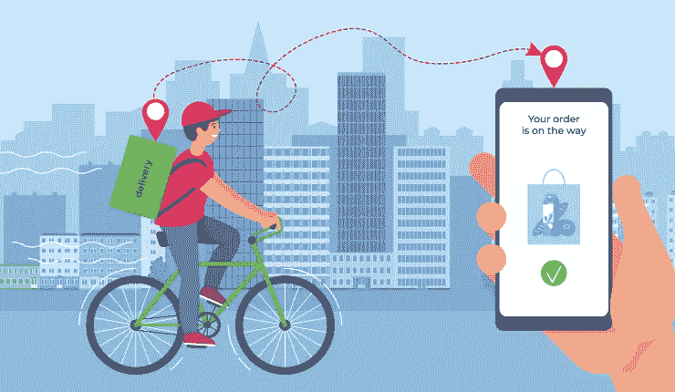
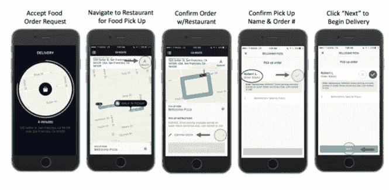

# 为什么你应该为你的新食品公司安装一个食品订购应用程序

> 原文：<https://javascript.plainenglish.io/reasons-why-you-should-include-a-food-ordering-app-for-your-new-food-startup-4edc89e11c21?source=collection_archive---------16----------------------->

Food Ordering & Delivery App

一句古老的谚语说，抓住一个人的心的最好方法是通过食物。是的，这句谚语的确很对。毫无疑问，任何人能找到的进入他人内心的最有效的方法就是满足他们的渴望。这就是为什么餐馆如此受欢迎的原因。然而，随着时间的推移，应用程序已经在全球范围内占据了突出的位置。这导致了按需餐饮应用的兴起。

在下面的几行中，我将向您介绍这些应用程序。这包括列出一些独特的特征，这些特征是它们广受欢迎的原因。

# 向您介绍按需送餐业务

如前所述，食品配送业务无疑是一个非常有利可图的企业。这是因为它在满足全球饥饿方面提供了支持。毕竟，当人们饥饿时，它能让他们的饥饿感得到满足。

特别是，由于按需食品应用的出现，该业务见证了更大的需求。根据 Statista 的报告，按需送餐业务将在 2022 年至 2026 年期间保持约 8.38%的增长率。同时，到 2026 年，用户数量将增长到 26.91 亿。

这些数字足以描述这些解决方案在未来几年将继续享有的总体受欢迎程度。

你现在可能会疑惑；这些解决方案首先获得如此大规模普及的原因。在了解这些因素之前，请阅读这篇非常有用且信息丰富的帖子:

 [## 开发食品订购和交付应用程序时应考虑的关键属性

### 让一款订餐 app 大获成功应该考虑的因素。

javascript.plainenglish.io](/key-attributes-that-should-be-considered-while-developing-a-food-ordering-deliveryapp-3e54e7b2d762) 

# 食品配送应用受欢迎的因素

**1。加强客户拓展**

按需餐饮应用程序的 mos 影响力优势在于它们支持增强餐厅的客户拓展。根据环球新闻网的一份报告，全球 43%的顾客在网上订餐。因此，采用一款能让餐厅灵活地与企业合作的应用是一个非常好的主意。他们将能够加强与客户的联系，并向客户提供有关他们所提供服务的知识。

**2。个性化范围更大**

送餐应用程序允许顾客根据自己的喜好定制食物。换句话说，如果他们希望添加更少或更多的盐，或者让它变得更浓或更淡，这款应用程序可以让这一切变得简单。

通过该应用程序，用户还可以添加他们的偏好，如果他们希望订单交付专业人员在他们到达他们的位置时响铃，或者不响铃。

**3。简化客户数据的收集**

一个企业最大的任务，不管它服务于哪个部门，都是收集客户数据，并了解他们收集数据需要采用的技术；然后同时利用它的优势。如果他们在食品配送行业工作，这一点尤为重要。

这些数据对于风险企业来说变得非常方便，可以帮助他们了解他们正在取得的进展、他们需要努力的领域等等。

简而言之，点播食品应用程序有助于企业了解客户及其满意度，从而更容易尽可能地为他们提供更好的服务。

看看这张图片，观察这个应用程序的流畅运行，这是它受欢迎的主要原因。

图片来源——geniusee.com

所以，现在我相信你已经知道按需送餐业务受欢迎的原因了。现在让我向您介绍一些使这些应用程序如此受欢迎的独特功能。

# 在线食品配送应用中的独特元素

*   **订单调度**

Order Scheduling

该功能使用户能够根据自己的喜好提前订餐。举个例子，如果用户想在某一天吃顿饭，这个应用程序可以让他们非常轻松地做到这一点。

*   **实时定位围栏**

利用这一点，用户和送货专业人员都可以无缝跟踪对方，并知道他们的行踪。直到专业送货人员到达。

作为引用透明度的一种形式，这个特性当然有助于用户了解他们的递送状态，并知道他们的饭菜何时到达。

*   **无接触交付**

在疫情之后，这一特征已经成为一个相关的特征。它确保在交付时，专业交付人员和客户都不必进行物理连接。用户只需简单地下订单、付款并提出请求。他们想要一种无接触的送货方式，其中送货专业人员需要在他们的门外下订单。

*   **智能搜索**

基于用户进行的频繁搜索；他们将被赋予与食物或餐馆和小吃店相关的结果。这使得用户的整个订购过程既流畅又无缝。

同时，这款应用还有一些其他独特的元素，让它们变得更加流行。

## 这些措施包括

*   餐馆简介评论，了解餐馆、菜单和顾客对餐馆的评论
*   烹饪管理帮助餐馆在应用程序中添加新的食物，并尽可能以最好的方式将用户的注意力保持在应用程序上
*   餐桌预订允许用户直接从应用程序无缝预订特定餐厅的座位。
*   游戏化功能，允许用户在下一个订单内在应用程序上玩的游戏中兑换奖励。

这些功能作为送餐应用的媒介，帮助餐厅将业务提升到一个新的水平；这就是成功、最大客户、投资回报率和最大收入。

因此，简而言之，如果你是一家新的食品配送企业，那么采用[按需食品配送应用程序开发](https://www.peppyocean.com/food-ordering-delivery-app-development/)是一个好主意。这将帮助你在很大程度上扩大你的餐馆业务，让它实际上大大提高其知名度，并帮助它扩大其基础。

# 结尾词

点播食品应用程序帮助餐馆和送餐业务开辟了一个利基市场，以建立强大的在线业务。同时，它还帮助他们扩大了客户群，帮助餐馆让更多的观众了解他们的服务，送货专业人员自动化了他们执行订单的方式，并通过他们的订单获得了丰厚的收入。因此，简而言之，这些应用程序是送餐业务的福音。

因此，如果你是一家新的食品交付企业，渴望在食品交付方面做大，今天就联系一家食品交付应用程序开发公司吧！

他们在应用程序中包含最佳在线食品订购应用程序开发实践的专业知识将对您有很大帮助。事实上，您将获得一个可根据您的需求和要求定制的解决方案。这将最终推动您的业务向前发展，使其更上一层楼，并为您的客户和配送专业人员提供无缝的食品配送体验，从而帮助您在最短的时间内建立强大的用户群。

*更多内容请看*[***plain English . io***](https://plainenglish.io/)*。报名参加我们的* [***免费周报***](http://newsletter.plainenglish.io/) *。关注我们关于*[***Twitter***](https://twitter.com/inPlainEngHQ)*和*[***LinkedIn***](https://www.linkedin.com/company/inplainenglish/)*。查看我们的* [***社区不和谐***](https://discord.gg/GtDtUAvyhW) *加入我们的* [***人才集体***](https://inplainenglish.pallet.com/talent/welcome) *。*