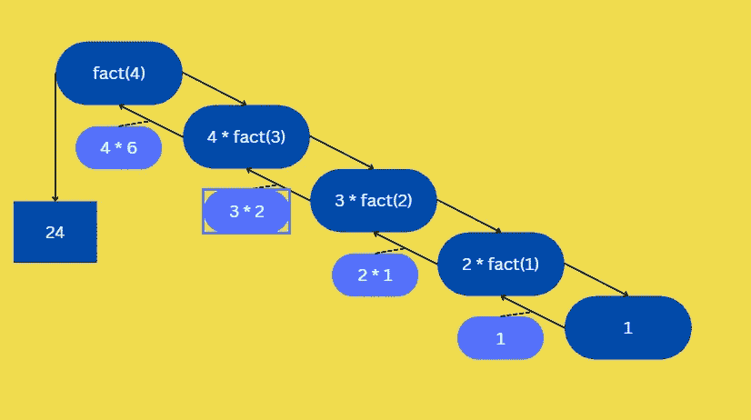
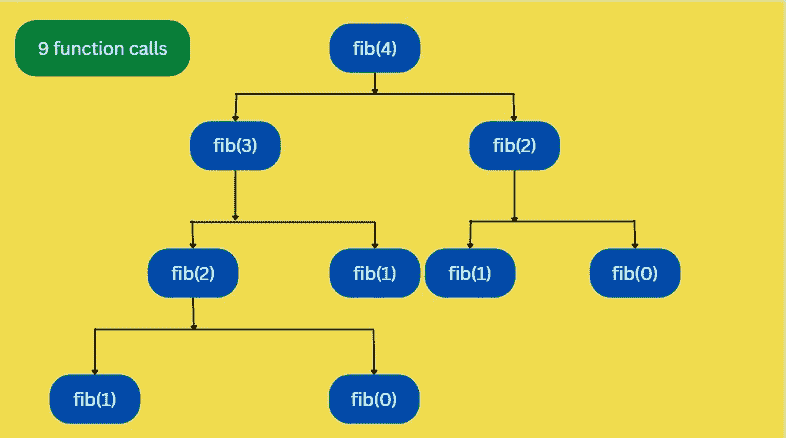

# 递归算法及其时间复杂度 O(n) vs O(2^n)

> 原文：<https://javascript.plainenglish.io/recursive-algorithms-and-their-time-complexities-o-n-vs-2-n-713856ad4e2?source=collection_archive---------5----------------------->

## JavaScript 算法基础第四部分: ***线性时间复杂度为 O(n)的递归算法&指数时间复杂度 O(2^n)***


Photo by [Markus Spiske](https://unsplash.com/@markusspiske?utm_source=medium&utm_medium=referral) on [Unsplash](https://unsplash.com?utm_source=medium&utm_medium=referral)

**递归**是编程中的关键概念之一。作为一种解决问题的方法，它也被广泛应用于**数据结构和算法**。它帮助我们把复杂的大问题分解成小问题。因此，理解递归的时间复杂度对于理解和提高代码效率至关重要。

关于本系列 **JavaScript 算法**的 **part 3** ，可以参考下面的链接。

[第 3 部分:使用渐近分析导出常数时间复杂度 O(1)](https://medium.com/@code.ceeker/derive-constant-time-complexity-o-1-using-asymptotic-analysis-e786df20fc7b)

在本文中，我们将研究递归算法的两个例子及其时间复杂度。

1.  ***线性时间复杂度为 O(n)的递归算法***
2.  ***具有指数时间复杂度的递归算法【o(2^n】***

首先，简单介绍一下递归。

## **什么是递归？**

如果一个函数直接或间接地调用自己，我们说它是递归函数。下面是递归函数的大概样子。

```
function recursiveFunction() {
 return recursiveFunctionn();
}
```

上面的函数是递归函数的一个**例子，因为它正在调用自己，但是它也是不完整的，因为它会**导致一个无限循环**。这是因为该功能没有任何**退出条件**。但是，这里的**要点是，递归就是从函数内部调用函数。****

为了说明得更清楚，我们来看下面一个简单的例子。

**例题**

创建一个简单的函数来计算输入数字的阶乘。

如果你不知道什么是阶乘，看看下面函数的行为，输入如下。

```
factorial(3);  // 3 * 2 * 1 = 6factorial(4);  // 4 * 3 * 2 * 1 = 24
```

你把输入的数字，乘以那个数字减 1，重复同样的操作，直到你达到 1。这是我们计算阶乘的方法。最后，我们可以写一个这样的函数。

```
Fn = n * (n - 1) * (n - 2) * (n - 3) * … * 3 * 2 * 15! = 5 * 4 * 3 * 2 * 1 = 120
```

我们先来看一个**非递归方法**。因为通常，不是总是，递归只是常规循环的一种替代。所以，让我们先用基于循环的方法来解决它。

## **功能(基于循环的方法)**

```
function factorial(n){
 let result = 1;

 for(let index = 1; index <= n; index++){
  result = result * index;
 }
 return result;
}
```

所以，这是一个使用普通循环的阶乘函数**。使用这样的循环是解决阶乘问题的一个不错的方法。但是**也存在一种不同的方法来使用递归**解决上述问题。而且，正如您将进一步看到的，递归将允许我们编写更少的代码，这通常是我们可能想要使用递归的原因之一。**

## **递归求解 O(n)**

```
function factorial(n){
 **if (n === 1) {** -> Exit condition/Base case **return 1;
 }**return n * **factorial(n - 1)**; -> Recursive step
}
```

上面的函数是递归的，因为它在调用自己。**在函数中有两件重要的事情需要注意，即“if 块”和参数为(n-1)** 的“函数调用”。

我们称 if 块为**“退出条件”或总是返回值的“基本情况”**。并且，**“函数调用”为“递归步骤”**。

**另一个需要注意的重要事情是，我们在递归步骤**中向函数调用传递了一个不同的参数。因为，如果我们再次调用带有 **n** 的函数，我们不会改变任何东西。我们会得到一个无限循环。

***因此，一个递归函数应该总是有这两个组成部分，即“退出条件”和“递归步骤”，否则我们将总是有一个无限循环，这会使我们的程序崩溃。***

**退出条件**或**基本情况**为我们提供了基本条件满足时退出函数的方法。

并且，**递归步骤**通过对同一个函数进行递归调用来帮助我们**计算**结果，但是**输入的大小**减小了。

这可以表示为一连串的函数调用。如下例所示，对于一个**事实(4)** ，我们将返回 **4 *事实(3)** ，这将为我们提供 **3 *事实(2)** ，这将再次为我们提供 **2 *事实(1)** 。并且，它最终返回 **1** ，然后将计算出的返回值传递给函数调用，导致 **24** 。



## **如何推导递归算法的时间复杂度？**

根据渐近分析，我们仍然可以对上述函数中的**运算**进行计数。因此，每个操作将执行一次，包括 return 语句中的函数调用。

但是，因为我们在 return 语句中有一个函数调用。我们开始一个新的函数调用，因此该函数中的所有代码都会再次运行多次，直到满足退出条件。因此，我们可以在这里计算递归函数的函数调用次数。因此，我们可以看到，在上面的例子中，对于 4 的阶乘，我们得到了 **4 个函数调用**。

在每个函数调用中，我们有一个固定的时间，函数中没有任何循环。因此，我们可以这样写。

```
**T = O(1) => Time complexity of a single function call**
```

但是，当输入值为 **n** 时，上述函数调用触发了多个函数调用，即 **n** 函数调用。

因此，我们对于多个函数调用的时间复杂度是，

```
**T = n * (Time complexity of individual function)**
```

那就是，

```
**T = n * O(1)**
```

**可以写成，**

```
**T = O(n)**
```

**上式最后简单来说就是 O(n)**。这与基于循环的解决方案的时间复杂度相同，即**线性时间复杂度**。

虽然这是递归算法的一个非常简单的例子，但是我们也有使用递归的算法，因为它们产生的结果比替代解决方案更好。

## **递归算法指数时间复杂度 O(2^n)**

在前面的例子中，递归看起来不错，我们通常可以编写更少的代码来解决问题。但是，让我告诉你，递归并不总是最好的解决方案。为了证明这一点，我们将看看斐波纳契数列的**递归实现。**

**功能**

```
function fib(n){
 **if (n === 0 || n === 1) {  -> Exit Condition
  return 1;
 }**return **fib(n-1) + fib(n-2)**; **-> Recursive Step**
}
```

上面的函数是一个**斐波那契**函数，它启动**两个递归函数**，触发新的函数调用，直到满足退出条件。一旦所有这些函数调用都被解析，结果就会冒泡并返回到初始函数。这里这两个函数都将返回一个值，然后将这些值相加。

那么，这种方法有什么问题呢？

这种方法的错误在于，当我们调用它时，函数会构建一个跨越多个分支的嵌套递归函数调用树。

这可以在下面的 **n = 4** 的示例图中看到。



如你所见，对于像 **4** 这样的数字，我们得到了 **9 个函数调用**。如果我们使用基于循环的解决方案，那么我们将只迭代**4 次**。这不是一个好的解决方案，因为即使对于像 **4** 这样的较小输入数，也有大约 **9 次函数调用**的执行。

类似地，函数调用**随着**输入数**的**线性增加**而指数增加**，如下图从 **4 到 6** 所示。

```
fib(4); // 09 executions
fib(5); // 15 executions
fib(6); // 25 executions
```

如果输入数量进一步增加，情况会变得更糟。

**那么这个递归函数的时间复杂度是多少？**

**不一定是 O(n)**，这是**基于循环的解决方案**的情况。我们得到了对 4 人的( **9)次处决，对 5 人的(15)次处决，对 6 人的(25)次处决。因此，如果我们将提供给函数的数字增加 **1** ，我们的执行次数就会有**的指数增长**。它不是线性增长的**。我们添加的执行数似乎随着我们的 n 的增大而呈指数增长。

因此，相对微小的上升需要越来越长的时间。事实上，这个时间尺度的复杂性是指数级的。随着第 n 个中的每一个增量，我们将整个新的分支添加到这个递归树中，而不仅仅是一个函数调用。此外，每个分支由其他分支组成。结果，这很快增加到我们的机器无法处理的量。因此，对于一个我们已经有线性时间复杂度解决方案的问题，这是一个糟糕的解决方案。**像这样的递归函数是次于基于循环的解决方案的一个例子**。这需要更多的时间。虽然看起来很优雅，但这是一个糟糕的解决方案。

**这是一个指数时间复杂度的 O(2^n)** 。我们确定函数调用的增长，因为它是指数级的，我们可以说这个算法具有指数级的时间复杂度。

**但是，你知道吗，上面的递归指数函数也可以改进成具有线性时间复杂度？如果你知道答案，请在评论里告诉我。**

感谢您的阅读。

*更多内容请看*[***plain English . io***](https://plainenglish.io/)*。报名参加我们的* [***免费周报***](http://newsletter.plainenglish.io/) *。关注我们关于*[***Twitter***](https://twitter.com/inPlainEngHQ)[***LinkedIn***](https://www.linkedin.com/company/inplainenglish/)*[***YouTube***](https://www.youtube.com/channel/UCtipWUghju290NWcn8jhyAw)*[***不和***](https://discord.gg/GtDtUAvyhW) *。对增长黑客感兴趣？检查* [***电路***](https://circuit.ooo/) *。***