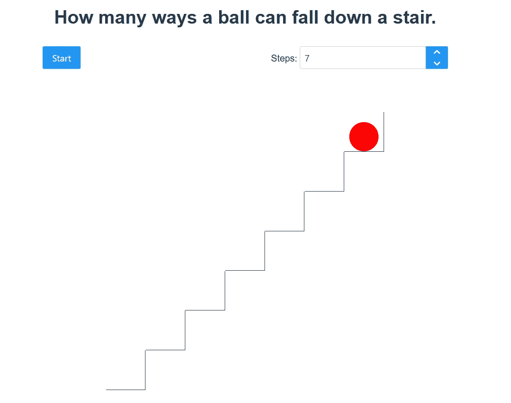

# 带有 Vue.js 的递归组件

> 原文：<https://javascript.plainenglish.io/recursive-components-with-vue-js-c3c49e69955c?source=collection_archive---------17----------------------->

## 一个小的示例应用程序，用于可视化“爬楼梯”问题。

[](https://medium.com/@applied-math-coding/membership) [## 通过我的推荐链接加入 Medium-applied . math . coding

### 获得我所有的故事，以及其他作家在媒体上发表的成千上万的故事。我坚信，媒介是…

medium.com](https://medium.com/@applied-math-coding/membership) 

这篇文章是我最近提交的关于“爬楼梯”问题的故事的后续，你可以在这里找到。现在让我们将结果可视化，即模拟一个球以各种方式从楼梯上落下。

当然，这种可视化比它认为的任何严肃的意义都有趣，尽管前端代码中使用的技术看起来非常有趣。

我使用版本 3 中的 [Vue.js](https://v3.vuejs.org/) 来创建应用程序，结果应该看起来像这样简单:



你可以看到[在这里](https://applied-math-coding.github.io/ball-falling-steps/)在行动。整个代码位于这个[库](https://github.com/applied-math-coding/ball-falling-steps)中。

整个应用程序由两个组件组成:`App.vue`和`Step.vue`。

`App`组件包含所有触发 resp 的动作按钮逻辑。停止模拟。此外，它在其模板中托管第一个`Step`:

```
<div class="step-positioner" :style="{ width, height: width }">
   <Step :idx="0"></Step>
</div>
```

`Step`只是代表一个显示底部和左边界的盒子。有趣的是,`Step`的实现是递归的:

所以`Step.vue`的模板看起来是这样的:

```
<template>
  <div ref="step" class="step">
    <div class="ball" v-if="currentStep === idx"></div>
    <div class="next-step-positioner" 
       v-if="idx + 1 < numberOfSteps">
       **<Step :idx="idx + 1"></Step>**
    </div>
  </div>
</template>
```

正如您所看到的，同一个组件，虽然是另一个实例，但是在它自己的模板定义中被重用。

每个`Step`都有一个内部状态`idx`，代表其在楼梯上的位置。递归添加的组件提供有加 1 的`idx`。此外，当`idx + 1 < numberOfSteps`时，或者换句话说，当已经添加了楼梯的所有步骤时，递归停止。

另一个有趣的部分是每一步的定位。这个想法只是让下一步相对于当前步骤定位。这是通过将以下样式添加到步进包装元素中实现的，即“步进定位器”:

```
position: absolute;
left: 100%;
bottom: 100%;
width: 100%;
height: 100%;
```

为了让每样东西都呈现完美的像素，我们实际上还必须考虑到边界的宽度(`calc(100% + var( — border-width))`)，但这些都是次要的细节。

上面的 CSS 从当前的右上角开始递归呈现步骤。这样我们就有了一个楼梯。

此外，每个`Step`包含一个元素，用于渲染球。如果该球的`idx`与模拟确定的球一致，则该球仅在特定的`Step`显示。因此，如果模拟希望球在位置`idx`被渲染，那么它只给出全局状态，即`currentStep`，值`idx`:

```
<div class="ball" **v-if="currentStep === idx"**></div>
```

这里值得注意的是，这个全局状态不是传递给所有的`Step`实例，而是添加到一个`vuex`存储中。在这种情况下，这是最干净的方法。你可以在`/store/index.ts`找到店铺的定义。

同时，这个存储实现了类似于`decrCurrentStep, initCurrentStep, …`的变异，这些变异在实际的模拟代码中使用。

点击开始按钮触发的`App.vue`内的模拟代码如下所示:

```
for (let seq of 
   enumerate_climbing_stairs(this.$store.state.numberOfSteps)) {
   **this.$store.commit("initCurrentStep");**
   for (let idx of seq) {
     await new Promise<void>((res) => setTimeout(() => res(), 200));
     **this.$store.commit("decrCurrentStep", idx)**;
   }
}
```

在这里，您可以看到全局状态是如何被存储上的相应突变所改变的。

虽然这个应用没什么大不了的，但是我觉得一个人可以从中学到很多东西。

感谢阅读！

*更多内容看* [***说白了。报名参加我们的***](http://plainenglish.io/) **[***免费周报***](http://newsletter.plainenglish.io/) *。在我们的* [***社区不和谐***](https://discord.gg/GtDtUAvyhW) *获得独家获取写作机会和建议。***