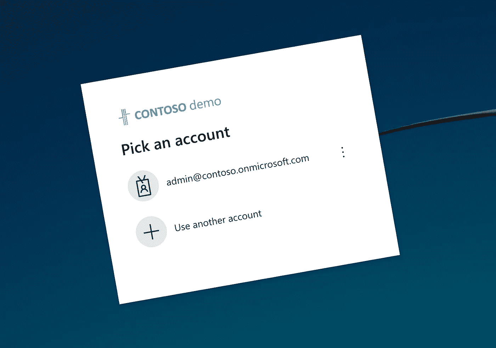
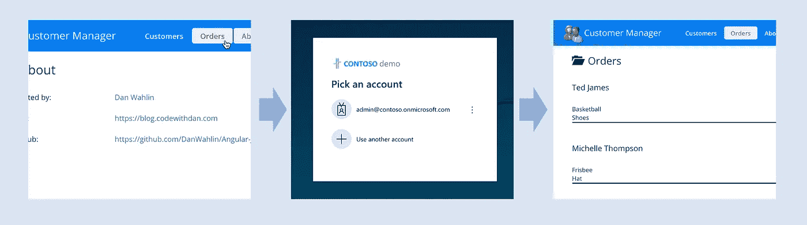
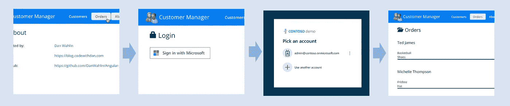

# 重定向至使用 MSAL 保护您的 Angular 应用程序时的自定义登录页面

> 原文：<https://javascript.plainenglish.io/redirect-to-a-custom-login-page-when-securing-your-angular-app-with-msal-421014face89?source=collection_archive---------11----------------------->

## 使用 MSAL 保护 Angular 应用程序时，如何重定向到自定义登录页面的指南。



使用 MSAL Angular 和`MsalGuard`是通过微软身份平台保护您的 Angular 应用程序的最简单方法。但如果你想使用自定义登录页面，而不是直接将用户重定向到 Azure Active Directory，有一件事你需要考虑。

# 使用 Microsoft 身份平台保护您的 Angular 应用程序

当您为您的组织构建 Angular 应用程序时，您可能需要保护它们。它们不应该对任何人开放，尤其是当它们可以通过互联网访问时。相反，人们应该先登录，然后才能访问该应用程序。

虽然你可以在你的应用中添加一个基本的用户管理系统，但这并不是一个好主意。这与你的应用程序正在解决的问题没有任何关系，而且要做好也极其困难。您需要考虑管理用户帐户、处理过期密码、多因素身份验证，更不用说像条件访问这样更复杂的事情了。这不是小事，就像我刚刚提到的，这与你的应用程序正在解决的问题无关。最重要的是，您需要人们创建和管理另一个帐户。

如果您的组织使用 Microsoft 365，您可以使用 Microsoft 身份平台来保护您的应用。您可以免费获得所有用户管理功能，并且您的同事可以使用他们用于访问 Outlook 或团队的相同帐户来使用您的应用程序！

# 使用 MSAL Angular 通过 Microsoft 身份平台保护您的 Angular 应用程序

通过微软身份平台保护 Angular 应用的最简单方法是使用 [MSAL(微软认证库)Angular](https://github.com/AzureAD/microsoft-authentication-library-for-js/tree/dev/lib/msal-angular) 包。这个包包含了在你的应用中实现 MSAL 的角度特定的构建模块。

要使用 MSAL Angular 保护你的 Angular 应用，你需要两个构建模块:`MsalGuard`和`MsalRedirectComponents`。

您将`MsalGuard`添加到需要用户登录的路线中。例如:

```
**import** { Routes } **from** '@angular/router';
**import** { MsalGuard } **from** '@azure/msal-angular';

**const** app_routes: Routes **=** [
  { path: '', pathMatch: 'full', redirectTo: '/customers' },
  { path: 'customers/:id', data: { preload: **true** }, loadChildren: () **=>** **import**('./customer/customer.module').then(m **=>** m.CustomerModule), canActivate: [MsalGuard] },
  { path: 'customers', loadChildren: () **=>** **import**('./customers/customers.module').then(m **=>** m.CustomersModule), canActivate: [MsalGuard] },
  { path: 'orders', data: { preload: **true** }, loadChildren: () **=>** **import**('./orders/orders.module').then(m **=>** m.OrdersModule), canActivate: [MsalGuard] },
  { path: 'about', loadChildren: () **=>** **import**('./about/about.module').then(m **=>** m.AboutModule) },
  { path: '**', pathMatch: 'full', redirectTo: '/customers' } *// catch any unfound routes and redirect to home page*
];
```

在这个例子中，除了`/about`之外的所有路线都需要用户登录。

接下来，您需要添加`MsalRedirectComponent`，它处理从 Azure 广告登录页面到您的应用程序的重定向。最简单的方法是添加一条映射到`MsalRedirectComponent`的额外路线，并且不使用`MsalGuard`保护:

```
**import** { Routes } **from** '@angular/router';
**import** { MsalGuard, MsalRedirectComponent } **from** '@azure/msal-angular';

**const** app_routes: Routes **=** [
  { path: '', pathMatch: 'full', redirectTo: '/customers' },
  { path: 'customers/:id', data: { preload: **true** }, loadChildren: () **=>** **import**('./customer/customer.module').then(m **=>** m.CustomerModule), canActivate: [MsalGuard] },
  { path: 'customers', loadChildren: () **=>** **import**('./customers/customers.module').then(m **=>** m.CustomersModule), canActivate: [MsalGuard] },
  { path: 'orders', data: { preload: **true** }, loadChildren: () **=>** **import**('./orders/orders.module').then(m **=>** m.OrdersModule), canActivate: [MsalGuard] },
  { path: 'about', loadChildren: () **=>** **import**('./about/about.module').then(m **=>** m.AboutModule) },
  { path: 'auth', component: MsalRedirectComponent },
  { path: '**', pathMatch: 'full', redirectTo: '/customers' } *// catch any unfound routes and redirect to home page*
];
```

有了这个配置，如果用户没有登录，并且他们试图用`MsalGuard`导航到一个路线，`MsalGuard`将把他们重定向到 Azure AD 登录页面。



这是保护 Angular 应用程序所需的全部操作。但你可能想先给他们展示一个自定义页面，而不是直接把他们重定向到 Azure AD。

# 在将用户重定向到 Azure AD 之前，重定向到自定义登录页面

在前面的例子中，当用户试图打开一个受`MsalGuard`保护的路由时，他们会被自动重定向到 Azure AD 登录页面。在使用他们的工作帐户登录后，他们被重定向回他们最初请求的路线。虽然这个流程完成了它的工作，但有些人可能会认为它不太用户友好。人们一会儿在你的应用中，一会儿在 Azure AD 中，没有任何附加信息。为了改进它，您可能希望在两者之间放置一个带有一些附加信息的自定义登录页面，以及一个人们用来启动登录流程的登录按钮:



您实现它的第一个想法是用一个自定义的守卫来替换`MsalGuard`,该守卫检查用户是否登录，如果没有，则重定向到登录页面:

```
**import** { Injectable } **from** '@angular/core';
**import** { ActivatedRouteSnapshot, CanActivate, Router, RouterStateSnapshot } **from** '@angular/router';
**import** { MsalBroadcastService, MsalService } **from** '@azure/msal-angular';
**import** { InteractionStatus } **from** '@azure/msal-browser';
**import** { filter, Observable, **of**, switchMap } **from** 'rxjs';
**import** { AuthService } **from** '../services/auth.service';

@**Injectable**({ providedIn: 'root' })
**export** **class** CanActivateGuard **implements** CanActivate {
  **constructor**(**private** msalService: MsalService,
    **private** authService: AuthService,
    **private** router: Router,
    **private** msalBroadcastService: MsalBroadcastService) { }

  canActivate(route: ActivatedRouteSnapshot, state: RouterStateSnapshot): Observable**<**boolean**>** **|** Promise**<**boolean**>** **|** boolean {
    **return** **this**.msalBroadcastService.inProgress$
      .pipe(
        filter((status: InteractionStatus) **=>** status **===** InteractionStatus.None),
        switchMap(() **=>** {
          **if** (**this**.msalService.instance.getAllAccounts().length **>** 0) {
            **return** **of**(**true**);
          }

          **this**.authService.redirectUrl **=** state.url;
          **this**.router.navigate(['/login']);
          **return** **of**(**false**);
        })
      );
  }
}
```

自定义守卫订阅由 MSAL 广播服务引发的事件，并检查用户帐户在 MSAL 服务中是否可用，这表明用户已经登录。

您应该更新您的路线定义以使用您的自定义防护:

```
**import** { Routes } **from** '@angular/router';
**import** { CanActivateGuard } **from** './core/guards/can-activate.guard';
**import** { MsalRedirectComponent } **from** '@azure/msal-angular';

**const** app_routes: Routes **=** [
  { path: '', pathMatch: 'full', redirectTo: '/customers' },
  { path: 'customers/:id', data: { preload: **true** }, loadChildren: () **=>** **import**('./customer/customer.module').then(m **=>** m.CustomerModule), canActivate: [CanActivateGuard] },
  { path: 'customers', loadChildren: () **=>** **import**('./customers/customers.module').then(m **=>** m.CustomersModule), canActivate: [CanActivateGuard] },
  { path: 'orders', data: { preload: **true** }, loadChildren: () **=>** **import**('./orders/orders.module').then(m **=>** m.OrdersModule), canActivate: [CanActivateGuard] },
  { path: 'about', loadChildren: () **=>** **import**('./about/about.module').then(m **=>** m.AboutModule) },
  { path: 'auth', component: MsalRedirectComponent },
  { path: '**', pathMatch: 'full', redirectTo: '/customers' } *// catch any unfound routes and redirect to home page*
];
```

不幸的是，这个设置并不像你想象的那样工作。如果人们试图访问一个需要他们登录的路由，他们会被重定向到预期的登录页面。点击登录按钮后，他们会被重定向到 Azure 广告登录页面。但在登录他们的工作后，当他们被重定向回你的应用程序时，他们将无法登录！

原因是，不是`MsalRedirectComponent`负责处理来自 Azure AD 的响应并让用户登录你的应用。这是`MsalGuard`做的，因为我们已经删除了它，我们的应用程序认为认证仍在进行中。那么如何解决呢？

# 将`MsalGuard`与定制防护装置结合使用

为了将用户重定向到自定义登录页面，并使用最少的代码量**正确处理来自 Azure AD 的响应，您需要同时使用自定义防护和`MsalGuard`。您的自定义防护将处理将用户重定向到登录页面，而`MsalGuard`将处理来自 Azure AD 的重定向，并将用户注册为使用您的应用程序登录:**

```
**import** { Routes } **from** '@angular/router';
**import** { CanActivateGuard } **from** './core/guards/can-activate.guard';
**import** { MsalGuard, MsalRedirectComponent } **from** '@azure/msal-angular';

**const** app_routes: Routes **=** [
  { path: '', pathMatch: 'full', redirectTo: '/customers' },
  { path: 'customers/:id', data: { preload: **true** }, loadChildren: () **=>** **import**('./customer/customer.module').then(m **=>** m.CustomerModule), canActivate: [CanActivateGuard, MsalGuard] },
  { path: 'customers', loadChildren: () **=>** **import**('./customers/customers.module').then(m **=>** m.CustomersModule), canActivate: [CanActivateGuard, MsalGuard] },
  { path: 'orders', data: { preload: **true** }, loadChildren: () **=>** **import**('./orders/orders.module').then(m **=>** m.OrdersModule), canActivate: [CanActivateGuard, MsalGuard] },
  { path: 'about', loadChildren: () **=>** **import**('./about/about.module').then(m **=>** m.AboutModule) },
  { path: 'auth', component: MsalRedirectComponent },
  { path: '**', pathMatch: 'full', redirectTo: '/customers' } *// catch any unfound routes and redirect to home page*
];
```

有了这两种保护，你的 Angular 应用将为用户提供更好的用户体验，清楚地管理他们的期望。你将能够做到这一点，而不必重新实现任何代码，已经是 MSAL 角的一部分。

# 摘要

使用 MSAL Angular 是通过 Microsoft Identity Platform 保护 Angular 应用程序的最简单方法。使用`MsalGuard`和`MsalRedirectComponent`您可以指定哪些路线需要用户登录。通过添加自定义防护，您可以在将用户直接重定向到 Azure AD 登录页面之前，通过将用户重定向到带有附加信息的自定义登录页面来改善用户体验。

*非常感谢我的同事* [*瓦西姆·切汉姆*](https://github.com/manekinekko) *帮我搞清楚。本文中的代码来自于我的另一位同事* [*丹·瓦林*](https://github.com/DanWahlin) *构建的一个* [*示例 app*](https://github.com/waldekmastykarz/Angular-JumpStart/tree/identity) *。*

*原载于 2022 年 1 月 31 日*[*https://blog . mastykarz . nl*](https://blog.mastykarz.nl/redirect-custom-login-page-securing-angular-app-msal/)*。*

*更多内容请看*[***plain English . io***](http://plainenglish.io/)*。报名参加我们的* [***免费周报***](http://newsletter.plainenglish.io/) *。在我们的* [***社区不和谐***](https://discord.gg/GtDtUAvyhW) *获得独家写作机会和建议。*