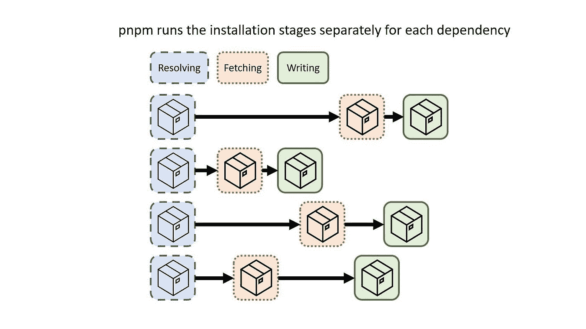

# 使用 PNPM 将 React 应用中的磁盘空间减少 60%

> 原文：<https://javascript.plainenglish.io/reduce-disk-space-in-reactjs-app-by-60-using-pnpm-5e2c5e19a6b6?source=collection_archive---------4----------------------->

## 关于在 React 应用程序中使用 PNPM 减少磁盘空间的教程。


Photo by [NordWood Themes](https://unsplash.com/@nordwood?utm_source=unsplash&utm_medium=referral&utm_content=creditCopyText) on [Unsplash](https://unsplash.com/@nordwood?utm_source=unsplash&utm_medium=referral&utm_content=creditCopyText)

您是否正在处理多个具有共同依赖关系的 React 项目？如果是这样，那么这篇文章是给你的。

当处理多个项目或微前端应用程序时，您需要在每个项目上安装相同的依赖项，例如，如果您处理 5 个基于 React 的项目，所有项目都具有相同的依赖项版本，并且每个项目都有节点模块文件夹，这将占用大量的磁盘空间。

我们可能会从中得到一些问题。

1.  为什么同一个依赖项安装了多次却没有重用？
2.  当处理多个具有相同依赖关系的项目时，如何节省磁盘空间？
3.  如何加速依赖项的安装？

在本文中，我们可以看到如何使用 pnpm 解决这个问题。

# 什么是 PNPM？

**pnpm** 代表性能 npm。它是基于 NodeJS 的项目的包管理器。主要关注速度和处理磁盘空间的有效方式。它是“npm”和“yarn”的替代词。

# 突出

1.  快的
2.  高效的
3.  支持 Monorepos

# PNPM 的效率如何？

Pnpm 非常高效地处理磁盘内存。让我们看看怎么做。

pnpm 将依赖项保存在您机器上的一个**全局存储库**中，在项目和依赖项之间创建一个硬链接。所以确切的**依赖关系**在项目之间**共享**，节省了大量空间。在 npm 中，它还会复制相同的依赖项，并将它们保存在特定于项目的节点模块中，这增加了存储空间。

# PNPM 使用非平面目录

默认情况下， **pnpm** 在全局存储和项目节点模块之间创建一个符号链接。但是你可以看到节点模块为每个项目占用了磁盘空间。

这是由于[硬链接](https://unix.stackexchange.com/questions/88423/why-do-hard-links-seem-to-take-the-same-space-as-the-originals)，硬链接指向原始文件所在的相同位置。但是对于一个版本，在内存中只保存依赖关系的一个副本。参考下图:


pnpm file structure

# 让我们看一个实时的例子

**每个 React 应用的常见依赖关系**

```
"dependencies": {
"[@testing](http://twitter.com/testing)-library/jest-dom": "5.16.5",
"[@testing](http://twitter.com/testing)-library/react": "13.3.0",
"[@testing](http://twitter.com/testing)-library/user-event": "13.5.0",
"react": "18.2.0",
"react-dom": "18.2.0",
"react-scripts": "5.0.1",
"web-vitals": "2.1.4"
}
```

# 使用 NPM 配置的项目


磁盘总容量: **1260 MB**

# 使用 PNPM 配置的项目


*注意:所有的依赖项都将放在全局存储中，而不是单个项目中。上表是为了区分。*

磁盘总容量: **500 MB**

公共依赖项放在全局存储中，由项目访问。根据上面的例子，常见的依赖项有 **380MB** 。根据上面的例子，我们可以看到，通过高效地使用“pnpm ”,我们节省了 60%的磁盘空间。

# PNPM 更快

与其他依赖项管理器相比，pnpm 速度更快，因为它在安装中没有阻塞阶段。每个依赖项都有自己的阶段，通过单独安装每个依赖项，下一个阶段会尽快开始。



pnpm dependency

# 基准

基准是由 [pnpm 官方文档](https://pnpm.io/benchmarks#lots-of-files)使用这个[包. json](https://github.com/pnpm/pnpm.github.io/blob/main/benchmarks/fixtures/alotta-files/package.json) 给出的。


benchmarks

# 装置

## 使用 NPM

我们可以通过以下命令使用 npm 全局安装 pnpm:

```
npm install -g pnpm
```

## 使用自制软件

我们可以用下面的命令安装自制软件:

```
brew install pnpm
```

# 作为独立脚本安装

**使用卷曲**

```
curl -fsSL [https://get.pnpm.io/install.sh](https://get.pnpm.io/install.sh) | sh -
```

**使用 wget**

```
wget -qO- [https://get.pnpm.io/install.sh](https://get.pnpm.io/install.sh) | sh -
```

**使用 PNPM 创建 React 应用**

我们可以使用下面的命令来配置 React 应用程序:

```
pnpm create react-app my-pnpm-app
```

# 常见命令

`pnpm install` - >从 package.json 安装依赖项

`pnpm add` - >添加依赖关系

`pnpm run` - >运行 package.json 文件中的脚本

`pnpm test` - >在项目中运行测试

`pnpm init` - >创建一个 package.json 文件

`pnpm publish` - >将包发布到注册表

`pnpm start` - >运行 package.json 中的命令启动 app。

# 结论

**pnpm** 比 npm 和 yarn 更快，处理磁盘内存的效率更高。当处理多个项目和微前端应用程序时，这给了我们很多自由空间。将依赖关系放在全局存储上并重用它更有效，这是其他包管理器所没有的。

感谢您的阅读。

*更多内容请看*[***plain English . io***](https://plainenglish.io/)*。报名参加我们的* [***免费周报***](http://newsletter.plainenglish.io/) *。关注我们关于*[***Twitter***](https://twitter.com/inPlainEngHQ)[***LinkedIn***](https://www.linkedin.com/company/inplainenglish/)*[***YouTube***](https://www.youtube.com/channel/UCtipWUghju290NWcn8jhyAw)*[***不和***](https://discord.gg/GtDtUAvyhW) *。对增长黑客感兴趣？检查* [***电路***](https://circuit.ooo/) *。***