# 减小 Next.js 应用程序的 Docker 图像大小

> 原文：<https://javascript.plainenglish.io/reduce-docker-image-size-for-your-next-js-app-bcb65d322222?source=collection_archive---------4----------------------->

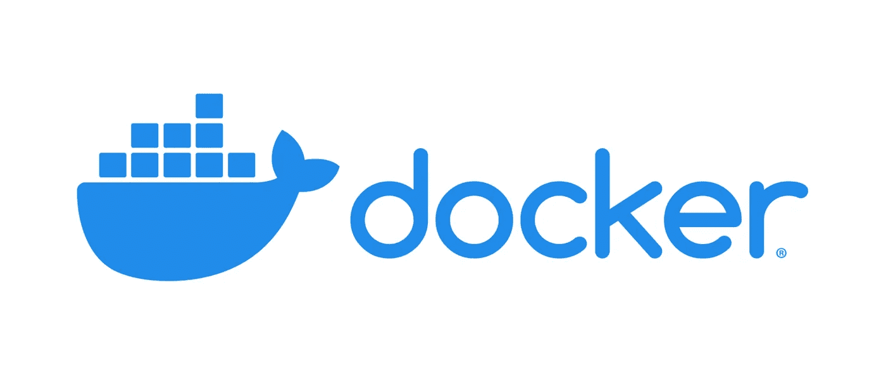

# 介绍

首先，我希望你知道 Docker 是什么，但如果你不知道:

> Docker 是一个开发、发布和运行应用程序的开放平台

你可以花时间[了解一下](https://docs.docker.com/get-started/overview/)

另一方面，NextJS 是一个灵活的 React 框架，它为你提供了构建快速 web 应用的基础。

# 将你的应用归档

在我们优化任何东西之前，我们必须首先对应用程序进行 dockerize。假设我们的应用程序名为`my-space`。从以下内容开始:

创建`Dockerfile`:

```
touch Dockerfile
```

忽略`dockerignore`中不必要的文件:

```
node_modules
.next
.vscode
.gitignore
README.md
.dockerignore
.git
```

将它归档:

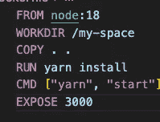

这是关于如何对你的应用程序进行 dockerize 的最基本的例子，现在让我们用:

```
docker build -t my-space .
```

现在看看大小:

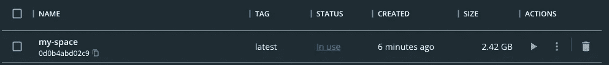

**太疯狂了，2.42gb！！**

难以置信的权利，我们不能发表这个图像，它太沉重了！

# 缩小图像尺寸

## 使用阿尔卑斯山

Node.js Docker 团队维护一个`node:alpine`图像标签及其变体，以将 Alpine Linux 发行版的特定版本与 Node.js 运行时的版本相匹配。原始版本大小约为 1gb。

现在我们将转向`alpine`版本:

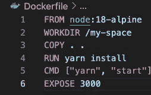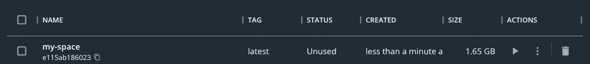

现在尺寸缩小到了 **1.65gb，比**小了 800mb。这是一个好的开始！

## 多阶段构建

多阶段构建对于那些努力优化 docker 文件同时保持它们易于阅读和维护的人来说非常有用。

我们将在`Dockerfile`中创建 2 个阶段。我将称之为`builder`和`runner`

通过这种方式，我们可以删除映像中不必要的文件:

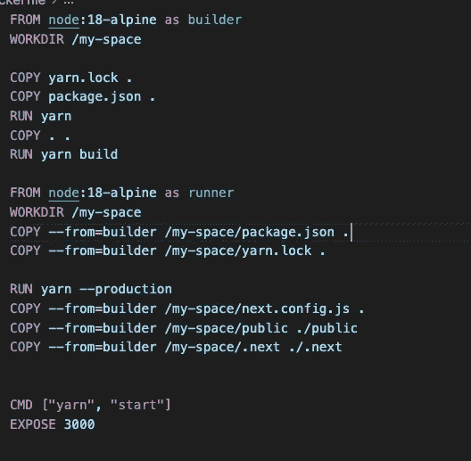

我们将从`builder`中挑选文件，并将其移动到我们最终将使用的`runner`

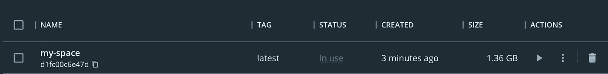

大小下降到 **1.36gb，约 300mb 小，我们做得很好！**

## 移除重复层

你可以看到有东西在复制。是的，我们为每个阶段安装了两次依赖项。虽然这种工程和项目规模仍然是一样的。由于缓存和图层的原因，图像尺寸仍然很大。

所以我们可以在构建阶段选择`node_modules`:

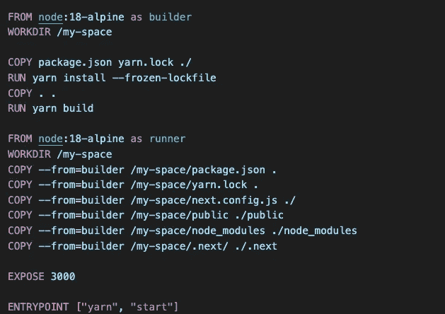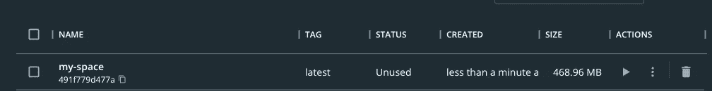

对于一个 NextJS 应用程序来说，现在的大小相当不错，**低于 500mb**

但是我们还可以让它变轻！

# 输出文件跟踪

在构建期间，Next.js 将自动跟踪每个页面及其依赖项，以确定部署应用程序的生产版本所需的所有文件。

此功能有助于大幅降低部署规模。以前，当使用 Docker 部署时，您需要安装软件包`dependencies`中的所有文件来运行`next start`。从 Next.js 12 开始，您可以利用`.next/`目录中的输出文件跟踪来只包含必要的文件。

在您的`next.config.js`文件中，启用独立输出

```
experimental: {
    outputStandalone: true,
  },
```

这将在`.next/standalone`创建一个文件夹，然后可以在不安装`node_modules`的情况下自行部署。

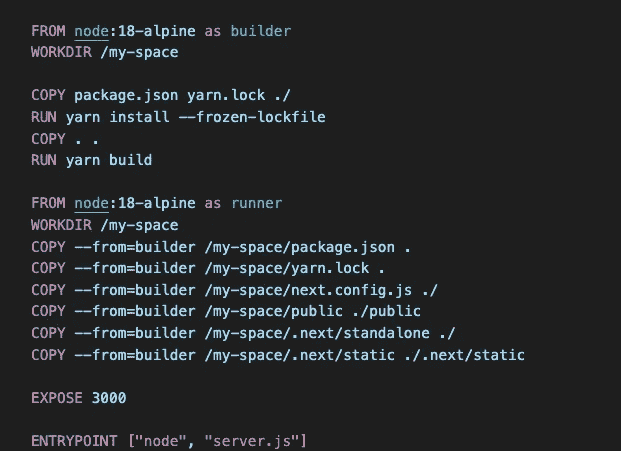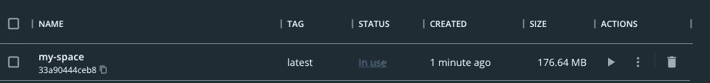

大小现在是 **176mb！对大多数情况来说足够小**

# 结论

这只是一个关于如何优化 docker 图片大小的简单例子，你可以在 Docker 文档中找到最适合你的应用的处理方法！

## 更多内容请访问 [PlainEnglish.io](https://plainenglish.io/) 。

报名参加我们的 [**免费每周简讯**](http://newsletter.plainenglish.io/) 。关注我们 [**推特**](https://twitter.com/inPlainEngHQ) ，[**LinkedIn**](https://www.linkedin.com/company/inplainenglish/)**，**[**YouTube**](https://www.youtube.com/channel/UCtipWUghju290NWcn8jhyAw)**，** [**不和谐**](https://discord.gg/GtDtUAvyhW) **。**

## 对扩展您的软件启动感兴趣吗？检查[电路](https://circuit.ooo/?utm=publication-post-cta)。

我们提供免费的专家建议和定制解决方案，帮助您建立对您的技术产品或服务的认知和采用。