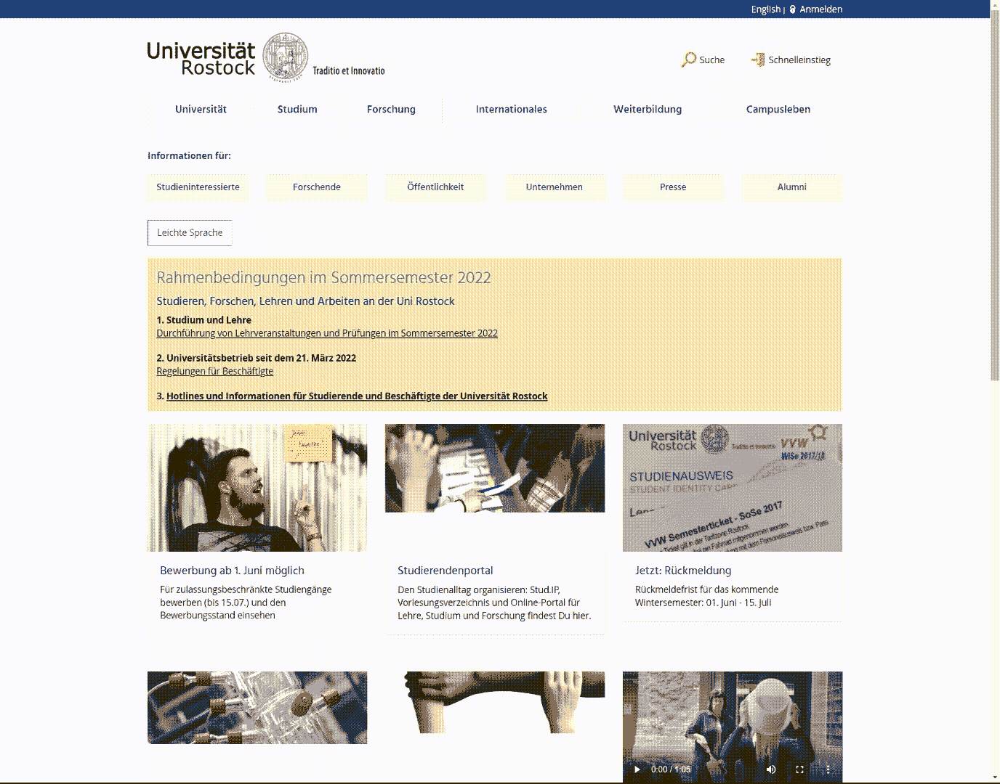
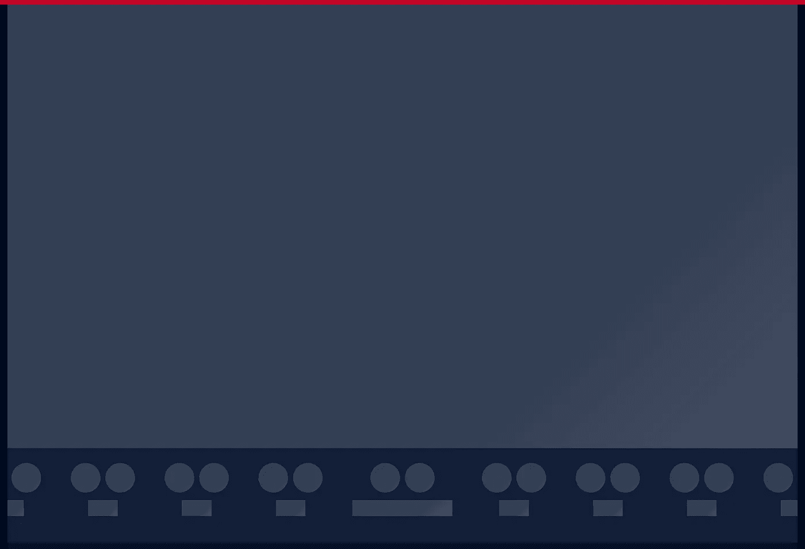
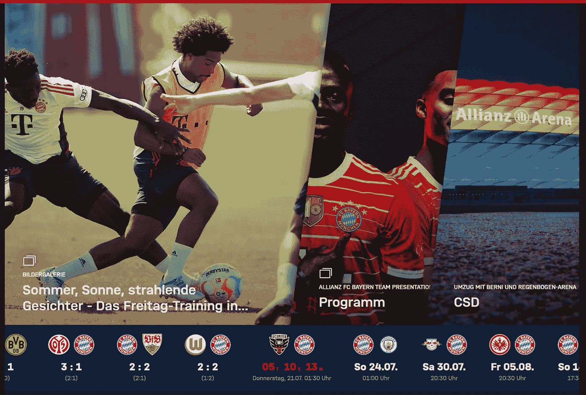

# 减少布局偏移

> 原文：<https://javascript.plainenglish.io/reduce-layout-shifts-5355c74eea1f?source=collection_archive---------12----------------------->

如何减少你网站的布局偏移？


Photo by [Lindsay Henwood](https://unsplash.com/@lindsayhenwood?utm_source=medium&utm_medium=referral) on [Unsplash](https://unsplash.com?utm_source=medium&utm_medium=referral)

布局变化令人讨厌，并导致糟糕的用户体验。如果你不知道什么是布局偏移，看看这个 gif，把注意力放在页眉部分。一旦它被加载，它将“推倒”其他所有东西。



Layout Shift on [https://www.uni-rostock.de/](https://www.uni-rostock.de/)

## 什么导致了布局的改变？

布局变化有一些突出的原因。当你再次看 gif 时，这就是所谓的动态内容(一个滑块)。文本和背景图像一加载，内容就会弹出，导致布局变化。布局变化的主要原因是

*   动态内容
*   图像、iFrames、广告等等
*   字体
*   动画片

布局偏移并不总是不好的；有时，它们甚至是有意的。它们有助于表明事情已经发生了变化。然而，你应该避免不可思议地改变布局，尤其是在折叠上方。根据经验:预期的布局变化来自用户交互。

## 如何避免动态内容的布局偏移？

拥有动态内容意味着您最有可能等待一个获取发生。有几种方法可以解决这个问题。一种可能是使用服务器端呈现，这样就可以在将 JavaScript 提交给浏览器之前进行提取。解决这个问题的另一个流行方法是使用框架组件。看一看[https://fcbayern.com/](https://fcbayern.com/)

他们正在使用占位符。



Placeholder at fcbayern.com

直到实际内容到达，并且他们用实际内容替换框架



The actual content of fcbayern.com

想法是提供一个与实际内容尺寸相同的占位符。即使它们不是相同的尺寸，这至少会减少偏移，并且不会导致硬切割。

有时，您甚至不需要依赖外部获取就能实现转变。请注意，您正在向用户发送大量的 JavaScript，尤其是在单页面应用程序(SPA)中。这也很吸引人；它是否会导致布局变化取决于您选择的架构和文件的大小。例如，如果您的模块捆绑器将 base64 图像字符串添加到 JavaScript 文件中，您可能就完蛋了。

## 如何处理图像引起的布局偏移？

图像是所谓的“替换元素”(像 iframes、视频、对象等等)。不幸的是，浏览器很难为替换的元素保留合适的空间，因为它们的内容在呈现之前是未知的。

幸运的是，处理图像标签很容易。只需向元素添加宽度和高度属性。浏览器知道图像的可用宽度，并通过长宽比计算出正确的高度。

我们可以对背景图像使用相同的技术。CSS 支持`aspect-ratio`属性。将它与对象适合度和宽度相结合是一个好主意，因此不管设备的实际尺寸如何，图像仍然使用整个空间

```
.my-img {
  aspect-ratio: 16 / 9;
  width: 100%;
  object-fit: cover;
}
```

## 如何处理字体引起的布局偏移？

字体…很难。它们往往很大，会导致各种各样的 UI 问题。两个突出的问题是 FOUT(非样式文本的闪现)和 FOIT(不可见文本的闪现)。这两种情况都会导致你的布局发生变化。

使用自定 web 字体时，您应该采取两个操作:

1.  为字体设置一个`<link rel="preload" ...>`。这将增加字体更早加载的机会。
2.  添加`font-display: optional;`

预加载可选字体将导致渲染受阻(大约 100 毫秒，因此您仍然应该注意字体足够小，可以在此阈值内下载)。但是，如果在阈值期间没有加载，网站将加载回退字体。因此，无论如何不会导致任何无样式或不可见字体的闪烁。

## 如何处理动画引起的布局偏移？

有些动画是使用像`top`、`margin`或`background-color`这样的属性构建的。请注意，更改这些属性的成本很高，甚至会导致重新计算布局。然而，除了变换和不透明度**之外的任何属性都将**触发重画。

因此，应该通过变换来改变位置。如果你必须触发重绘，你可以通过提升*需要*改变的部分来最小化重绘的元素数量。这个提升可以用`transform: translateZ(0);`或者`will-change: transform;`来完成。这将使你的元素呈现在一个新的复合层上，从而导致更高性能的重画。但是，请谨慎使用这种技术，因为层也会消耗计算能力。

就这些了，伙计们！这些技术将帮助您减少项目中的布局变化！你在你的项目中遇到过这些问题吗？你是怎么解决的？

感谢您的阅读！如果你想要更多这样的文章，一定要留下掌声、评论或关注，让我知道！

*更多内容请看*[***plain English . io***](https://plainenglish.io/)*。报名参加我们的* [***免费周报***](http://newsletter.plainenglish.io/) *。关注我们关于*[***Twitter***](https://twitter.com/inPlainEngHQ)*和*[***LinkedIn***](https://www.linkedin.com/company/inplainenglish/)*。查看我们的* [***社区不和谐***](https://discord.gg/GtDtUAvyhW) *加入我们的* [***人才集体***](https://inplainenglish.pallet.com/talent/welcome) *。*