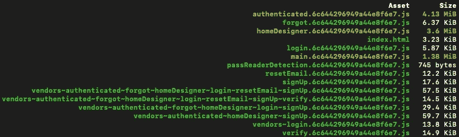
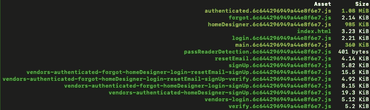

# 通过压缩将您的 React 应用捆绑包大小减少 75%

> 原文：<https://javascript.plainenglish.io/reduce-your-react-applications-bundle-size-by-75-with-compression-e0103abe9b69?source=collection_archive---------0----------------------->


每个 React 开发人员都应该在他们的捆绑过程中增加压缩。

减少 React 应用程序包大小的最有效技术之一是压缩。

*压缩是通过对文件数据进行重新编码以使用比原始文件更少的存储位来减小文件大小的过程。*

压缩通常是通过像 Rollup 或 Webpack 这样的 JavaScript bundler 实现的。在本文中，我将展示如何用 Webpack 实现压缩。

*本文假设读者对 Webpack 及其配置有基本的了解。*

首先，让我们看看未压缩时我的应用程序包大小:



我的应用程序使用代码分割，所以我有比现成配置更多的文件。

**添加压缩**

首先要做的是安装 [Webpack 压缩插件](https://webpack.js.org/plugins/compression-webpack-plugin/)

```
yarn add compression-webpack-plugin -Dornpm install compression-webpack-plugin --save-dev
```

安装完成后，将插件导入 webpack.config.js

```
const CompressionPlugin = require("compression-webpack-plugin")
```

接下来，将插件添加到插件数组中

```
plugins: [ ...other plugins, *new* CompressionPlugin({ test: /\.js(\?.*)?$/i, filename: "[path][query]", algorithm: "gzip", deleteOriginalAssets: false, }),],
```

对于包括的项目:

**测试:**包括所有通过测试断言的资产。

**文件名**:目标资产文件名。

**算法**:压缩算法/函数。

**deleteOriginalAssets** :是否删除原有资产。

我建议查看所有可用选项的 Webpack 文档。

**完整网络包配置:**

一旦配置就绪，您所要做的就是像平常一样运行您的构建。您的构建文件夹中的文件将显著变小。

在我的例子中，包含的每个 JavaScript 文件都比原始文件小 75%。



**最终注释**

为了让浏览器读取压缩文件，它们必须包含标题:

```
Content-Encoding: gzip
```

如果没有这个头文件，您的浏览器会试图将这些文件作为普通的 JavaScript 文件读取并崩溃。

当它们在 s3 上传到我的 CDN 时，我将这些头添加到每个文件中。

```
aws s3 sync --delete ./dist s3://${S3_BUCKET}${BRANCH_NAME} --content-encoding gzip
```

你的情况可能有所不同，但指出这一点很重要。

*更多内容请看* [***说白了就是***](http://plainenglish.io/) *。报名参加我们的* [***免费每周简讯***](http://newsletter.plainenglish.io/) *。在我们的* [***社区***](https://discord.gg/GtDtUAvyhW) *获得独家获得写作机会和建议。*