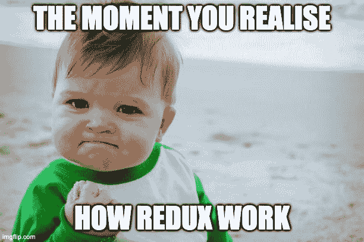
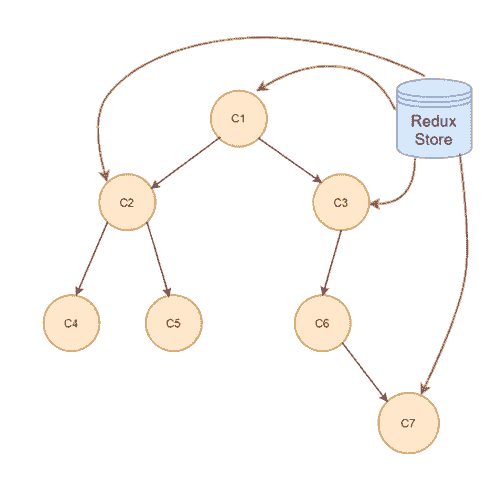
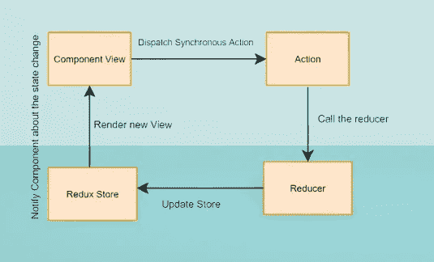
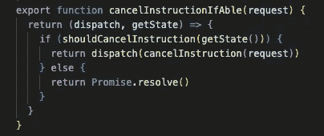
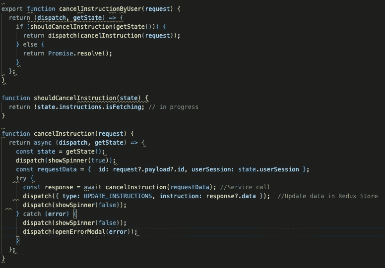
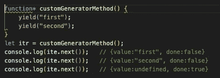

# Redux Thunk vs Redux Saga:你需要知道的一切

> 原文：<https://javascript.plainenglish.io/redux-thunk-vs-redux-saga-all-you-need-to-know-ecb06eb7e34e?source=collection_archive---------5----------------------->

## 您需要了解的关于 Redux Thunk 和 Redux Saga 的一切，以便为您的项目选择正确的 React 中间件。

在过去，我一直在我的项目中使用 Redux Thunk，但最近我开始接触 Redux Saga，发现它最初有点让人不知所措。但是我越理解它，就越开始欣赏它。因此，我想写这篇文章来教育和通知那些尝试 Redux Saga 或试图选择正确的 React 中间件的人。



## **为什么 Redux？**

随着项目规模的扩大，在组件之间传递数据总是一件痛苦的事情，因此 Redux 通过拥有一个 Redux store 来拯救您，它是您的组件的唯一真实来源。可以把它想象成一个单独的数据类，这样每个组件都可以访问相同的数据，一个组件所做的任何更改都会反映到所有其他组件中。



Redux 通常会用到以下东西:

*   行动
*   还原剂
*   动作创作者/工人传奇
*   Redux 商店

Redux 的工作方式如下图所示:



## **什么是 Redux Thunk？**

Redux Thunk 是一个使用动作创建器的中间件。这些动作创建者返回一个函数(thunk ),该函数将商店的分派方法作为参数，并在 API 或副作用完成后使用该方法分派同步动作。

下面是一个使用 thunk 的动作创建器的简单例子。它接受 dispatch 和 getState 作为参数，然后稍后触发一个操作。



## 【Redux Thunk 是如何工作的？

下面是 Redux-Thunk 如何工作的逐步过程:

1.  *检查输入动作是什么:*

如果是常规动作对象，Redux Thunk 不做任何事情，动作对象由存储的 reducer 处理。

2.如果动作是一个函数，Redux Thunk 调用它并将其传递给存储的 dispatch 和 getState 方法以及任何额外的参数(例如，Axios)。

3.函数运行后，thunk 会调度动作，动作会相应地更新状态。

下面是它的一个小例子:



## **什么是 Redux Saga？**

Redux Saga 也是一个中间件库，帮助我们处理 API 调用或副作用。Redux Saga 使用了一个名为“生成器”的 ES6 功能，它可以帮助我们编写异步代码，并且它还使用工人 Saga 而不是动作创建者。

**生成器**是 ECMA 脚本 6 附带的函数。使用它们最好的一点是，生成器函数可以在执行过程中暂停，甚至可以退出，以后再重新进入。下面是生成器方法的语法:

```
*function* functionName() {}*
```

生成器方法是一个迭代器，所以它有一个内置的 next()方法。当您触发 next()时，会调用下一个 yield 方法，该方法会返回一个值和一个 done 属性，该属性会告诉您上一个 yield 是否已被调用。这样你就可以用一种更加可控和同步的方式来控制执行。下面是一个生成器方法如何工作的小例子:



## 【Redux Saga 是如何运作的？

Redux Saga 监听分派的动作，并触发 API 调用或您编写的任何其他副作用。它在动作到达你的 reducer 之前就捕获了它，所以在 Redux 状态设置之前你可以做任何你想做的事情。因为它在 reducer 之前捕获它，所以一旦你完成了你的工作，比如 API 调用等等。，您调度另一个动作，reducer 现在将监听从该动作调度的这个动作。

***注意:*** *理想情况下，我们不应该使用 saga 监听和调度的相同动作，因为这可能会导致下游出现问题。*

现在 Saga 提供了多种触发动作的方式，最常见的是 **put:**

```
yield put({ type: 'SET_LOADING', isLoading: true });
```

在这里，您也可以使用**调用来调用服务:**

```
yield call(searchRequest, { data: { searchBody } });
```

Redux Saga 还提供了多种现成的解决方案来监听每个动作，只监听最后一个动作，等等。你可以在这里阅读它们[。](https://redux-saga.js.org/docs/api/)

```
yield takeEvery('UPDATE_STATUS', updateStatus);
yield takeLatest('UPDATE_STATUS', updateStatus);
yield takeLeading('UPDATE_STATUS', updateStatus);
yield takeMaybe('UPDATE_STATUS', updateStatus);
```

## 【Redux Thunk 和 Redux Saga 的区别


1 — Thunk 使用回调方法，而 Saga 几乎使用一个单独的线程，您可以很好地控制它。因此，如果您在 thunk 中不使用异步 await，您可能会陷入回调地狱，而 saga 没有这个问题。

2-在 Thunk 中，动作创建者可能持有大量逻辑，因此开始变得复杂和不纯，而在 Saga 中，工人 Saga 只负责 API 调用等副作用。

3-Saga 使用一种称为发电机的 ES6 概念。简单地调用一个生成器方法不会触发该方法，而是需要调用 next()来按顺序触发各种产出。Thunk 没有这些问题，因为它不使用迭代器或生成器。

4 —使用 Saga，您可以更容易地测试您的异步数据流。call 和 put 方法返回 JavaScript 对象。因此，您可以通过等式比较简单地测试您的 saga 函数产生的每个值。另一方面，Redux Thunk 返回的是承诺，更难测试。测试 Thunks 通常需要对 fetch API、axios 请求或其他函数进行复杂的模拟。有了 Redux Saga，你不需要模仿用效果包装的函数。这使得测试变得清晰、易读、易于编写。

## **两者之间如何选择**


这两种中间件各有优缺点。现在来看如何选择使用哪种中间件是非常主观的，但是您可以在决定时记住一些事情。

*   如果你的项目是小型到中型的，Thunk 会很好的工作，因为动作创建者不会做太多的工作，它会保持轻量级。
*   **Thunk** 自带的样板代码较少，所以如果担心包的大小，Thunk 是更好的选择。
*   **Saga** 需要更多的学习曲线，因为它使用了更新的概念，如*生成器方法*，这可能会让一些人一开始就感到困惑。
*   **Saga** 确实提供了许多现成的方法来处理各种问题，这些问题需要在 thunk 架构中进行大量的编码，例如，如果在短时间内多次触发相同的操作，例如刷新按钮，假设使用 Saga，您可以使用 *takeLatest* 并仅处理最新的操作，而在 thunk 中，您需要跟踪状态以了解现有的刷新是否正在进行，然后阻止更新的请求。
*   另外， **Saga** 更容易测试，因为 Saga 文件只处理 API 调用等副作用。因此相对更容易测试，而 Thunk 中的动作创建者会有很多逻辑。

## **结论**

这两种中间件各有优缺点。您可以根据需求和上面提到的两个中间件之间的差异来决定哪一个适合您。

当谈到编码时，通常没有错误的答案，你可以使用任何东西完成几乎任何事情。唯一要考虑的是带宽和截止日期，所以要明智地选择。

如果你喜欢这篇文章，也可以看看我的其他文章:

[](/all-about-importing-methods-in-javascript-d8d84fbd30d3) [## 关于在 JavaScript 中导入方法的所有内容

### 知道在什么情况下使用什么语法。

javascript.plainenglish.io](/all-about-importing-methods-in-javascript-d8d84fbd30d3) [](https://medium.com/geekculture/jss-or-css-what-to-use-and-why-829dc117a5ba) [## JSS 或 CSS…用什么，为什么？

### 如果你们没有听说过 JSS，它的 CSS 是 JS 风格的。它真的很受欢迎，并且在几个月内非常方便…

medium.com](https://medium.com/geekculture/jss-or-css-what-to-use-and-why-829dc117a5ba) [](/must-know-javascript-features-in-2022-80c0655a6e98) [## 2022 年必知的 JavaScript 特性

### 使用这些功能，您可以减少代码并使其更具可读性。

javascript.plainenglish.io](/must-know-javascript-features-in-2022-80c0655a6e98) 

*更多内容请看*[***plain English . io***](https://plainenglish.io/)*。报名参加我们的**[***免费周报***](http://newsletter.plainenglish.io/) *。关注我们关于* [***推特***](https://twitter.com/inPlainEngHQ) ， [***领英***](https://www.linkedin.com/company/inplainenglish/) *，*[***YouTube***](https://www.youtube.com/channel/UCtipWUghju290NWcn8jhyAw)*，以及* [***不和***](https://discord.gg/GtDtUAvyhW) *。**