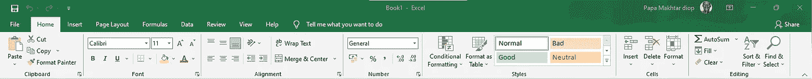
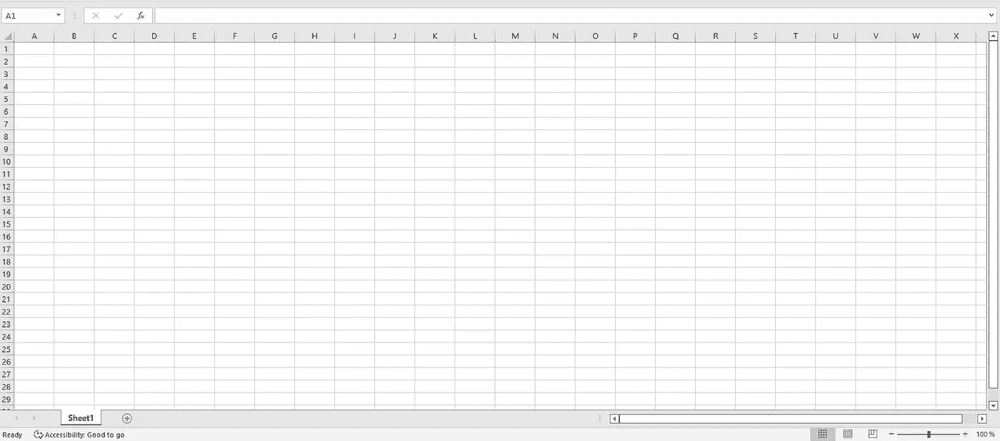
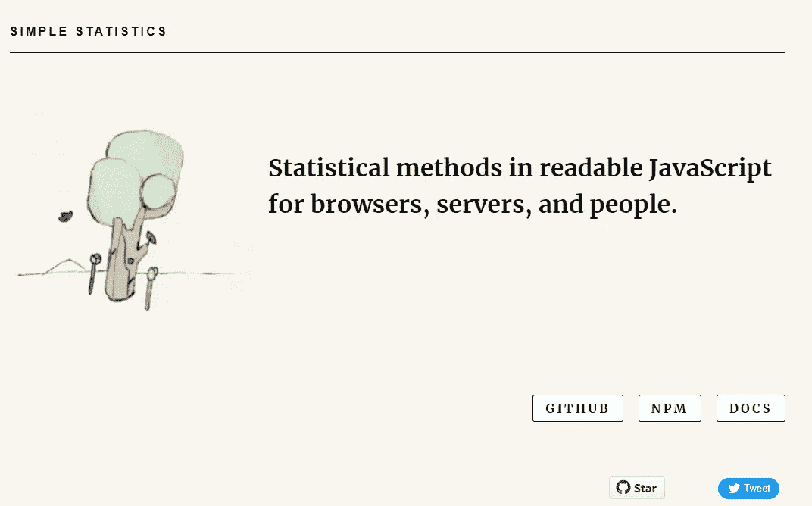
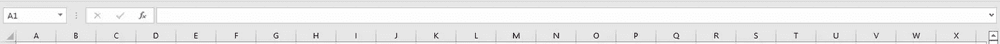
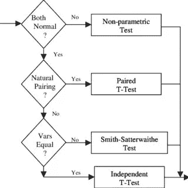
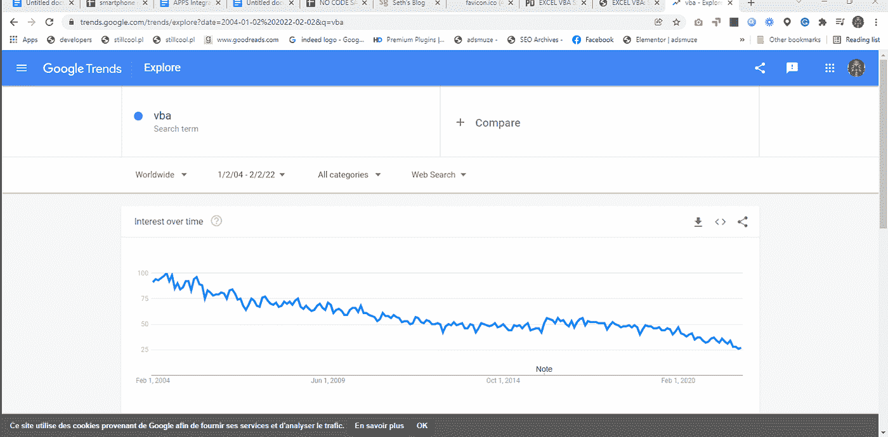
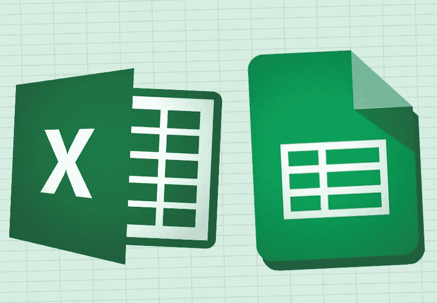

# 用 JavaScript 重新设计微软的 Excel 来代替 VBA

> 原文：<https://javascript.plainenglish.io/reengineer-microsoft-excel-with-javascript-for-a-no-code-alternative-to-vba-29aaa816de40?source=collection_archive---------12----------------------->

## 如何使用 JavaScript 构建 VBA 的无代码替代方案

Microsoft Excel

对于 JavaScript 开发人员来说，用 JavaScript 重建整个 Excel 体验，使其能够与任何类型的浏览器(如 Microsoft Edge、Chrome 或 Safari)一起工作是一项有趣的练习，如果这个解决方案还包括一个无代码模块，允许任何人在不了解 VBA 内外的情况下制作复杂的电子表格，那么这个解决方案可能会被专业人士采用。

使用 React、Angular、Vue.js 或 svelte 等前端解决方案，对于熟练的前端软件工程师来说，重建 Excel 的用户界面非常容易，因为我们可以将用户界面分解为组件。分解成内容 excel 由 Ruban 和表格查看器组成，它保存电子表格的行和列，而 ribbon 将保存一组按钮和输入字段，允许用户执行 Excel 提供的许多操作，如修改单元格内容的格式或应用公式。

The Ribbon Component

Table viewer component of the JavaScript spreadsheet solution

由于将执行以单元格的值作为参数的操作，因此所有这些单元格都将被视为变量，前端解决方案应该能够将这些单元格识别为表格查看器组件的子组件，并且所有这些单元格都应该用独特的想法来识别。

如果您正在使用 React，那么在组件属性中引入唯一的 ID 是必需的，因为 React 使用虚拟 DOM 和浏览器 DOM 之间的差分操作来帮助它跟踪更改，但是在我们的解决方案中，这个唯一的 ID 将帮助我们跟踪构成电子表格的每个单元格的值。唯一 UI 组件 ID 的相同想法也适用于我们的 excel 前端解决方案的行和列，就像 Excel 已经使用数字和字母来标识这些行和列一样。

当谈到统计公式时，您可以通过自己编写 Excel 提供的所有统计方法来重新创建轮子，但是通过使用其他 JavaScript 开发人员已经完成的工作来利用开源的力量将使您走得更快，并且 [simplestatistics](https://simplestatistics.org/) 这个 JavaScript 统计库可能是一个好的解决方案。

您的 ribbon 组件将被分解为多个子组件，其中一个子组件将允许您输入统计公式，这些公式将通过您已经实现的 JavaScript 统计库来实现。

The subcomponent for imputing formulas

就像困惑一样，你将把几个解决方案粘在一起，最终目标是拥有微软所有可用的特性，我希望你能看到，对于像你这样的优秀 JavaScript 开发人员来说，所有这些并不那么困难。但是你可能会问为什么要用 JavaScript 重建 Microsoft Excel？我最简单的回答是，这将使你成为一名更好的软件工程师，并帮助你在大型科技公司和初创公司找到一份非常好的工作，但另一个答案是，浏览器能够独立运行 Word 和 Microsoft Excel 等软件很重要。

对于微软的 Word，如果你是一个像我一样的媒体写作者，你会发现媒体的编辑器就像一个用 JavaScript 开发的文字处理器。但是，我为您提供的这一原创性和创造性练习的最重要部分是无代码模块，该模块将允许这一 JavaScript 支持的 Excel 解决方案的未来用户能够使用图形工具实现复杂的电子表格操作，该图形工具允许拖放统计操作以及计算和分析流程，这些流程将在后面运行，以处理保存在我们构建的 JavaScript 电子表格解决方案的不同单元格中的值。

这个统计流程图构建器将是你的 JavaScript Excel 解决方案的无代码模块，下面是如何使用图形流程图构建器设计统计程序，而不是像 VBA 那样使用代码。

对于这个 JavaScript Excel 解决方案的图表模块，我们都知道 JavaScript 在关于图表的库方面有多好。我们有一个庞大的图表库，如 D3、Chart.js 和其他，这将使您可以轻松地开发模块，该模块将负责允许用户从他们正在工作的电子表格中构建图表。

A professional working with a Spreadsheet

这种用 JavaScript 构建 Excel 的无代码模块的想法是一个非常有趣的创业，因为我们仍然有很多像我一样的电子表格用户，他们对利用低代码无代码功能的电子表格解决方案感兴趣。

根据下面的谷歌趋势图，即使 Excel 和 VBA 似乎没有以前那么受欢迎，但对于处理统计数据的专业人士来说，它仍然是一个非常重要的工具，如会计师、交易员、量化工程师和企业家，他们与数字打交道，以跟踪他们的商业价值链的表现。

VBA search trend since 2004

Logos of Microsoft Excel and Google Spreadsheet

像 Airtable 这样的解决方案是在考虑到这一重要性的情况下开发的，Microsoft Excel 和 Google Spreadsheet 都将其解决方案现代化，使其可以像 SaaS 一样访问，但这种无代码 Excel 版本的想法进一步推动了通过使用低代码无代码来更好地实现电子表格解决方案的趋势。

您可以使用集成解决方案，如 [Microsoft Flow](https://powerautomate.microsoft.com/fr-fr/) 或 [Zapier](https://zapier.com/) 让您的 JavaScript 电子表格解决方案从其他第三方 SaaS 解决方案获取数据，您也可以想象一个全新的无代码 Excell 宏市场，用户将向该 JavaScript 无代码电子表格解决方案的用户社区提供他们的统计模块。

自从本文开始讨论这个 JavaScript 驱动的电子表格解决方案以来，我们一直在谈论无代码，我实际上在问自己，我一直向你描述的这个电子表格解决方案是否可以使用现在的代码解决方案来开发，如[微软 PowerApps](https://powerapps.microsoft.com/en-us/) 或[谷歌 AppSheet](https://cloud.google.com/appsheet) 而不是 JavaScript？我不知道答案是什么，但我几乎可以肯定，在构建低代码无代码解决方案的新趋势下，您的 JavaScript 技能将具有重要价值。

**PS:** 我希望通过这篇关于 JavaScript 和低代码无代码的文章，你也能发现像谷歌和微软这样的大型科技公司是如何用他们自己的版本来应对流行的 SaaS 解决方案的。我将在接下来关于大科技领域竞争的文章中写下大科技领域的竞争动态。

*更多内容看* [***说白了。报名参加我们的***](http://plainenglish.io/) **[***免费周报***](http://newsletter.plainenglish.io/) *。在我们的* [***社区不和谐***](https://discord.gg/GtDtUAvyhW) *获得独家获取写作机会和建议。***