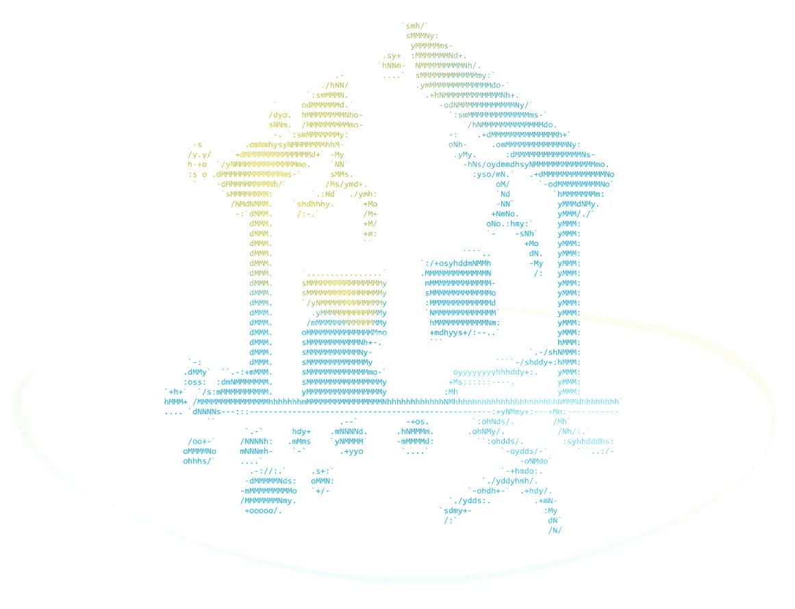
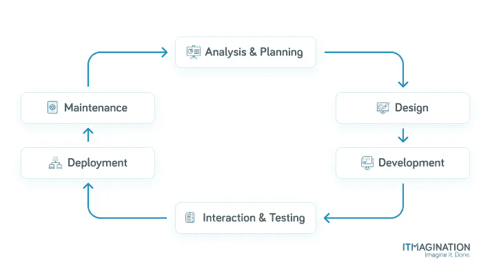

# 重构代码:耐心的练习

> 原文：<https://javascript.plainenglish.io/refactoring-code-an-exercise-in-patience-41d47e2a908f?source=collection_archive---------15----------------------->

尽管看起来管理软件过于复杂，但在某些方面，它类似于管理建筑。我们来探讨一个类比。

# 设置

假设你是你所在城市一栋新的多层建筑的经理。这是全新的，所以很自然，一切都处于最佳状态。

在未来的某个时候，第一批问题开始出现，尽管业务仍然进展顺利。人们仍然付房租，所以你继续。你看到了扩张的机会，所以你做了。你在旧的基础上建造了更多的楼层，因为在这个类比中这是可能的。更重要的是，你不断增加越来越多的楼层，而旧的部分开始崩溃。

由于你忽视了第一栋建筑的状况，管道开始漏水，所以你只是把所有东西粘在一起，然后就收工了。电线是危险的，尽管没有什么是适量的胶带解决不了的，对吗？冲洗，然后重复。

再次快进，您管理的资产开始变得比其他任何东西都更像磁带。在这一点上，该物业开始变得危险，尽管维修范围让你不知所措。事实证明，节省定期维修的时间和金钱并不经济。

尽管如此，人们仍然住在那里，因为核心目的得到了满足；他们头上有个屋顶，所以这很好，不是吗？假设这种情况会持续到很久以后，有一天你会面临一个选择:我是把一切推倒在地，重新开始，还是开始艰苦的翻新过程？当你开始深思熟虑的时候，房产开始成为一个定时炸弹；它看起来好像要倒塌了。

# 软件在这个类比中处于什么位置？

代码的情况也类似。正如“唯一不变的是变化”，我们在维护软件时有两种选择。您可能会:

*   不断地向现有代码添加特性，直到最后，一切都变得不可维护
*   不断修改系统，为当前的和**未来的**功能提供稳定的基础。

当然，从长远来看，更可取的做法是不断地修改现有的基础，以避免随着时间的推移积累问题——也许更重要的是，为了省钱。代码库最终需要修改，越晚开始，对你越不利。从现在开始，我们将使用动词“to refactor”而不是“to modify”。重构是在不改变产品功能的情况下，对产品内部状态的改进。

# 大揭秘

就开发软件的步骤或阶段而言，重构过程中发生的事情与第一次编写系统时发生的事情没有太大的不同。当然，除了那个细节，就是水火不容了。重构是在不改变外部功能的情况下进行内部修复，而不是拆掉所有东西，重新构建。

软件开发的阶段是由一个框架决定的，架构师和管理者已经遵循这个框架大约 60 年了(从 20 世纪 60 年代开始)。

这个框架就是系统开发生命周期(SDLC ),它描述了开发 IT 系统的过程。重要的是，该框架不会在未来的任何时候变得无关紧要，因为所有步骤最终都必须重复。

The Systems Development Lifecycle (SDLC)

整个过程看起来就像上面的图片描述的那样，当然也有例外。这一过程必须建立在个案分析的基础上。例如，经理们可能希望修改框架以更好地适应他们。

*如果您已经熟悉 SDLC，您可以跳到下一部分。*

## 分析和规划

在这里，团队将收集关于系统的信息，并计划整个操作应该如何进行。在解决一个具体问题时，更广泛的背景也很重要；在应对挑战时，组织更广泛的目标是相关的。

然后，我们可以开始定义我们运营的目标，并计划如何实现这些目标。此外，让真实用户(或潜在用户)参与进来，以便能够细化问题定义以及我们如何修复它，这是一件好事。

## 设计

这一阶段的全部内容是规划达成一致的解决方案。首先，团队制定一个总体计划，然后进行详细规划。

在设计阶段，所有必要的和相关的设计文件到达客户手中。我们收到的文档如此详细地描述了系统，以至于软件开发人员和工程师在开发产品时应该没有问题。

## 发展

这是“有趣”的部分。只有在第三阶段**中，实际的编码**才会发生。我们不想成为无头骑士。

## 集成和测试

在这个阶段，我们展示我们所创造的确实符合我们预先设定的需求和目标。

## 部署(实施)

我们差不多可以走了。然而，现在棘手的是。我们需要一步一步地部署我们的创造，同时检查是否一切都如预期的那样工作。如果之前的所有步骤都执行仔细，正确，应该是轻而易举的。当然，生活就是生活，在极少数情况下，事情不会像预期的那样发展。

## 维护

最后一步。我们需要定义为了保持一个健康的代码库而必须执行的任务。

当然，维护步骤通常是最长的一步。只要我们不决定添加新的特性或功能或改变现有的特性或功能，这个阶段就会持续下去。如果我们想增加/改变什么，我们再重复整个循环。

在这里，我们确保为当前和未来的功能打下良好的基础。

# 丑陋的真相

重写一个管理不当的软件不仅本身的难度很高；您也可能没有适当的文档，甚至没有人可以谈论过去实现的更改。

你或整个团队的士气会下降。虽然团队在努力工作，但业务优势往往只能在几个月甚至几年后才能看到。这并不是说我们要立即将一辆旧菲亚特升级为一辆新的梅赛德斯-奔驰。

尽管事实如此，也许令人失望，但最终的重构是必要的。代码需要更新和维护，就像机器一样。如果一个团队多年未能给机器上油，另一个团队将不得不在机器开始越来越频繁地出现故障并变成定时炸弹后进行必要的维修。

# 救援队

救援队也不能是一群“随机”的开发者。他们必须是精英中的精英，对编程语言和开发平台的旧部分有着罕见的迷恋。当然，他们编写的代码使用了所有最新的技巧和框架，尽管这只是他们工作的一部分。毕竟，他们主要是一头扎进一碗着火的旧意大利面条代码中。

负责组织每个人工作的经理们必须时刻掌握一切。首先，根据编程艺术，正确的改变并不总是好的。毕竟，客户在等待我们交付能够为他们的解决方案增加价值的东西——而不是让代码库“表面上”正确。

# 从此幸福快乐

一旦重构准备就绪，就到了关键时刻。部署后，应该不会出现问题，但是，有些问题自然会出现。偶尔会有文件丢失，设置正确的环境变量可能会有问题(出于配置目的)；版本控制可能会有问题，比如在不希望的时候覆盖文件，反之亦然，等等。

另一个困难是，有时必须在国外开发人员的帮助下进行生产部署——例如，由于敏感或机密数据而存在访问限制的情况。不完全是一个问题，虽然有时这可能是一个挑战。国外团队和公司工程师之间会产生误解。偶尔，他们会危及整个行动。

Magdalena Lewandowska 是今年一个大规模重构项目的一部分，为了深入了解这个过程，我与她进行了交谈。随着这一年即将结束，她和她的团队可以感到自豪:他们成功地完成了这一年。

*最初发表于*[*【https://www.itmagination.com】*](https://www.itmagination.com/blog/refactoring-code)*。*

*更多内容看* [***说白了. io***](http://plainenglish.io/) ***。*** *报名参加我们的**[***免费每周简讯***](http://newsletter.plainenglish.io/) ***。*** *在我们的* [***社区获得独家写作机会和建议***](https://discord.gg/GtDtUAvyhW) ***。****