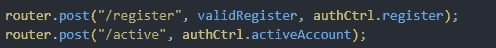

# Node.js 和 Google OAuth 2.0 Playground 的注册和激活

> 原文：<https://javascript.plainenglish.io/registration-and-activation-with-node-js-google-oauth-2-0-playground-3d734b33736d?source=collection_archive---------11----------------------->

## 关于用 Node.js、Express 和 TypeScript 创建的后端应用程序的身份验证部分的教程。

今天我想告诉你用 Node.js、Express 和 TypeScript 创建的后端应用程序的认证部分。我用 PostgreSQL 做数据库，用 prismaOrm 管理数据库。

我跳过了安装部分，现在开始主要部分。但是如果你想用 TypeScript 和 Prisma 实例化你的应用程序，你需要安装心爱的包。

*typescript，ts-node，express，nodemailer，google-auth-library，@prisma/client，prisma，pg，jsonwebtoken，bcrypt，@types/jsonwebtoken，@types/node，@ types/node mailler @ types/express，@typesbcrypy。*

安装完软件包后，我们需要启动 Prisma。你可以在这里找到更多关于如何启动 Prisma 的信息，在 [Prisma 网站](https://www.prisma.io/docs/getting-started/setup-prisma/start-from-scratch/relational-databases-typescript-postgres)。

`npx prisma && npx prisma init`

My Prisma Schema

现在首先让我们在 JWT 的帮助下创建激活令牌。我们需要一个激活令牌来检查用户的信息，以完成用户的注册。JSON Web Token 代替我们处理这个问题。首先，我们需要用 sign 方法创建一个令牌。它通常接受一个对象，该对象包含我们要签名的信息、要签名的私钥和过期时间。创建令牌后，我们将借助 JWT 验证方法，用我们的私钥验证该令牌。您需要将您的私钥保存到。环境文件。

generating Activation token

现在让我们编写邮件发送函数，这样我们就可以在注册后向用户发送一封激活邮件。

在编写函数之前，我们需要导入 nodeMailer 和 OAuth2Client。我们将从谷歌控制台获取凭据。首先，进入[谷歌控制台](https://console.cloud.google.com/)。然后，如果你还没有一个应用程序[，创建你的第一个应用程序。](https://console.cloud.google.com/projectcreate?previousPage=%2Fapis%2Fcredentials%2Foauthclient%2F547727143953-kf47baif2ufmfr3iuk6rcjqdnr3l5vsu.apps.googleusercontent.com%3Fproject%3Dsouresachen&organizationId=0)你可以在图片的右边部分看到下图中的凭证。

在你去谷歌认证之前。请确保您已经将[开发者的 Google](https://developers.google.com/oauthplayground/) 链接添加到您的应用程序中。

现在我们来看看[谷歌开发者](https://developers.google.com/oauthplayground/)。

Type your own user credentials from google consele

Please write the [http://mail.google.com](http://mail.google.com) and authorize APIs

Press Excange auth code for tokens and Take your refresh token from here

现在，将您的用户凭证和刷新令牌保存到。在发送邮件函数中使用的 env 文件。请查看下面 GitHub 链接中详细介绍的功能:

 [## soures achen/sendmail . ts at main em rekrt 1655/soures achen

### 此文件包含双向 Unicode 文本，其解释或编译可能与下面显示的不同…

github.com](https://github.com/emrekrt1655/soureSachen/blob/main/config/sendMail.ts) 

现在我们可以编写注册处理程序了。首先，我们需要检查我们的数据库给定的电子邮件是否存在。如果退出，我们需要返回一个消息，否则我们可以继续。然后，我们需要从用户那里获取所需的信息，如用户名、电子邮件和密码。我们需要加密给定的密码，因为将密码直接保存到数据库是不安全的。然后我们需要用给定的信息创建一个用户，这样我们就可以创建一个激活令牌。有了这个激活令牌，我们需要创建一个 URL，这样我们就可以发送请求来激活电子邮件。

Valid Email function

然后我们可以检查给定的电子邮件是否有效。如果有效，我们可以调用 sendMail 函数并给出电子邮件、URL 和消息参数。

Register handler

为了激活，我们需要 req.body 中的 active_token，然后我们需要在。env 文件，使用 JWT 的验证方法。在检查时，我们创建一个类似 decoded 的新对象，这样我们就可以从这个对象中拉出用户。然后，我们可以使用 prismaOrm create 方法保存用户，并向用户发送消息。

Active account handler

您可以通过下面的链接查看详细的代码:

 [## soures achen/auth ctrl . ts at main em rekrt 1655/soures achen

### 此文件包含双向 Unicode 文本，其解释或编译可能与下面显示的不同…

github.com](https://github.com/emrekrt1655/soureSachen/blob/main/controllers/authCtrl.ts) 

the routes for registering and activating account

在注册请求之后，注册处理程序返回一个激活令牌。您在注册处理程序中看到上面的一个 URL，(const URL = ` ＄{ CLIENT _ URL }/active/＄{ active token } `；)当我们向 api/active/token_active 发送请求时，我们将激活电子邮件。

您可以从下面的 GitHub 链接调用身份验证部分:

 [## GitHub - emrekrt1655/soureSachen

### 此时您不能执行该操作。您已使用另一个标签页或窗口登录。您已在另一个选项卡中注销，或者…

github.com](https://github.com/emrekrt1655/soureSachen) 

*更多内容请看*[***plain English . io***](https://plainenglish.io/)*。报名参加我们的* [***免费周报***](http://newsletter.plainenglish.io/) *。关注我们关于*[***Twitter***](https://twitter.com/inPlainEngHQ)*和*[***LinkedIn***](https://www.linkedin.com/company/inplainenglish/)*。查看我们的* [***社区不和谐***](https://discord.gg/GtDtUAvyhW) *加入我们的* [***人才集体***](https://inplainenglish.pallet.com/talent/welcome) *。*