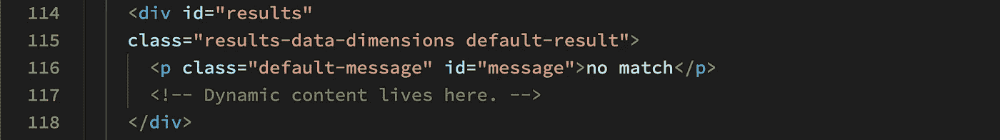

# 正则表达式—成年礼:完成应用程序

> 原文：<https://javascript.plainenglish.io/regular-expressions-a-rite-of-passage-completing-the-application-526589605075?source=collection_archive---------17----------------------->

## 第 3 部分:从基础设施到完整应用程序的构建


**Photo by** [**ThisisEngineering RAEng**](https://unsplash.com/@thisisengineering?utm_source=unsplash&utm_medium=referral&utm_content=creditCopyText) **on** [**Unsplash**](https://unsplash.com/s/photos/software?utm_source=unsplash&utm_medium=referral&utm_content=creditCopyText)

***欢迎回来！***

我们的时刻到了。我们现在准备完成我们在 [***正则表达式中开始的应用程序——一个通过的仪式:从理论到实践***](https://rhieger-98255.medium.com/regular-expressions-a-rite-of-passage-from-theory-to-practice-f4f23bec6044) ***。***

我们在本教程的第 2 部分中的**步骤 6** 处停止了，其中我们构建了应用程序的基础设施，提供了所有必要的**数据结构** 和**助手函数。**

完成应用程序还需要两个步骤。

1.  我们需要编写**回调函数**，这些函数将被第 2 部分**中提到的两个**事件监听器**使用。**
2.  我们需要编写**事件监听器**，它们将调用**回调函数**来执行它们的工作。

## 步骤 7:编写回调函数

让我们思考一下这些**回调函数**需要完成什么。我们知道它们作为**参数**被附加到两个**事件监听器**，一个监听**验证邮政编码**按钮上的**点击事件**，另一个监听**点击事件**上的****重置按钮。

在**第 2 部分的结尾，我们将从您代码中停止的地方开始。**

**图 1，下面的**显示了在**第 2 部分:**中下载的起始代码中剩余的相关行


**Fig 1\. Excerpt of Relevant Code in app.js Starter Code**

对于 **Validate Zip Codes** 按钮，我们需要一个**回调函数**，它将
与默认消息 **NO MATCH** 交换内容，并用有效邮政编码匹配的**滚动窗口**填充其**父节点**。

**populateResultBox()函数**
返回参考**图 1** ，用以下代码替换**第 65 行**(修改后的代码中的第 108 行)中的注释:

```
**const** populateResultBox = () => {

  **resultBox.classList.remove**('default-result');
  **resultBox.removeChild**(placeHolder);
  **resultBox.classList.add**('custom-scrollbar'); **createParagraphText();** // Create paragraphs and set textContent only
  // if not already created. Prevents doubling
  // of result data if old paragraphs have not
  // yet been garbage collected. **if** (**paragraphs.length** === 0) {
    **createParagraphs();**
  }// Append all result paragraphs to resultBox. **appendParagraphs**(resultBox, paragraphs);};
```

在这个函数中发生了很多事情，尽管在我们讨论**助手函数时已经分解了很多。尽管如此，这里仍然存在一些新概念。**

**前三行代码**是对 **DOM** 的操作，我们在本教程中还没有看到过。为了充分理解这三行代码，我们需要查看来自我们的 **HTML** 和 **CSS** 的一些代码片段。

**下面的代码清单 1** 显示了**结果框**引用的 **HTML** 元素:



**Code Listing 1\. HTML Elements Captured by resultBox**

您可能会从第 2 部分的**中回忆起以元素
`**<div id="getResults">**`开始的代码清单，它包含带有两个按钮
的整个小部件和带有**不匹配**消息的`**<p>**`元素，如上面的**清单 1** 所示。**

我们需要简单浏览一下 **CSS** 代码，以充分理解`**populateResultBox()**`正在改变什么。

看看下面的**代码清单 2** :


**Code Listing 2: CSS Class Controlling resultBox Background Color**

可以看到，`**.default-result**` 类指定了灰色背景。由于这个背景是将要填充`**resultBox**`的结果的占位符的一部分，我们想要清除它。

现在我们来看看`**populateResultBox()**` **回调函数中的第一行代码:**

```
**resultBox.classList.remove**('default-result');
```

我们知道，`**resultBox**` **对象**捕获了`**<div id=**"results"**>**`，如**代码清单 1 所示。**

在**文档对象模型(DOM)** ， **HTML 元素**具有`**classList**` **属性**，该属性跟踪与它们关联的所有 **CSS 类**。

链接到`**classList**` **属性**的`**remove()**` **方法**完全按照它所说的做——它从`**classList**` **中移除传递给它的**类**。**这并不意味着从 **CSS 样式表**中删除该类。的意思是，在你的浏览器中显示的网页将不再在结果的滚动窗口中显示灰色背景。

现在让我们回顾一下第二行代码:

```
**resultBox.removeChild**(placeHolder);
```

这一行代码与 **DOM 树中的**节点**有关。**您
可能还记得之前的内容，`**placeHolder**` 是捕获
`<**p class**="default-message" **id**="message">no match<**/p**>`的 **DOM 节点**。

这一段是我们的应用程序的打开屏幕上显示的**不匹配**消息。显然，我们需要把它从我们的展示中移除。

`**removeChild()**` **方法**从**父节点中移除**子节点**。**的`**placeHolder**`是`**resultBox**`的子节点。和上面的`**remove()**` **方法**一样，`**removeChild()**`保持 **HTML** 中的段落不变。它只是从我们的现场展示中移除。

接下来让我们回顾一下第三行代码:

```
**resultBox.classList.add**('custom-scrollbar');
```

在这里，我们正在做一些完全不同的事情。这里，我们*给 **resultBox 添加***一个 **CSS
类**。 **代码清单 3** 下面显示了 **CSS
类**T10**:**的代码


**Code Listing 3\. CSS Class Controlling Scrollbar Styling for resultBox**

无需深入研究上面的代码，我们所需要知道的就是这个类在 **resultBox** 中设置滚动条的前景和背景样式。对于那些有兴趣深入研究样式的人来说，上述样式是由 **CSS Tricks** (Coyier， [***“在 CSS 中使用自定义属性对滚动条进行样式化”***](http://Coyier, Chris. “The Current State of Styling Scrollbars in CSS (2022 Update): CSS-Tricks.” CSS Tricks, 21 Feb. 2022, https://css-tricks.com/the-current-state-of-styling-scrollbars-in-css/#aa-using-custom-properties-for-styling-scrollbars-in-css.) *)的工作提供的。*

链接到 **classList** **属性**的`**add()**` **方法**，与我们刚才看到的`**remove()**` **方法**相比，增加了一个 **CSS** **类**到 **resultBox** 。

`**populateResultBox()**` **回调函数**中剩余的代码已经在本教程**的**第 2 部分、** **第 6 步**中有所涉及。**

现在我们可以将注意力转向编写`**depopulateResultBox()**` **回调函数。**正如你可能猜到的，这个函数的目的是删除填充了**结果框**的所有段落，并恢复与之相关的默认消息和样式。

回头参考图 1 中的**，**用下面的函数替换**第 69 行**(修改代码中的第 133 行)上的注释:

```
**const** depopulateResultBox = () => {
  **while** (resultBox.firstChild) {
    **resultBox.removeChild**(resultBox.firstChild);
  }
  **resultBox.classList.remove**('custom-scrollbar');
  **resultBox.classList.add**('default-result');
  **resultBox.appendChild**(placeHolder);
};
```

当我们编写上面的`**populateResultBox()**` **辅助函数**时，我们遇到了这个函数中的每一个方法。下面是这段代码中发生的事情的快速分解:

1.  我们从一个 **while 循环**开始，它接受单个参数— `**resultBox.firstChild**`。我们已经知道 **resultBox** 是一个 **DOM 节点。**因此它公开了**属性**和**方法**。`**firstChild**`属性捕获 **resultBox** 的第一个子元素，这将是 **resultBox 中的第一个段落。**
2.  这个 **while 循环**中的参数是一个**布尔值**，如果 **resultBox** 中有一个 **firstChild** 段落节点，则该布尔值计算为 **true** 。每次通过循环，`**resultBox.removeChild**(resultBox.firstChild);`被执行，它删除一个段落。在循环的每次迭代中，下一段成为 f **irstChild。**一旦没有剩余的**第一个孩子**，循环终止，因为没有剩余的段落。
3.  一旦所有的段落都被删除，循环中**之外的
    代码的剩余三行从 **resultBox 中删除`**.custom-scrollbar**`类
    ，**添加`**.default-result**` **类**，从而恢复灰色背景，最后使用`**appendChild()**` **方法**恢复
    **不匹配**消息。**

我们现在已经完成了我们的**回调函数**，并准备好进行最后一步——为**验证邮政编码**和**重置**按钮编写**事件监听器**。

## 第八步。编写事件侦听器代码

现在我们接近完成应用程序的最后一步——为我们的按钮编写**事件监听器**。

首先，我想回忆一下我们在**第 2 部分**、 [***正则表达式—从理论到实践***](https://rhieger-98255.medium.com/regular-expressions-a-rite-of-passage-from-theory-to-practice-f4f23bec6044) 的开头创建的两个声明的**节点对象**:

```
**const** resultButton = **document.getElementById**('validate');
**const** resetButton = **document.getElementById**('reset');
```

这两行代码是我们的起点，因为我们将需要它们来构建我们的**事件监听器。**

**resultButton** 是捕获我们的
**index.html**文件中的
`<**button class="**controlButton" **id**="validate">` **元素**的 **DOM 节点**。

**resetButton** 是捕获
`<**button class=**"controlButton" **id**="reset">` **元素的 **DOM 节点**。**

有了这些信息，我们就可以开始了。回到图 1 的**，**用下面的代码替换**第 75 行**(修改后代码的第 146 行)中的注释:

```
**resultButton.addEventListener**(**'click',** populateResultBox);
```

使用 **resultButton DOM 节点，**我们将`**addEventListener()**`方法链接到它。如你所见，这个方法有两个参数。

第一个指定要监听的事件类型(有许多不同的种类)。我们的是一个**点击事件**，这意味着 JavaScript 将监听任何鼠标点击 **resultButton。**

第二个是检测到**点击事件**时要执行的**回调函数**。这个**回调函数**可以是作为第二个参数包含的匿名函数。在我们的例子中，**回调函数**是`**populateResultBox()**`。

有了这个**事件监听器**，当我们点击 **Validate Zip Codes** 按钮时，我们现在应该能够用有效的邮政编码匹配填充 **resultBox** 。我们来测试一下。

如果您还没有这样做，请在您喜欢的浏览器中打开**index.html**文件。如果您已经打开了该文件，请确保刷新浏览器。

点击**验证邮政编码**按钮。

您的屏幕看起来应该很像下面的**图 2** 所示:


**Fig. 2 resultBox with Scrollbar and Populated with Valid Zip Codes**

现在让我们为**重置**按钮编写**事件监听器**。

回头参考**图 1，**用以下代码替换**第 79 行**(修改代码中的第 150 行)的注释:

```
**resetButton.addEventListener**(**'click',** depopulateResultBox);
```

这个**事件监听器**也监听一个**点击事件**，但是这次是在我们的**重置**按钮上，并且调用`**depopulateResultBox()**` **回调函数**来将我们的页面重置到它的开始状态。

要对此进行测试，请刷新您的浏览器。现在点击**验证邮政编码**按钮。一旦您看到**结果框**已经填充了邮政编码匹配，单击**重置**按钮。

如果一切按计划进行，您的屏幕应重置到其初始状态，在**结果框中显示消息 **NO MATCH** 。**

# 结论

***祝贺你！*** 您已经完成了演示邮政编码验证**单页应用程序(SPA)** 。

***如果你的代码不工作，你不确定为什么，*** *你可以下载我的* [**完成的代码**](https://github.com/RHieger/regex-zip-code-tutorial/releases/tag/v2.2) *和你的对比一下，看看有没有错误。*

也可以在 [**codepen.io**](https://codepen.io/RHieger/live/yLvLJPO) 上查看这里的直播应用。

## 后续步骤

现在你已经有了一个从测试字符串 ***中返回有效邮政编码的功能性演示 web 应用程序，接下来你会怎么做呢？***

摆弄你已经完成的代码。以下是一些建议:

1.  **尝试进一步将** **助手函数**从它们操作的
    数据中解耦，就像我的`**createParagraphs()**` **函数**的例子一样。
2.  **考虑如何让这个应用成为真正的交互式应用**，用户只需输入一个测试字符串，然后点击 **Validate Zip Codes** 按钮即可获得结果。

最后，随意叉 [**我的资源库**](https://github.com/RHieger/regex-zip-code-tutorial) 创建自己的版本。

***快乐编码！***

*更多内容请看*[***plain English . io***](https://plainenglish.io/)*。报名参加我们的* [***免费周报***](http://newsletter.plainenglish.io/) *。关注我们关于*[***Twitter***](https://twitter.com/inPlainEngHQ)*和*[***LinkedIn***](https://www.linkedin.com/company/inplainenglish/)*。查看我们的* [***社区不和谐***](https://discord.gg/GtDtUAvyhW) *加入我们的* [***人才集体***](https://inplainenglish.pallet.com/talent/welcome) *。*