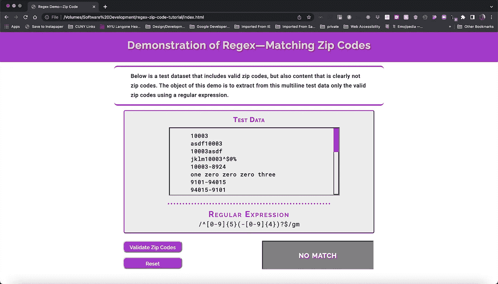

# 正则表达式 Web 开发人员的必经之路

> 原文：<https://javascript.plainenglish.io/regular-expressions-a-rite-of-passage-for-web-developers-b24181465096?source=collection_archive---------14----------------------->

## 第 1 部分:正则表达式速成班——解释正则表达式背后的理论。


Photo by ThisIsEngineering (pexels.com)

**目标受众:中级开发人员——需要对 HTML 有很强的掌握，对 CSS 有一些了解，对 JavaScript 语言有很强的中级掌握。**

# 介绍

整个软件工程职业，不管是什么学科，最终都会面临学习道路上的挑战。当一个初露头角甚至经验丰富的开发人员遇到这种挑战时，它会呈现出一个巨大的障碍。那一瞬间就好像是发现了一个新的具有威胁性的四个字母的单词(尽管它实际上是五个字母)——**regex。**

当我第一次遇到**正则表达式**(或**正则表达式**)时，我的经历是一场令人沮丧的学习似乎是一种神秘语言的斗争，尽管它有着显而易见的力量，却没有显示出它的效用。

然而，每当我们使用网络浏览器搜索一个项目时，无论是在谷歌上搜索还是在网站内容中搜索，它的效用都是显而易见的。当我们填写在线表格并点击**提交**按钮时，它的效用也很明显。

在提交表单中的数据之前，会对其进行验证，以确保其格式正确和/或经过处理(去掉错误的内容)。

# 在这个教程中我们要做什么？

我们将构建一个简单的演示**单页应用程序(SPA)** ，但是具有相当复杂的基础。

本教程是一个三部分系列的第一部分，在这个系列中，我们将从理论到实践再到实现一个完整的演示**单页面应用程序(SPA)。**

# 与理论搏斗

如果您对正则表达式完全陌生，那么本教程的第一部分将适合您。如果你对它们相当有经验，那么你可以跳到本系列的第二篇文章— ***正则表达式—一个通过的仪式:从理论到实践。***

然而，因为这部分教程使用我们的 web 应用程序中的数据来给出一个关于**正则表达式**的快速速成课程，您可能仍然会发现它很有用。

在本系列的第三篇教程结束时，我们将构建一个小型 web 应用程序，其目的是从一串文本中提取有效的邮政编码，并将它们显示在一个结果框中，单击 **Validate Zip Codes** 按钮就会填充该结果框。

**图 1** 显示了我们完成的应用程序的开始屏幕:



**Fig. 1 Application Landing Page**

简而言之，测试数据框滚动显示一个多行字符串，其中包含有效的邮政编码。当用户点击 **Validate Zip Codes** 按钮时，使用显示在测试数据下方的正则表达式，应用程序将用一个滚动的已验证的邮政编码匹配列表替换显示在其右侧框架中的 **NO MATCH** 消息。

**复位**按钮将屏幕恢复到初始状态。

为了实现这个项目，我们需要深入研究一下
**正则表达式的理论。**

***但是这个 app 看起来足够简单。为什么要用一整篇文章来讨论理论基础呢？我们不应该边做边学吗？***

嗯，是的…但不尽然。我们*将*在实践中学习，但是没有一些起码的理解基础的实践将是一个痛苦的追求。在编写这个应用程序时，我们将迎头撞上**正则表达式**的障碍，至少在最初，可能感觉像撞上了 ***暴龙正则表达式。***

玩笑归玩笑，如果没有这个成年礼，任何想出一个与我们将要创建的应用程序相似的应用程序的尝试都需要编写代码，而这些代码很可能不会像包含了**正则表达式**的代码那样有效。

对正则表达式及其在 JavaScript 中的实现的深入探究超出了本文的范围。这样的探索很容易需要一个自己的过程。

然而，为了便于理解它将如何在我们的演示 web 应用程序中发挥作用，我将给出一个快速速成课程，仅仅是实现这个项目所必需的**正则表达式**的概念。

# 足够的正则表达式

首先，我们需要定义我们的术语。到目前为止，我们只将我们的概念命名为**正则表达式**。但是它们是什么呢？

## 什么是正则表达式？

根据 Mozilla 开发者网络的定义—

> **“正则表达式是用来匹配字符串中字符组合的模式”** *(正则表达式— JavaScript，*[*https://developer . Mozilla . org/en-US/docs/Web/JavaScript/Guide/Regular _ Expressions*](https://developer.mozilla.org/en-US/docs/Web/JavaScript/Guide/Regular_Expressions)*)*。

***这是什么意思？*** 这是一个很抽象的说法。让我们再退一步来设置**正则表达式**的理论背景。

## 正则表达式的历史梗概


**Mathematician Stephen Cole Kleene**

**正则表达式**的词根在 1951 年数学家斯蒂芬·科尔·克莱尼 ***的一篇题为《神经网络和有限自动机中事件的 ***表示法*** *、* 的论文中。*** 本文定义的理论远远超出了本教程的范围，但如果你有兴趣探究他要说的话，可以在这里下载论文(*“事件的表象”)*。

克莱尼理论的实际应用在 1968 年左右得到了认可，当时它们被用来促进文本编辑器中的模式匹配，并被编译器用于源代码的词法分析。关于这方面的更多信息，你可能想参考这篇文章 ( *“正则表达式”*)。

可以说，在接下来的几年里，**正则表达式**的许多不同实现
被开发出来，所有这些实现都源于 UNIX 操作系统中这些概念的出现。**下面的表 1**
是在维基百科上找到的**正则表达式**
(*“正则表达式引擎的比较】*)的一些不同风味的样本:


**Table 1\. Some Well Known Flavors of Regex**

## JavaScript 中正则表达式的基本要素

在 JavaScript 中，正则表达式有两种表示方式:

1.一个对象文本。
2。用构造函数声明的对象。

**对象文字符号**是我们在上面的**图 1** 中看到的减去它的声明。事实上，您即将编写的代码使用了如下所示的符号:

```
**const** regex = /**[a-z]**/**g**;
```

该表达式将在指定的测试字符串中搜索并匹配小写字母 **a** 到 **z** 的任何实例。稍后将详细介绍。

使用其对象构造函数声明的同一个**正则表达式**具有以下语法:

```
**const** regex = **new** **RegExp(**
 '**[a-z]**', '**g**'
**)**;
```

这两种语法的工作原理相同。 ***有没有一个时间应该用这个或者那个？*** 有，有。根据 Mozilla 开发者网络:

> " T 当对表达式求值时，文字符号导致正则表达式的编译。当正则表达式
> 保持不变时，使用文字符号。例如，如果您使用文字符号来构造循环中使用的正则表达式，则正则表达式不会在每次迭代中重新编译
> (“RegExp—JavaScript | MDN”)。

关于这方面的更多信息，你可以咨询这个[帖子](https://developer.mozilla.org/en-US/docs/Web/JavaScript/Reference/Global_Objects/RegExp#literal_notation_and_constructor)。

## 正则表达式的剖析

我们将从更复杂的**正则表达式**开始，这是我们将在本教程的第 2 部分和第 3 部分构建的应用程序中有效邮政编码匹配的基础:

```
**/^[0-9]{5}(-[0-9]{4})?/gm**
```

看着这一行神秘的代码，您可能会问自己， ***“这是什么天书？”我向你保证，几分钟后，这看起来不会像现在这样令人生畏。***

如果我们将 **Regex** 视为我们希望匹配的字符模式的符号表示，我们就可以开始对不同种类的符号字符进行分类。

我们将快速浏览一下上面的**正则表达式**，一点一点地把它拆开，然后再把它放回一起，以理解**正则表达式引擎需要什么。**

我们的**正则表达式**的组成部分可以分解为
如下:

1.  **分隔符**
2.  **锚**
3.  **字符集和范围**
4.  **量词**
5.  **捕捉组**
6.  **标志**

所有这六个组件都在我们的**正则表达式**中发挥作用。让我们一个一个来。

**分隔符** 在 **JavaScript** **对象文字符号中，** **正则表达式**两边用正斜杠分隔
。出现在这些斜线之间的所有内容都代表了我们希望在测试字符串中找到匹配
的模式。

**锚点** 一个**锚点**不匹配测试字符串中的任何特定字符。相反，它定义了我们希望看到的由 **regex 引擎返回的匹配的起点或终点。**

**插入符号(** `**^**` **)** 代表我们正在搜索的匹配的开始。例如，如果我们想匹配模式开头字母`J`的任何实例，语法应该是`^J`。

另一方面，**美元符号** ( `$`)表示我们正在搜索的匹配的结束。这个符号用在字符串模式的末尾，影响紧接在它前面的字符或字符集。

**字符集** **字符集**是一个指定的字符集合，它可以是字符文字或指定的字符序列，我们要根据它来测试一个特定的测试字符串。**字符集**用**方括号括起来。**

**范围**当一系列字符定义了一个字符范围，我们就有了一个**范围。范围**由一组连续的数字或字母字符组成。例如， **0** 到 **9** 是我们所认为的(至少在十进制中)一个数字可能的完整数字范围。这也将在**方括号**中注明，如下所示:

```
[0-9]
```

对于字母字符，我们也有范围`[a-z]`和`[A-Z]`。但是我们也可以很容易地指定一个数字范围，比如`[1-5]`或者字母范围，比如`[a-g]`或者`[A-G]`。

**数量词** 一个**数量词**指定一个给定字符(或一个字符集中的字符)在匹配中所需的最小或最大实例。它还可以指定模式匹配中所需的确切字符数。

下面的表 2 显示了这些量词的一些用法:


**Table 2: Regex Quantifiers**

**捕捉组** 用括号表示，**捕捉组**设置一个图案序列，作为一个整体，而不是其组成部分。换句话说，如果我们有一个这样的捕捉组…

`([A-G]-0[0–9]{3})`

…我们所说的是**匹配任何完整的模式**，该模式以`A`和`G`之间的任何大写字母开始，然后是**连字符**和`0`，最后是`0`和`9`之间的 3 位数。

***这和普通字符集有什么区别？*** 在一个字符集中，除非一个量词紧随其后，如上面的序列`[0–9]{3}`，否则**正则表达式引擎**将只匹配 1 个在指定范围内的字符。

另一方面，利用**捕获组，**序列被作为一个整体来分析，并且必须作为一个整体来匹配。正如您将看到的，这在我们的迷你应用程序中非常有用。

有了标志，我们可能达到了迄今为止描述的所有语法中最容易理解的程度。标志对**正则表达式引擎**解析传递给它的测试字符串的方式有影响。

正则表达式的 JavaScript 风格有六个标志，但是我们将把我们的检查限制在你可能最经常遇到的三个。这些标志出现在右正斜杠后的**正则表达式**的末尾。它们是:

1.  `i`—不区分大小写标志指定将匹配字母字符，无论它们是大写还是小写。
2.  `g`—全局标志指定将返回从测试字符串开始到结束的所有匹配。默认情况下， **regex 引擎**从左到右读取测试字符串，一旦返回第一个匹配，就退出，忽略第一个匹配之后的任何匹配。
3.  `m` —Judas Stefan 澄清“多行标志改变了上面提到的`^`和`$`锚点的含义……”(Judis，*JavaScript 正则表达式中的多行模式*)。默认情况下， **regex 引擎**将一个测试字符串视为一个要搜索的不间断的长字符串。

该字符串的边界由表示字符串开始的`^`锚和表示字符串结束的`$`锚定义。将`m` (multiline)标志附加到表达式的末尾，这两个锚点定义了一行的开始和结束，而不是整个字符串。

好的。我知道那是一大堆东西，有些甚至可能有点令人困惑。这种情况即将改变。

## 正则表达式的拆除

我们现在准备分析我们将要构建的 web 应用程序中使用的**正则表达式**。让我们再来看看它的辉煌:

`/^[0–9]{5}(-[0–9]{4})?$/gm`

**拆开** 让我们从检查这个表达式最外层的部分开始。我们的**正则表达式**的外壳是这样的:

`//gm`

***这个小片段本身说明了什么？*** 不多，因为还没有指定模式。尽管如此，这个片段为如何处理出现在正斜杠分隔符之间的任何模式奠定了基础。

使用上面的 **regex 标志**的定义，这个片段告诉 **regex 引擎** *“匹配分隔符* ( **全局匹配** ) *之间指定的模式的所有实例，并分别考虑测试字符串的每一行* ( **多行匹配** ) *。”* **还不多，**但是引擎现在知道如何处理在分隔符之间为它定义的任何模式。

**模式的前半部分** 这个模式的第一部分使用了我们之前学过的`^`锚，有所不同。考虑到这一点，我们来看看模式的前半部分:

`^[0–9]{5}`

首先我们有字符串锚的`^` **开头，它声明了我们的模式的开始
。接下来我们有一个用方括号括起来的**字符集**。这个**字符集**完全由从 **0** 到 **9** 的数字**范围**组成。**

这个**范围**后面紧跟着一个`{5}`的**量词**。总之，**范围**和**限定符**指定在 **0** 到 **9** 范围内的任何一组正好 5 个数字将作为匹配返回。

现在我们有了**正则表达式的完整前半部分:**

`/^[0–9]{5}/gm`

这对 **regex 引擎**说的是*“搜索并返回测试字符串中所有行的所有匹配项，这些匹配项以 5 位数的任意组合开始。”*

就其本身而言，我们的**正则表达式**的前半部分是完整的，它将返回在我们的测试字符串中找到的任何有效的 5 位邮政编码。

但是还有一个问题。到目前为止，我们将绕过文本中嵌入的任何有效的+4 邮政编码。我们的**正则表达式**的后半部分将解决这个问题。

**模式的后半部分** 现在让我们接近**正则表达式的后半部分**:

`(-[0–9]{4})?$`

这里我们遇到一个**捕捉组**，前面已经解释过了。在**连字符**、**范围、**和**量词**周围出现的括号表示**组**只能作为一个整体来分析。**不会单独考虑**捕捉组**的**组成部分。

首先让我们看看**捕捉组的内容。**

**有时候连字符就是连字符**
我们从**连字符**开始。当**连字符**出现在限定**字符集**的方括号内时，表示**范围**，例如`[0–9]`。当它作为**捕获组**的第一个字符出现在方括号外时，它是一个**字符文字**。因此**连字符**是**捕获组**中要匹配的模式开头的必需字符。

接下来是**靶场**T2。到目前为止，我们的**组**将只返回一个以**连字符**开头，后跟`0`和`9`之间的 4 位数的匹配。

在**捕获组**的括号之外是`?` **量词**，它指定紧接在它前面的可以有`0`或`1`实例。需要注意的是，这个`?` **量词**适用于整个**捕获组**，而不仅仅是它左边的单个字符。

这就是**捕捉群体**的力量。它们使得要求匹配一组指定的字符或**字符集成为可能。**因为`?` **量词**接受其前面的`0`或`1`匹配，所以有时被称为**可选**。换句话说，将返回指定字符或模式的`0`或`1`实例的匹配。

这种行为使得 **regex 引擎**能够返回 5 位邮政编码或+4 邮政编码的匹配。

最后，我们有`$` **锚**，它定义了作为匹配返回的字符串的结尾。这非常明确地规定了一个有效的邮政编码匹配将以一个 5 位数字的序列开始，并有一个可选的连字符，后跟正好 4 位数字，但这个序列后面绝对没有任何内容。

让我们把正则表达式的整个序列放回一起。

`/^[0–9]{5}(-[0–9]{4})?$/gm`

这个顺序现在对我们来说应该更清楚了。从左向右读，下面是完整的**正则表达式的含义:**

> 在测试字符串的所有行中搜索并返回所有匹配项，这些匹配项以恰好 5 位数字的任意组合开始，并可选地以连字符和从`*0*`到`*9*`范围内的恰好 4 位数字结束

我们找到了。

## 举个真实世界的例子怎么样？

下面是一个非常简单的示例，展示了我们将为
应用程序实现的内容:

测试管柱
10003
asdf 10003
10003 asdf
10003–8924

回顾一下…

**我们的正则表达式**

```
/^[0-9]{5}(-[0-9]{4})?$/gm
```

你认为这个**搜索字符串**会返回多少个匹配？1，2，3，还是 4？

使用名为 [**Regex Pal**](https://www.regexpal.com/) 的非常有用的在线工具，我们获得了下面的**图 2** 中的结果:


**Fig. 2 Test Results Returned from RegexPal.com**

**图 2** 显示了**正则表达式引擎**返回的两个有效匹配。

**在第一行，** `10003`高亮显示为匹配。这是因为它符合 5 位数邮政编码的标准。

**第二行**，`asdf10003`没有高亮显示。这是因为即使这一行有 5 个数字，它们前面都有`asdf`。因此，它不符合标准，因为匹配字符串的开头不是所需的 5 位数字序列。

**在第三行，** `10003asdf`也没有被突出显示。这是因为，即使行首有 5 个数字，`asdf`也遵循这个顺序。因此，它不符合标准，因为匹配字符串的结尾必须是开头的 5 位数字序列的最后一位数字，或者是可选的连字符，后跟正好 4 位数字。其他什么都不会发生。

最后，**的第四行，** `10003-8924` ***被*** 高亮显示。这是因为它符合字符串的标准，该字符串恰好以 5 位数字开始，并以后跟 4 位数字的可选连字符序列结束。

因此有两个匹配。

虽然这个例子确实比我们将在最终应用程序中使用的例子简单一点，但是原理是一样的。

# 下一步是什么？

一旦你有了喘息的机会，请继续本系列教程的第二部分，我们将开始构建我们的应用程序— [***正则表达式—成年礼:从理论到实践***](https://rhieger-98255.medium.com/regular-expressions-a-rite-of-passage-from-theory-to-practice-f4f23bec6044) ***。***

*更多内容请看*[***plain English . io***](https://plainenglish.io/)*。报名参加我们的* [***免费周报***](http://newsletter.plainenglish.io/) *。关注我们关于*[***Twitter***](https://twitter.com/inPlainEngHQ)*和*[***LinkedIn***](https://www.linkedin.com/company/inplainenglish/)*。查看我们的* [***社区不和谐***](https://discord.gg/GtDtUAvyhW) *加入我们的* [***人才集体***](https://inplainenglish.pallet.com/talent/welcome) *。*