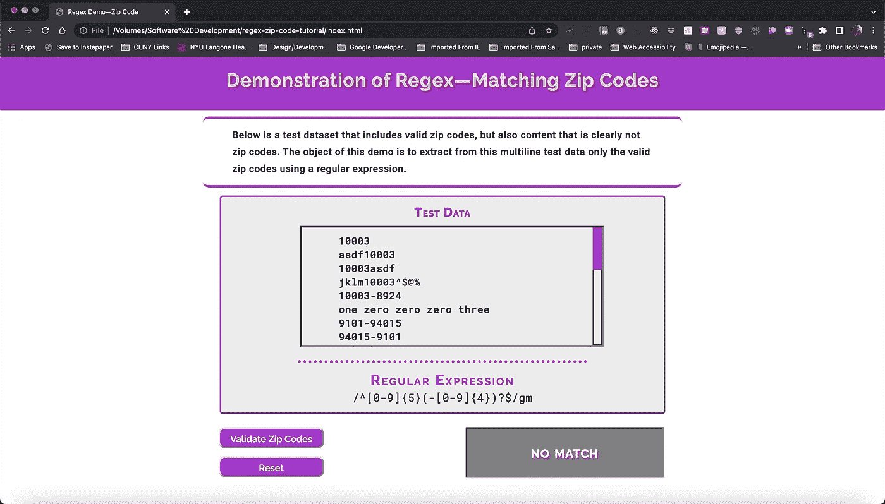
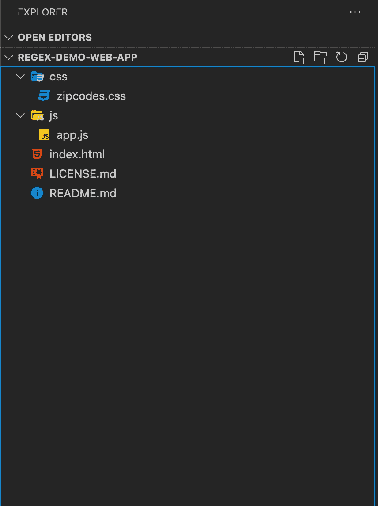
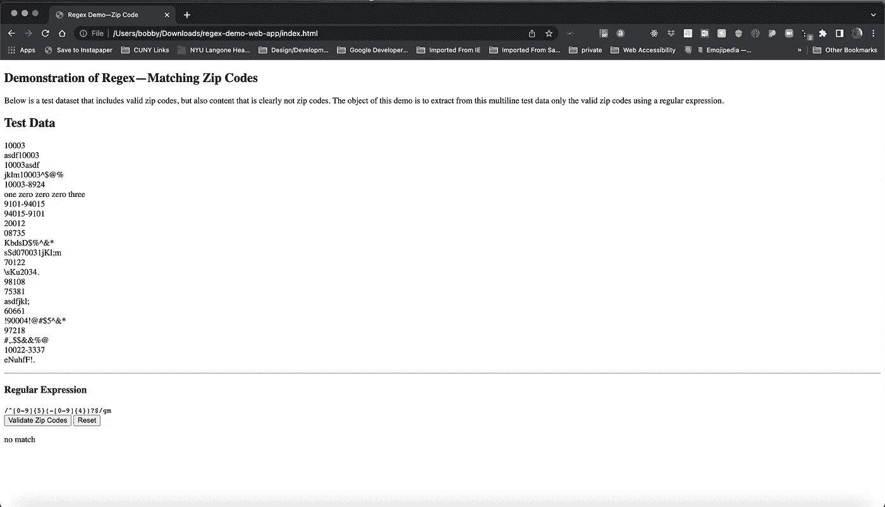
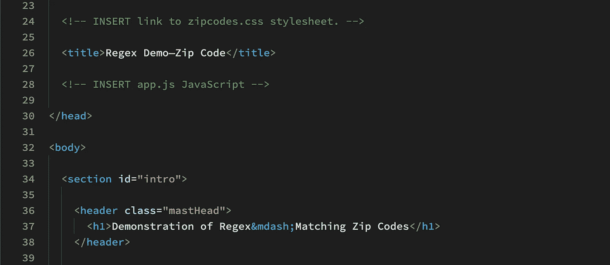
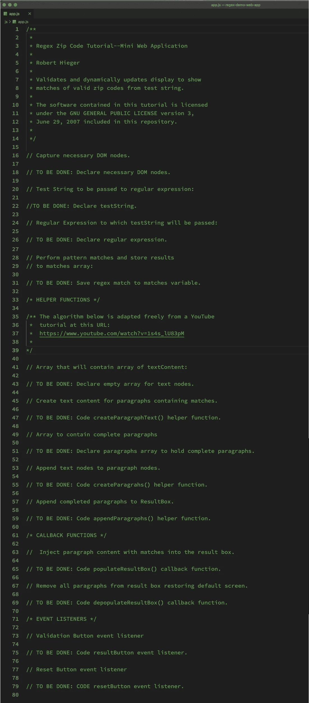
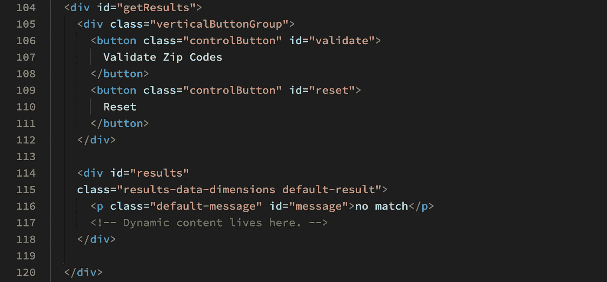
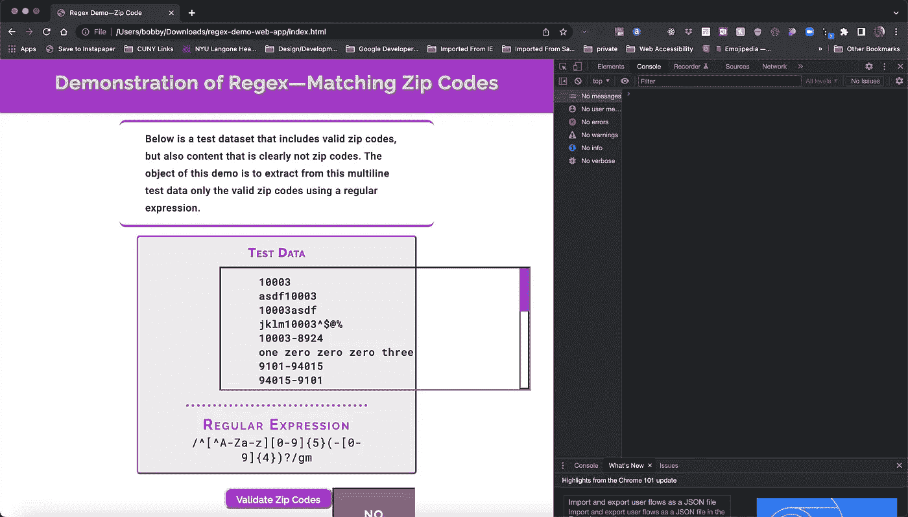
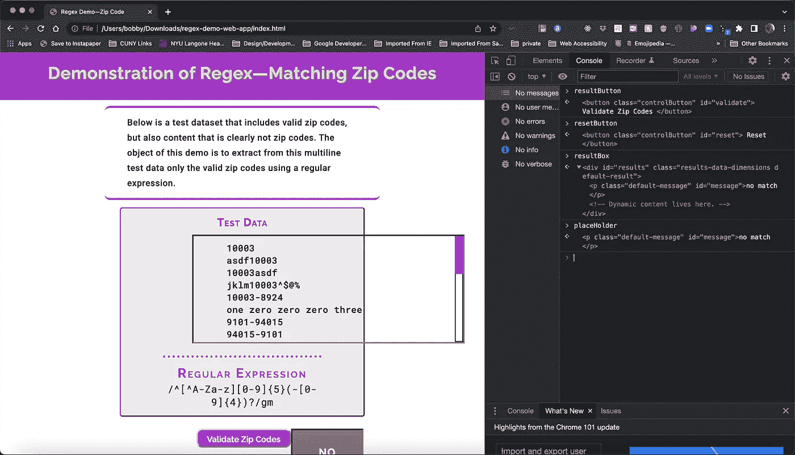
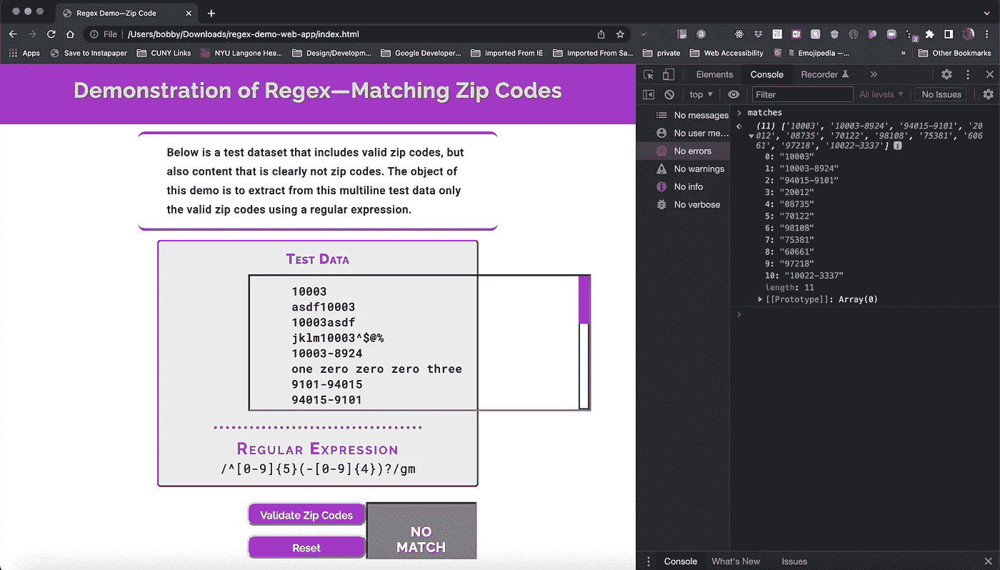

# 正则表达式——通过仪式:从理论到实践

> 原文：<https://javascript.plainenglish.io/regular-expressions-a-rite-of-passage-from-theory-to-practice-f4f23bec6044?source=collection_archive---------3----------------------->

## 第 2 部分:应用该理论构建一个验证邮政编码的演示单页应用程序。


**Photo by** [**Kelly Sikkema**](https://unsplash.com/@kellysikkema?utm_source=unsplash&utm_medium=referral&utm_content=creditCopyText) **on** [**Unsplash**](https://unsplash.com/s/photos/flow-chart?utm_source=unsplash&utm_medium=referral&utm_content=creditCopyText)

***欢迎回来！***

对于那些已经阅读了本教程系列第一部分的人，感谢您坚持阅读这篇理论文章。随着我们从理论走向实践，它会有回报的。

在第 2 部分中，我们应用了第 1 部分中所学的内容， [***正则表达式 Web 开发人员的必经之路***](https://rhieger-98255.medium.com/regular-expressions-a-rite-of-passage-for-web-developers-b24181465096)*其中快速介绍了**正则表达式**的一些关键概念。*

*我们将通过为网络建立一个演示**单页应用(SPA)** 来把理论转化为实践。*

# *入门指南*

*对于那些还没有看到我们的 **SPA** 的人来说，下面的**图 1** 显示了登录页面:*

**

***Fig. 1 Regex Demo Landing Page***

*上面的开始屏幕显示了以下组件:*

1.  *主标题，说明了应用程序的功能——即匹配有效的邮政编码。*
2.  *紧接在它的下面，一个标注框更详细地解释了应用程序的目标。*
3.  *接下来是多行测试字符串的滚动列表，它将被传递给下面显示的**正则表达式**。*
4.  *在这下面，我们有一个**小部件**，在左侧，有一组 2 个垂直堆叠的按钮。第一个是 **Validate Zip Codes** ，它触发一个匹配并从测试字符串中提取有效邮政编码的事件。单击时，其右侧的窗口会填充由**正则表达式返回的有效邮政编码。***
5.  *第二个按钮— **重置—** 将文本框重置为默认状态，如图 1**所示。***

****我们要怎么做这一切？*** 让我们思考一下这个问题。*

*我们为我们的应用程序提供了一些预制的测试数据(尽管如果用户上传一个包含测试数据的文件，原理仍然是一样的)。在这两种情况下，**正则表达式引擎**都会显示测试数据，并被要求只返回有效邮政编码的匹配。*

*这比听起来更复杂。指定给**正则表达式引擎**的**正则表达式**必须能够执行以下所有操作:*

*   *确保用户输入仅由数字和可选的+4 邮政编码连字符组成。(显然，在这个演示应用程序中，没有用户输入。但是这个项目的进一步开发可以使应用程序完全交互。)*
*   *除了+4 邮政编码中需要的连字符之外，任何字母、标点或其他特殊符号都不能作为返回匹配的一部分。*
*   *确保各种邮政编码(5 位数字或+4)的前面或后面没有其他字符。*
*   *在任何情况下，邮政编码都必须以 5 位数字开始。*
*   *可选地，**正则表达式引擎**必须能够匹配以连字符开始并以 4 个数字结束的 5 字符序列。*
*   *最后，最后 4 位数字后不得出现任何字符。*

*所有这些似乎都是一项艰巨的任务。但是正如我们在前面的教程中看到的，**正则表达式**完全能够满足所有这些需求。*

****这一刻终于到来了！****

# *让我们建造它！*

*在所有这些理论之后，让我们将它付诸实践并构建这个应用程序。*

*要开始，请下载 [**启动代码**](https://github.com/RHieger/regex-zip-code-tutorial/raw/starter-code/regex-starter-code.zip) 。*

## *第一步。解压缩启动代码档案*

*这个档案被命名为 **regex-starter-code.zip** 。你可以根据自己的喜好给它重新命名，比如 **regex-demo-web-app.zip** 。一定要保管好**。zip 扩展名，因为如果缺少扩展名，一些 zip 存档程序可能无法识别文件。***

*出于本教程的目的，我使用[微软 Visual Studio 代码](https://code.visualstudio.com/)，但是你也可以使用你最喜欢的文本编辑器。*

*一旦您解压了重命名的 **regex-demo-web-app.zip** (或者您选择的任何名称)，您将拥有一个类似于图 2**所示的文件结构。***

**

***Fig. 2 Project File Structure***

## *第二步。将项目片段放在一起*

*我们的项目由 **HTML** 内容、 **CSS** 样式和单个 **JavaScript** 文件— **app.js** 组成。*

*虽然我已经为您提供了样式，以便我们可以主要关注于 **JavaScript，**我们将从**index.html**文件提供的基本结构开始。*

*让我们首先在您最喜欢的网络浏览器中打开应用程序的**index.html**文件。出于本教程的目的，我使用 [Google Chrome](https://www.google.com/chrome/downloads/) 作为其卓越的开发工具。下面的图 3 显示了我们的准系统应用程序框架。*

**

***Fig. 3 Bare Bones HTML***

***图 3** 展示了我们的应用程序所在文档的基本结构。不是那么容易理解。让我们解决这个问题。*

***下面的代码清单 1** 显示了我们的**index.html**文件中第**行
23–39 的一个片段。***

**

***Code Listing 1\. index.html showing relevant <head> content***

***第 24 行和第 28 行**是相关的代码行，我们现在将对它们进行修改，以将应用程序的三个组件结合在一起。*

*如您所知，为了让浏览器按照我们的意愿呈现应用程序登录页面，我们必须将我们的**级联样式表**链接到 **HTML** 文件。*

*我们还必须将我们的 JavaScript 代码链接到 HTML 文件。请遵循以下步骤:*

1.  *将上面第 24 行的注释替换为下面的注释:
    `**<link rel=“stylesheet” href=“./css/zipcodes.css”>**`*
2.  *现在我们集成项目的最后一个组件。参考上面的**代码清单 1** ，将**第 28 行**替换为这个:
    `**<script src=“./js/app.js” defer></script>**`*

*`**<script>**`标签中的关键字 **defer** 保证了浏览器在脚本执行开始前加载**index.html**文档的 **DOM** 。这可以防止 **JavaScript** 抛出错误，因为 **DOM** 对象引用了一个尚未定义的节点。*

***记得将这些更改保存到你的 index.html 文件中。***

*3.刷新您的浏览器。*

*太好了！如果一切按计划进行，您的网页应该完全如图 1 所示。但是，如果你点击 ***中的任何一个按钮，此时绝对不会发生任何事情。*** 显然，这是因为我们还没有编写任何为这些按钮提供功能的代码。*

## *第三步。捕获必要的 DOM 节点*

*首先打开起始代码档案中的 **app.js** 文件。它应该如下图**4**所示:*

**

***Fig. 4 app.js Starter Code***

*如您所见，整个文件现在只包含注释。**图 4** 将是我们完成应用程序的路线图。我们将在构建缺失代码时引用它。*

*我们从捕获必要的 **DOM 节点开始。**我们将使用**文档对象模型(DOM)** 来确定当用户与我们的应用程序交互时，需要改变的屏幕部分。*

****DOM 对象中需要捕获哪些 HTML 元素？首先，我们可以推断，因为当我们单击应用程序中的任何一个按钮时都不会发生任何事情，所以我们需要访问这些节点。因此，我们需要 2 个 **DOM 对象**来捕获**验证邮政编码**和**重置**按钮。****

*接下来，我们需要做两件事。我们需要按钮右侧的默认消息，现在显示为 **NO MATCH** 消失，取而代之的是由 **regex 引擎**返回的滚动匹配列表。*

*为了做到这一点，我们需要能够捕获默认消息，以便可以删除它。我们还需要访问它的**父元素**，一旦默认消息被移除，它将包含滚动列表。因此，我们需要 2 个 DOM 对象来捕获这些元素。*

*总之，我们必须声明 4 个 **DOM** **对象**来捕获引用我们需要访问的 **HTML** **元素**的**节点**。*

*让我们创建它们，并测试它们在 **DOM 中是否可见。***

***下面的图 5** 显示了包含**元素**的 **HTML** 的相关行，我们将在 **DOM 对象中捕获这些元素:***

**

***Fig. 5 Elements to Be Captured in the DOM***

***图 5** 中的关键标记是按钮、显示为“不匹配”的段落及其父元素——具有**结果的 **id** 属性的`**<div>**`，第 106–118 行。***

*每个**元素**都设置了一个 **id** 属性，以便可以使用`**document.getElementById()**` **方法捕获它。**还有*和*其他可以采用的方法，比如`**querySelector()**`和`**querySelectorAll()**`方法。对于本教程，我选择使用`**getElementById()**`是因为它的直接和简单。*

*要创建必要的 **DOM 对象，**请参考上面的**图 4** 。用以下 4 行代码替换第 18 行的注释:*

```
***const** resultButton = **document.getElementById**('validate');
**const** resetButton = **document.getElementById**('reset');
**const** resultBox = **document.getElementById**('results');
**const** placeHolder = **document.getElementById**('message');*
```

*尽管如此，如果你刷新浏览器并点击**验证邮政编码**按钮，什么也不会发生。我们还没有提供这项功能。我们*现在将*做的是使用**谷歌 Chrome 开发者工具**测试我们捕获的元素是否真的被捕获。*

***验证节点对 DOM** 可见为此，刷新浏览器并通过按下 **Ctrl+Shift+J** 打开 **JavaScript 控制台**对于 Windows/Linux/Unix 和 **Command+Option+J** 对于 Mac。您应该会看到类似下面图 6 的内容:*

**

***Fig. 6 Google Chrome Showing JavaScript Console on Right***

*为了验证我们的**节点对象，**在 **JavaScript 控制台**中单击一个插入点，并键入以下命令，然后按 **Enter/Return** 键:*

```
***resultButton** <Enter>
**resetButton** <Enter>
**resultBox** <Enter>
**placeHolder** <Enter>*
```

*确保通过点击折叠信息旁边的向右箭头展开**结果框**的输出。*

*您应该会看到类似下面图 7**所示的结果:***

**

***Fig 7\. Browser with JavaScript console confirming access to desired nodes***

*到目前为止，我们已经有了应用程序的入口点，因为我们可以访问需要操作的页面部分。接下来，我们需要声明我们的**测试字符串**和我们的**正则表达式。***

## *第四步。声明测试字符串和正则表达式*

*我们需要声明两个**常量**——一个存储我们传递给**正则表达式**的**测试字符串**，另一个存储**正则表达式** **对象**，其中**测试字符串**将被传递给该对象。*

*回头参考**图 4** ，我们将关注**线 22 和 26。***

***替换第 22 行**
用以下代码替换**第 22 行**(修改后的代码中的第 25 行)的注释:*

```
***const** testString =
**`**10003
asdf10003
10003asdf
jklm10003^$@%
10003-8924
one zero zero zero three
9101-94015
94015-9101
20012
08735
KbdsD$%^&*
sSd070031jkl;m
70122
\sKu2034
98108
75381
asdfjkl;
60661
!9004!@#$5^&*
97218
#,.$$&&%@
10022-3337
eNuhfF!.**`;***
```

***替换第 26 行**
现在用以下代码替换第 26 行**的注释(修改后的代码中的第 52 行):***

```
***const regex** = **/**^[0-9]{5}(-[0-9]{4})?$**/gm;***
```

*我们的演示应用程序已经准备就绪。我们已经捕获了 **DOM** **节点**，当用户点击 **Validate Zip Codes** 按钮时，这些节点是向页面注入动态数据所必需的。我们还提供了我们的 **testString** 常量和 **regex** 常量。*

*接下来，我们必须继续构建功能，该功能将提供我们希望在页面上注入的有效邮政编码的匹配。*

## *第五步。使用 Regex 返回有效的邮政编码匹配*

*在我们实际向 **app.js** 添加必要的代码之前，让我们后退一步，清楚地了解匹配过程将如何工作。*

*我们已经有了使用**对象文字符号**声明的 **regex** 对象。这个**对象**公开了执行不同种类
搜索的**方法**。*

*有几个**方法**被 **regex** 对象公开。你可以在 Mozilla 开发者网 [**正则表达式页面**](https://developer.mozilla.org/en-US/docs/Web/JavaScript/Guide/Regular_Expressions#using_regular_expressions_in_javascript)(*在 JavaScript 中使用正则表达式】*)。*

*然而，与我们相关的是`**match()**`方法。这个**方法**的语法是:*

*`**<string object>.match(<regular expression object>);**`*

*我们的**字符串对象**就是上面在**步骤 4 中声明的常量 **testString** 。**我们将使用 **testString** 暴露的`**match()**` **方法**。**`**match()**`**方法**反过来需要一个**参数，那就是**正则表达式**对象。*****

*****`**match()**`的返回值是一个由**正则表达式返回的每个匹配组成的**数组**。*******

***返回值**必须是** **返回给某个**才能被访问。在上面显示的语法中，由`**match()**` **方法**返回的**对象**是不可寻址的，尽管已经为它保留了内存。***

***一旦**方法**被执行 **JavaScript** 将**垃圾收集**存储在其中的
值，只要它确定它们没有被
使用或者不再被使用。如果你有兴趣了解更多关于
这方面的知识，你可能想参考这篇关于
[**垃圾收集**](https://javascript.info/garbage-collection) ( *“垃圾收集】*)的简短但内容丰富的文章。***

***我们将使用的实际语法如下所示:***

***`**const myConstant = <string object>.match(<regular expression object>);**`***

*****替换第 31 行**
回过来参考**图 4，**用以下代码行替换**第 31 行**(修改后的代码中的第 57 行)的注释:***

***`**const** matches = **testString.match**(regex);`***

***这一行代码完成了很多工作。将 **testString** 一次性传递给 **regex** (我们的**正则表达式** **对象**)，执行模式匹配，提取有效的邮政编码，并将结果存储在一个**数组**中，其中的标识符**与**匹配。 ***非常强大的东西。******

***现在，让我们通过以下步骤对此进行测试:***

1.  ***刷新您的浏览器。如果您尚未打开 **JavaScript 控制台，**现在就打开。***
2.  ***在 **JavaScript 控制台**中点击一个插入点，键入**匹配**，然后按 **Enter/Return** 键。展开控制台中返回的内容后，您的显示应该如下面的**图 8** 所示:***

******

*****Fig. 8 Browser with JavaScript Console confirming valid zip code matches*****

***由于**图 8** 确认了**正则表达式对象返回了 11 个有效的邮政编码匹配。*****

*****显然，我们不能要求最终用户进入 JavaScript 控制台来获得验证过程的结果。**为了使这成为一个真正的动态应用程序，我们必须为创建两个**事件监听器**构建一些基础设施——一个监听**验证邮政编码**按钮上的**点击**，另一个监听**点击**重置**按钮上的**。***

## ***第六步。创建助手函数***

******该基础设施由什么组成？*** 如果我们从最明显的假设开始，我们需要当最终用户点击其中一个按钮时发生一些事情。***

***我们的应用程序是事件驱动的。因此我们需要为按钮编写两个**事件监听器**。正如我们将看到的，这些事件监听器由几个**助手函数**提供支持。***

***在我们编写第一个**助手**之前，我们需要声明一个空的**数组**，它的代码将填充这个数组。***

***回头参考**图 4** ，用以下代码行替换**第 43 行**(修改后的代码中的第 69 行)的注释:***

```
*****const** paragraphText = [];***
```

***上面的空**数组**将由我们的第一个**辅助函数填充。*****

*****`**createParahgaphText()**`**助手函数** 回过来参考**图 4** ，用以下代码替换**第 47 行**(修改后的代码中的第 73 行)中的注释:*****

```
*******const** createParagraphText = () => {
  **matches.forEach**( match => {
    **let** matchNumber = **matches.indexOf**(match) + 1;
    **paragraphText.push**(
      `Match #${**matchNumber**}: ${**match**}`
    );
  });
};*****
```

********这个辅助函数发生了什么？*** 我们来一行一行的分解一下。*****

*****`**createParagraphText()**` 中的代码是由****`**forEach()**`循环组成的。`**forEach()**`被**数组**对象暴露。在上面的代码中，我们的**数组**是**匹配**常量。*********

*****我们称之为**比赛中的`**forEach()**`方法。match，**位于**方法**的**参数**部分，是对在 **matches 数组**中找到的每个**元素**的引用。*****

***还有一个**匿名回调函数**作为第二个参数，从`**match()**` **方法**创建的`**matches[]**` **数组**中提取数据。在**回调函数的第一行中，**我们声明了变量 **matchNumber，**，它存储了`**matches[]**` 数组中 **index + 1** 的值。***

***我们调用 **match** 上的`**indexOf()**` 来得到 **match** 的**数组索引**循环的每次迭代。 **1** 被添加到**索引**值，因为我们知道，数组是 **0 索引的，**对于人类来说，引用匹配 **1 到 11，**比引用匹配 **0 到 10 更有意义。*****

***在我们函数的最后一行，我们使用由**数组对象公开的`**push()**` **方法**来填充`**paragraphText[]**`数组。*****

***我们为每一项指定要推送到**数组**的数据同时使用**模板文字符号**和**字符串插值**来创建一个**数组元素**，如下所示:***

```
***Match #1: 10003***
```

***你可能想知道为什么我没有在
中一次性完成整个段落。构建完整的段落是我们的
next **helper 函数的结果。*****

***在我们构建那个**，**之前，我们需要声明另一个空的**数组**来包含完整的段落。***

***回头参考**图 4** ，用以下代码替换**第 51 行**(修订代码中的第 84 行)的注释:***

```
*****const** paragraphs = [];***
```

***用从`**paragraphText[]**` **数组**中提取的**子** **文本节点**填充**数组**。***

***`**createParagraphs()**`必须完成以下所有工作:***

1.  ***为每个**正则表达式**匹配在 **DOM** 中创建一个`**<p>**`元素。***
2.  ***将包含**匹配**数据的**文本节点**附加到添加到 **DOM 的每个`**<p>**` **元素**。*****
3.  ***将每个完成的段落推送到`**paragraphs[]**` **数组**。***

*****`**createParagraphs()**`**助手函数** 回过来参考**图 4，**用以下代码替换**第 55 行**(修改后的代码中的第 88 行)中的注释:*****

```
*******const** createParagraphs = () => {
  **paragraphText.forEach**( **text** => {
    **const** paragraph = **document.createElement**('p');
    **paragraph.textContent** = text;
    **paragraphs.push**(paragraph);
  });
};*****
```

********那么这段代码到底在做什么？****`**createParagraphs()**`函数的整个逻辑可以在对
`**forEach()**` **方法的一次调用中找到。********

******循环中的第一行是:******

```
********const** paragraph **= document.createElement**('p');******
```

******让我们思考一下这里发生了什么。******

******每次通过循环， **JavaScript** 都会找到一个**文本** **节点**，它是`**paragraphText[]**` **数组**的成员。这一行代码声明了一个`**<p>**` **元素**，其中的**文本** **节点**将作为**子节点追加到该元素中。********

******循环中的下一行是:******

```
********paragraph.textContent =** text;******
```

******这一行将当前索引处的**文本节点**追加到前一行创建的`**<p>**` **元素**中。循环中的最后一行代码是:******

```
********paragraphs.push**(paragraph);******
```

******这行代码将一个完整的段落推送到`**paragraphs[]**` **数组**。重复该序列，直到`**paragraphText[]**` **数组**中的最后一个**元素**被读入循环。******

******已完成段落的**数组**现在等待被追加到 **resultBox 对象。最后一个**助手函数**将完成这项任务。********

******append paragraphs()辅助函数** 让我们回顾一下**图 1** 。所示的两个按钮在它们的右侧有一个显示**不匹配的信息框。******

****我们现在要交换这个框的内容，用一个滚动窗口移除**不匹配**占位符消息，该窗口将包含`**paragraphs[]**` **数组**中的所有段落作为其子项。****

****回头参考图 4 中的**，**用下面的代码替换**第 59 行**(修改代码中的第 98 行)上的注释:****

```
******const** appendParagraphs = (**parent, children**) => {
  **children.forEach**( (**child**) => {
    **parent.appendChild**(child);
  });
};****
```

****在仅仅 5 行代码中，`**appendParagraphs()**`完成了相当多的工作。该函数接受两个**参数**、**父**和**子**。****

****调用该函数时，**父**引用 **resultBox** ，即在我们的**index.html**文件中捕获`**<div id="results">**` 的**节点对象**。**子**指`**paragraphs[]**` **数组。******

****我们最后的**辅助函数**也使用了`**forEach()**` **方法。**这里`**paragraphs[]**` **数组**的所有元素都被追加到 **resultBox** 节点，重复这个过程直到所有 11 个匹配都被追加到 **resultBox。******

> *******重要提示:*** 如果您尝试在浏览器中将这些节点记录到***JavaScript******控制台*** 中，您会收到一条错误消息。这是因为我们到目前为止创建的每个 ***助手函数*** 都是由 ***回调函数*** 调用的 ***事件监听器*** 我们还没有编码。****

****我们现在已经完成了由**数组**和 3 个**辅助函数组成的基础设施。******

> *******抛开一个重要的:*** 你会注意到，在`**appendParagraphs()**` ***函数*** 中，我们有一个完全抽象的 ***函数*** 即 ***解耦*** 。****
> 
> ****虽然所有的 ***助手函数*** *，*都可以这样做，但为了简洁起见，我还是举了这个例子。这种 ***将函数*** 从它们所操作的数据中分离出来的技术使得代码更加可重用，并且应该在公共应用程序版本中作为一条规则来实践。****

# ****下一步是什么？****

****当你成功完成上述所有步骤后，你可以继续我们教程的第三部分也是最后一部分— [***正则表达式—成年礼:完成应用***](https://rhieger-98255.medium.com/regular-expressions-a-rite-of-passage-completing-the-application-526589605075) ***。*******

*****更多内容请看**[***说白了。报名参加我们的***](https://plainenglish.io/)***[***免费每周简讯***](http://newsletter.plainenglish.io/) *。关注我们关于*[***Twitter***](https://twitter.com/inPlainEngHQ)*和*[***LinkedIn***](https://www.linkedin.com/company/inplainenglish/)*。查看我们的* [***社区不和谐***](https://discord.gg/GtDtUAvyhW) *加入我们的* [***人才集体***](https://inplainenglish.pallet.com/talent/welcome) *。*********