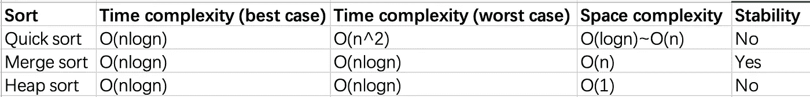

# 重新学习前端排序算法

> 原文：<https://javascript.plainenglish.io/relearn-the-front-end-sorting-algorithm-348f939632e0?source=collection_archive---------5----------------------->

## 作为初级前端工程师探索您的学习路径，或者作为高级前端工程师复习您的知识。

Photo by [Greg Rakozy](https://unsplash.com/@grakozy?utm_source=medium&utm_medium=referral) on [Unsplash](https://unsplash.com?utm_source=medium&utm_medium=referral)

我会花一个月的时间整理前端相关的知识。一方面我会巩固自己的技能。另一方面，我会用它来分享初级前端工程师的学习路径和高级前端工程师的知识复习。

总体文章目录

*   [重新学习前端— HTML](/relearn-the-front-end-html-26a38c5ba196)
*   [重新学习前端——CSS](/relearn-the-front-end-css-4d74eb5981f8)
*   [重新学习前端——JavaScript 基础知识](/relearn-the-front-end-javascript-basics-d770eefd791f)
*   [重新学习前端——面向 JavaScript 对象](/relearning-the-front-end-javascript-object-oriented-913077e735bf)
*   [重新学习前端— JavaScript V8 引擎机制](/relearning-the-front-end-javascript-v8-engine-mechanism-cc6457b43aff)
*   [重新学习前端—浏览器渲染机制](/relearning-the-front-end-browser-rendering-mechanism-efbfc19d225f)
*   [重新学习前端—浏览器缓存策略](/relearn-the-front-end-browser-caching-strategy-21cd081886d)
*   [重新学习前端—排序算法](/relearn-the-front-end-sorting-algorithm-348f939632e0)
*   [重新学习前端—设计模式](/relearning-the-front-end-design-patterns-e95444b6bdb)
*   [重新学习前端网络](/relearn-the-front-end-network-b0402a870336)
*   [重新学习前端—前端安全](/relearning-the-front-end-front-end-security-bbc20ded6b12)

这篇文章是关于排序算法的。

# 1 手写冒泡排序

泡泡排序应该是很多人接触到的第一种排序。比较简单，就不解释了。

# 2 如何优化冒泡排序

冒泡排序将总是执行(N-1)+(N-2)+(N-3)+..+2+1 次，但是如果在达到一次运行时排序已经完成，或者输入是一个有序数组，那么后面的比较就是多余的。为了避免这种情况，我们添加了一个标志来确定排序是否已经在中间完成(即确定是否有元素交换)

# 2 手写快速排序

快速排序的基本步骤:

*   选择基准元素
*   小于基本元素的元素放置在左侧，较大的元素放置在右侧
*   在左右子阵列中重复步骤 1 和 2，直到阵列中只剩下一个元素
*   逐级合并数组

# 3 如何优化快速排序

我们不能写这样的快速排序。如果我们每次打开两个数组，将会消耗大量的内存空间。当数据量很大时，可能会导致内存溢出。我们必须避免打开新的内存空间，也就是说，要在原地完成排序。

我们可以用元素交换来替换新数组的开头，每次执行分区时直接交换原数组中的元素，并将小于参考数的元素移到数组的开头。

我们定义一个后置指针来标识待替换元素的位置，然后逐一遍历数组元素，当个数小于参考个数时用`arr[pos]`交换位置，然后用`pos++`交换位置。

# 4 手写合并排序

合并排序和快速排序的思想是相似的。它们都是递归的分治。区别在于快速排序在分区时进行排序，而合并排序只在分区完成后进行。

# 5 手写堆排序

一个堆是一个特殊的树，只要这个树是一个完整的二叉树，并且堆中每个节点的值大于或小于它的左、右子节点，那么它就是一个堆，根据堆中每个节点的值大于或小于它的左、右子节点，又分为大根堆和小根堆

堆排序的过程:

*   初始化大(小)根堆，此时根节点是最大(小)值，并与最后一个节点(数组的最后一个元素)交换根节点
*   除了最后一个节点，调整大(小)根堆的大小，使根节点成为最大(小)值
*   重复步骤 2，直到堆中只剩下一个元素，并且排序完成

# 6 合并排序、快速排序和堆排序之间有什么区别

# 最后

**感谢您阅读**。我期待着你的关注和阅读更多高质量的文章。

[欧姆嘴](https://medium.com/@omgzui?source=post_page-----348f939632e0--------------------------------)

## 更好的编程

[View list](https://medium.com/@omgzui/list/better-programing-9b4c9bb174aa?source=post_page-----348f939632e0--------------------------------)109 stories

[omgzui](https://medium.com/@omgzui?source=post_page-----348f939632e0--------------------------------)

## Java Script 语言

[View list](https://medium.com/@omgzui/list/javascript-48bfc7b5f93c?source=post_page-----348f939632e0--------------------------------)57 stories

[omgzui](https://medium.com/@omgzui?source=post_page-----348f939632e0--------------------------------)

## 新闻

[View list](https://medium.com/@omgzui/list/news-67ec0a972660?source=post_page-----348f939632e0--------------------------------)23 stories

*更多内容请看*[***plain English . io***](https://plainenglish.io/)*。报名参加我们的* [***免费周报***](http://newsletter.plainenglish.io/) *。关注我们关于*[***Twitter***](https://twitter.com/inPlainEngHQ)[***LinkedIn***](https://www.linkedin.com/company/inplainenglish/)*[***YouTube***](https://www.youtube.com/channel/UCtipWUghju290NWcn8jhyAw)*[***不和***](https://discord.gg/GtDtUAvyhW) *。对增长黑客感兴趣？检查* [***电路***](https://circuit.ooo/) *。***