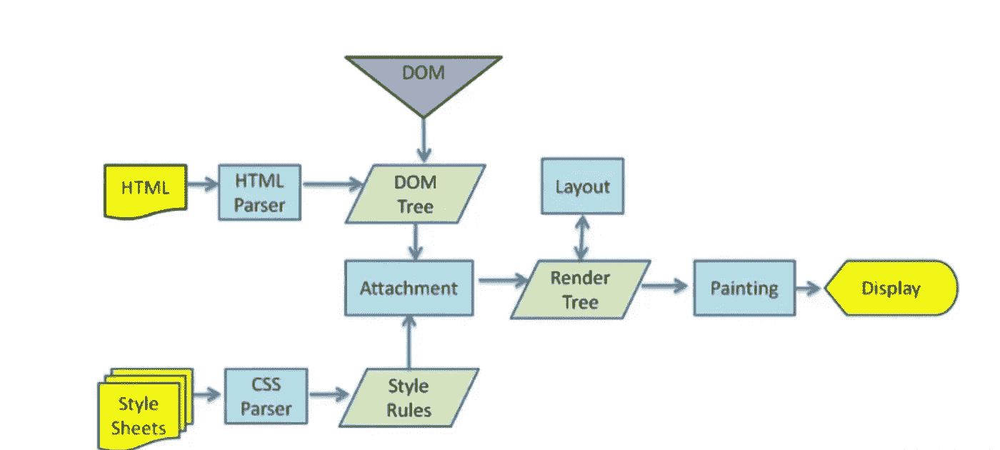

# 重新了解前端—浏览器呈现机制

> 原文：<https://javascript.plainenglish.io/relearning-the-front-end-browser-rendering-mechanism-efbfc19d225f?source=collection_archive---------7----------------------->

## 作为初级前端工程师探索您的学习路径，或者作为高级前端工程师复习您的知识。

Photo by [Greg Rakozy](https://unsplash.com/@grakozy?utm_source=medium&utm_medium=referral) on [Unsplash](https://unsplash.com?utm_source=medium&utm_medium=referral)

我会花一个月的时间整理前端相关的知识。一方面我会巩固自己的技能。另一方面，我会用它来分享初级前端工程师的学习路径和高级前端工程师的知识复习。

总体文章目录

*   [重新学习前端— HTML](/relearn-the-front-end-html-26a38c5ba196)
*   [重新学习前端——CSS](/relearn-the-front-end-css-4d74eb5981f8)
*   [重新学习前端——JavaScript 基础知识](/relearn-the-front-end-javascript-basics-d770eefd791f)
*   [重新学习前端——面向 JavaScript 对象](/relearning-the-front-end-javascript-object-oriented-913077e735bf)
*   [重新学习前端— JavaScript V8 引擎机制](/relearning-the-front-end-javascript-v8-engine-mechanism-cc6457b43aff)
*   [重新学习前端—浏览器渲染机制](/relearning-the-front-end-browser-rendering-mechanism-efbfc19d225f)
*   [重新学习前端—浏览器缓存策略](/relearn-the-front-end-browser-caching-strategy-21cd081886d)
*   [重新学习前端—排序算法](/relearn-the-front-end-sorting-algorithm-348f939632e0)
*   [重新学习前端—设计模式](/relearning-the-front-end-design-patterns-e95444b6bdb)
*   [重新学习前端网络](/relearn-the-front-end-network-b0402a870336)
*   [重新学习前端—前端安全](/relearning-the-front-end-front-end-security-bbc20ded6b12)

这篇文章是关于浏览器渲染机制的。

# 1 浏览器的渲染过程是怎样的？

一般流程如下:

1.  HTML 和 CSS 被分别解析以生成 DOM 树和 CSSOM 树
2.  合并到渲染树中
3.  根据渲染树进行布局
4.  最后调用 GPU 绘制并显示在屏幕上

# 2 如何根据浏览器渲染机制加快首屏速度

*   **优化文件大小**:HTML 和 CSS 的加载和解析会阻塞渲染树的生成，影响首屏的显示速度。所以我们可以通过优化文件大小，降低 CSS 文件级别来加快首屏速度。
*   **避免资源下载阻塞文档解析**:当浏览器解析到`<script>`标签时，会阻塞文档解析，直到脚本执行完成，所以我们一般会把`<script>`标签放在底部，或者添加 defer，async 进行异步下载

# 3 什么是回流(重排)，什么情况下会触发回流

*   当元素的大小或位置改变时，渲染树需要重新计算，这就是回流
*   当 DOM 元素的几何属性(`width/height/padding/margin/border`)改变时，会触发重排
*   DOM 元素移动或增加会触发回流
*   读写`offset/scroll/client`等属性时触发回流
*   调用 window.getComputedStyle 将触发回流

# 4 什么是重绘，什么情况下会触发重绘

当 DOM 样式改变而不影响 DOM 的几何形状时，会触发重画，但不会触发回流。重绘在性能上优于回流，因为不需要更新 DOM 位置信息，并且省略了布局过程。

# 5 什么是 GPU 加速，如何使用 GPU 加速，GPU 加速的缺点

**优点**:使用变换、不透明度、滤镜等属性时。，处理会直接在 GPU 中完成，这些属性的改变不会导致回流和重绘
缺点**缺点** : GPU 渲染字体会导致字体模糊，GPU 处理过多会导致内存问题

# 6 如何减少回流

*   用类代替样式，减少样式的使用
*   使用`resize`和`scroll`时的防抖和节流，两者都会直接导致回流
*   **替换显示**:无可见，因为前者只会导致重绘，后者会导致回流
*   批量修改元素时，可以先从文档流中删除元素，修改完成后再放入文档流中。
*   为了避免触发同步布局事件，当我们获取`offsetWidth`等属性的值时，可以使用变量来存储查询结果，避免多次查询。每次我们查询`offset/scroll/client`这样的属性，都会触发一个回流
*   对于复杂的动画效果，请使用绝对定位，使它们远离文档流。复杂的动画效果会频繁触发回流和重绘。我们可以设置动画元素的绝对位置，将它们从文档流中分离出来，以避免重复的回流和重绘。

# 最后

**感谢阅读**。期待您的关注，阅读更多高质量的文章。

[omgzui](https://medium.com/@omgzui?source=post_page-----efbfc19d225f--------------------------------)

## 更好的编程

[View list](https://medium.com/@omgzui/list/better-programing-9b4c9bb174aa?source=post_page-----efbfc19d225f--------------------------------)109 stories

[omgzui](https://medium.com/@omgzui?source=post_page-----efbfc19d225f--------------------------------)

## Java Script 语言

[View list](https://medium.com/@omgzui/list/javascript-48bfc7b5f93c?source=post_page-----efbfc19d225f--------------------------------)57 stories

[omgzui](https://medium.com/@omgzui?source=post_page-----efbfc19d225f--------------------------------)

## 新闻

[View list](https://medium.com/@omgzui/list/news-67ec0a972660?source=post_page-----efbfc19d225f--------------------------------)23 stories

*更多内容看* [***说白了。报名参加我们的***](https://plainenglish.io/) **[***免费周报***](http://newsletter.plainenglish.io/) *。关注我们关于* [***推特***](https://twitter.com/inPlainEngHQ) ，[***LinkedIn***](https://www.linkedin.com/company/inplainenglish/)*，*[***YouTube***](https://www.youtube.com/channel/UCtipWUghju290NWcn8jhyAw)*，以及* [***不和***](https://discord.gg/GtDtUAvyhW) *。对增长黑客感兴趣？检查* [***电路***](https://circuit.ooo/) *。***