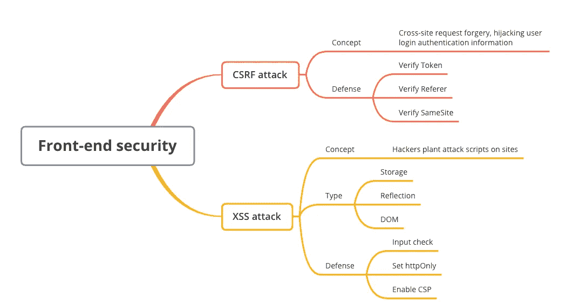

# 重新了解前端:前端安全性

> 原文：<https://javascript.plainenglish.io/relearning-the-front-end-front-end-security-bbc20ded6b12?source=collection_archive---------10----------------------->

## 作为初级前端工程师探索您的学习路径，或者作为高级前端工程师复习您的知识。

Photo by [Greg Rakozy](https://unsplash.com/@grakozy?utm_source=medium&utm_medium=referral) on [Unsplash](https://unsplash.com?utm_source=medium&utm_medium=referral)

我会花一个月的时间整理前端相关的知识。一方面我会巩固自己的技能。另一方面，我会用它来分享初级前端工程师的学习路径和高级前端工程师的知识复习。

总体文章目录

*   [重新学习前端— HTML](/relearn-the-front-end-html-26a38c5ba196)
*   [重新学习前端——CSS](/relearn-the-front-end-css-4d74eb5981f8)
*   [重新学习前端——JavaScript 基础知识](/relearn-the-front-end-javascript-basics-d770eefd791f)
*   [重新学习前端——面向 JavaScript 对象](/relearning-the-front-end-javascript-object-oriented-913077e735bf)
*   [重新学习前端— JavaScript V8 引擎机制](/relearning-the-front-end-javascript-v8-engine-mechanism-cc6457b43aff)
*   [重新学习前端—浏览器渲染机制](/relearning-the-front-end-browser-rendering-mechanism-efbfc19d225f)
*   [重新学习前端—浏览器缓存策略](/relearn-the-front-end-browser-caching-strategy-21cd081886d)
*   [重新学习前端—排序算法](/relearn-the-front-end-sorting-algorithm-348f939632e0)
*   [重新学习前端—设计模式](/relearning-the-front-end-design-patterns-e95444b6bdb)
*   [重新学习前端网络](/relearn-the-front-end-network-b0402a870336)
*   [重新学习前端—前端安全](/relearning-the-front-end-front-end-security-bbc20ded6b12)

这篇文章是关于前端安全的。

# 1.什么是 CSRF 攻击

*CSRF 代表跨站点请求伪造(跨站请求伪造)。*

如果黑客在他的网站上放置了另一个网站的外部链接，例如**www.medium.com/api**，默认情况下，如果用户已经登录该网站，浏览器将使用**medium.com**cookie 访问该网站。而如果网站不防御 CSRF 攻击，服务器会认为是用户自己在调用这个接口并进行相关操作，导致账户劫持。

## 1.1 如何防御 CSRF 攻击

*   **验证令牌**:当浏览器请求服务器时，服务器返回一个令牌，每个请求都需要携带令牌和 cookie，才被认为是合法请求
*   **验证推荐人**:通过验证请求头的推荐人来验证源站点，但是请求头很容易伪造
*   **设置 SameSite** :为 cookies 设置 SameSite，这样 cookies 就不会和跨域请求一起发送，但是浏览器兼容性不同

# 2.什么是 XSS 攻击

*XSS(Cross Site Scripting)代表跨站脚本(Cross Site Scripting)，是指利用网页开发过程中留下的漏洞，将恶意指令代码注入网页，使用户加载并执行攻击者恶意创建的网页程序。比如评论区植入 JS 代码。该代码在用户进入评论页面时执行，导致页面被植入广告，账户信息被盗。*

## 2.1.XSS 攻击有哪些类型

*   **存储类型**:即攻击存储在服务器上。在评论区插入攻击脚本是很常见的。如果脚本存储在服务器上，所有看到相应评论的用户都会受到攻击。
*   **反射型**:攻击者在 URL 中混入脚本，服务器接收到 URL 后将恶意代码作为参数取出，拼接回 HTML。浏览器在解析 HTML 后执行恶意代码。
*   **DOM 类型**:在 URL 中编写攻击脚本，诱导用户点击 URL。如果 URL 被解析，攻击脚本将被执行。与前两者的主要区别在于，DOM 类型的攻击不会通过服务器。

## 2.2.如何防御 XSS 的攻击

*   **输入检查**:转义或过滤输入内容中的`<script><iframe>`等标签
*   **设置 httpOnly** :很多 XSS 的攻击目标都是窃取用户 cookie 来伪造认证，设置该属性可以阻止 JS 获取 cookie
*   **开启 CSP** ，即开启白名单，可以阻止白名单之外的资源的加载和运行

# 最后

**感谢阅读**。期待您的关注，阅读更多高质量的文章。

[omgzui](https://medium.com/@omgzui?source=post_page-----bbc20ded6b12--------------------------------)

## 更好的编程

[View list](https://medium.com/@omgzui/list/better-programing-9b4c9bb174aa?source=post_page-----bbc20ded6b12--------------------------------)109 stories

[omgzui](https://medium.com/@omgzui?source=post_page-----bbc20ded6b12--------------------------------)

## Java Script 语言

[View list](https://medium.com/@omgzui/list/javascript-48bfc7b5f93c?source=post_page-----bbc20ded6b12--------------------------------)57 stories

[omgzui](https://medium.com/@omgzui?source=post_page-----bbc20ded6b12--------------------------------)

## 新闻

[View list](https://medium.com/@omgzui/list/news-67ec0a972660?source=post_page-----bbc20ded6b12--------------------------------)23 stories

*更多内容看* [***说白了。报名参加我们的***](https://plainenglish.io/) **[***免费周报***](http://newsletter.plainenglish.io/) *。关注我们关于*[***Twitter***](https://twitter.com/inPlainEngHQ)[***LinkedIn***](https://www.linkedin.com/company/inplainenglish/)*[***YouTube***](https://www.youtube.com/channel/UCtipWUghju290NWcn8jhyAw)***，以及****[***不和***](https://discord.gg/GtDtUAvyhW)**** ***对成长黑客感兴趣？检查出* [***电路***](https://circuit.ooo/) ***。*****